# Entrance Exam

## Entrance Test

### Course Pre test

(20 points possible)  

#### Instructions**
  
To be successful in this course, you need to already have a good grasp
of the fundamental concepts of DHIS2.

Whether you completed the DHIS2 Fundamentals online course or not,
please answer the following questions to assess your basic knowledge on
the platform. This will help to make sure you are ready to make the most
of this course.

To enable the contents of the modules, you need to score 70% or more in
this pre-test (in other words, have at least 14 out of 20 questions
answered correctly). You will have unlimited attempts to pass this
entrance exam.

In case you are not familiar yet with the key concepts of the platform,
we strongly recommend you to complete DHIS2 Fundamentals online course
as a prerequisite for this one.  
Read carefully all the questions and select the "Check" button to submit
your test.

#### Questions

1. An organization unit refers to:

   - The variable we are measuring (the what dimension)  
   - **The geographical units attached to our data (the where dimension)**  
   - The time in which our data was recorded (the when dimension)- This
    answer is unanswered.

    Explanation

    Organization units represent the where dimension in DHIS2. They associate any data that we have entered with a specific location. This could be a facility, district, state, province, region, country, etc. Organization units are context specific, and are based on where the DHIS2 implementation is collecting data from.

2. In DHIS2, data elements and indicators represent the same concept

   - True  
   - **False**

    Explanation

    Data elements and indicators represent different concepts. Data elements are the raw data, while indicators are calculated values that use data elements within their calculation.

3. Pivot Tables in DHIS2 is mainly used for:

   - Visualizing data in charts
   - **Analyzing data in dynamic tables**  
   - Creating standard, one-click reports for review

    Explanation

    As the name implies, pivot tables are used to review data in dynamic tables. They are dynamic because their layout can be altered very quickly and new inputs can be added to alter the data that is being reviewed at any time.

4. In DHIS2, I can add additional dimensions (such as Male/Female,
Public/Private Facilities, etc.) to further break-down my data during
analysis.

   - **True**
   - False

    Explanation

    Data can be broken down into different disaggregations in analysis. This is a key part of data review in order to review data at a more granular level.

5. Metadata refers to:

   - The data values that have been entered by users in a DHIS2 system  
   - **The information that defines what is in a DHIS2 system (which variables to collect, indicators to calculate, geography, etc.)**  
   - Manuals and procedures that are used to guide a DHIS2 system’s use

    Explanation

    Metadata comprises all of the various objects that are added to a DHIS2 system. DHIS2 by default does not come with any metadata. This must all be set up by the team implementing DHIS2.
6. If I want to create a new data element, where do I go in DHIS2?

   - **Maintenance app**  
   - Data administration app  
   - Data management app
  
    Explanation

    Data elements, along with any other object that needs to be added to DHIS2, is all managed through the maintenance app. It is used heavily in order to customize a DHIS2 system.

7. Which of the following are data elements

   - **Number of maternal deaths**  
   - Maternal Mortality Ratio (per 100,000)  
   - Maternal Deaths (% from total deaths)

    Explanation

    Data elements are the raw data values that we collect, such as source “number of” type variables. Calculated values such as ratios and percentages are considered indicators.

8. If today's date is April 2, 2020 and I select a relative period of
the last 5 years in one of the analysis apps, which periods will be
displayed in my output? Select one:

   - 2016-2020  
   - **2015-2019**
   - 2014-2019

    Explanation

    Relative periods work backwards from the current date. In 2020, if we go back 5 years we have 2015, 2016, 2017, 2018 and 2019. The current period will not be selected unless we specify it to be included in our output through selecting a relevant period such as “This year.”

9. In a map, multiple layers can be added to represent different
features or items for analysis

   - **True**  
   - False

    Explanation

    Multiple layers representing different items can be added to maps. We might have one layer of data representing information from facilities, and another layer aggregated to represent districts for example.

10. The main function of Data Sets in DHIS2 is to:

    - Create dynamic outputs  
    - Group together data elements for analysis  
    - **Capture Data**

    Explanation

    Data Sets are used to capture data from different sources in DHIS2. Data sets collect different data elements together in order to allow users to input aggregate data into DHIS2.

11. Data Element Groups are used for grouping together similar data
elements for hematic analysis

    - **True**
    - False

    Explanation

    Data element groups are user defined and assist us in finding our data elements during analysis. They are particularly useful in an integrated system, as they allow us to separate our data elements by thematic area.

12. What is the primary role of a DHIS2 dashboard?

    - **Make data more accessible and communicate findings to users** 
    - Manage operational lists and actions that a user needs to follow up
    on  
    - Act as the primary method to access different applications within
    DHIS2

    Explanation

    Dashboards are useful in conveying a variety of different information together. They are particularly useful for users that are not trained on making their own outputs or when a number of standard outputs needs to be reviewed routinely.

13. Reports in DHIS2 can be the combination of data from several
different data sources

    - **True**
    - False

    Explanation

    You can make reports pulling data from a variety of different services within your DHIS2 system. This includes specific services, for example health or education services, as well as demographic data, like population, for example. 

14. In DHIS2, what is a validation rule?

    - A check which indicates if data has been submitted  
    - **An expression that checks if data is correct (for example, malaria tests >= malaria cases positive)**
    - A check which indicates if data has been submitted on time

    Explanation

    Validation rules are logical expressions that are defined by the user. They check data that is available in the system against the criteria that has been defined with the created expressions. When these rules are violated, there are various ways these violations can be brought to the attention of the user. 

15. Data Element names should:

    - Be as long and descriptive as possible  
    - **Use self-contained names which describe the data effectively for output**  
    - Replicate the name on a paper/source form

    Explanation

    When discussing data elements, we should always consider how they will appear in output. Making concise names that can be easily listed will make finding them easier and will group them together appropriately when searching for them in lists. We can always make their appearance during data entry match a paper form even when naming the data element appropriately.

16. What is the Organisation Unit that is being analyzed in the above
pivot table?

    - MAL - Malaria inpatient admissions  
    - **Trainingland**  
    - June 2019 - May 2020

    Explanation

    The organisation unit is Trainingland. This means all the data that we are seeing is being aggregated for the organisation unit that has been selected.

17. The map above

    - Has a layer showing where individual facilities are located  
    - Has a layer showing the individual home location of children that
    received their BCG vaccine  
    - **Has a layer showing indicator information by the selected
    geographical level**

    Explanation

    What we see is a thematic layer that is being used to display indicator information. There are many different layer types that are available when making maps in DHIS2; making a quick evaluation of the most appropriate one is necessary when working with maps.

18. In the above chart, which month has the highest malaria test
positivity rate?

    - March 2020  
    - November 2019  
    - **May 2020**
    Explanation

    The blue line in this chart represents the malaria test positivity rate based on the legend at the bottom of the chart. If we follow this line, we can see the highest value is shown in May 2020.

19. The above screenshot is taken from when you create a data element
within DHIS2. What does the star next to the field name “Domain Type”
mean?

    - I can skip filling in this field when creating the data element  
    - I can fill this field in by selecting an item from a drop down list

    - **I must fill this field in when I create the data element**

Explanation

Stars in DHIS2 maintenance always denote mandatory, required fields that need to be filled in. 

20. The above screenshot is taken from a data entry screen within
DHIS2. When I have an internet connection and the background of a value
is green, as we see above, what does this mean?

    - The value has been stored locally within my computer  
    - The value has not been stored and I need to hit the save button  
    - **The value has been stored online**

    Explanation
    In DHIS2, as values are entered, they are automatically saved online when you have internet connectivity. This is indicated by the green coloured background that appears after entering data values. There is no save button as a result of this feature.

CHECK YOUR ANSWER

# Module 1: Course Overview & Getting Started

## 1.0 - Getting Started

### Pre-course Survey

#### Complete our Pre-Course Survey

Tell the DHIS2 Academy team more about yourself by filling out our
pre-course survey below. The information you provide will help us to
make useful updates to this course and create more effective training
material in the future.

Pre-Course Survey: DHIS2 Events Fundamentals

Your responses to this survey will help the DHIS2 Academy team improve
our course offerings by providing valuable insight into our Academy
audience. Whether you are just browsing or you are determined to
complete the entire course, the more we know about you, the better we
can serve all participants in this course.

By submitting this form you give DHIS2/HISP UiO permission to use your
anonymized responses in research, research publications, and
DHIS2-related communications materials. We appreciate your input!

**Why did you enroll in this course?**

_Applies to me_         x _Does not apply to me_

To advance my career

To advance my education

To qualify for more advanced DHIS2 training

Interest in the subject matter

**How important is learning the contents of this course to you?**

Not at all important

A little important

Moderately important

Very important

Extremely important

**How many hours do you intend to spend on this course each week? Please enter a whole number**

**Which statement best describes your goals for taking this course?**

Explore the course contents to see if I'm interested

Explore a particular module or content of the course

Gain knowledge to apply it on a specific DHIS2 project

Qualify for more advanced DHIS2 training

To deliver DHIS2 training to others

Other…

Apply knowledge to a specific DHIS2 task

**Could you briefly describe your current work with DHIS2? (What type of
project(s) you work on, how the project uses DHIS2, whether is uses
aggregate or individual data, what your role is)**

**For what purpose have you most commonly used DHIS2?**

To enter aggregate data

To enter individual-level data (Tracker or Event)

To create data visualizations (graphs, charts, tables, maps)

To analyze data

To submit reports

To manage or evaluate projects

To make data-driven decisions

To configure the DHIS2 system

To export data to other systems

To give DHIS2 training to others

Other…

#### Knowledge of Data Analysis and DHIS2

**How familiar are you with data analysis?**

On a scale of 1 to 10, what level of theoretical-practical knowledge do
you have on Data analysis? (1= Little to no knowledge; 10= Full
practitioner)

**How familiar are you with DHIS2?**

On a scale of 1 to 10, what level of theoretical-practical knowledge do you have on DHIS2? (1= Little to no knowledge; 10= Full practitioner)

**Do you intend to earn a certificate in this course?**

Yes

No

Unsure

#### Demographic Data

**What is your gender?**

Female

Male

Prefer not to say / Other

**What is your age?**

0-14 years

15-29 years

30-44 years

45-59 years

60-74 years

75+

Prefer not to say

**What is your highest level of education?**

None

Primary school

Secondary / High School

Some college / university

Bachelors degree

Masters degree

Ph.D. - Doctorate

**What is your primary language?**

English

French

Portuguese

Spanish

Russian

Arabic

Chinese

Hindi

Indonesian

Urdu

Vietnamese

Other

**How would you describe your English language skills?**

Weak

Basic

Intermediate

Proficient

Fluent

**In which country do you live?**

Afghanistan

Albania

Algeria

American Samoa

Andorra

Angola

Anguilla

Antigua and Barbuda

Argentina

Armenia

Aruba

Australia

Austria

Azerbaijan

Bahamas

Bahrain

Bangladesh

Barbados

Belarus

Belgium

Belize

Benin

Bermuda

Bhutan

Bolivia

Bosnia and Herzegovina

Botswana

Brazil

British Virgin Islands

Brunei

Bulgaria

Burkina Faso

Burundi

Cambodia

Cameroon

Canada

Cape Verde

Caribbean Netherlands

Cayman Islands

Central African Republic

Chad

Chile

China

Colombia

Comoros

Congo

Cook Islands

Costa Rica

Croatia

Cuba

Curaçao

Cyprus

Czech Republic

Denmark

Djibouti

Dominica

Dominican Republic

DR Congo

East Timor

Ecuador

Egypt

El Salvador

Equatorial Guinea

Eritrea

Estonia

Eswatini

Ethiopia

F.S. Micronesia

Falkland Islands

Faroe Islands

Fiji

Finland

France

French Guiana

French Polynesia

Gabon

Gambia

Georgia

Germany

Ghana

Gibraltar

United Kingdom

Greece

Greenland

Grenada

Guadeloupe

Guam

Guatemala

Guernsey and Jersey

Guinea

Guinea-Bissau

Guyana

Haiti

Honduras

Hong Kong

Hungary

Iceland

India

Indonesia

Iran

Iraq

Ireland

Isle of Man

Israel

Italy

Ivory Coast

Jamaica

Japan

Jordan

Kazakhstan

Kenya

Kiribati

Kuwait

Kyrgyzstan

Laos

Latvia

Lebanon

Lesotho

Liberia

Libya

Liechtenstein

Lithuania

Luxembourg

Macau

Madagascar

Malawi

Malaysia

Maldives

Mali

Malta

Marshall Islands

Martinique

Mauritania

Mauritius

Mayotte

Mexico

Moldova

Monaco

Mongolia

Montenegro

Montserrat

Morocco

Mozambique

Myanmar

Namibia

Nauru

Nepal

Netherlands

New Caledonia

New Zealand

Nicaragua

Niger

Nigeria

Niue

North Korea

North Macedonia

Northern Mariana Islands

Norway

Oman

Pakistan

Palau

Palestine

Panama

Papua New Guinea

Paraguay

Peru

Philippines

Poland

Portugal

Puerto Rico

Qatar

Réunion

Romania

Russia

Rwanda

Saint Helena, Ascension and Tristan da Cunha

Saint Kitts and Nevis

Saint Lucia

Saint Pierre and Miquelon

Saint Vincent and the Grenadines

Samoa

San Marino

São Tomé and Príncipe

Saudi Arabia

Senegal

Serbia

Seychelles

Sierra Leone

Singapore

Sint Maarten

Slovakia

Slovenia

Solomon Islands

Somalia

South Africa

South Korea

South Sudan

Spain

Sri Lanka

Sudan

Suriname

Sweden

Switzerland

Syria

Taiwan

Tajikistan

Tanzania

Thailand

Togo

Tokelau

Tonga

Trinidad and Tobago

Tunisia

Turkey

Turkmenistan

Turks and Caicos Islands

Tuvalu

U.S. Virgin Islands

Uganda

Ukraine

United Arab Emirates

United States

Uruguay

Uzbekistan

Vanuatu

Vatican City

Venezuela

Vietnam

Wallis and Futuna

Western Sahara

Yemen

Zambia

Zimbabwe

**What is your current employment status?**

Employed

Unemployed

Student

Retired

Other…

**What kind of organization do your work for?**

Ministry of Health

Other government agency

International organization

NGO / Charitable organization

University / Research institute

Consultant / Private company

Other…

**What is your job title?**

#### Online learning experience

**How many online courses have you completed before?**

5+

3-4

1-2

0

**Do you have any challenges (technological or otherwise) that may make it difficult for you to complete this online course?**

**Is there anything else you would like to share with us?**

**Enter your email address (optional)**

### Getting started

#### Welcome

Welcome to the DHIS2 Event Fundamentals online course and thank you for
joining us!

If you are new to OpenEdX, we recommend you review how to navigate the
platform by viewing the video demonstrations below; these videos will
show you how to navigate and use OpenEdX during this course.

After you have reviewed these demonstrations, please start the course by
accessing module 1.1 - Event Fundamentals Course Overview.

**NOTE:** This course is still in the **beta testing phase**, which means that there might be some cosmetic changes in the coming weeks but nothing that should affect your learning experience. In the beta testing phase, you are able to go through the whole course and finish all activities and graded assignments, but there will be a delay of up to several weeks before we are able to generate your certificate. This means that if you go through the course very fast, you might need to wait some time until your certificate appears on the “Progress” page.

#### Video - Getting Started Demonstration [Part 1 of 3]

Video Download [Part 1 of 3]

Download this video (Low/High)

#### Video - Getting Started Demonstration [Part 2 of 3]

#### Video - Getting Started Demonstration [Part 3 of 3]

#### GUIDELINES

Please download the guidelines for navigating OpenEdX [[here]](https://www.google.com/url?q=https://studio.academy.dhis2.org/asset-v1:HISP%2BD2EVENTS100%2BQ2_2020%2Btype@asset%2Bblock@Navigating_OpenEdX.pdf&sa=D&ust=1605291870171000&usg=AOvVaw2kMaNSqf7omz6ASlYEsD2P)

#### NEED HELP

For any questions feel free to send an email to  events-fundamentals-support@dhis2.org

## 1.1 - Event Fundamentals Course Overview

### Presentation - Prerequisites & Review of DHIS2 Data Models & Terminology

#### Video - Event Fundamentals Course Overview Presentation [Part 1 of 2]

#### PREREQUISITES

In order to take part in this course, you must have:

- Either completed the DHIS2 Fundamentals course (available in the
    catalogue of online courses) and received your certificate;
- Or, if you have not taken the DHIS2 Fundamentals course,
    demonstrated relevant experience/knowledge in the fundamentals by
    taking our screening test.

### Presentation - Course Objectives & Modules, Certification Process, & Getting Help

#### Video - Event Fundamentals Course Overview Presentation [Part 2 of 2]

#### Course Outline - Download

[You can download the detailed course outline here.](https://www.google.com/url?q=https://studio.academy.dhis2.org/assets/courseware/23f5e1cb85cedb360ebc51072e32fbb9/asset-v1:HISP%2BD2EVENTS100%2BQ2_2020%2Btype@asset%2Bblock/Course_Outline.pdf&sa=D&ust=1605291870174000&usg=AOvVaw2G5xtzABBExV9lp0IJwlzI)

## 1.2 - Practical Information

### System Requirements & Course Information

#### Course Information

##### System Requirements

In order to provide hands-on practice in using DHIS2, we have created
several DHIS2 training systems for use in this course when performing
both ungraded activities as well as graded assignments. Please see unit
1.4 - Training Environment for additional details on these training
systems. Instructions for signing up for these training systems are
provided in:

- Module 3, Subsection 3.0
- Module 4, Subsection 4.0
- Module 5, Subsection 5.0

Please consult these for additional detail as you go through the course.

To properly use the DHIS2 training systems in this course we recommend
the use of either Chrome, Firefox or Chromium-based Edge as your web
browser. We do not recommend Internet Explorer, as it will not provide
you with full functionality of DHIS2.

In **Module 3, Section 2** you will require an Android device in order to take part in non-graded activities using the DHIS2 Android app. If you do not have an Android device, you will still be able to complete the course; however, you will be unable to try to the Android-based activities. You can find a list of requirements and links to download
the Android App at the [Install DHIS2 Android App](https://www.google.com/url?q=https://www.dhis2.org/app-store%23requirements&sa=D&ust=1605291870176000&usg=AOvVaw0wRsavUSpEMyXz2SdWfZzc) web page.

##### Viewing the Video Demonstrations

In order to get the best experience viewing the video demonstrations, we
recommend having at least a 500 kilobit per second (Kbps) internet
connection. This will enable you to access a standard definition view.
You’ll be able to view the videos at 720p definition with a 2.5 Megabit
per second (Mbps) connection, and 1080p at 4Mbps.

You can check your internet speed [here](https://www.google.com/url?q=https://fast.com/&sa=D&ust=1605291870177000&usg=AOvVaw0GN4e1ueMSodmC2r05aMZW).

##### Course Content

Each topic is presented in the form of several videos of approximately 5
to 10 minutes in length. Watch them at your leisure, download them to
save them for later, participate in the discussions, and see how much
you’ve learned by taking the assignments afterwards. The estimated time
for completing this course is approximately 25 hours. A full breakdown
of estimated time commitment by module is available within the [course
outline](https://www.google.com/url?q=https://studio.academy.dhis2.org/assets/courseware/23f5e1cb85cedb360ebc51072e32fbb9/asset-v1:HISP%2BD2EVENTS100%2BQ2_2020%2Btype@asset%2Bblock/Course_Outline.pdf&sa=D&ust=1605291870177000&usg=AOvVaw0uxiaovzbrtLE97L-neUbv).
This is an estimate and it may take you more or less time depending on
your background.

##### Grading Policy

The core philosophy of this course is "learning by doing.” You must
complete all of the graded activities and assignments where indicated to
pass the course and earn your certificate. A more detailed overview of
the activities and assignments is provided at the beginning of each
module; while a full breakdown of how much each assignment contributes
to your overall grade is provided in the [course
outline](https://www.google.com/url?q=https://studio.academy.dhis2.org/assets/courseware/23f5e1cb85cedb360ebc51072e32fbb9/asset-v1:HISP%2BD2EVENTS100%2BQ2_2020%2Btype@asset%2Bblock/Course_Outline.pdf&sa=D&ust=1605291870178000&usg=AOvVaw1W1Hkh17rfXCipm0KILNu8).

##### Timeline

### Discussion Forum, Support & General Forum Guidelines

#### Discussion Forum, Support & General Forum Guidelines

##### Discussion Forum

The Discussion Forum is a section of the course where learners have the
opportunity to communicate with other learners and course staff. We
highly encourage you to participate in these forums to learn from peers
and have discussions on course material.

##### Support

If you encounter any issues, please share! Ideally through the [Discussion Forum](https://www.google.com/url?q=https://academy.dhis2.org/courses/course-v1:HISP%2BD2EVENTS100%2BQ2_2020/discussion/forum&sa=D&ust=1605291870179000&usg=AOvVaw3BDKfUk296XWkkhzmV719Z).
Moderators and other course participants can help advise on solutions.
Moderators aim to address any issues flagged in the discussion forum within one working day.

Alternatively, you can send us an email at events-fundamentals-support@dhis2.org. We will do our best to answer in a timely manner. However, please do try consulting the [Discussion Forum](https://www.google.com/url?q=https://academy.dhis2.org/courses/course-v1:HISP%2BD2EVENTS100%2BQ2_2020/discussion/forum&sa=D&ust=1605291870180000&usg=AOvVaw23LNUyMDwAlAkAaIpC9pGl) as a resource first, as it is very useful to gain knowledge and insight from other learners (and it may be quicker too)!

##### Support Email for Technical Issues

For technical support, we recommend the use of the support email
events-fundamentals-support@dhis2.org.

##### General Forum Guidelines

Please ensure you post in the correct section. The forum has sections
devoted to the various course modules and topics, as well as a dedicated
area where you can post any technical issue you may be experiencing.

You can “upvote” posts. This means that you can give posts more priority
by “voting” them “up.” Posts with the most upvotes are likely to get the
most attention from the staff and from your fellow students. This
process will help both staff and peers understand what is valued by
those participating in the course which may further be used to tailor
the course to your needs.

Please be polite to your fellow students. We want to build a positive,
encouraging community!

Please search before posting to ensure that your question has not
already been answered.

Know when to use the “report misuse” flag. We hope that nobody ever has
to use this option, however, if you believe that a post is harassing or
wholly inappropriate, please use it! This flags the post to course
staff so they can take action. Our staff will not tolerate harassment of
any nature, including, but not limited to, harassment based on race,
origin, ethnicity, religion, disability, gender, sex, gender identity or
sexual orientation. Please refrain from using the “report misuse” flag
simply because you judge a post to be unimportant, incorrect, or poorly
thought out. This is an incorrect way to use the flagging mechanism.

Aside from the information listed, there are no silly questions and
invalid opinions. Please feel free to post anything you feel is relevant
in relation to your learning process or that of your peers, and make
others feel free to do the same.

## 1.3 - it´s Your Turn

### It's Your Turn

#### It's your turn

#### Introduce Yourself on the Discussion Forum

Now that you are ready to being the Events Fundamentals course, we
invite you to introduce yourself to your fellow learners and course
staff on the course [Discussion Forum](https://www.google.com/url?q=https://academy.dhis2.org/courses/course-v1:HISP%2BD2EVENTS100%2BQ2_2020/discussion/forum&sa=D&ust=1605291870183000&usg=AOvVaw1Mfd9NyBSoHzlPNdFPtU2H). We would love to hear about your background and experience with DHIS2, which country you are based in, and how you hope to use the knowledge you gain from this course in your work.

To view live discussions, click Preview or View Live in Unit
Settings.Discussion ID: 6a07a5b7e8d94f398ea49a3bc0dfff5630e647c9

## 1.4 - Overview of the Training Environment

### Demonstration - Overview of Training Environment [Part 1 of 2]

#### Video - Overview of Training Environment Demonstration [Part 1 of 2]

### Demonstration - Overview of Training Environment [Part 2 of 2]

#### Video - Overview of Training Environment Demonstration [Part 2 of 2]

## Feedback - Course Overview & Getting Started

### Survey

#### Feedback - Course Overview & Getting Started

Please take 2 or 3 minutes to complete this feedback survey once you are
done with the Module 1. Your careful response will have a real impact on
how courses like this are run. Thank you!

#### Module 1 Feedback: DHIS2 Events Fundamentals

This survey will help us to improve the DHIS2 Events Fundamentals online
course. This survey is anonymous.

**How would you rate the quality of these sessions?**

Excellent/Very Good/Good/Fair/Poor

**Is there any course material in these sessions that is broken, incomplete, or confusing? (Please include session/part number if appropriate)**

**Do you have any comments or feedback to share with us? (Please include session/part number if appropriate)**

Share your email address (optional)

# Module 2: Introduction to Tracker Concepts

## 2.0 - Introduction to Module 2

### Introduction to Module 2

#### Welcome to Module 2

In module 2, there are 2 subsections that you will be reviewing:

- 2.1 - Event & Tracker Program Introduction
- 2.2 - What is a Use Case

This module starts the initial discussion of tracker concepts. These may
be a bit confusing as this course focuses on events, but bear with us as
we introduce you to this terminology!

##### Objectives

By the end of this module, you should be able to:

- Explain the key difference between event and tracker programs
- Identify some of the key features used in event and tracker programs
- Identify the applications in DHIS2 used to manage event data
- Recognize some of the key benefits to using events
- Define what a use case is as it relates to DHIS2

##### Activities & Assignments

As this is your first module with course content, there are no
activities or graded assignments for you to perform.

##### Time Commitment

This module should take you approximately 1 hour in total to review all
of the content as identified in the course outline.

## 2.1 - Event & Tracker Program Introduction

### Presentation - Review of Aggregate Model & Introduction to Event and Tracker Data Models

#### Introduction - Subsection 2.1

In Subsection 2.1 we provide an overview of the event and tracker data
models as well as the key features and benefits associated with using
event programs.

Subsection 2.1 has 3 units for you to review. We recommend that you
review these units in order.

1. Presentation - Review of Aggregate Model & Introduction to Event and
    Tracker Data Models
2. Presentation - Event and Tracker Development & Key Features of Event
    Programs
3. Presentation - Event and Tracker Data Capture, Analysis & Key
    Benefits

#### Video - Event & Tracker Program Introduction Presentation [Part 1 of 3]

### Presentation - Event and Tracker Development & Key Features of Event Programs

#### Video - Event & Tracker Program Introduction Presentation [Part 2 of 3]

### Presentation - Event and Tracker Data Capture, Analysis, & Key Benefits

#### Video - Event & Tracker Program Introduction Presentation [Part 3 of 3]

## 2.2 - What Is a Use Case?

### Presentation - Definitions & Use Case Examples

#### Introduction - Subsection 2.2

In Subsection 2.2 we define what a use case is and introduce the use
cases we will use in this course. This takes into consideration some of
concepts that were discussed in subsection 2.1; please review the
concepts there if you haven't already.

Subsection 2.2 has 3 units for you to review. We recommend that you
review these units in order.

1. Presentation - Definitions & Use Case Examples
2. Presentation - Malaria Case Management Use Case
3. Presentation - SARA Survey Use Case

#### Video - What Is a Use Case? Presentation [Part 1 of 3]

### Presentation - Malaria Case Management Use Case

#### Video - What Is a Use Case? Presentation [Part 2 of 3]

### Presentation - SARA Survey Use Case

#### Video - What Is a Use Case? Presentation [Part 3 of 3]

### Takeaways from Module 2

#### Recap, reflect and share

What new ideas have you come up with in this module? What doubts do you
have?

Even though most of the contents of the course are aimed for you to get
familiar with the DHIS2 features, the end goal is for you to relate what
you learn to your daily work and find new ways to solve data challenges
you face.

Take advantage of this space to recap, reflect, and share your thoughts
with your peers and learn from them.

## Feedback - Introduction to Tracker Concepts

### Survey

#### Feedback - Introduction to Tracker Concepts

Please take 2 or 3 minutes to complete this feedback survey once you are
done with the Module 2. Your careful response will have a real impact on
how courses like this are run. Thank you!

#### Module 2 Feedback: DHIS2 Events Fundamentals

This survey will help us to improve the DHIS2 Events Fundamentals online
course. This survey is anonymous.

# Module 3: Event Data Capture

## 3.0 - Create your DHIS2 account on CAPTURE & Introduction to Module 3

### Introduction to Module 3

#### WELCOME TO MODULE 3!

This module focuses on showing you how you can enter event data into
DHIS2 using both a desktop web interface as well as through the use of
an Android device.

In module 3, there are 2 subsections that you will be reviewing:

  - 3.1 - Event Capture for Web. This subsection is divided into 3
    units.
  - 3.2 - Event Capture for Android. This subsection is divided into 4
    units.

#### OBJECTIVES

By the end of this module, you should be able to:

  - Describe how the capture app is used to collect event data
  - Use the capture app in order to enter data into DHIS2
  - Describe how the Android app is used to collect event data
  - Use the Android app in order to enter data into DHIS2

#### ACTIVITIES & ASSIGNMENTS

##### Activities

You will be performing ungraded activities for each unit within both 3.1
- Event Capture for Web as well as 3.2 - Event Capture for Android.
There is therefore a total of 7 activities that you will perform within
this module.

##### Assignments

You will have 2 graded assignments in the form of quizzes, one for each
subsection. Each graded quiz will contribute to 10% of your overall
grade. This module therefore contributes to 20% of your grade overall.

##### Training Environment

You will be using the CAPTURE training environment to perform your
activities and assignments. If you have not done so, please sign up for
this training environment by following the instructions in the unit
Account Creation - Capture

#### TIME COMMITMENT

This module should take you approximately 3 hours in total to review all
of the content, perform the ungraded activities and finish the graded
assignments as identified in the course outline.

### Account Creation - CAPTURE

#### Instructions - Account Creation on Capture

Printable version

In order to perform the exercises and assignments within Module 3, you
will be accessing the CAPTURE DHIS2 system. The CAPTURE DHIS2 system has
been set up with data capture in mind. The account you create will have
limited access to the apps within DHIS2, only including the apps
referenced in the screenshot below.

Please create an account for CAPTURE by following the available
instructions.

Click the "Request account" button below to request an account on the
DHIS2 Capture system.

You will receive an invitation by email with instructions on how to
complete the registration in DHIS2.

Note: the email address you use with OpenEDX will be sent to the DHIS2
database to create an account.

Give it a couple of seconds to think; DO NOT keep clicking the “Request
account” button several times in a row! It will send your email details
that you used when you registered in OpenEdX to the DHIS2 capture system
to begin the registration process. After 5-10 seconds you should receive
the following notification in your browser window.

Click on OK to close this notification.

Login to to your e-mail. You should receive an e-mail subject that looks
like the following:

We can see in the email subject that the DHIS2 system that has been
identified is the CAPTURE system that you should be signing up for.

Note that this e-mail may be in your junk folder. If you do not see it
in one of your primary inboxes, please check your junk folder in case it
was filtered out.

The e-mail itself should look like this

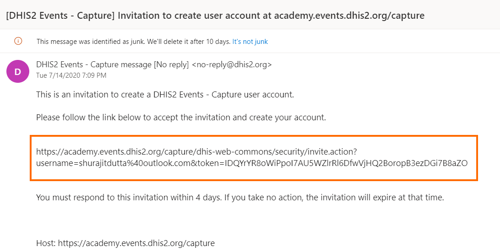

DHIS2 Events - Capture Invitation to create user account at
academy.events.dhis2.org/capture

DHIS2 Events - Capture message No reply

This is an invitation to create a DHIS2 Events - Capture user account.

Please follow the link bellow to accept the invitation and create your
account.

You must respond to this invitation within 4 days. If you take no
action, the invitation will expire at that time.

In order to continue, either click on the highlighted link or copy and
paste it into a new tab in your browser. This link will take you to the
following page:

Your email-details have already been filled in from OpenEdX. You will
need to fill in the remaining fields however.

Take note of the restrictions on the password. It must:

  - Be at least 8 characters long
  - Include an uppercase letter
  - Include 1 number/digit
  - Include a special character

After filling in all the fields select “Create” to proceed

This should log you in to the DHIS2 Capture system where you can view
the dashboard.

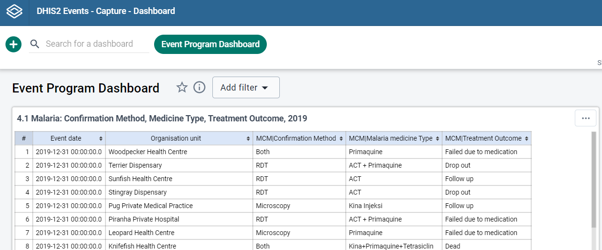

From here, please follow instructions for any activities or assignments
that are referring you to the DHIS2 capture system.

## 3.1 - Event Capture for Web

### Demonstration - Overview of Capture App

#### Introduction - Subsection 3.1

In Subsection 3.1 we review how to enter event data into DHIS2 using the
capture app on the web.

Subsection 3.1 has 3 units for you to review. We recommend that you
review these units in order.

1.  Demonstration - Overview of Capture App
2.  Demonstration - Skip Logic, Indicators & Validation Rules
3.  Demonstration - Form View & Row View

##### Ungraded Activities

There is an activity associated with each unit in this subsection.
Scroll below the video demonstration in each unit in order to view the
activity.

##### Graded Assignment

After you have completed reviewing all the material within this
subsection, please attempt the graded quiz for this subsection. This
quiz will contribute to 10% of your overall grade.

#### Video - Event Capture for Web Version Demonstration Part 1 of 3

#### Activity Links

#### Part 1 Activity: Overview of Capture App

DHIS2 Capture  DHIS2 Documentation   Printable version

This activity will be completed in DHIS2 Capture. Please use the account
details you have created for DHIS2 Capture  in order to log in.

Activity Instructions

In the **Search apps** field, search for the **Capture app**. Click on the
target symbol.

To choose a location, click on the arrow to expand the Organisation Unit
(OU) hierarchy in the desired branch.

  - Select the “Yam Health Centre,” by expanding **Trainingland > Food
    Region > Staple District**

Only programs relevant to the selected OU and user will show up in the
selection list.

Select the “Malaria Case Management” program.

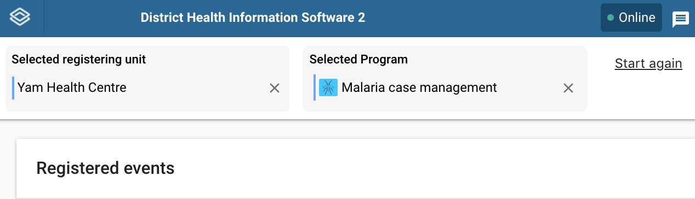

Register a new event by clicking on the **New Event** button in the top
right corner.

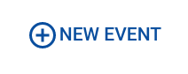

First click on the **gear symbol** on the right; this allows users to decide
which columns to show or hide in the table of events displayed.

Second, click on the **horizontal ellipses** next to the gear symbol then
select “Download data…”

This allows for the download of a list of events in XML, JSON, or CSV
format.

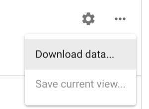 

Third, click any of the column headers. This sorts the information that
appears in the table by column. The sorting icon, which is a little
green arrow, indicates the current sorting column.

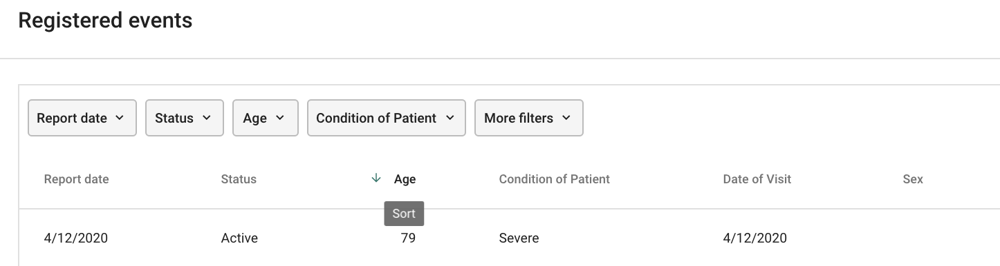

Fourth, it is also possible to filter the information that appears in
the table by clicking any of the **headers** at the top of the table. When
clicking them an input field appears to select, or type, a filtering
criteria. An example of the input field options for “Condition of
Patient” is shown below.

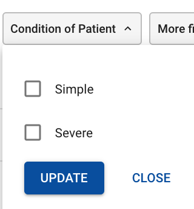

During filtering it is possible to define start and end dates for date
type data elements as well as lower and upper limits for number types.

Lastly, the interface’s paging options can be changed; it is possible to
edit the number of event rows that appear per page by using the paging
section at the bottom of the list and editing the **Rows per page** drop
down. You can also move between the pages of events using the arrows at
the bottom of the table.

### Demonstration - Skip Logic, Indicators & Validation Rules

#### Video - Event Capture for Web Version Demonstration Part 2 of 3

#### Part 2 Activity: Skip Logic, Indicators & Validation Rules

  - De-select the “Malaria case management” Program
  - Now select the “SARA RCH” program
  - Click on + **New Event** in the top right corner

Let’s review the form. First, as is required, select a report date.

Fill out the remainder of the form.

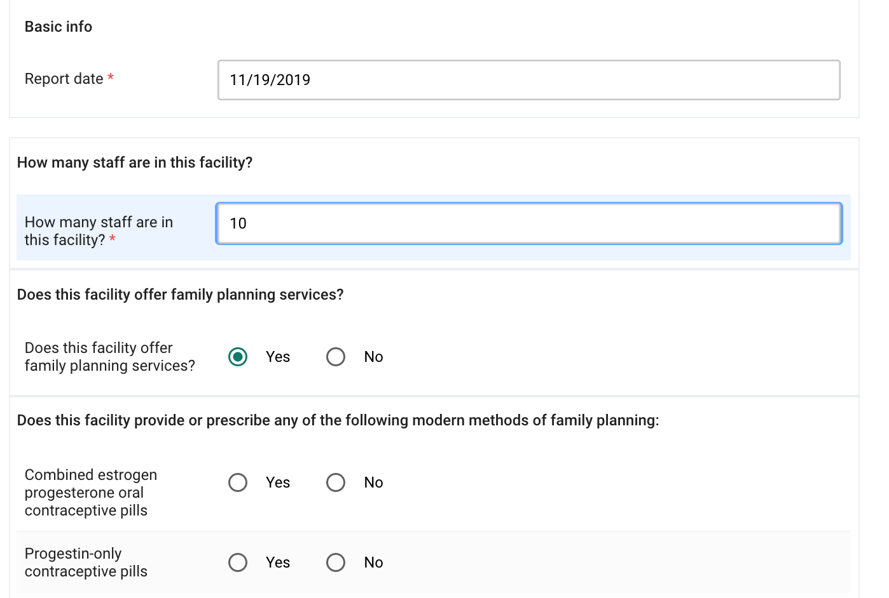

Let’s demonstrate how skip-logic functions as a result of program rules.

  - Switch between the selections of “Yes” and “No” for the following
    variables in the form:

<!-- end list -->

  - “Does this facility offer family planning services?”
  - “Received any family planning training in the last two years?”
  - “Received any training in adolescent sexual and reproductive health
    in the last two years?”
  - “Does this facility stock contraceptive commodities at this service
    site?”
  - “Does this facility offer antenatal care (ANC) services?”
  - “Received any ANC training in the last two years?”
  - “Received any training in IPTp in the last two years?”

If we click “Yes” when responding to the question “Does this facility
offer family planning services,” six sections of questions appear. If we
click “No”, to this question, nothing happens to the form. These fields
will not appear due to the “skip logic” incorporated into the form.

Let’s review the program indicators and how they can be calculated
within the Event Data Entry form.

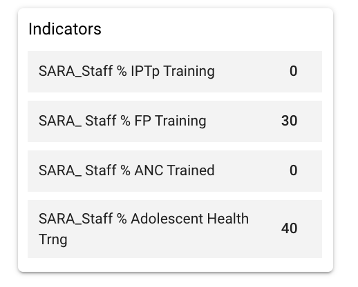

  - In the form on the right is a section for program indicators
  - “On-the-fly” indicator expression evaluation is supported; if a
    program has indicators defined for it, the system will calculate the
    indicator and display the result the moment all values related to
    the indicator expression have been entered
  - All numerators and denominators are entered into this form

Let’s now take a look at program validation rules:

  - These are used to validate the data entered in each event
    registration form
  - Change the denominator value of the data element “How many staff are
    in this facility” to be < (less than) the number of those who
    “Received any family planning training in the last two years”

  - A validation warning will appear directly next to the data element
    where the violation is detected

  - Now let’s change the denominator value back to the original value so
    the validation warning no longer appears

## 3.1 - Graded Quiz - Event Capture for Web

#### Graded quiz - Event capture for web

This is a **graded quiz** and it is worth **10%** of your final grade.

You have **2 attempts** to pass each question.

Select the "**check**" button to submit your answers.

If you want to save your current response without submitting it for
grading yet, select the "save" button. This allows you to come back
later and resume the attempt.

#### Question 1 - Screenshot

The above screenshot (Question 1 - Screenshot) shows the default
view when I first navigate to the capture app. What steps do I take when
I want to enter new events within the capture app?

( ) I click on the “New” button in the top right corner. I can then
select the event program, organization unit and date associated with the
event. {{This is the incorrect sequence -- try again!}}

( ) I select the program I want to work with, click on the “New” button
in the top right corner, select the organization unit I want to add a
new event to followed by the date associated with the event {{This is
the incorrect sequence -- try again!}}

(x) I select the organisation unit I want to add a new event to, select
the event program I want to add a new event to than select the “New”
button followed by the date associated with the event

explanation

Work from left to right when adding new data for an event within the
capture app. DHIS2 will prompt you when you select an item in the
sequence out of order.

explanation

#### Question 2 - Screenshot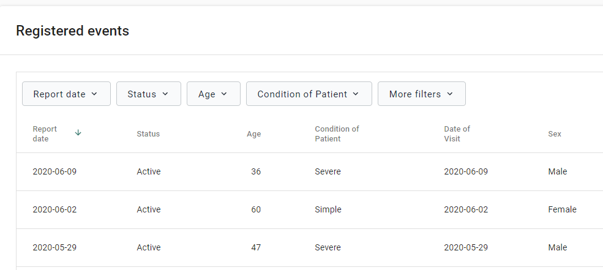

Review the screenshot above (Question 2 - Screenshot) taken from the
capture app when reviewing an event program. How can I filter the
results shown in the table using the field “Condition of Patient” to
show only cases that meet the criteria of Condition of Patient = Severe.
Note that the condition of patient data element uses a pre-populated
drop down list in order to record a response.

(x) Click on the button above the table labelled “Condition of patient”
with and Select “Severe.” Note this button has a small down arrow beside
its name. {{The grey buttons with dropdown arrows next to their name
above the table allow you to filter criteria shown within the table
itself. You can add additional filters within the event program you are
reviewing at any time if they are not shown above the table as well; the
subsequently use those to filter the table further.}}

( ) Click on the column heading “Condition of patient” within the table
and select “Severe” {{Column headings allow you to sort, but they do not
perform filtering of the table}}

( ) Use a filter function that allows me to type the criteria of
Condition of Patient = Severe in order to filter the table {{In this
case, you are working with a pre-populated response of options. You will
not need to type anything when using these types of lists.}}

explanation

The grey buttons with dropdown arrows next to their name above the table
allow you to filter criteria shown within the table itself. You can add
additional filters within the event program you are reviewing at any
time if they are not shown above the table as well; the subsequently use
those to filter the table further.

explanation

#### Question 3 - Screenshot

Within the capture app, I am able to change to “row view” by
selecting the button as shown in the above image (Question 3 -
Screenshot). How does the “row view” differ from the default view shown
in the capture app?

( ) The row view will take me back to the front page table list so I can
view the the events associated with the event program and organization
unit that have been selected in a tabular format. {{To take you back to
the front page tablelist you can use the back button within the DHIS2
application or your browser}}

(x) The row view will take the current event I am entering data for and
display the data elements within the selected program in a tabular
format. I am then able to enter my data in tabular format rather than a
vertical format.

( ) The row view will show me a table view produced via the event
reports application that is a summary of all of the events within the
organization unit and program I have selection {{You can view event
reports on the dashboard or via the event reports application but not in
the capture app.}}

explanation

The row view will alter the data entry interface so your data elements
are displayed horizontally rather then vertically.

explanation

#### Question 4

I am able to review indicators that have been calculated
“on-the-fly” (ie. directly in the event program as I enter data)
within the capture app on the web when entering data for an event
program

(TRUE), FALSE

explanation

True. This functionality gives flexibility to use individual data to
provide immediate feedback to a user for an individual event directly
within the capture app.

explanation

#### Question 5

I am unable to validate my data as it is being entered within an
event program.

TRUE, (FALSE)

explanation

We are able to validate our data directly within event capture as we are
entering data. Various rules can be created in order to perform this
validation to ensure data is being entered correctly.

explanation

## 3.2 - Event Capture for Android

### Demonstration - Installation & Logging In

#### Introduction - Subsection 3.2

In Subsection 3.2 we review how to enter event data into DHIS2 using the
capture app on an Android device.

Subsection 3.2 has 4 units for you to review. We recommend that you
review these units in order.

1.  Demonstration - Installation & Logging In
2.  Demonstration - Register & Sync an Event
3.  Demonstration - Settings Syncing Data to the Online Server
4.  Demonstration - Offline Event Capture

##### Ungraded Activities

There is an activity associated with each unit in this subsection.
Scroll below the video demonstration in each unit in order to view the
activity.

##### Graded Assignment

After you have completed reviewing all the material within this
subsection, please attempt the graded quiz for this subsection. This
quiz will contribute to 10% of your overall grade.

#### Video - Event Capture for Android Demonstration Part 1 of 4

#### Part 1 Activity: Installation & Logging In

  - Install the **Event Capture** app on your Android device
  - Open Google play on the device and search for “dhis2”

  - Note: You can access the DHIS2 app via the google play store
    directly via your computer if you would like by accessing the
    following link : [https://play.google.com/store/apps/details?id=com.dhis2](https://www.google.com/url?q=https://play.google.com/store/apps/details?id%3Dcom.dhis2&sa=D&ust=1605291870220000&usg=AOvVaw0H-KTeOoCAYtiVVokA0PXp)

  - Select the app called **DHIS2 Capture**

Next, select **Install** to install the app on the device.

##### Logging in

Next, let’s explore how to log in to the app.

Open the app and enter the following login details:

**Server URL**: https://academy.events.dhis2.org/capture

**Username**: Select a user name from the table below. **You will not be using the username that you created previously when interacting with theandroid app.**

**Password**: District1#

Note: For the username, several have been created for this exercise.
Please select an account according to your last name. This is being done
so that we can separate the data that is entered by the android devices
across the various organisation units within Trainingland Capture so it
is easier for each user to find their data when they log in through
their web browser later on.

The server will take some time to sync the configuration and load the
metadata.

The programs available will appear on the homepage of the app.
Underneath the program name you see the number of events that are
registered. In this case, we can see the **Malaria Case Registration program**.

  - **Note**: Depending on the user you select, you may not see any
    data/events registered in the program. This is because each user has
    been assigned different organization units.

Upon login, a screen that reads **Home** in the top left corner will appear.
Click on *Show help *for a walkthrough of the interface.

### Demonstration - Register & Sync an Event

#### Video - Event Capture for Android Demonstration Part 2 of 4

#### Part 2 Activity: Register & Sync an Event

##### Selecting a program

Now that we’ve logged in, let’s go over how to select a program for data
entry.

Select the program “Malaria case registration”. Note that both the color
and the icon that represent the program, and elements within it can be
defined by the user.

After selecting the program any events linked to the program and
organization units the user has access to will appear.

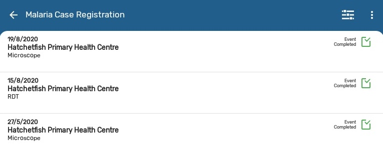

By using the **filter** button at the top right, you can filter the
registered events by organization unit or period, so that only events
that meet your filter criteria will appear in the
list.

##### Review the program and enter data

To register a new event, click on the + icon in the lower right corner.
Select the date the case visited the health center.

Select an organization unit at the lowest level. Note that the
organization units you see may be different then what is available in
the screenshot below. This is because each android account is assigned
different organization units.

Sections can be collapsed by clicking on the arrow next to the section
name. Note you can navigate to a different section by clicking on the
section name at the top, and selecting the section of interest.

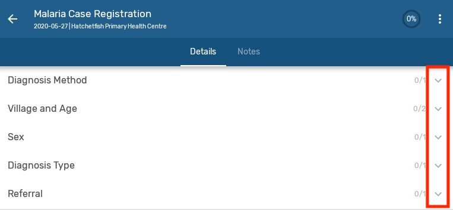

The sections have a completion indicator next to the section name as
well. The 0/1 indicates there is 1 data element in this section in which
none have a response.

Fill in the details of this new malaria case event.

For each element, options are selected by tapping on the option of
interest on the screen. You can see that the option has been selected as
it will have a check mark next to it. The number indicators next to the
section headings are also updated as we enter data for each section to
indicate there are now values selected for the data elements within the
section.

Select “RDT” as the option in the “Diagnosis Method” section.

##### Program rules

Program rules allow for “skip logic” when entering data in event and
tracker programs. To view this feature:

  - With “RDT” selected as the “Diagnosis Method”, notice that the next
    section that appears is “Diagnosis Result RDT”
  - Navigate to the “Diagnosis Method” section and select “Microscope”
    as the method
  - Notice that the next section that appears is “Diagnosis Result
    Microscopy”

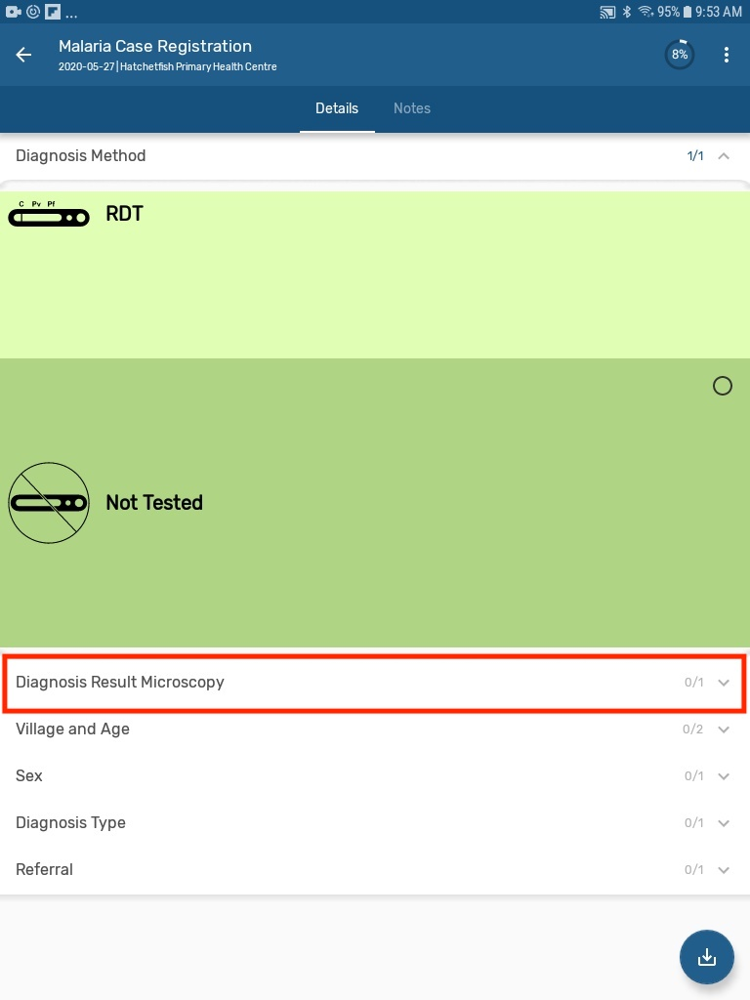

Fill in the data for the “Diagnosis Result Microscopy” section by
clicking on the section header. Select “Pf” as the result. When clicking
on this we can see the “Treatment PF” section appears. If we click into
the treatment section, we can see that the options within that are ACT
doses.

If we go back into the Diagnosis Result Microscopy section by clicking
on the section header, and select Pv as the result., the treatment
section now reads Treatment PV, and the options within it are different
doses of CQ and CQ + PQ.

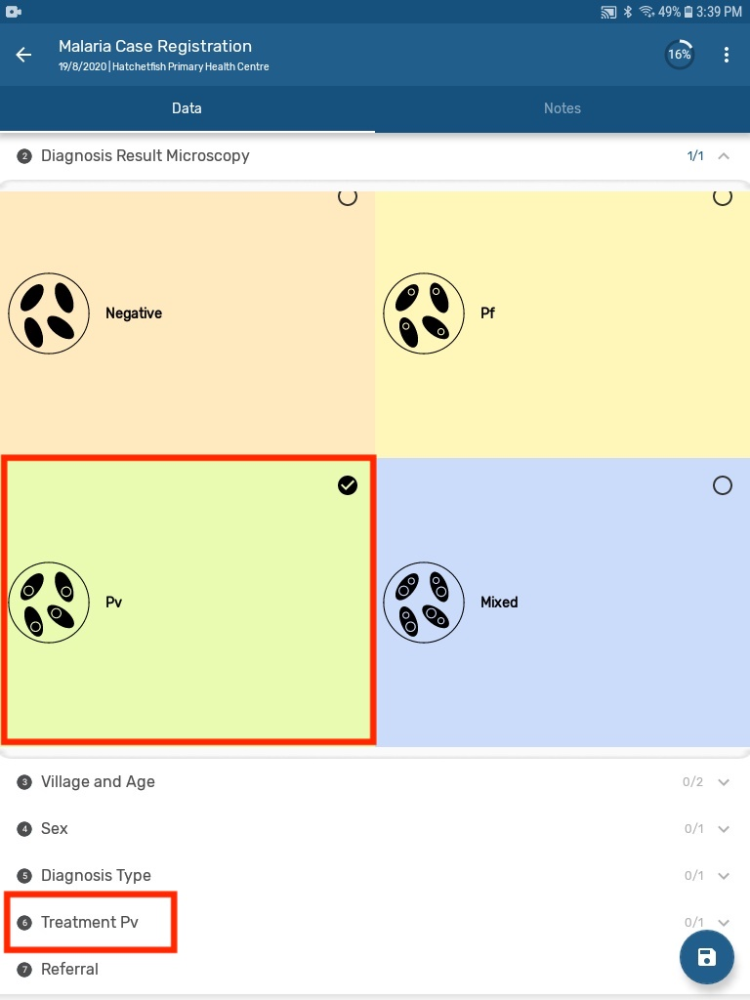

Finish filling out the event data. Navigate to the “Village and Age”
section. Select the village as the same organization unit that you
registered the event in and tap Accept.

Tap on the “Age” element, and enter an age using the numeric keyboard.
Then tap Next on the keyboard.

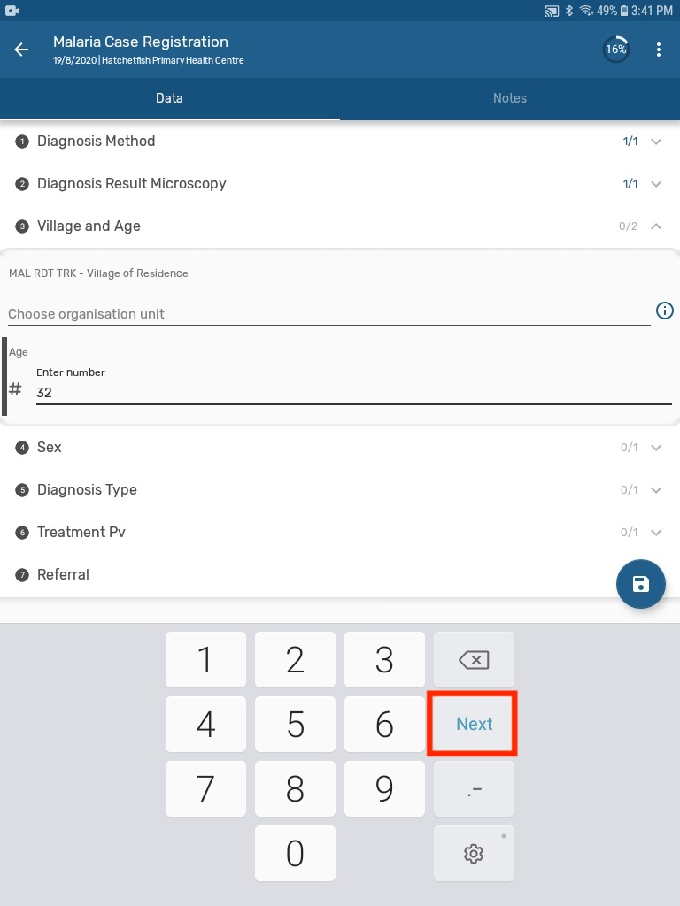

Continue navigating through the sections and filling in data for the
event until each section is complete.

  - Select a sex
  - Select a diagnosis type
  - Select a treatment
  - And select a referral

When you have entered all of the data, click on the blue circular save
button in the bottom right corner of the screen.

Upon completing data entry, it will be possible to select whether or not
the event is complete. For this example, select Finish and complete.

The new event will then appear at the top of the list of events.

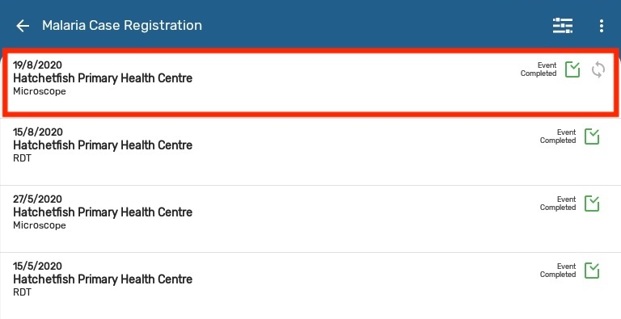

### Demonstration - Settings for Syncing Data to the Online Server

#### Video - Event Capture for Android Demonstration Part 3 of 4

#### Part 3 Activity: Settings for Syncing Data to the Online Server

##### Sync Status

If an event has not yet been synced with the online server, it will have
a Sync status button, which is the circular double arrow button, located
to the right of it in the program page. If the event has been synced
with the server, the Sync status button will not appear.

Clicking on the **sync status** button will reveal that the event has not yet synced to the server. This is a result of the settings and how
frequently the data are synced with DHIS2. Note that while it is not
sent to the server, the data are stored locally on the mobile device.

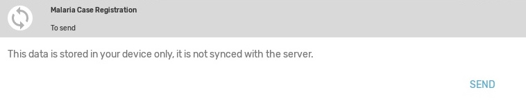

If you want to sync the event to the server, you can click on Send in
the bottom right corner after selecting the sync status.

The app will display a message that says the data have been sent to the
server. We can also see in the events list that the sync symbol is no
longer next to the event.

Sync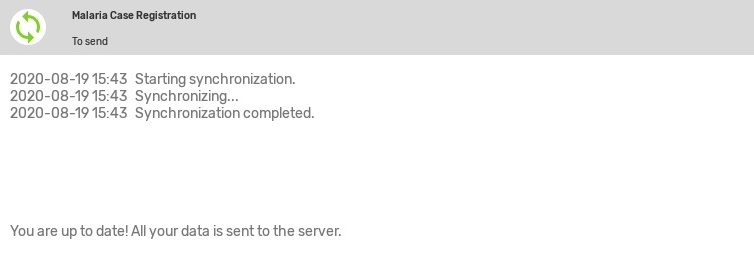

##### Sync settings

To access the app settings, click on the **Menu** button in the top left
corner, then select **Settings**. There are a number of different options, among them **Sync data, Sync configuration**, and **Sync parameter** settings.

To manually sync multiple events at one time:

  - Select **Sync data** in settings
  - Select **Sync data now**

##### Verify by logging in on the web

Verify that this event was sent by logging in through the web-browser
DHIS2 instance and opening up the **Capture** app. For the organisation unit **select the organization unit that you registered your event on when using the Android device**. This may be different then the facility shown in the screenshot below. and “Malaria Case Registration” as the program. The event should be in the list of events shown.

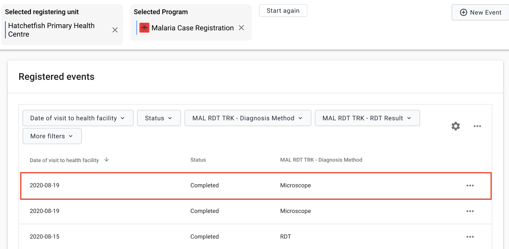

### Demonstration - Offline Event Capture

#### Video - Event Capture for Android Demonstration Part 4 of 4

#### Part 4 Activity: Offline Event Capture

To test the syncing of events while offline:

  - First, turn off the wifi on your Android device
  - Register and complete an event for the “Malaria Case Registration”
    program
  - Attempt to sync the event with the server

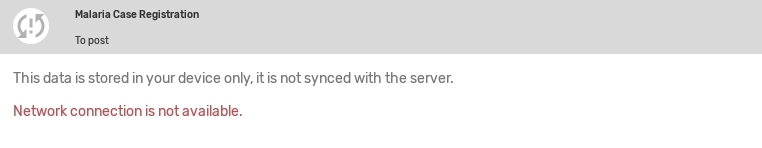

  - Now, turn the wifi back on and try to sync
  - Despite registering the event while offline, the event now syncs to
    the server

### Takeaways from Module 3

#### Recap, reflect and share

**What new ideas have you come up with in this module? What doubts do you have?**

Even though most of the contents of the course are aimed for you to get
familiar with the DHIS2 features, the end goal is for you to relate what
you learn to your daily work and find new ways to solve data challenges
you face.

Take advantage of this space to recap, reflect, and share your thoughts
with your peers and learn from them.

## 3.2 - Graded Quiz - Event Capture for Android

### Graded Quiz - Event Capture for Android

This is a **graded quiz** and it is worth **10%** of your final grade.

You have **2 attempts** to pass each question.

Select the "**check**" button to submit your answers.

If you want to save your current response without submitting it for
grading yet, select the "**save**" button. This allows you to come back
later and resume the attempt.

##### Question 1 - screenshot

The above screenshot (Question 1 - Screenshot) has highlighted the
server URL on the log in page using a box in red colour. When using this
URL field, I need to re-enter the server URL every time I log in to the
same server on the Android app.

TRUE, (FALSE)

explanation

If I am going to log in to a different server, I will need to re-enter
the URL. If I log in to the same URL on the same device, the URL will be
saved; I do not need to re-enter it.

explanation

Question 2 - Screenshot

The above screenshot (Question 2 - Screenshot) shows the default
view in the Android app after I have select an event program that I want
to work with. Which button do I select in order to create a new
event?

( ) The button outlined in the black box labelled as “1.” {{This allows
you to filter events}}

(x) The button outlined in the orange box labelled as “2.”

( ) The button outlined in the blue box labelled as “3.” {{This button
allows you to open an existing event}}

explanation

You select the plus sign within the Android app in order to add a new
event to the program you are working with.

explanation

##### Question 3 - Screenshot

In the screenshot above (Question 3 - Screenshot), one of the events
is outlined via a box in red colour. To the very right of the event,
there is an icon showing two grey circular arrows along with an !
(exclamation point) in the centre of the circular arrows in grey colour.
What does this icon represent?

( ) This means the data has been synchronized both on the device as well
as sent online. {{Please review the Demonstration - Settings for Syncing
Data to the Online Server if unsure about this icon}}

( ) This means the data has been synchronized online only {{Please
review the Demonstration - Settings for Syncing Data to the Online
Server if unsure about this icon}}

(x) This means the data has been synchronized to the Android device
only. It has not yet been sent online.

explanation

This icon represents that the event is not yet synchronized online; only
on the Android device. Events can be synchronized manually or via a
schedule that is set up to perform this automatically.

explanation

 Event programs can be created using large icons to represent
dropdown lists/option sets within the Android app.

(TRUE), FALSE

explanation

True. This is an option to allow for a more intuitive user interface
when the Android app is being used to collect data.

explanation

Program rules/skip logic does not work on the Android app. This is
a function that only works within the capture app when using the
web-based version of DHIS2.

TRUE, (FALSE)

explanation

False. Program rules/skip logic is fully supported within the Android
app. This allows us to implement necessary workflows to improve the data
entry process on both Web and Android when working with event programs.

explanation

## Feedback - Event Data Capture

# Module 4: Event Data Analysis

## 4.0 - Create your DHIS2 account on ANALYSIS & Introduction to Module 4

### Introduction to Module 4

#### WELCOME TO MODULE 4!

This module focuses on showing you how you can use event data to create
event data outputs in the form of tables, charts and maps.

In module 4, there are 4 subsections that you will be reviewing:

  - 4.1 - Event Reports. This subsection is divided into 6 units.
  - 4.2 - Event Visualizer. This subsection is divided into 5 units.
  - 4.3 - Maps. This subsection is divided into 6 units
  - 4.4 - Joint Analysis of Event & Aggregate Data. This subsection is
    divided into 5 units.

#### OBJECTIVES

By the end of this module, you should be able to:

  - Describe the features of the event reports, event visualizer and
    maps apps as they relate to outputting event data
  - Use the event reports, event visualizer and maps app to create event
    data outputs in DHIS2
  - Describe how event and aggregate data can be reviewed together
  - Use the data visualizer and maps app to create joint event and
    aggregate data outputs

#### ACTIVITIES & ASSIGNMENTS

#### Activities

You will be performing ungraded activities **for each unit labelled as a demonstration** within the 4 subsections of this module. Activities will be identified within the subsection themselves. There is therefore a total of **20 activities** that you will perform within this module. Don't worry, we try not to make any single activity to long!

#### Assignments

You will have **4 graded assignments** in the form of hands-on exercises
that you must answer, one for each subsection. Each graded assignment
will contribute to 10% of your overall grade. This module therefore
contributes to 40% of your grade overall.

#### Training Environment

You will be using the ANALYSIS training environment to perform your
activities and assignments. If you have not done so, please sign up for
this training environment by following the instructions in the unit
Account Creation - Analysis.

#### TIME COMMITMENT

There is a significant amount of content to cover in this module! This
module should take you approximately **8 hours** in total to review all of the content, perform the ungraded activities and finish the graded
assignments as identified in the course outline. This is our longest
module, but will likely be very useful to many of you!

### Account Creation - ANALYSIS

Instructions - Account Creation on Analysis

In order to perform the exercises and assignments within Module 4, you
will be accessing the **ANALYSIS** DHIS2 system. The **ANALYSIS** system will grant you access to different apps within DHIS2 when compared to **CAPTURE**. You can see the apps you will have available in the screenshot below. In this system, you will not have access to any of the apps used to capture data. If modification of the data was allowed, this could potentially affect any of the values associated with the outputs used in this module.

Please create an account for ANALYSIS by following the available
instructions.

-----

Click the "Request account" button below to request an account on the
DHIS2 Analysis system.

You will receive an invitation by email with instructions on how to
complete the registration in DHIS2.

Note: the email address you use with OpenEDX will be sent to the DHIS2
database to create an account.

Give it a couple of seconds to think; DO NOT keep clicking the “Request
account” button several times in a row! It will send your email details
that you used when you registered in OpenEdX to the DHIS2 Analysis
system to begin the registration process. After 5-10 seconds you should
receive the following notification in your browser window.

Click on OK to close this notification.

Login to to your e-mail. You should receive an e-mail subject that looks
like the following:

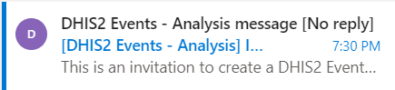

We can see in the email subject that the DHIS2 system that has been
identified is the Analysis system that you should be signing up for.

Note that this e-mail may be in your junk folder. If you do not see it
in one of your primary inboxes, please check your junk folder in case it
was filtered out.

The e-mail itself should look like this

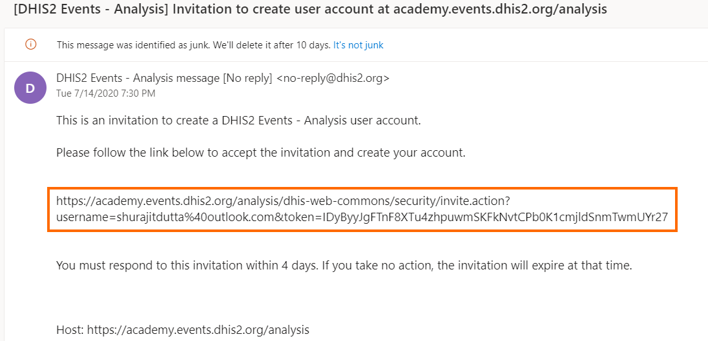

In order to continue, either click on the highlighted link or copy and
paste it into a new tab in your browser. This link will take you to the
following page:

Your email-details have already been filled in from OpenEdX. You will
need to fill in the remaining fields however.

Take note of the restrictions on the password. It must:

  - Be at least 8 characters long
  - Include an uppercase letter
  - Include 1 number/digit
  - Include a special character

After filling in all the fields select “Create” to proceed

This should log you in to the DHIS2 Analysis system where you can view
the dashboard.

From here, please follow instructions for any activities or assignments
that are referring you to the DHIS2 Analysis system.

## 4.1 - Event Reports

### Demonstration - Interface Description

#### Introduction - Subsection 4.1

In Subsection 4.1 we review how to enter event data into DHIS2 using the
capture app on the web.

Subsection 4.1 has 6 units for you to review. We recommend that you
review these units in order.

1.  Demonstration - Interface Description
2.  Demonstration - Creating a Line List Event Report
3.  Demonstration - Filtering Data Items
4.  Demonstration - Creating a Pivot Table Event Report
5.  Demonstration - Updating the Table Layout
6.  Demonstration - Aggregated Data Using an Average

##### Ungraded Activities

There is an activity associated with each unit in this subsection.
Scroll below the video demonstration in each unit in order to view the
activity.

##### Graded Assignment

After you have completed reviewing all the material within this
subsection, please attempt the graded quiz for this subsection. This
quiz will contribute to 10% of your overall grade.

#### Video - Event Reports Demonstration Part 1 of 6

#### Part 1 Activity: Interface Description

This activity will be completed in DHIS2 Analysis.

Clicking on the DHIS2 symbol below, located in the upper left of the
page, navigate to the main Dashboard page.

Next, select the **action ellipses** within the 4.1 Pivot Table, and click  “Open in Event Reports app.”

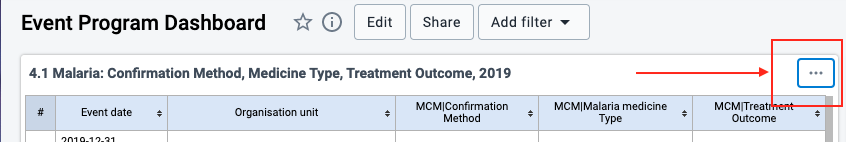

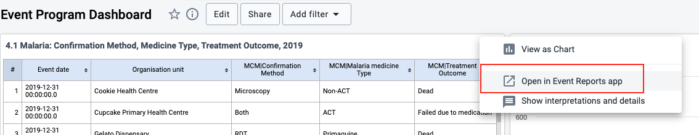

Using the **Data** tab on the left, add the data item “Condition of
Patient”.

**Update** the table to see the changes reflected on the screen.

Add the year “2020” to the **period** and then **update** the table.

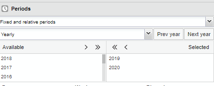

Change the Organisation unit to “Animal Region” and update the table.

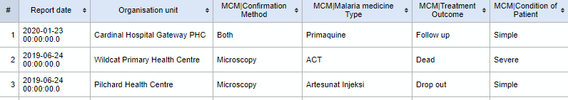

### Demonstration - Creating a Line List Event Report

#### Video - Event Reports Demonstration Part 2 of 6

#### Part 2 Activity: Creating Line List Event Report

Create a new table by selecting **Favorites > New**.

Select the **Table style** “Line list” and the **Output type** “Event.”

In the **Data** tab, select:

  - The **Program** and **Stage** “Malaria Case Management”
  - The data elements “Age", "Sex" and "MCM Treatment Outcome”

  - In the **Periods** tab select:
  - “Fixed and relative periods”
  - The period type “Yearly”
  - “2019”
  - Make sure to remove the checkmark next to “Last 12 months”

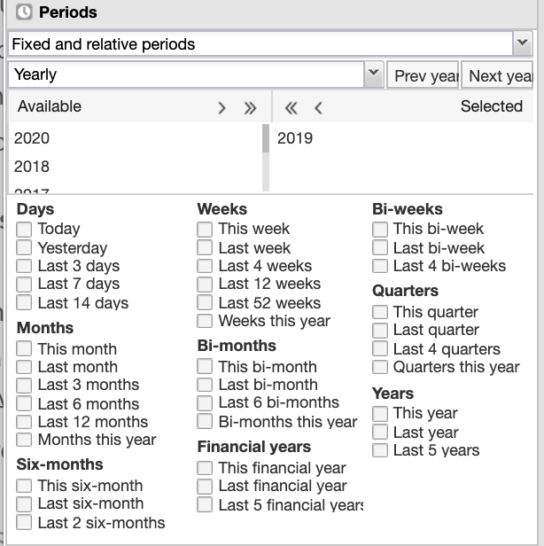

In the **Organisation units** tab select “Trainingland” and then click on **Update**.

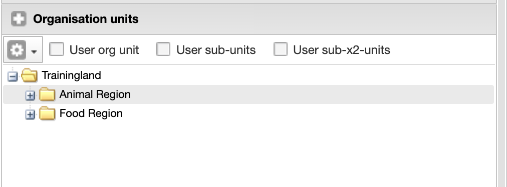

### Demonstration - Filtering Data Items

#### Video - Event Reports Demonstration Part 3 of 6

#### Part 3 Activity: Filtering Data Items

Edit the data item “Sex” to filter the cases to show “Females” only.

Click **Update** and view the table.

Change the “Age” filter, set the option to “No range set” and the
operator to “=”.

Click **Update** and view the table.

### Demonstration - Creating a Pivot Table Event Report

#### Video - Event Reports Demonstration Part 4 of 6

#### Part 4 Activity: Creating a Pivot Table Event Report

Clear the current table. Select **Favorites> New**.

In the **Data** tab select:

  - The **Program** and **Stage** “Malaria Case Management”
  - The data elements “Age", "MCM | Condition of Patient" and
    "MCM|Malaria species Type”

In the **period** tab select:

  - “Fixed and relative periods”
  - The period “Yearly”
  - “2019”
  - Make sure to uncheck the “Last 12 months” box

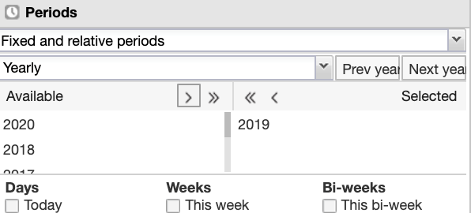

Select the **Organisation Unit** “Animal Region.”

Click **Update**.

Edit the table **Options**

  - Remove the checks next to “Show row totals” and “Show row
    sub-totals”
  - Check the box next to “Hide n/a data”

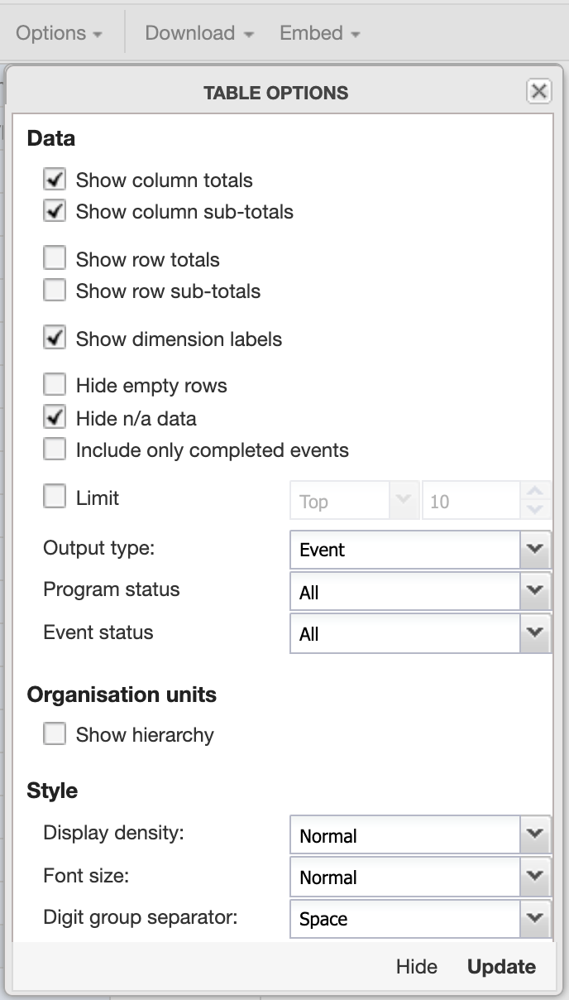

Click Update.

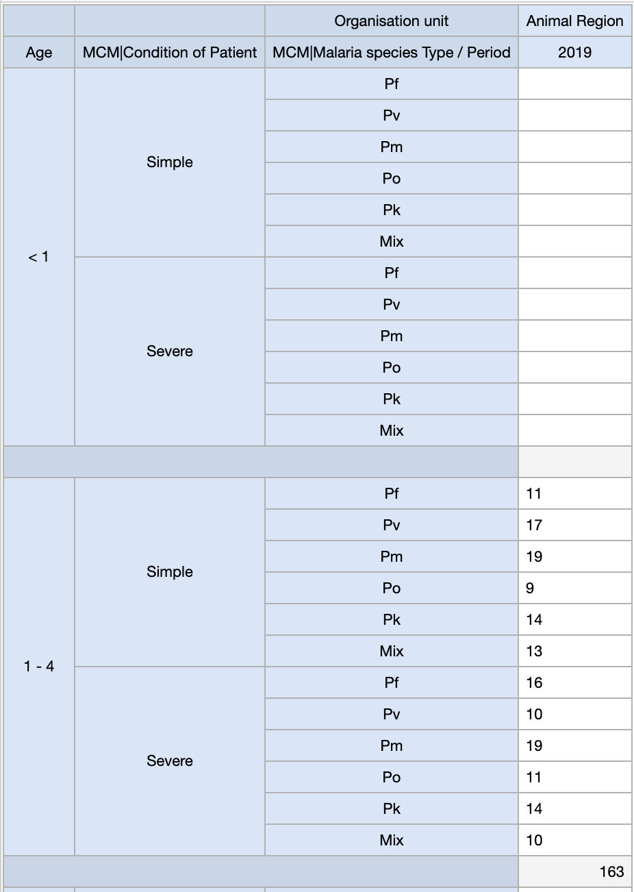

### Demonstration - Updating the Table Layout

#### Video - Event Reports Demonstration Part 5 of 6

#### Part 5 Activity: Updating Table Layouts

Change the table layout by clicking on the **Layout** button

  - Put “Periods” under **Report filter**
  - Put “Age” under **Column dimensions**
  - Leave “MCM l Condition of Patient” and “MCM l Malaria species Type"
    in **Row dimensions**

Click Update.

Under the Data items change the “Age” legend to “CoD: Age group
(broad)”.

Click **Update**.

### Demonstration - Aggregated Data Using an Average

#### Video - Event Reports Demonstration Part 6 of 6

#### Part 6 Activity: Aggregated Data Using an Average

Click **Layout**.

Under Aggregation select “Age” instead of “Number of events”. Select the
aggregation operator as “Average”.

Click **Update**.

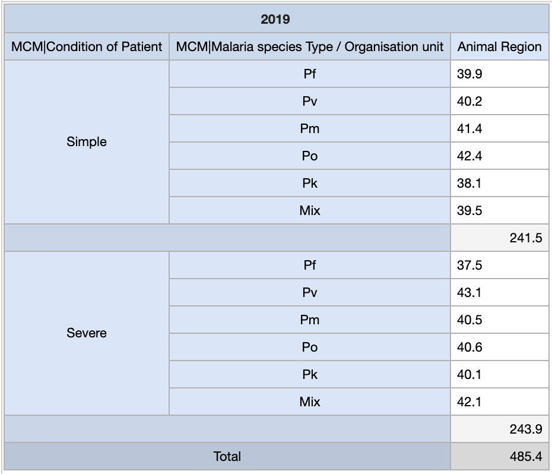

If you would like, you can save the table as a favorite. Click
**Favorites > Save**.

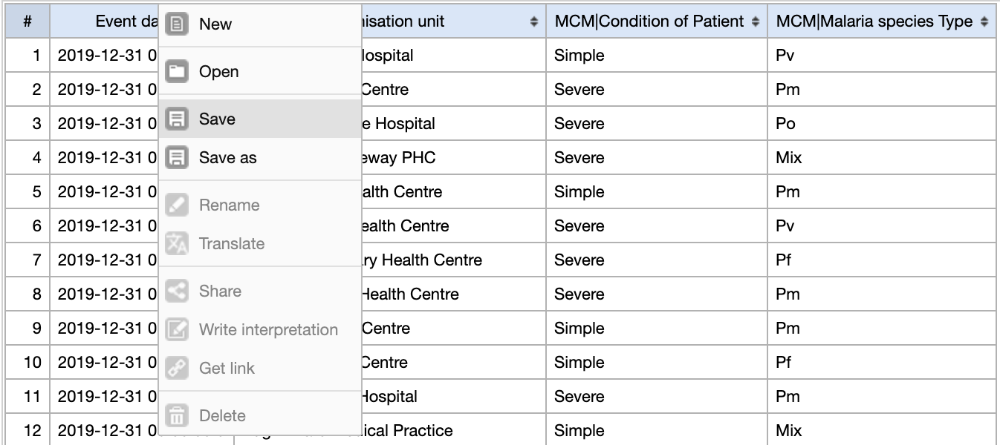

  - Please provide the favorite name and description using a unique
    naming convention that begins with your initials
  - A useful convention is: **your initials_program_what_where_when**
  - Next, select **Download**.

  - Click on the format you prefer

## 4.1 - Graded Assignment - Event Reports

### Graded Assignment - Event Reports

This is a **graded assignment** and it is worth **10%** of your final grade.

You have **2 attempts** to pass each question.

If you are not sure about the steps you followed in the assignment to
get to the correct answer, click on the "**hint**" button to see some tips.

If you want to save your current response without submitting it for
grading yet, select the "**save**" button. This allows you to come back
later and resume the attempt.

Select the "**check**" button to submit your answers.

#### Assignment Links

#### Instructions

1.  For this assignment, answer questions using the **Event Reports** app
2.  Use the “Malaria Case Management” **program** and **stage**
3.  You will be marked based on the answers selected through multiple
    choice. To determine the answers, you must create the associated
    table described in the details section.
4.  Save all tables as Favorites, using the convention:
    **username_program_what, where, when**

##### Question 1: Details

**Table style**: “Line list”

**Output type**: “Event”

**Program**: “Malaria Case Management”

**Stage**: “Malaria Case Management”

**Data elements**: “MCM | Malaria method of detection,” “MCM|Malaria species Type,” “MCM|Confirmation Method”

Period: “2020”

**Organisation Unit**: “Food Region”; “Select levels” as the mode and then “Facility”

The eighth event listed is from the “Ice Cream Dispensary.” What was
the “Malaria Species Type” for this event?

( ) Mix {{Mix is incorrect, it was not the Malaria Species Type for the
eighth event listed }}

( ) Po {{Po is incorrect, it was not the Malaria Species Type for the
eighth event listed}}

(x) Pk {{Pk is the Malaria Species Type for the eighth event listed}}

( ) Pf {{Pf is incorrect, it was not the Malaria Species Type for the
eighth event listed .}}

||(A) Make sure for the Period you chose “Fixed and relative periods,”
then''Yearly” before selecting “2020.”||

||(B) Make sure you unchecked the “Last 12 months” box in the Periods
section.||

||(C) In the Layout tab, make sure the “Longitude” and “Latitude” are
“Excluded dimensions.”||

##### Question 2: Details

**Table style**: “Pivot table”

**Output type**: “Event”

**Program**: “Malaria Case Management”

**Stage**: “Malaria Case Management”

**Data elements**: “Sex,” “MCM|Treatment Outcome”

**Period**: “Start/end dates,” from “15th August 2019” to “15th June 2020"

**Organisation unit**: “Trainingland”

**Tip**: Hide “n/a data” as well as “row totals.”

**What is the most common “MCM Treatment Outcome” for “Females?”**

(x) Recovered {{Recovered. ‘Recovered’ is the most common Treatment
Outcome for Females.}}

( ) Drop out {{Drop out - is not the most common Treatment Outcome for
Females. Double check you have entered all of the input details
correctly and disaggregated the number of malaria cases by “Sex.” }}

( ) Failed due to medication {{Failed due to medication - is not the
most common Treatment Outcome for Females. Double check you have entered
all of the input details correctly and disaggregated the number of
malaria cases by “Sex.”}}

( ) Dead {{Dead - is not the most common Treatment Outcome for Females.
Double check you have entered all of the input details correctly and
disaggregated the number of malaria cases by “Sex.”}}

( ) Follow up {{Follow up -  is not the most common Treatment Outcome
for Female. Double check you have entered all of the input details
correctly and disaggregated the number of malaria cases by “Sex.”}}

||(A) Make sure to disaggregate the number of malaria cases by gender by
going to the Data tab and selecting “Male” and “Female” within the data
item “Sex.”||

||(B) Use the Options menu to hide “n/a data” as well as “row totals.”
||

**What is the most common “MCM Treatment Outcome” for “Females?”**

(x) Recovered {{Recovered. ‘Recovered’ is the most common Treatment
Outcome for Females.}}

( ) Drop out {{Drop out - is not the most common Treatment Outcome for
Females. Double check you have entered all of the input details
correctly and disaggregated the number of malaria cases by “Sex.” }}

( ) Failed due to medication {{Failed due to medication - is not the
most common Treatment Outcome for Females. Double check you have entered
all of the input details correctly and disaggregated the number of
malaria cases by “Sex.”}}

( ) Dead {{Dead - is not the most common Treatment Outcome for Females.
Double check you have entered all of the input details correctly and
disaggregated the number of malaria cases by “Sex.”}}

( ) Follow up {{Follow up -  is not the most common Treatment Outcome
for Female. Double check you have entered all of the input details
correctly and disaggregated the number of malaria cases by “Sex.”}}

||(A) Make sure to disaggregate the number of malaria cases by gender by
going to the Data tab and selecting “Male” and “Female” within the data
item “Sex.”||

||(B) Use the Options menu to hide “n/a data” as well as “row totals.”
||

##### Question 3: Details

**Table style**: “Pivot table”

**Output type**: “Event”

**Program**: Malaria Case Management”

**Stage**: “Malaria Case Management”

**Data elements**: “Age,” “MCM l Condition of Patient”

**Periods**: “Fixed and relative periods” “Quarterly” For the following
quarters:

  - “July - September 2019”
  - “October - December 2019”
  - “January - March 2020”
  - “April - June 2020”

Organisation unit: “Trainingland”

***Tip**: Filter the number of cases in the Age Range 5-9

**Which quarter has the highest number of people aged, “5-9” with a “Severe” condition?**

( ) “Jul - Sep 2019” {{“Jul - Sep 2019” does not have the  highest
number of people aged 5-9 with a "Severe" condition. Double check you
have entered all of the input details correctly and that you are
reporting the number of patients within the “5-9” age range
disaggregated by “Condition of patient.”}}

(x) “Oct - Dec 2019” {{“Oct-Dec 2019” has the highest number of people
aged, 5-9 with a "Severe" condition.}}

( ) “Jan - Mar 2020” {{Jan - Mar 2020” does not have the  highest number
of people aged 5-9 with a "Severe" condition. Double check you have
entered all of the input details correctly and that you are reporting
the number of patients within the “5-9” age range disaggregated by
“Condition of patient.”}}

( ) “Apr - Jun 2020”  {{ “Apr - Jun 2020” does not have the highest
number of people aged 5-9 with a "Severe" condition. Double check you
have entered all of the input details correctly and that you are
reporting the number of patients within the “5-9” age range
disaggregated by “Condition of patient.”}}

||Think about the objective and the specifics of what you are reporting.
Make sure to correctly adjust the age ranges in the data tab under the
“Age” data item. When choosing the period you may need to make use of
the Prev year and Next year buttons.||

##### Question 4: Details

**Table style**: “Pivot table”

**Output type**: “Event”

**Program**: “Malaria Case Management”

**Stage**: “Malaria Case Management”

**Data elements**: “Age,” “MCM | Condition of Patient”

**Period**: “Fixed and relative periods”; “Yearly”; “2020”

**Organisation unit**: Facilities within Animal Region > Bird District.

***Tip**: Calculate the average of the “Age” data element using the Layout tab

**Which facility in the “Bird District” has the highest average age of
“Severe” malaria cases?**

( ) “Owl Dispensary” {{“Owl Dispensary” does not have the highest
average age of severe malaria cases in Bird District. Double check you
have entered all of the input details correctly and that you are
reporting the average age of “Severe” malaria cases within all “Bird
District” facilities in “2020.”}}

(x) “Robin Primary Health Centre” {{“Robin Primary Health Centre” has
the highest average age of severe malaria cases in Bird District.}}

() “Ostrich Health Centre”  {{“Ostrich Health Centre” does not have the
highest average age of severe malaria cases in Bird District. Double
check you have entered all of the input details correctly and that you
are reporting the average age of “Severe” malaria cases within all “Bird
District” facilities in “2020.”}}

( ) “Parrot District Hospital” {{“Parrot District Hospital” does not
have the highest average age of severe malaria cases in Bird District.
Double check you have entered all of the input details correctly and
that you are reporting the average age of “Severe” malaria cases within
all “Bird District” facilities in “2020.”}}

||(A) Update the layout of the report. Click on Layout and make sure
“Organisation units” is under Row dimensions, and the “Condition of
patient” is in the Report Filter. ||

||(B) Remember you are reporting the “Severe” cases of Malaria and make
sure the "Condition of patient" data item is filtering only "Severe"
cases.||

||(C) In order to calculate the average of the “Age” data element in the
Layout tab, under the Value > Aggregation section, find the “Age” data
element and then, directly below, select the aggregation type as
"Average".||

## 4.2 - Event Visualizer

### Demonstration - Navigating the Event Visualizer Application

#### Introduction - Subsection 4.2

In Subsection 4.2 we review how to create data outputs using the event
visualizer app in DHIS2.

Subsection 4.2 has 5 units for you to review. We recommend that you
review these units in order.

1.  Demonstration - Navigating the Event Visualizer Application
2.  Demonstration - Visualizing Event Data in a Column Chart
3.  Demonstration - Filtering an Age Range
4.  Demonstration - Additional Filters for a Visualization
5.  Demonstration - Creating a Pie Chart with Event Data

##### Ungraded Activities

There is an activity associated with each unit in this subsection.
Scroll below the video demonstration in each unit in order to view the
activity.

##### Graded Assignment

After you have completed reviewing all the material within this
subsection, please attempt the graded quiz for this subsection. This
quiz will contribute to 10% of your overall grade.

#### Video - Event Visualizer Demonstration Part 1 of 5

#### Part 1 Activity: Navigating the Event Visualizer Application

Navigate to the **Event Visualizer** application. To do so:

a) Use the **search apps** feature OR 

b) Use the **action ellipses** and select “Open in Event Visualizer app”

Now that we are in the app, let’s review the interface.

At the very top left corner of the criteria selection column, we can see
the first option to select is the **Type**.

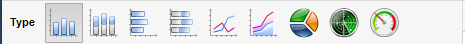

Next, we can see the **Data** selection tab where we choose the program, and if the program is a tracker program, we will also have the option to select the program stage too. The available data items are the data elements and program indicators related to the selected program.

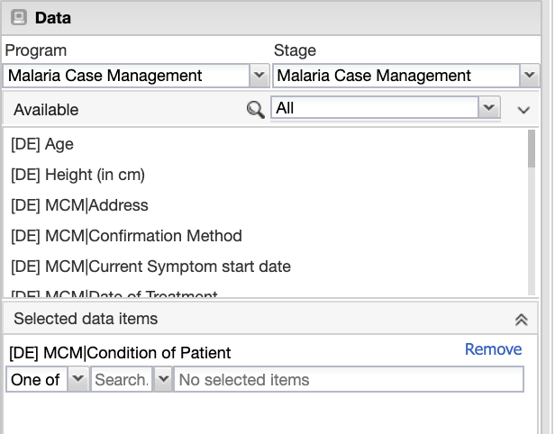

The next tab is the **Period**, and here, as in the Event Reports app, we
have the option to select either the fixed and relative period, or the
start and end dates.

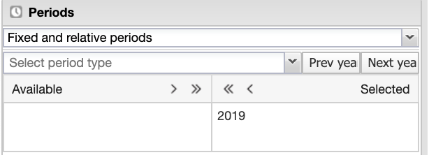

Lastly the **Organisation Unit** selection tab is where we can select the organisation units we would like to view in the report.

### Demonstration - Visualizing Event Data in a Column Chart

#### Video - Event Visualizer Demonstration Part 2 of 5

#### Part 2 Activity: Visualizing Event Data in a Column Graph

Now let’s proceed with **Task 1** and create a column graph displaying the options for malaria species type in 2019 for Trainingland.

From the **Event Visualizer** app, select **Favorites > New**.

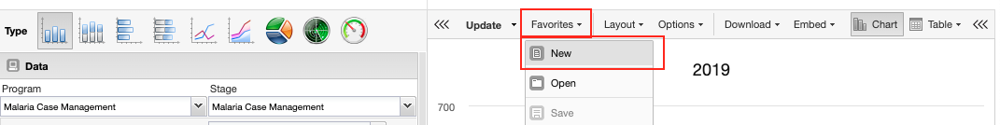

Click **Ok** to continue and approve the discarding of any changes made to the previous chart.

Select the **column graph** type.

In the data tab select:

  - The **Program** and **Stage** “Malaria Case Management”
  - The **data element** “MCM l Malaria species Type”
  - Select all “MCM l Malaria species types,” “Mix, Pf, Pk, Pm, Po, Pv”

In the Period tab, select:

  - “Fixed and relative periods”
  - The period type “Yearly”
  - The period “2019”
  - Ensure “Last 12 months” is deselected in the Relative Periods
    section

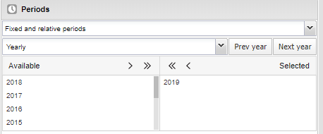

In the Organisation units tab, use the Selection mode “Select
organisation units” and then select “Trainingland.” Next, click Update.

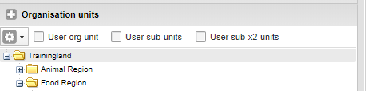

The graph shows all malaria species types listed across the horizontal
axis. It is showing the aggregate number of cases of malaria in 2019 for
the whole of Trainingland, by species type.

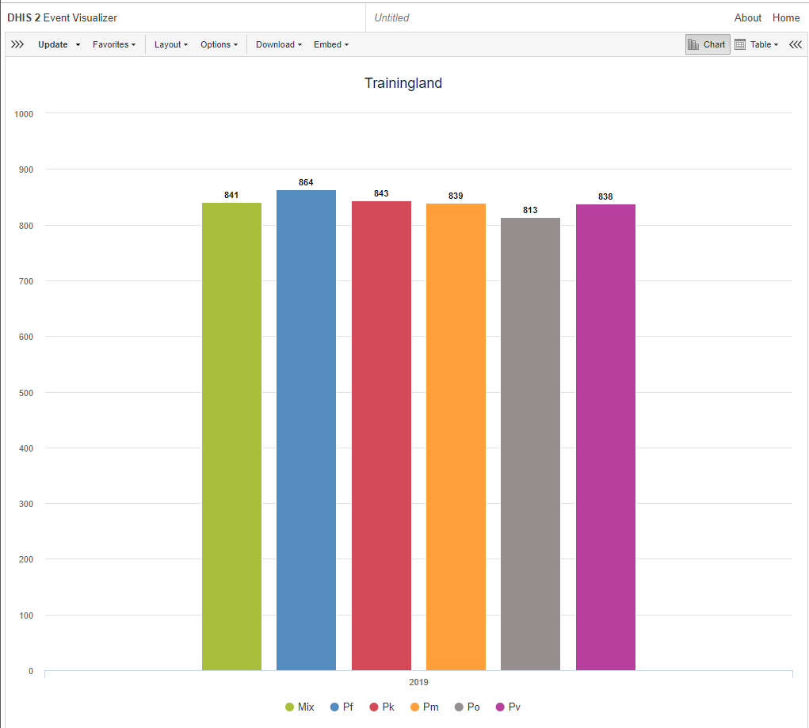

Next, let’s view the species type separately by region.

From the Organisation Units tab, select the “Animal” and “Food” regions.

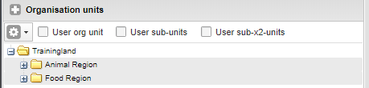

Click on the Layout button:

  - “Organisation units” should be listed under Category dimensions
  - “Periods” should be listed under Report Filter

Click Update.

Now we are able to view the mix of species types of malaria cases
separately for Animal Region and Food Region in the chart.

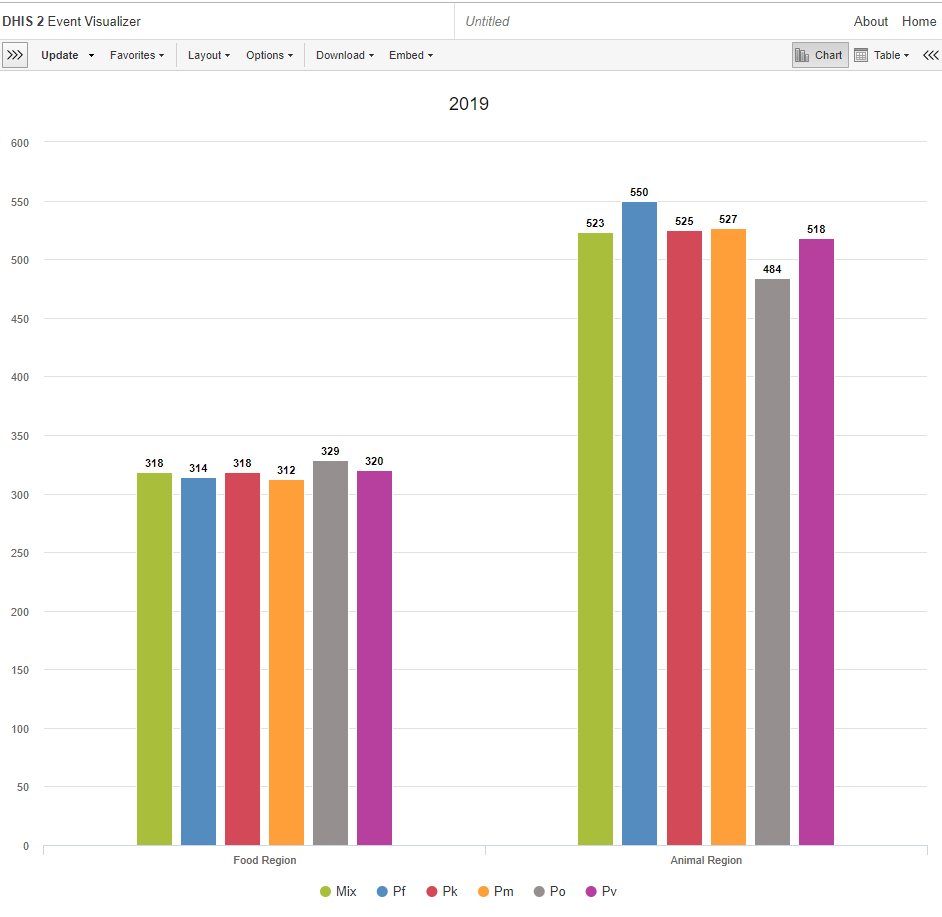

Now let’s see what happens when we drill down even further into the
Organisation Units.

From the Organisation Units tab, select all of the districts within the
“Animal Region”; then click Update.

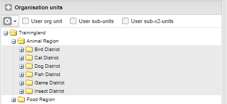

This gives you separate results for malaria cases by species in each of
the districts within “Animal Region”.

Next, from the Options menu, above the chart:

  - Select “Hide n/a data”
  - Chose the Sort order “Low to high”
  - Leave Hide chart title unchecked and add a chart title “Malaria
    Species Type, Animal Region, 2019”

 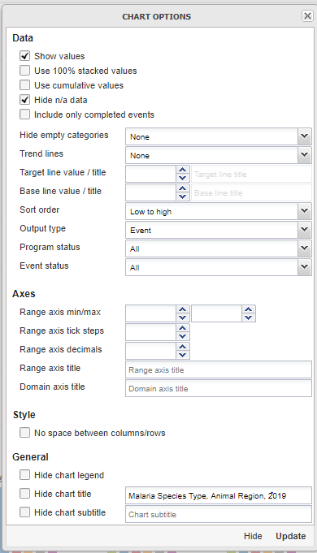

Then click Update.

The chart now displays the results by district from lowest to highest,
and we can see the title at the top.

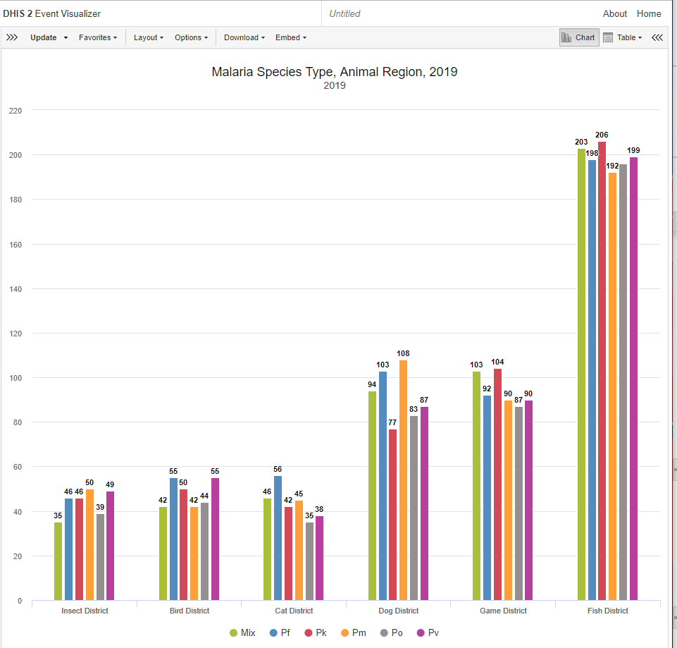

Save your chart as a favorite.

  - In the menu bar, click on Favorites > Save

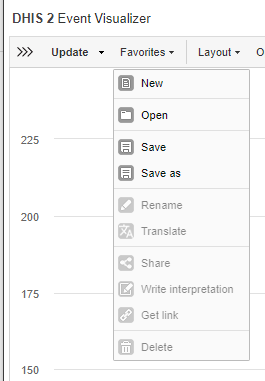

  - Fill in the Name section: “Your initials_Malaria: Species Type,
    Animal Region, 2019”
  - Add a description, “This chart shows the positive malaria cases
    separated by their species type within the Animal Region in 2019”
  - Click Save

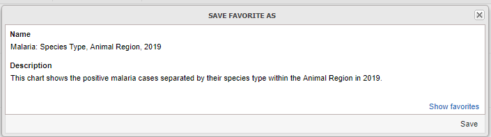

You are able to download this chart in various formats by clicking
Download in the menu bar and choosing your preferred download option.

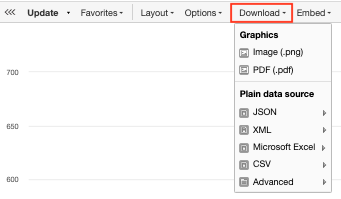

### Demonstration - Filtering an Age Range

#### Video - Event Visualizer Demonstration Part 3 of 5

#### Part 3 Activity: Filtering an Age Range

Now, we will move onto Task 2 , where we will filter out a range of ages
in an event report. Recall that we want to view the conditions of
malaria patients who are between the ages of 15-20, with the time frame
of July - December 2019, by district, in the Food Region.

From the Event Visualizer app, click on Favorites > New.

Select the Line chart.

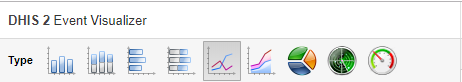

In the Data tab, select:

  - The Program and Stage “Malaria Case Management”
  - The Data elements “MCM l Condition of Patient” and “Age”  
    

To view cases that are in the age range of “15-20”:

  - Duplicate the “Age” data item
  - Select “No range set” for both “Age” items
  - For one Age item, choose “>=” and “15”
  - For the other Age item, choose “<=” and “20”  
    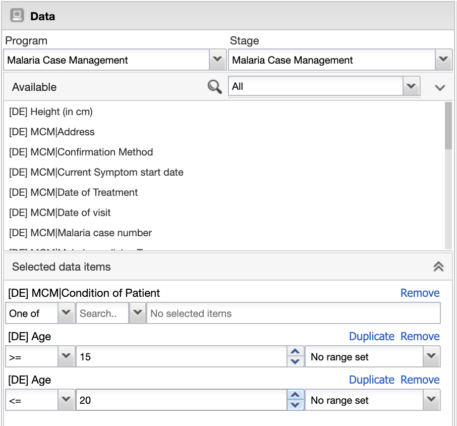

In the Period tab select:

  - “Fixed and relative periods” and “Six - monthly”
  - Select “July - December 2019” as the period
  - Ensure “Last 12 months” is unticked in the Relative
    Periods section  
    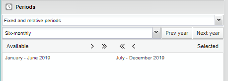

In the Organisation units tab open the hierarchy for “Food Region”.

  - Select all Districts in “Food Region”  
    

Click on the Layout tab

  - Set “Age” as the Report filter
  - Put “Organisation Units” in Category dimensions
  - Put “MCM l Condition of Patient” in Series dimensions
  - Click on Update  
      
    The resulting line graph should now depict the number of simple and
    severe malaria cases for people >=15 and <=20 years old by
    district within the Food Region.

### Demonstration - Additional Filters for a Visualization

#### Video - Event Visualizer Demonstration Part 4 of 5

#### Part 4 Activity: Additional Filters for a Visualization

Continuing on with the line chart from the last activity, now let’s
update the chart to only show female cases in the line graph. We’ll need
to add more filters to this visualization.

In the Data tab select:

  - “Sex” as a data element
  - “Female” as the filter

In the Layout menu organise the following:

  - Put “Age” and “Sex” under Report filter
  - Put “MCM l Condition of Patient” under Series dimensions
  - Put “Organisation units” under Category dimensions
  - Click Update

The line graph should now depict the number of “Simple” and “Severe”
malaria cases for females aged between 15 -20 years old by district in
the “Food Region”.

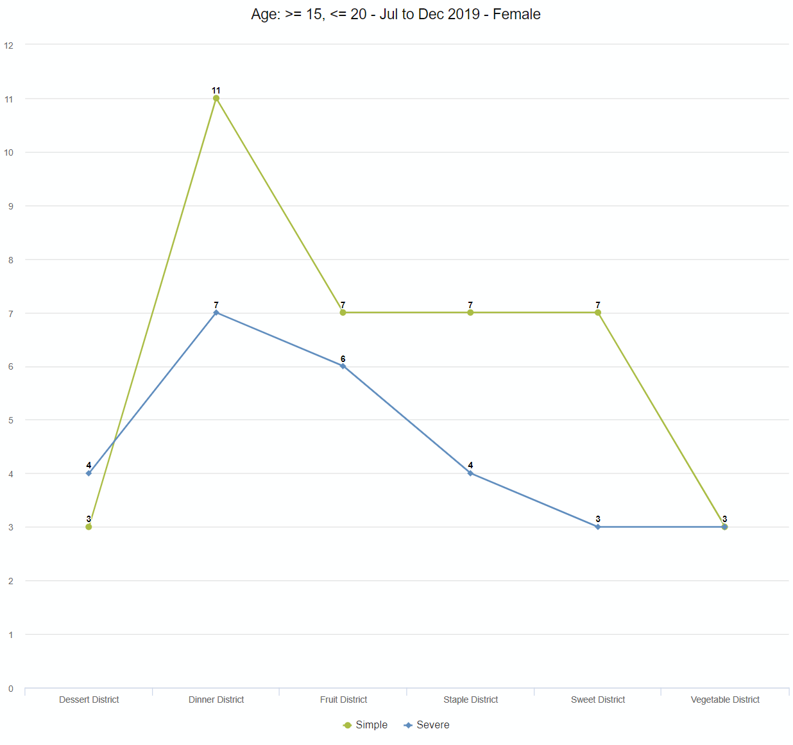

Let’s add another filter to your Line chart.

In the Data tab, select:

  - “Pregnant” as the data element
  - Filter this element by selecting “Yes”

Click on the Layout menu and organise the following:

  - “Pregnant” under Report filter
  - “Organisation Units” under Category dimensions
  - “Condition of Patient” under Series dimensions

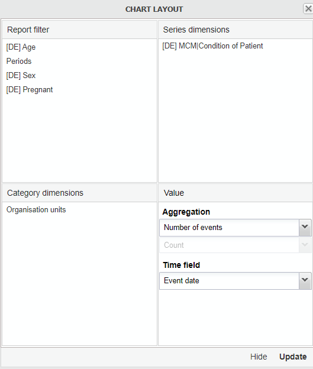

Then click on Update.

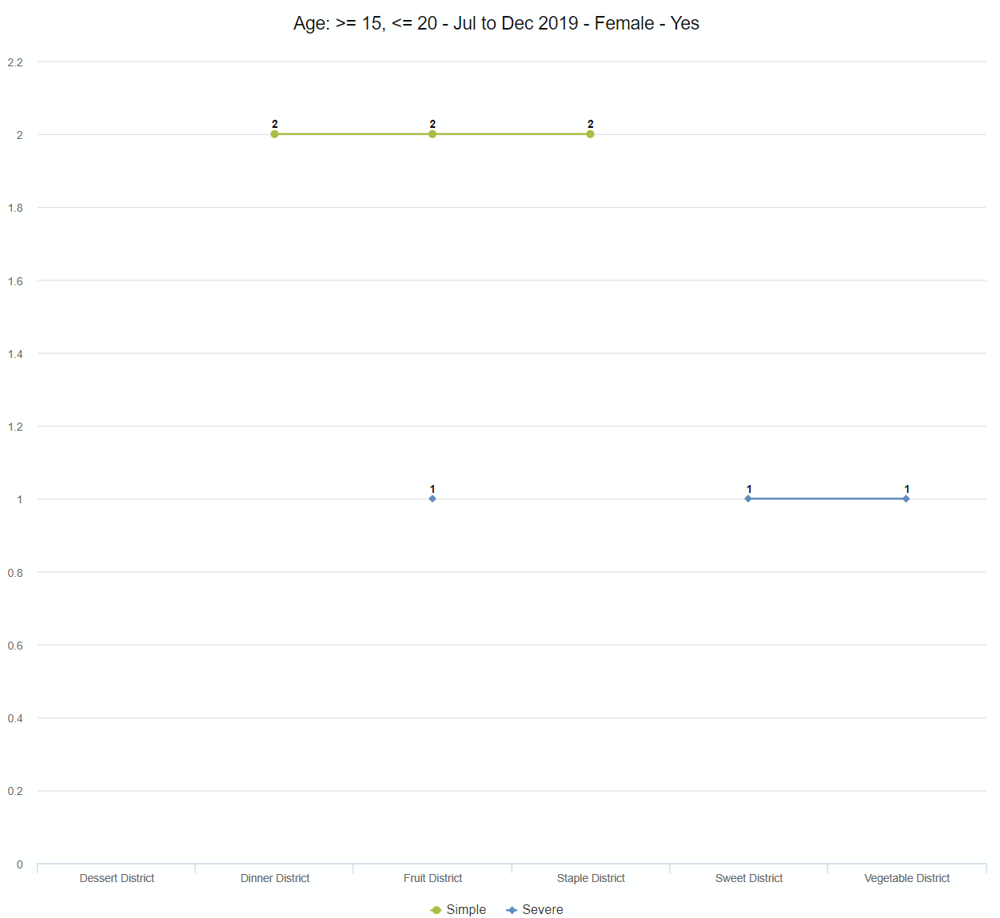

The graph type is no longer appropriate for this data. Change the graph
type to a bar graph and click Update.

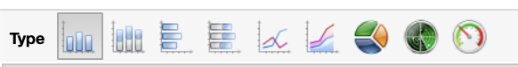

  - Click on Favorites > Save
  - Provide the chart with a name and description using the recommended
    naming convention “Your intials_program, data elements, location,
    period”

### Demonstration - Creating a Pie Chart with Event Data

#### Video - Event Visualizer Demonstration Part 5 of 5

#### Part 5 Activity: Creating a Pie Chart with Event Data

From the Event Visualizer app, click on Favorites > New.

Please create a pie chart that follows the example in the demo.

Choose pie chart as the chart type.

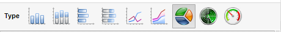

In the Data tab, select

  - The Program and Stage “Malaria case management”
  - The data element “MCM l Treatment Outcome”

In the Periods tab, select

  - “Fixed and relative periods”
  - The period type “Yearly”
  - “2020” as the available period
  - Ensure “Last 12 months” is unticked in the Relative Periods section

In the Organisation units tab, select “Trainingland.”

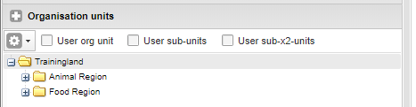

From the Layout menu organize the following:

  - “Periods” under the Report filter
  - “Organisation units” under the Series dimensions
  - “MCM l Treatment Outcome” under the Category dimensions

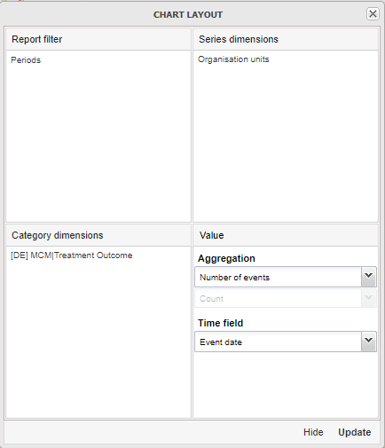

Then click on Update.

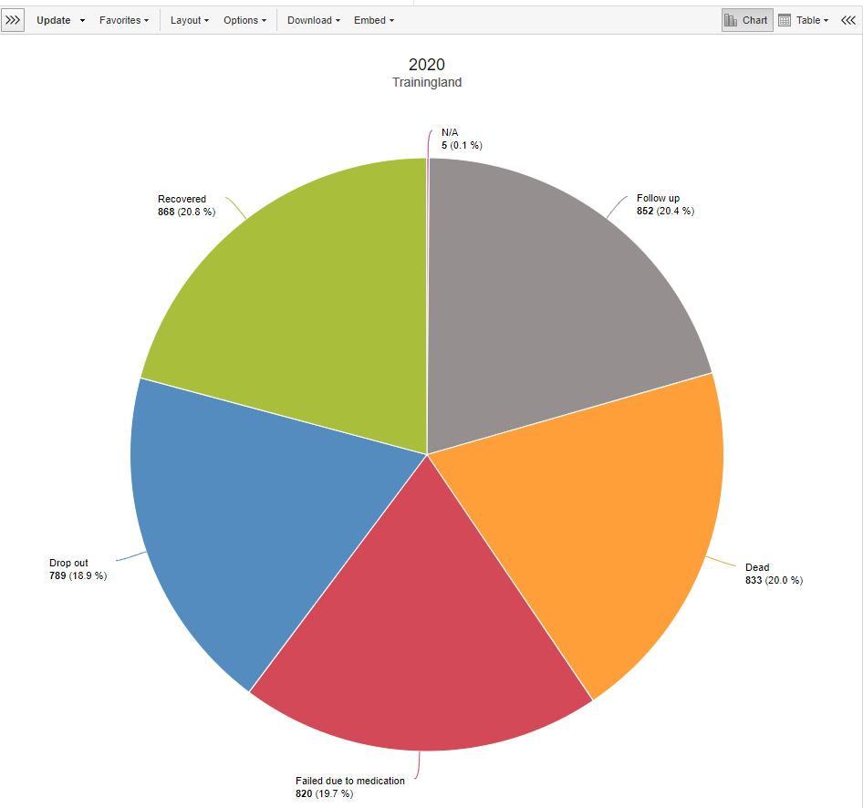

  - Click on Favorites > Save
  - Provide the chart with a name and description using the recommended
    naming convention “Your intials_program, data elements, location,
    period"

## 4.2 - Graded Assignment - Event Visualizer

#### GRADED ASSIGNMENT - EVENT VISUALIZER

This is a graded assignment and it is worth 10% of your final grade.

You have 2 attempts to pass each question.

If you are not sure about the steps you followed in the assignment to
get to the correct answer, click on the "hint" button to see some tips.

If you want to save your current response without submitting it for
grading yet, select the "save" button. This allows you to come back
later and resume the attempt.

Select the "check" button to submit your answers.

#### INSTRUCTIONS

1.  For this assignment, answer questions using the Event Visualizer app
2.  Use the “Malaria Case Management” program and stage
3.  You will be marked based on the answers selected through multiple
    choice. To determine the answers, you must create the associated
    table described in the details section.
4.  Save all tables as Favorites, using the convention:
    username_program_what, where, when

#### QUESTION 1: DETAILS

  - Visualization Type: Pie Chart
  - Program: “Malaria Case Management”
  - Data Element: “MCM|Malaria method of detection”
  - Period: “2020”
  - Organisation Unit: “Trainingland”

In 2020, what is the most common method for detecting malaria?

( ) MFS {{“MFS”; in 2020 MSF was not the most common method for malaria
detection at 12.1% Double check you have entered all of the input
details correctly, including the program, data elements, org unit and
period }}

(x ) FUP {{In 2020 FUP was the most common method for malaria detection
at 13.8%}}

( ) Kader {{“Kader”; in 2020 Kader was not the most common method for
malaria detection at 12.4% Double check you have entered all of the
input details correctly, including the program, data elements, org unit
and period}}

( ) SK {{“SK”; in 2020 SK was not the most common method for malaria
detection at 11.3%

Double check you have entered all of the input details correctly,
including the program, data elements, org unit and period}}

|| You may need to update the Layout of this chart. Click on Layout to
make sure “Periods” is under Report filter, “Organisation units” is
under Series dimensions, and “Malaria method of detection” is under
Category dimensions.||

#### Question 2: Details

Visualization Type: Line Chart

Program: “Malaria Case Management”

Data Elements:

“Sex”

“Age" >= 30

Period: “July to December 2019”

Organisation Units: Districts in “Trainingland”

In which Districts do women (aged >=30) have more malaria cases
than men (aged >=30)?

( ) “Cat District, Dinner District, Fruit District” {{“Cat District,
Dinner District, Fruit District” - Dinner District is the only District
where more women have malaria cases. Double check you have entered all
of the input details correctly, including the program, data elements,
org unit and period.}}

(x) “Dessert District, Dinner District, Sweet District” {{in “Dessert
District, Dinner District, Sweet District” women have more malaria cases
than men.}}

( ) “Dessert District, Bird District, Insect District” {{ “Dessert
District, Dinner District, Insect District”  In Bird District there are
ten more male case of malaria than there are female cases. Double check
you have entered all of the input details correctly, including the
program, data elements, org unit and period. }}

( ) “Dinner District, Game District, Staple District” {{“Dinner
District, Game District, Staple District”  In Game District, men have
more malaria cases than women. Double check you have entered all of the
input details correctly, including the program, data elements, org unit
and period

.}}

||Make sure that when you’re entering “Age >= 30” you use “No range
set” so that you are able to enter the number 30 manually||

||Review the layout of the chart by clicking the layout tab: “Age” and
"Periods" should be under Report filter; “Sex” should be under Series
dimensions; Organisation units should be under Category dimensions.||

#### QUESTION 3: DETAILS

Visualization Type: Bar Chart

Program: "Malaria Case Management"

Data Elements:

“Age” Range: 20-59

“MCM|Treatment Outcome = Dead”

“MCM|Condition of Patient" = "Severe”

Periods: “2020”

Organisation Units: Districts in “Animal Region”

In 2020, which District has the least amount of people who passed
away from “Severe” malaria for the age range “20-59?”

( ) Game District {{“Game District” does not have the least amount of
cases; it has 27. Double check you have entered all of the input details
correctly, including the program, data elements, org unit and period .}}

(x) Insect District {{“Insect District” has the least amount of people
who passed away from “Severe” malaria cases for the age range “20-59,”
with 8 “dead” cases registered.}}

( ) Dog District {{“Dog District”  does not have the least amount of
cases; it has 20. Double check you have entered all of the input details
correctly, including the program, data elements, org unit and period.}}

( ) Fish District {{“Fish District” does not have the least amount of
cases; it has 49. Double check you have entered all of the input details
correctly, including the program, data elements, org unit and period

.}}

||Click on Layout and make sure  (A) “MCM | Condition of Patient,” “Age”
and “Periods” are under Report Filter (B) “MCM | Treatment Outcome” is
under Series dimensions and (C) “Organisation units” is under Category
dimensions. ||

## 4.3 - Maps

### Presentation - Introduction to Maps

#### Introduction : Subsection 4.3 - Maps

In Subsection 4.3 we review how to create data outputs using the maps
app in DHIS2.

Subsection 4.3 has 6 units for you to review. We recommend that you
review these units in order.

1.  Presentation - Introduction to Maps
2.  Demonstration - Coordinates in Capture App & Maps Interface
    Description
3.  Demonstration -  Adding Layers to Maps
4.  Demonstration - Styling Layers & Adding Filters
5.  Demonstration - Style by Data Element & Donut Clusters
6.  Demonstration - Creating a Dashboard

##### Ungraded Activities

There is an activity associated with each unit in this subsection
labelled as "demonstration." Scroll below the video demonstration in
each of these units in order to view the activity.

##### Graded Assignment

After you have completed reviewing all the material within this
subsection, please attempt the graded quiz for this subsection. This
quiz will contribute to 10% of your overall grade.

#### 

#### Video - Maps Presentation Part 1 of 6

### Demonstration - Coordinates in Capture App & Maps Interface Description

#### Video - Maps Demonstration Part 2 of 6

#### Part 2 Activity: Coordinates in Capture App & Maps Interface Description

Now let’s see how coordinates can be visualized in the maps app. We can
do so by using an existing map.

Navigate to the dashboard by clicking on the Dashboard app in the Search
apps menu.

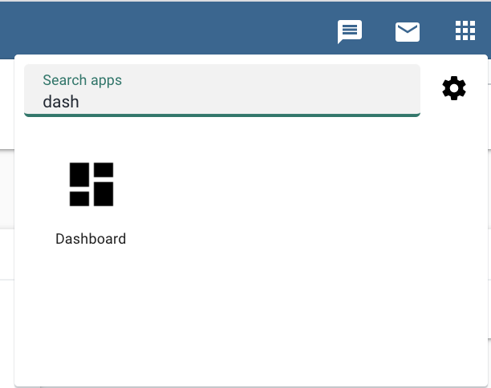

Find the particular map of interest within the dashboard and click on
the action ellipses.

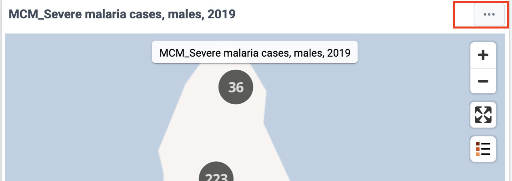

Then click on “Open in Maps app.”

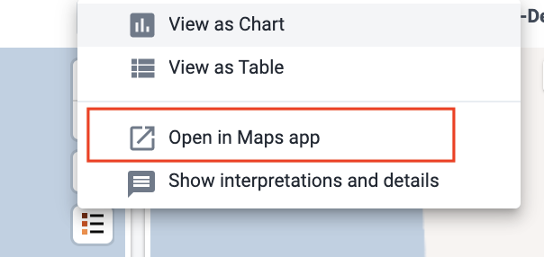

Note the criteria selection column is on the left.

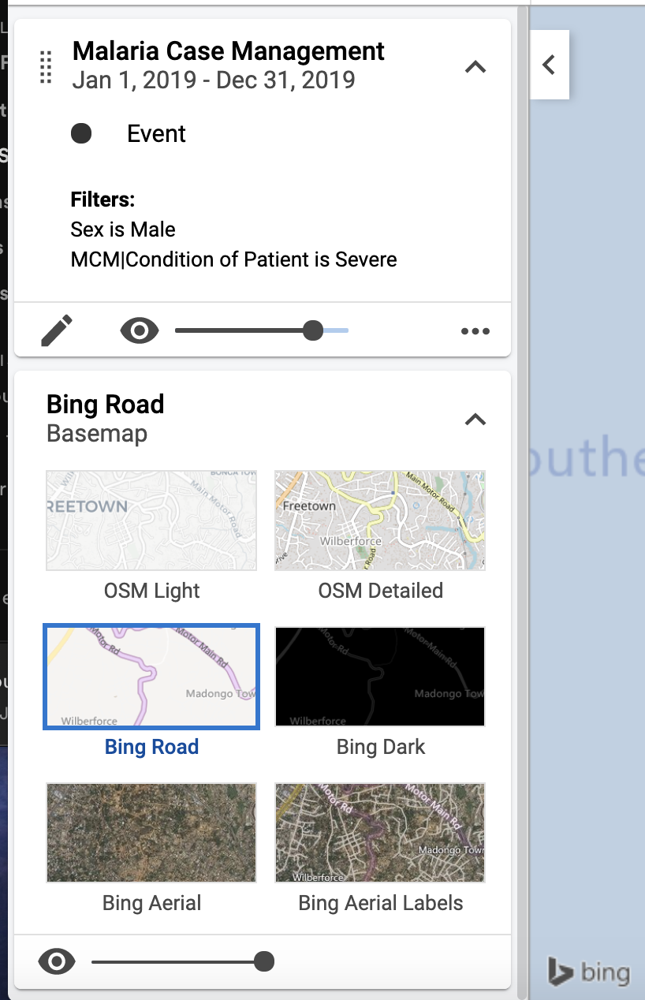

Click on the pencil symbol at the bottom left of the layer box to edit
the layer.

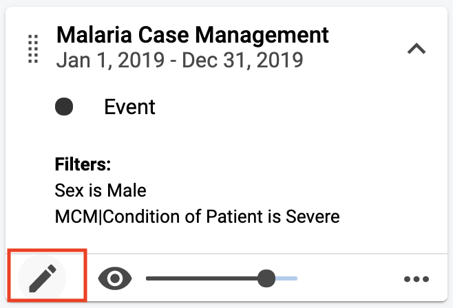

Click on the Org Units tab, then deselect “Trainingland” and select
“Animal Region.” Then click Update Layer.

Next, let’s add a boundary layer. Click on the Add layer button in the
top left corner.

Next, select a “Boundaries” layer.

In the Organisation Units tab, ensure “Trainingland” is selected. Make
sure the level “Region” is selected.

Under the Style tab, make sure the Labels box is ticked.

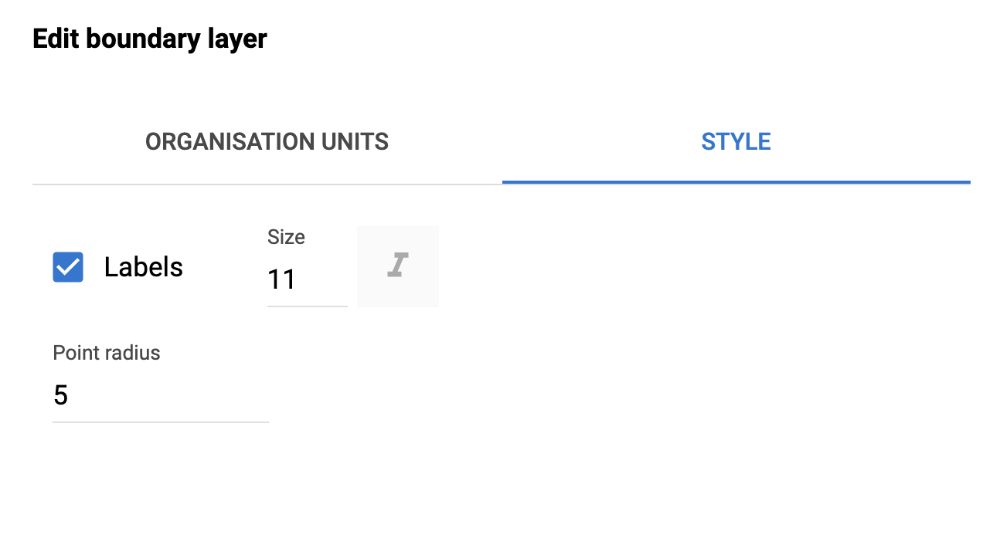

Then select Add Layer.

Example of what the result should look like:

### Demonstration - Adding Layers to Maps

#### Video - Maps Demonstration Part 3 of 6

#### Part 3 Activity: Adding Layers to Maps

Under the File button, click on “New” to open a new map.

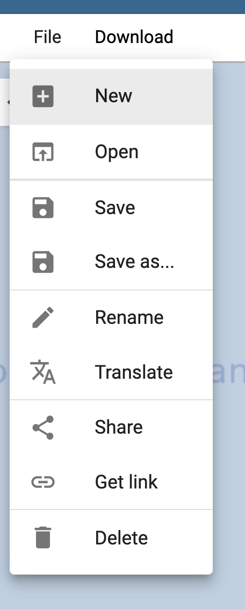

In the left corner, you can see the default layer, the Basemap layer. It
allows you to choose the basemap. Let’s choose Bing Road as the Basemap.

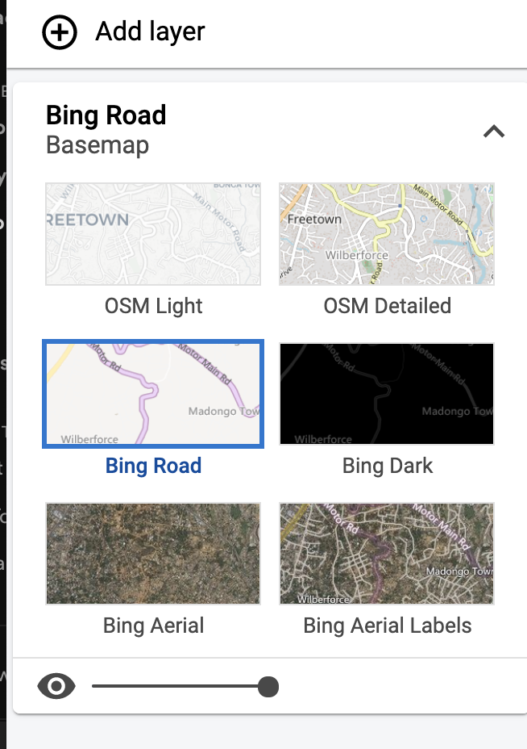

Click on the Add layer button.

Choose Boundaries.

From the Organisation Unit tree, select “Trainingland”.

From the Select levels drop down list choose “Region” and “District”.

Click on Add Layer.

You can now see the region and district boundaries of “Trainingland”.

Add another new layer by clicking on the Add layer button.

As a layer type, choose Events.

The Add new event layer box opens.

Under the Data tab, choose “Malaria Case Management” as the Program and
as the Stage.

Leave the Coordinate field as “Event location”.

Select the Period tab.

In the period tab, choose a “Start/end date”.

Select “January 1, 2020 - March 31, 2020” as the period.

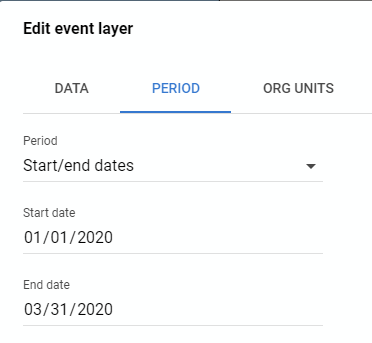

Go to the Org Units tab and select “Trainingland”.

  - Choose the Filter tab and click on Add Filter

<!-- end list -->

  - This tab allows you to apply criteria to the events being displayed
    on the map

<!-- end list -->

  - In our case, we have two criteria:

<!-- end list -->

  - Choose “Pregnant” under Data item, “one of” as the Operator and
    “Yes” as the option
  - Add a second filter by selecting Add Filter
  - Choose the Data item “MCM|Condition of Patient,” the Operator “one
    of,” and “Severe” under the Options

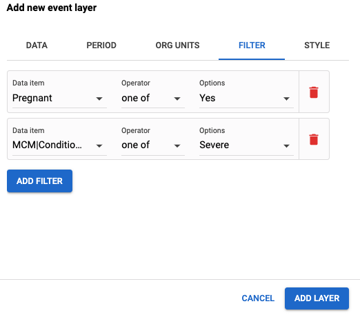

Before adding the layer, we want to ensure that the clustering is on.

Go to the Style tab and select “Group events”. By doing so, you will
regroup events and make the map easier to read if there are a large
number of events.

Click on Add Layer.

N.B. The filter that you have applied to the map will appear along with
the legend on the left side of the maps app. You can edit the layer by
clicking on the pen icon.

Zoom in until you get to point data and click one point. A box opens
that shows the attributes of the selected event.

  - You can verify the condition of the patient is “Severe”. You will
    also be able to determine what kind of treatment the woman has
    received (ACT, Non-ACT…)

Go to File > Save.

Enter the name of the map and a short description and save it.

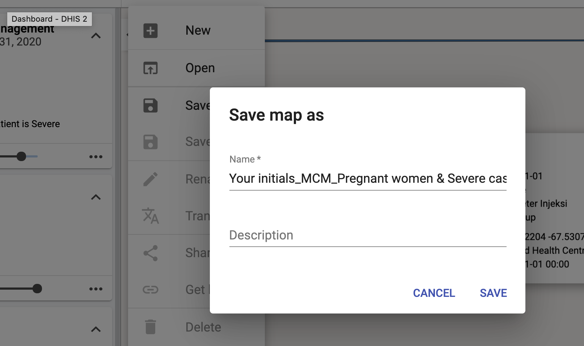

### Demonstration - Styling Layers & Adding Filters

#### Video - Maps Demonstration Part 4 of 6

#### Part 4 Activity: Styling Layers & Adding Filters

Click on File > New.

First choose Bing Road as the base map.

Click on Add layer on the top left side of the interface and choose
Boundaries as a layer type.

From the Organization unit tree, select Animal Region > Cat District.

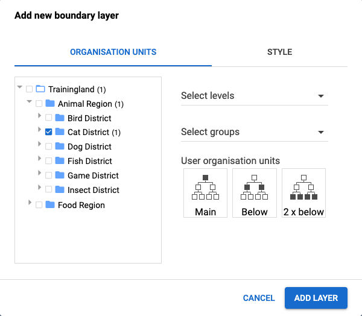

Go to the Style tab and select Labels to display the name of the
district on the map. You can change the size of the font.

Click on Add Layer.

We now only see the boundaries of the “Cat District”.

The second step is to add an event layer to display all malaria cases
that have resulted in death from “July 31 2019 to December 31 2019”.

Click on Add Layer and select Events.

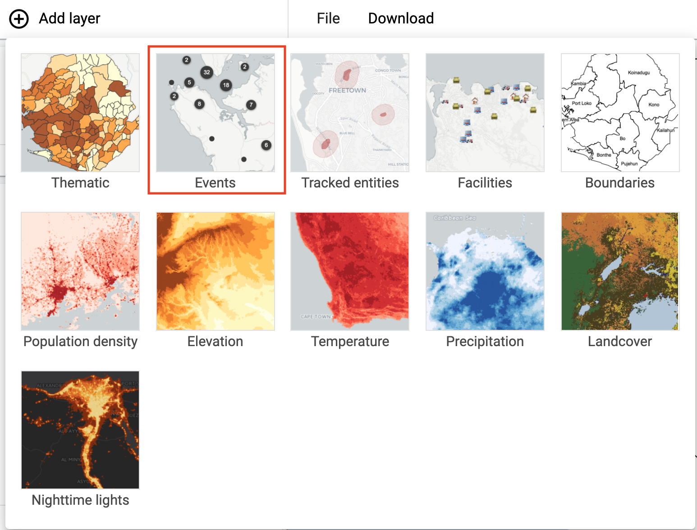

Under the Data tab, choose “Malaria Case Management” as the Program and
the Stage.

Leave the Coordinate field as “Event location”.

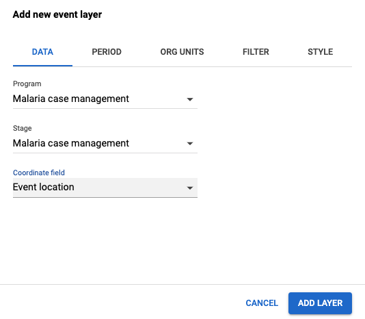

Go to the Period tab and specify the period type as “Start/end dates”.

Use “July 31 2019” as a Start date and “December 31 2019” as an End
date.

Under the Org Units tab, select Animal Region > Cat District. Make sure
the box next to Trainingland is unchecked.

Under the Filter tab, click Add filter.

Choose the Data item “MCM|Treatment Outcome”, the Operator “one of,” and
“Dead” under the Options.

Go to the Style tab.

Select “View all events”.

Pick a color on the color scale.

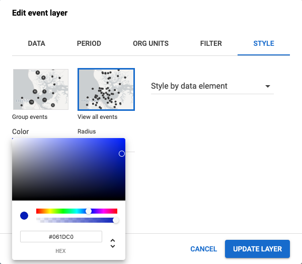

Change the Radius size to “4”.

Click on Add Layer.

As the map shows, unfortunately, there are some deaths from malaria in
the “Cat District,” between “July 31, 2019 and December 31, 2019”.

Note that you can view the filter that has been applied on the left side
panel. It indicates that the “Treatment outcome” is “Dead” under the
filter heading.

Do not forget to save your map as a favorite!

Select File > Save. Add a name that includes your initials and a
description.

### Demonstration - Style by Data Element & Donut Clusters

#### Video - Maps Demonstration Part 5 of 6

#### Part 5 Activity: Style by Data Element & Donut Clusters

The last task is to create a map that filters the data by “Female” and
“PF” malaria and that applies a data element style using the
confirmation method.

Click on File > New.

Choose “Bing Road” as the base map.

Click on Add layer and choose “Boundaries”.

From the org units tree choose the Insect District under the Animal
Region.

Click on Add Layer. The app shows the boundaries of the Insect District.

Add an Event layer to our map.

Click on Add layer and choose “Events”.

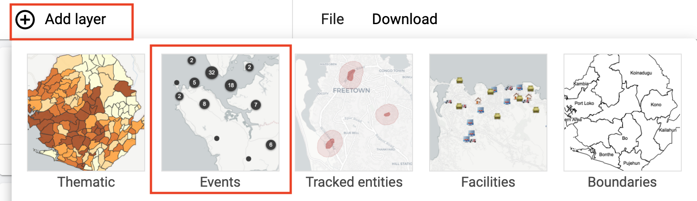

Under the Data tab, choose “Malaria Case Management” as the Program and
Stage.

Leave the coordinate field as “Event Location”.

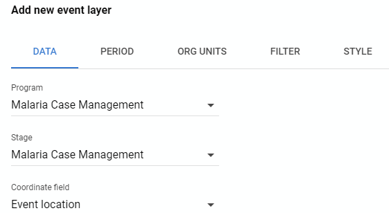

In the Period tab, select “Start/End dates.”

  - Start date is “July 1st 2019”
  - End date is “December 31 2019”

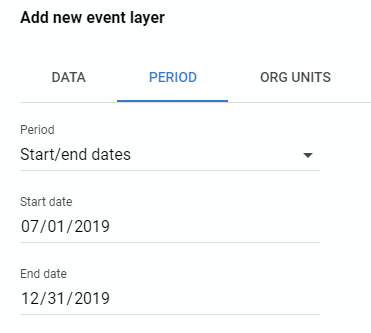

In the Org Units tab, select the “Insect District” from the organization
unit tree.

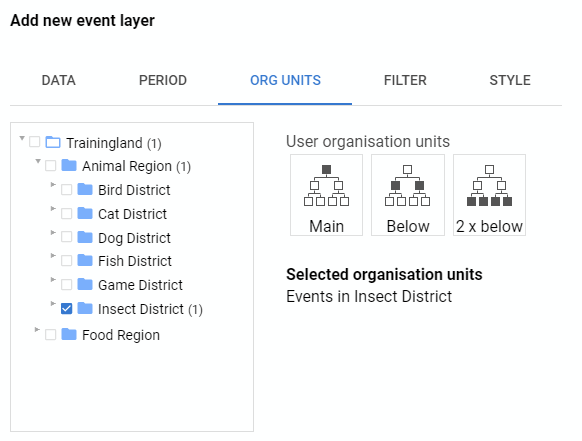

Under the Filter tab, click Add filter.

Choose the Data item “Sex”, the Operator “one of”, and the Option
"Female".

Click on Add filter to add the second filter to specify the Malaria
species type. Choose the Data item “Malaria species Type,” the
Operator “one of,” and “Pf” as the Option.

With these options, the map will only display events that show where
women are infected with the Pf species of malaria. These filters will
appear under this layer’s heading in the column on the left.

For each event we would like to know what type of confirmation method
has been used. To do this, we need to apply a data element style.

In the Style tab, click on the Style by data element drop down list and
choose “Confirmation Method.”

Notice that all of the options for confirmation method appear: “RDT,
Microscopy and Both.”

The colors that appear next to each option can be customized by clicking
on the color and adjusting to the color of your choice.

Change the colors as follows:

  - “RDT = purple”
  - “Microscopy = blue”
  - “Both = red”

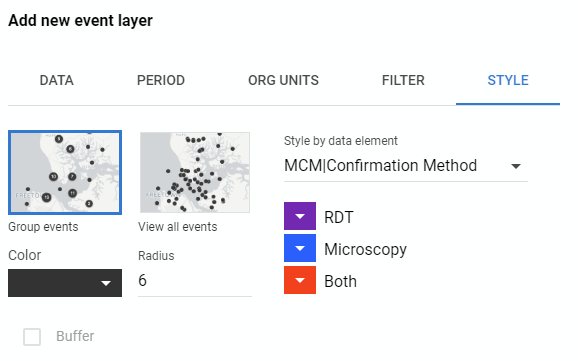

Click on Add Layer.

The map now displays the “female” cases of malaria infected with the
“Pf” species that occurred in the “Insect District” between “July
and December” of 2019. Using donut clusters the map shows these cases by
the confirmation method.

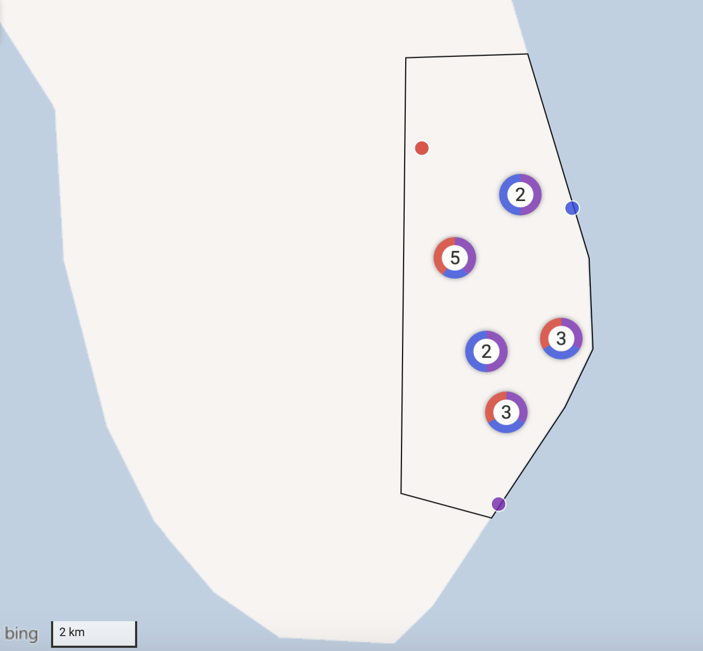

The number displayed in the middle of the cluster represents the total
number of cases by cluster, and the different colored rings represent
the percentage of each confirmation method. The number displayed in the
middle of the cluster represents the total number of cases by cluster,
and the different colored rings represent the percentage of each
confirmation method.

Click on the File > Save. Give the map a name with your initials and a
description.

An example is shown below.

### Demonstration - Creating a Dashboard

#### Video - Maps Demonstration Part 6 of 6

#### Part 6 Activity: Creating a Dashboard

Now that we have all of the maps from the 3 tasks in this demonstration
saved, let’s add them to a dashboard.

Search for the Dashboard app in the apps menu then select it.

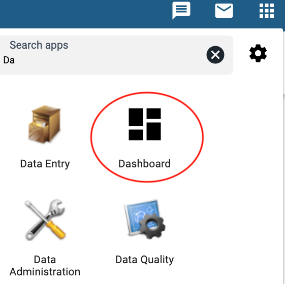

Let’s create a new dashboard. Do so but clicking on the green plus
button.

Provide the new dashboard with a name. See an example below.

Now in the Search for items to add to this dashboard tab, type in the
individual names of the maps you just created and click on the
insert button at the right of the name.

Once you have clicked “insert” for all of the relevant maps, click on
Save changes at the top of the page.

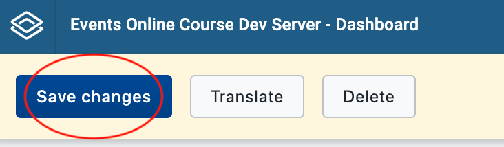

The maps you’ve just added are now available on your dashboard.

  - The dashboards are interactive, the +, - buttons allow you to zoom
    in or out on the map
  - The button with 4 arrows allows you to view the map in fullscreen
    mode
  - The list icon allows you to easily view the layers on the map

## 4.3 - Graded Assignment - Maps

#### GRADED ASSIGNMENT - MAPS

This is a graded assignment and it is worth 10% of your final grade.

You have 2 attempts to pass each question.

If you are not sure about the steps you followed in the assignment to
get to the correct answer, click on the "hint" button to see some tips.

If you want to save your current response without submitting it for
grading yet, select the "save" button. This allows you to come back
later and resume the attempt.

Select the "check" button to submit your answers.

#### 

#### INSTRUCTIONS

1.  For this assignment, answer questions using the Maps app
2.  Use the “Malaria Case Management” program and stage
3.  You will be marked based on the answers selected through multiple
    choice. To determine the answers, you must create the associated
    table described in the details section.
4.  Save all tables as Favorites, using the convention:
    username_program_what, where, when

 Click here for a printable version of this assignment.

##### Question 1: Details

Create an event layer map for all of Trainingland that shows pregnant
women with severe malaria. Make sure that the district boundary layer is
present along with the labels for the district layer.

  - Basemap: Bing Road
  - Program/Program Stage: “Malaria Case Management”
  - Period: “January 1 2019 - December 31 2019”
  - Organisation Unit: “Trainingland”
  - Data Element Filters:

<!-- end list -->

  - “Pregnant = Yes”
  - “MCM|Condition of Patient = Severe”

How many cases of severe malaria in pregnant women are there in the
"Insect District"?

( ) 10 {{10 is the total for Sweet District. Make sure: (a) you have
entered all of the inputs correctly in the Event Layer, including the
program, period and org unit (b) the additional Boundaries Layer has
been established with the district borders outlined using labels}}

( ) 24 {{24 is the total for Game District. Make sure: (a) you have
entered all of the inputs correctly in the Event Layer, including the
program, period and org unit (b) the additional Boundaries Layer has
been established with the district borders outlined using labels}}

(x) 15 {{15; During this period, 12 pregnant women had severe cases of
malaria within “Insect District.”}}

||Remember to set up the additional district boundary layer to  view
where the events are allocated. This means clicking on Add layer, then
“Boundaries.” Afterwards, select the “Insect District” as the Org
Unit, and check the “Labels” box under Style.||

##### Question 2: Details

Create a map for "Cat District" showing all the malaria medicine types
from January 31 2019 to Dec 31 2019. The map will be more meaningful if
you add the district boundary for Cat District.

  - Basemap: Bing Road
  - Program/Program Stage: “Malaria Case Management”
  - Period: “January 31 2019 - December 31 2019”
  - Organisation Unit: “Cat District”
  - Data Element Filters: “MCM|Malaria medicine Type”

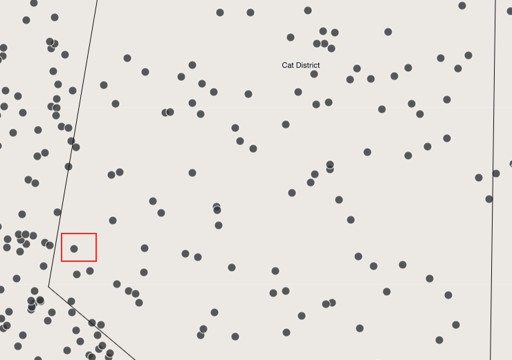

What is the medicine type that has been provided to the highlighted
case?

( ) ACT + Primaquine {{“ACT + Primaquine”. Make sure: (a) you have
entered all of the inputs correctly in the Event Layer, including the
program, period and org unit (b) the additional Boundaries Layer has
been established with the district borders outlined using labels.}}

( ) Artemeter Injeksi {{ “Artemeter Injeksi”. Make sure: (a) you have
entered all of the inputs correctly in the Event Layer, including the
program, period and org unit (b) the additional Boundaries Layer has
been established with the district borders outlined using labels.}}

(x) Kina+Primaquine+Doksisiclin {{ “Kina+Primaquine+Doksisiclin” is the
medicine type that has been provided to the highlighted case of the
female who is 62 years old.}}

( ) Kina+Primaquine {{“Kina+Primaquine". Make sure: (a) you have entered
all of the inputs correctly in the Event Layer, including the program,
period and org unit (b) the additional Boundaries Layer has been
established with the district borders outlined using labels.}}

||You can access additional details about individual events on the map
by clicking on the event. Review the details for the event using this
feature.||

-----

#### Question 3: Details

Create a map of malaria cases filtering the data by the condition of the
patient, the confirmation method and gender. Also apply a data element
style using the confirmation method data.

  - Basemap: Bing Road
  - Program/Program Stage: “Malaria Case Management”
  - Period: “July 01 2019 - December 31 2019”
  - Organisation Unit: “Fruit District”
  - Data Element Filters:

<!-- end list -->

  - “MCM|Confirmation Method" = "Both", "Microscopy" and "RDT”
  - “MCM|Condition of Patient" = "Simple”
  - “Sex" = "Male”

<!-- end list -->

  - Data element style should be on: “MCM|Confirmation Method”

What is the most common confirmation method used in "Fruit District"
to detect simple malaria cases who are male?

(x) RDT {{ RDT.  This should be easily identifiable via the legend that
has been applied as a result of the data element style that has been
added. Roughly 50% of the simple, male cases have been identified using
an RDT.}}

( ) Microscopy {{Microscopy”. Roughly 25% of male cases with “Simple”
malaria have been confirmed with the “Microscopy” method in Fruit
District. Make sure to: (a) apply a data element style using the style
tab on the event layer in order to easily identify which confirmation
type was the most common (b) group the events in clusters so you can
view the distribution by confirmation method.

}}

( ) Both {{Roughly 25% of male cases with “Simple”  malaria have been
confirmed with “Both” methods in Fruit District. Make sure: (a) to apply
a data element style using the style tab on the event layer in order to
easily identify which confirmation type was the most common (b) group
the events in clusters so you can view the distribution by confirmation
method.

}}

||Ensure that in the MCM Event Layer Style tab, you have the option
“Group events” turned on. To view the donut cluster for the whole
district, zoom out on the map so you only have one cluster for the
district.||

## 4.4 - Joint Analysis of Event & Aggregate Data

### Presentation - Introduction of Joint Analysis

#### Introduction : Subsection 4.4 - Joint Analysis of Event & Aggregate Data

In Subsection 4.4 we will review how you can create data outputs that
combine both aggregate and event data together using the data visualizer
and maps app in DHIS2.

Subsection 4.4 has 6 units for you to review. We recommend that you
review these units in order.

1.  Presentation - Introduction of Joint Analysis
2.  Demonstration - Analysis of Program Indicators Using a Pivot Table
3.  Demonstration - Analysis of Program Indicators Using a Chart
4.  Demonstration - Analysis of Aggregate Data, Program Indicators and
    Combined Indicators
5.  Demonstration - Analysis of Event Data & Combined Indicators using
    Maps

##### Ungraded Activities

There is an activity associated with each unit in this subsection
labelled as "demonstration." Scroll below the video demonstration in
each of these units in order to view the activity.

##### Graded Assignment

After you have completed reviewing all the material within this
subsection, please attempt the graded quiz for this subsection. This
quiz will contribute to 10% of your overall grade.

#### Video - Joint Analysis of Event & Aggregate Data Presentation Part 1 of 5

### Demonstration - Analysis of Program Indicators Using a Pivot Table

#### Video - Joint Analysis of Event & Aggregate Data Demonstration Part 2 of 5

#### Part 2 Activity: Analysis of Program Indicators in Data Visualizer App Using a Pivot Table

Navigate to the Data Visualizer app.

Search for the Data Visualizer app in the search apps field, then click
on the app.

Once you have the Data Visualizer app open, choose the Pivot
table option:

Then enter the following data:

  - Under the Data tab choose “Program indicators”
  - Select the Program “SARA RCH”
  - Select the Program indicators “SARAFacilities offering ANC” and
    “SARAfacilities offering Family Planning services”

<!-- end list -->

  - Use the arrow pointing to the right to move them over to the
    Selected Data box

<!-- end list -->

  - Then click Hide

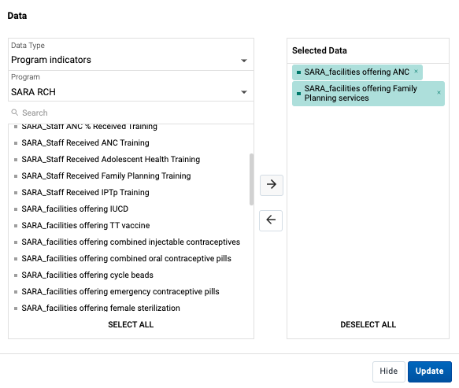

  - Under the Period dimension, select the period type ”Fixed periods,”
    the period type “Yearly” and the year “2020”. Make sure to move
    “2020” to the Selected Data column using the arrow pointing to the
    right
  - Remove “Last 12 Months” from the Selected Data column
  - Then click Hide

  - In the Organization Unit dimension, ensure “Trainingland” is
    selected in the hierarchy
  - Select the Level “District”
  - Then click Hide

  - To ensure we can view the facilities by district, change the layout
    around; bring the “Organization Unit” to the Rows dimension, and the
    “Period” into the Filter dimension
  - Click Update

  - If we only want to view rows with data in them, using the
    Options tab we can select the “Hide empty rows” and then select
    “Column totals” to view the total number of facilities that
    provide ANC or family planning services
  - Next, click Update

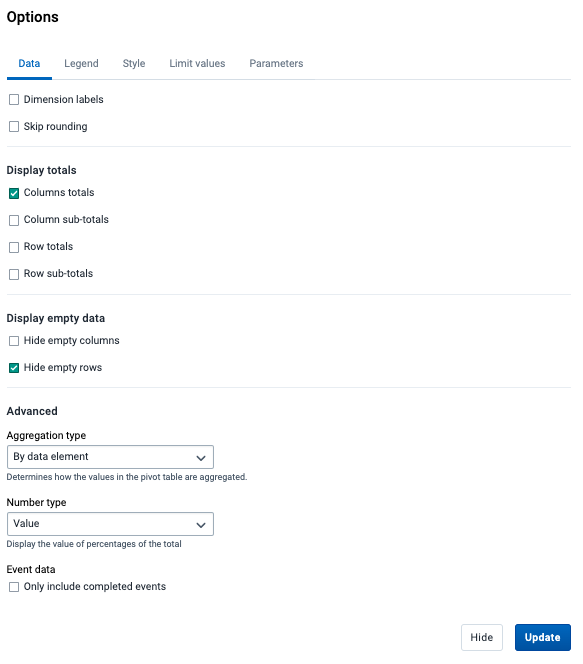

 

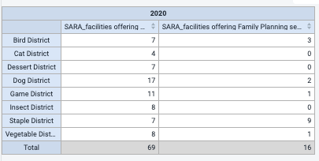

Click on File > Save.

Provide the pivot table with a name and a description.

### Demonstration - Analysis of Program Indicators Using a Chart

#### Video - Joint Analysis of Event & Aggregate Data Demonstration Part 3 of 5

#### Part 3 Activity: Analysis of Program Indicators in Data Visualizer App Using a Chart

Click on File > New. In the chart types drop down menu in the top left
corner of the app, select “Line”

  - For the Data dimension choose “Program indicators”
  - Select the program “Malaria Case Management”
  - Select the Program indicators “Malaria cases male,” “Malaria cases
    female,” and “Malaria cases”
  - Click Hide

  - For the Period dimension, select:

<!-- end list -->

  - “Fixed periods”
  - Period type “Monthly”
  - Year “2019”
  - “July - December2019”
  - Deselect “Last 12 months”

  - Then choose “Trainingland” as the Organisation Unit dimension
  - Then click Update

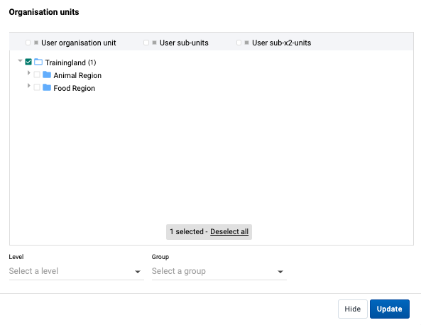

 

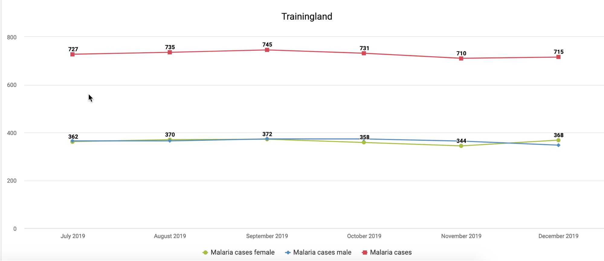

Now let’s compare the cases by district:

  - Change the graph type to a “Column” graph

Next, edit the layout:

  - Move the “Period” dimension to the Filter
  - Move the “Organization Unit” dimension to the Category

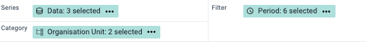

  - Edit the Organization unit level to show “District”

Then click Update.

Save this graph. Click File > Save.

Provide this graph with a name and description.

### 

### Demonstration - Analysis of Aggregate Data, Program Indicators and Combined Indicators

#### Video - Joint Analysis of Event & Aggregate Data Demonstration Part 4 of 5

#### Part 4 Activity: Analysis of Aggregate Data Elements, Program Indicators and Combined Indicators in Data Visualizer App

  - First, File > New
  - Choose the Pivot Table option under graph types

 

  - Under Data Type choose “Program indicators”
  - Select the Program “Malaria Case Management”
  - Select the Program indicator “Malaria cases”

 

  - Second, under Data Type choose “Data elements”
  - Select the data element group “Primary Health Care Yearly”
  - Select “Total Population”

 

  - Third, choose the Data Type “Indicators”
  - Choose the indicator group “Malaria”
  - Select “Malaria case incidence per 10,000”
  - Click Hide.

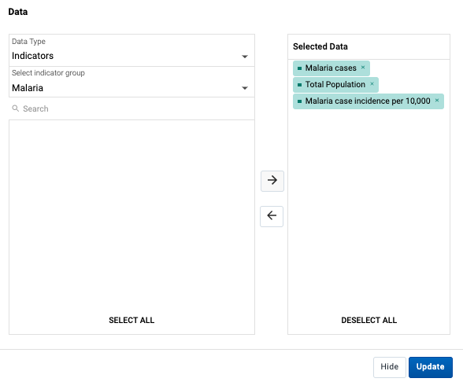

  - For the Period dimension, select the period Fixed periods and the
    Period type as “Yearly”
  - Then choose “2019” from the available list and move it to the
    Selected Data column
  - Remove “Last 12 months” from the Selected Data column
  - Then click Hide

 

  - In the Organization Unit dimension, ensure “Trainingland” is
    selected in the hierarchy
  - Select the Level “District”
  - Then click Hide 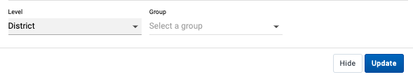
  - Change the layout around and esure: “Period” under Filter,
    “Organisation Unit” under Row and “Data” under Columns
  - Click Update

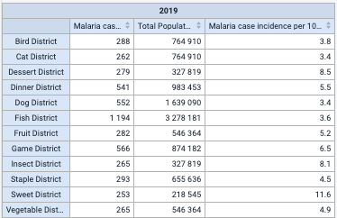

Click on Favorites > Save. Provide this Pivot table with a name and a
description.

### Demonstration -  Analysis of Event Data & Combined Indicators using Maps

#### Video - Joint Analysis of Event & Aggregate Data Demonstration Part 5 of 5

#### Part 5 Activity: Analysis of Event Data & Combined Indicators using Maps

For the last example in this subsection, we will be using the Maps app.

From within the Data Visualizer app, click on the grid button in the
upper right corner to open the Search apps feature.

Search for and open the Maps app.

 

Once within the Maps app, select “Bing Road” as the Basemap.

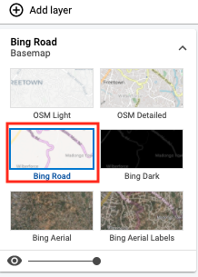

Next, we’ll add the “Thematic” layer by clicking on Add layer, and then
selecting “Thematic.”

  - In the Data tab, select the Item type “Indicator”
  - Choose the Indicator group “Malaria” and the Indicator “Malaria case
    incidence per 10,000”
  - Leave Aggregation type as “By data element”

  - Within the Period tab select the Period type “Six-monthly”
  - Use the arrows to navigate to the year “2019,” and select the period
    “July - December 2019”

 

  - In the Org Units tab, ensure “Trainingland” is selected in the
    hierarchy, and use the Select levels option to choose the “District”
    level

Click Add Layer.

Next, using the Add layer button, add an Event layer by selecting the
Events option.

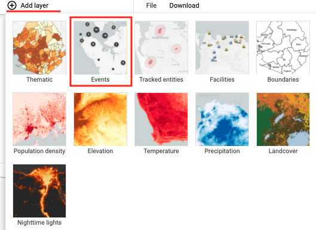

  - Under the Data tab select the Program and Stage as “Malaria Case
    Management”
  - Under Coordinate field leave the selection “Event location”

 

  - In the Period tab of this layer, select the period “Start and end
    dates”

<!-- end list -->

  - Use the Start date “July 1, 2019” and an End date of “December 31,
    2019”

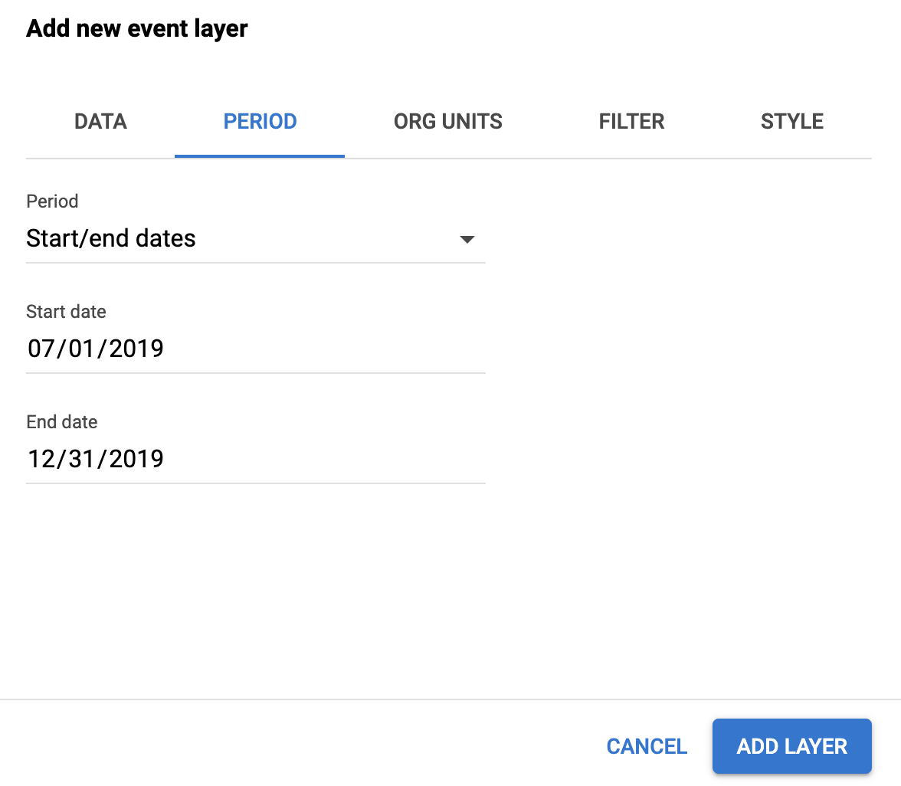

  - Select the Organization Unit “Trainingland”

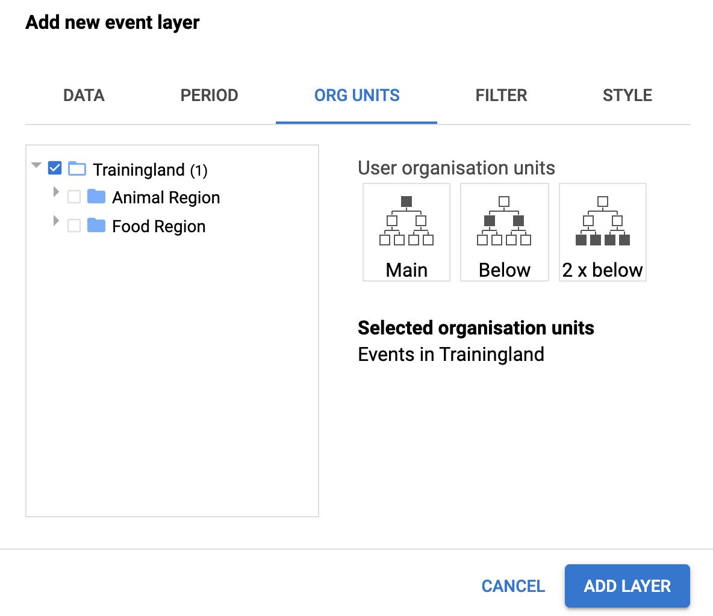

  - Click on the Add Layer button to add this “Event Layer” to the Map

Click on File > Save.

### Takeaways from Module 4

#### Recap, reflect and share

What new ideas have you come up with in this module? What doubts do you
have?

Even though most of the contents of the course are aimed for you to get
familiar with the DHIS2 features, the end goal is for you to relate what
you learn to your daily work and find new ways to solve data challenges
you face.

Take advantage of this space to recap, reflect, and share your thoughts
with your peers and learn from them.

## 4.4 - Graded Assignment - Joint Analysis of Event & Aggregate Data

#### Graded Assignment - Joint Analysis of Event & Aggregate Data

This is a graded assignment and it is worth 10% of your final grade.

You have 2 attempts to pass each question.

If you are not sure about the steps you followed in the assignment to
get to the correct answer, click on the "hint" button to see some tips.

If you want to save your current response without submitting it for
grading yet, select the "save" button. This allows you to come back
later and resume the attempt.

Select the "check" button to submit your answers.

#### Instructions

1.  You will be marked based on the answers selected through multiple
    choice. To determine the answers, you must create the associated
    table described in the details section.
2.  Save all tables as Favorites, using the convention:
    username_program_what, where, when

 Click here for a printable version of this assignment.

##### Question 1: Details

  - Visualization App: Data Visualizer
  - Visualization Type: Column
  - Data Type: Program indicators
  - Program and Program Stage: “SARA RCH program”
  - Program Indicators: “Staff received adolescent health training”,
    “Staff received ANC training”, “Staff received family planning
    training”, “Staff received IPTp training”
  - Period: “2020”
  - Organization Unit: “Trainingland”

In Trainingland, in 2020, what type of training was delivered to the
greatest number of staff?

(x) IPTp training {{“IPTp training”. Staff at health facilities in
Trainingland in 2020 received the most training in IPTp, with 1,105
staff trained.}}

( ) Family planning training {{“Family planning training”. 435 staff
members at health facilities in Trainingland in 2020 received training
in family planning. This is not the training type that staff have been
trained the most. Make sure you have the data in the series dimension,
so you can compare the staff trained by type of training.}}

( ) ANC training {{“ANC training”. Staff at health facilities in
Trainingland in 2020 received the least training in ANC, with 219 staff
trained. Make sure you have the data in the series dimension, so you can
compare the staff trained by type of training.}}

( ) Adolescent health training {{“Adolescent health training”. 1,024
staff members at health facilities in Trainingland in 2020 received
training in adolescent health. This is not the training type that staff
have been trained in the most. Make sure you have the data in the series
dimension, so you can compare the staff trained by type of training.}}

||"Data" should be in the series, “period” should be in the category,
and “Organization units” should be filtered out of the graph.||

##### Question 2: Details

  - Visualization App: Data Visualizer
  - Visualization Type: Pivot table
  - Data Type: Program indicators
  - Program and Program Stage: “Malaria Case Management”
  - Program Indicators: “Malaria deaths", "Malaria cases severe”
  - Period: “2019”
  - Organization Units: Districts in "Trainingland"

Which district has less than 100 “malaria deaths” and more than 250
 “Malaria cases severe?”

( ) Staple District {{“Staple District” has less than 100 malaria
deaths, but has less than 250 severe malaria cases. Use the up and down
arrows next to the data element names to sort the districts from most
deaths to least deaths.}}

(x) Dog District {{“Dog District” has a total of 90 malaria deaths and
279 severe malaria cases. }}

( ) Dinner District {{“Dinner District” has more than 250 severe malaria
cases, but has more than 100 malaria deaths. Use the up and down arrows
next to the data element names to sort the districts from most deaths to
least deaths.}}

( ) Vegetable District {{“Vegetable District” has less than 100 malaria
deaths, but has less than 250 severe malaria cases.  Use the up and down
arrows next to the data element names to sort the districts from most
deaths to least deaths.}}

||Adjust the layout of the table. “Periods” should be under the Report
Filter, “Organization units” should be under Row dimensions, “Data”
should be under Column dimensions.||

##### Question 3: Details

Visualization App: Maps

Basemap

  - “Bing Road”

Thematic layer

  - Value type: “Indicator”
  - Indicator group: “Malaria”
  - Indicator: “Malaria case incidence per 10,000”
  - Period: “Yearly", "2019”
  - Organization unit: “Trainingland,” “District level”

Event layer

  - Program and Program Stage: “Malaria Case Management”
  - Periods, start and end dates: “1 January 2019 - 31 December 2019”
  - Organization Units: “Trainingland”
  - Filter:

<!-- end list -->

  - Data item: “Condition of patient”
  - Operator: “One of”
  - Option: “Severe”

In the district with the highest incidence of malaria, what was the
treatment outcome of the northern most severe case?

( ) Recovered {{The district with the highest incidence is colored dark
orange. To inspect the case details, find the case that is at the
northern tip of the district, and click on the case for more
information.}}

( ) Failed due to medication {{The district with the highest incidence
is colored dark orange. To inspect the case details, find the case that
is at the northern tip of the district, and click on the case for more
information.}}

( ) Dead {{The district with the highest incidence is colored dark
orange. To inspect the case details, find the case that is at the
northern tip of the district, and click on the case for more
information.}}

(x) Drop out {{“Drop out.” The district with the highest incidence is
Sweet District. The treatment outcome for the northernmost case was
“Drop out.”}}

||Use the zoom feature in the application. Also, clicking on a case will
provide you with information about that case, including the treatment
outcome.||

## Feedback - Data Analysis of Events

# Module 5: Customizing Event Programs

## 5.0 - Create your DHIS2 account on CUSTOMIZATION & Introduction to Module 5

### Introduction to Module 5

#### Welcome to Module 5!

This module focuses on showing you to configure an event program in
DHIS2. In order to do this, we will also discuss the event data model
(terms and parameters that need to be understood to configure event
programs in DHIS2).

In module 5, there are 3 subsections that you will be reviewing:

  - 5.1 - Event Data Model. This subsection is divided into 2 units.
  - 5.2 - Event Data Model in Practice. This subsection is divided into
    2 units.
  - 5.3 - Creating an Event Program. This subsection is divided into 11
    units.

#### Objectives

By the end of this module, you should be able to:

  - Identify the different components of the event data model
  - Examine data collection tools and apply the event data model to them
  - Construct event programs in DHIS2

#### Activities & Assignments

##### Activities

You will be performing 1 ungraded activity in each of subsection 5.1 and
5.2 within the second unit of each of these subsections. Activities will
be identified within the subsection themselves. In subsection 5.3, you
will be performing activities for units 2-11. There is therefore a total
of 12 activities that you will perform within this module.

##### Assignments

You will have 1 graded assignment in the form of hands-on exercises that
you must perform in subsection 5.3. This assignment contributes to 30%
of your overall grade.

##### Training Environment

You will be using the CUSTOMIZATION training environment to perform your
activities and assignments. If you have not done so, please sign up for
this training environment by following the instructions in the unit
Account Creation - Customization.

#### Time Commitment

This is the most technical module of our course and time to complete
this module will likely be variable depending on your background. This
module should take you approximately 7 hours in total to review all of
the content, perform the ungraded activities and finish the graded
assignment as identified in the course outline.

### Account Creation - Customization

#### Instructions - Account Creation on Customization

In order to perform the exercises and assignments within Module 5, you
will be accessing the CUSTOMIZATION DHIS2 system. The
CUSTOMIZATION system is very different then CAPTURE and ANALYSIS. In
CUSTOMIZATION you will have elevated authority, as you will be allowed
to access the maintenance app and create meta-data within this system.
You can see the apps you will have access to in the screenshot below.

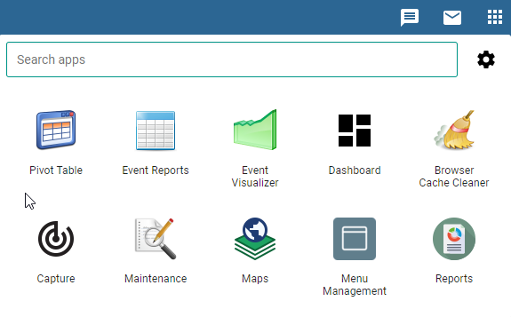

Please create an account for CUSTOMIZATION by following the available
instructions.

-----

Click the "Request account" button below to request an account on the
DHIS2 Customization system.

You will receive an invitation by email with instructions on how to
complete the registration in DHIS2.

Note: the email address you use with OpenEDX will be sent to the DHIS2
database to create an account.

Give it a couple of seconds to think; DO NOT keep clicking the “Request
account” button several times in a row! It will send your email details
that you used when you registered in OpenEdX to the DHIS2 Customization
system to begin the registration process. After 5-10 seconds you should
receive the following notification in your browser window.

Click on OK to close this notification.

Login to to your e-mail. You should receive an e-mail subject that looks
like the following:

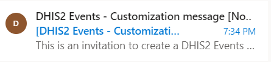

We can see in the email subject that the DHIS2 system that has been
identified is the Customization system that you should be signing up
for.

Note that this e-mail may be in your junk folder. If you do not see it
in one of your primary inboxes, please check your junk folder in case it
was filtered out.

The e-mail itself should look like this

In order to continue, either click on the highlighted link or copy and
paste it into a new tab in your browser. This link will take you to the
following page:

Your email-details have already been filled in from OpenEdX. You will
need to fill in the remaining fields however.

Take note of the restrictions on the password. It must:

  - Be at least 8 characters long
  - Include an uppercase letter
  - Include 1 number/digit
  - Include a special character

After filling in all the fields select “Create” to proceed

This should log you in to the DHIS2 Customization system. Note that
there is no dashboard when you log in to this system.

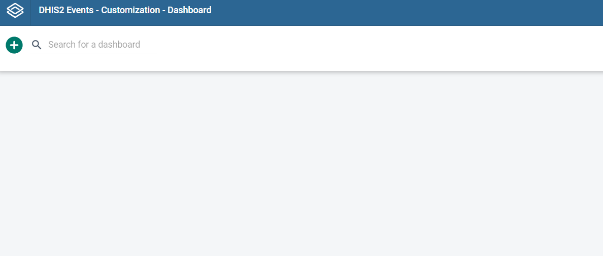

From here, please follow instructions for any activities or assignments
that are referring you to the DHIS2 Customization system.

## 5.1 - Event Data Model

### Presentation - Event Programs: Key Terms & Conceptual Overview

#### Introduction : Subsection 5.1 - Event Data Model

In Subsection 5.1 we explain some of the key terms that need to be
understood when customization event programs in DHIS2.

Subsection 5.1 has 2 units for you to review. We recommend that you
review these units in order.

1.  Presentation - Event Programs : Key Terms & Conceptual Overview
2.  Presentation - Data Elements, Options and Option Sets: Key Terms,
    Conceptual Overview & Application

##### Ungraded Activities

There is an activity associated with the second unit in this module.
Scroll below the video demonstration in the second unit in order to view
the activity.

##### Graded Assignment

There is no graded assignment associated with subsection 5.1.

#### Video - Event Data Model Presentation Part 1 of 2

### Presentation - Data Elements, Options and Option Sets: Key Terms, Conceptual Overview & Application

#### Video - Event Data Model Presentation Part 2 of 2

#### Knowledge Check

Please complete the questions below as the activity for this session.
Note that this is not a graded assignment, it is only meant to
re-enforce the concepts that have been discussed in this session. You
can attempt the questions as many times as you need. If you find after 2
attempts that you are unable to answer a question, it may be a good idea
to review the video and/or presentation again.

##### Question 1

Event Programs are meant to be used when more detailed analysis must
be captured about an activity or event.

(x) True {{When data entry can happen at the lowest possible level, more
details can be captured. The more detailed data generated by storing
these anonymous individual level data, allows for an increase in the
flexibility of analyses and visualizations performed, in comparison to
aggregated data. For example, in aggregated data, we can only review a
case's age range, where as in the event data, we store the case’s actual
age. This age can then be grouped in analyses in DHIS2 if necessary.}}

( ) False {{In the case where detailed information does not need to be
captured we can refer to the aggregate model, not an Event program. With
Event Programs, when data entry can happen at the lowest possible level,
more details can be captured. The more detailed data generated by
storing these anonymous individual level data, allows for an increase in
the flexibility of analyses and visualizations performed, in comparison
to aggregated data. For example, in aggregated data, we can only review
cases’ age range, whereas in the event data, we store the cases’ actual
age. This age can then be grouped in analyses in DHIS2 if necessary.}}

##### Question 2

 What is a set of information collected on a single dengue case
called?

( ) Program {{A “Program” is similar to a paper register that would be
filled out. Thus, it can contain all of the dengue cases, not just
information on one case. To create a program, you must first configure
several types of metadata objects.}}

( ) Data element {{Data elements define what is actually recorded in the
system, for example, in the case of dengue, the gender or the pregnancy
status of the dengue case.}}

(x) Event {{The event is the actual activity captured, without
registration. For example, a set of information about a single dengue
case, such as symptoms experienced. The event is anonymous; no person is
attached to these individual transactions. }}

( ) Options {{Options are used when a data element has a few choices to
select from. Options make up Option Sets, and provide a pre-defined
dropdown (enumerated) list for use in DHIS2. You can define any kind of
options, for instance an option set called "Delivery type" where
"Normal," "Breach," "Caesarian," and "Assisted," would be the options.}}

||This set of information is not registered, it is anonymous, and linked
to an entity.||

In Event Programs data elements must be of the domain type
 “----------” and a predefined list of values assigned to them are
“------------.” 

( ) Tracker / Categories {{In Event Programs data elements must be of
the domain type “Tracker” to collect details about any entity.

A “Category” is a group of "Category options" but they are used in an
aggregate model. Remember, the category model has three main elements:
1) the “category option,” which corresponds to “female,” “male,” and
less then 5 years,” and “more then 5 years”.

2) The category, which corresponds to “gender” and “age group”.

3) The category combination, which should in the above example be named
“gender and age group” and be assigned both categories mentioned above.

.}}

( ) Aggregate / Option sets {{Aggregate domain types are used for the
Aggregate data model in DHIS2. Option sets are a list of values assigned
to a data element of tracker type. They provide a predefined drop-down
(enumerated) list for use in DHIS2. You can define any kind of options.
An option set called “Delivery type” would have the options: “Normal”,
“Breach”, “Caesarian” and “Assisted”}}

(x) Tracker / Option sets {{In Event programs data elements must be of
the domain type “Tracker” to collect detail about any entity. The list
of values assigned to a data element are called an Option set, which is
a group of options similar to a multiple choice question.  They provide
a predefined drop-down (enumerated) list for use in DHIS2. You can
define any kind of options. An option set called “Delivery type” would
have the options: “Normal,” “Breach,” “Caesarian,” and “Assisted.”}}

|| In Event Program, a list of values provides a predefined drop-down
(enumerated) list for use in DHIS2.||

||Think about which domain type is needed to collect details about any
entity. ||

In Event Programs each event is independent and does not have a
relationship with another event. However, the events can still share the
location and the date.

(x) True {{Events are without registration of any entity (they are
anonymous events), such as a person, but information can be collected on
the same date about different persons that belong to the same
location.}}

( ) False {{When events are related to each other based on a predefined
relationship a Tracker program can be used.}}

## 5.2 - Event Data Model in Practice

### Presentation - Event vs. Aggregate Data Dimensions & Applying Data Model to SARA Survey

#### Introduction : Subsection 5.2 - Event Data Model in Practice

In Subsection 5.2 we will apply the event data model we learned about in
subsection 5.1 to the SARA survey and malaria case management event
programs that we have been reviewing in this course.

Subsection 5.2 has 2 units for you to review. We recommend that you
review these units in order.

1.  Presentation - Events vs. Aggregate Data Dimensions & Applying Data
    Model to SARA Survey
2.  Presentation - Event Model Indicators & Applying Data Model to
    Malaria Case Management

##### Ungraded Activities

There is an activity associated with the second unit in this module.
Scroll below the video demonstration in the second unit in order to view
the activity.

##### Graded Assignment

There is no graded assignment associated with subsection 5.2.

#### Video - Event Data Model in Practice Presentation Part 1 of 2

### Presentation - Event Model Indicators & Applying Data Model to Malaria Case Management

#### Video - Event Data Model in Practice Presentation Part 2 of 2

#### Part 2 Activities: Event Data Model in Practice

In this activity, we are going to work through the event data model and
apply what we have learned to an example paper registry. This will
demonstrate how a paper registry can be converted to the DHIS2 data
model.

In order to do this, we will need to consider the following items for
this registry and map them to the DHIS2 data model:

1.  What are the data elements?
2.  What are the data element value types?
3.  Are there any option sets?
4.  What are the options included in those option sets?

To complete this activity, download the Cholera line list form here:
[Cholera line
list](https://www.google.com/url?q=https://studio.academy.dhis2.org/assets/courseware/958e79a13a191709a526d1777c7d5411/asset-v1:HISP%2BD2EVENTS100%2BQ2_2020%2Btype@asset%2Bblock/5_2_2_Activities_Link_1_Cholera_line_list_template.xlsx&sa=D&ust=1605291870453000&usg=AOvVaw23MBhZ-UV_VHZSRgrEWAQY)

Then, using this form, attempt to fill in this template: [Cholera line
list
template](https://www.google.com/url?q=https://studio.academy.dhis2.org/assets/courseware/1fdc00aea8b3b71e8963f411725f32fa/asset-v1:HISP%2BD2EVENTS100%2BQ2_2020%2Btype@asset%2Bblock/5_2_2_Activities_Link_2__Cholera_Line_List_Data_Model_Template.xlsx&sa=D&ust=1605291870454000&usg=AOvVaw17kuYuGLEPTzZjhsLgZRgV)

We have filled in one line in the template so you can see what it might
look like. You may want to consider referring to the following
documentation when entering the data element value types: [Data
element](https://www.google.com/url?q=https://docs.dhis2.org/master/en/user/html/dhis2_user_manual_en_full.html%23create_data_element&sa=D&ust=1605291870454000&usg=AOvVaw0fbxUXRuHlDl8GRjhN-L2z)

We have provided the completed template
[here](https://www.google.com/url?q=https://studio.academy.dhis2.org/assets/courseware/8b05ca893c501134cd8256e0c495c247/asset-v1:HISP%2BD2EVENTS100%2BQ2_2020%2Btype@asset%2Bblock/5_2_2_Activities_Link_4_Cholera_Line_List_Data_Model_Template_Filled.xlsx&sa=D&ust=1605291870455000&usg=AOvVaw1ljnxMYp5_sBHYmbZIfRs4) to
check you have completed the activity correctly, but please do not
download the completed template until you have tried this exercise on
your own.

## 5.3 - Creating an Event Program

### Presentation - Introduction to Demo Tasks

#### Introduction - Subsection 5.3 - Creating an Event Program

In Subsection 5.3 we will demonstrate how to create an event program in
DHIS2. Understanding the DHIS2 data model makes the creation of an event
program much easier; please ensure you have reviewed subsection 5.1 and
5.2 prior to reviewing the concepts presenting in this subsection.

Subsection 5.3 has 11 units for you to review. We recommend that you
review these units in order.

1.  Presentation - Introduction to the Demo Tasks
2.  Demonstration - Review Program in Capture App
3.  Demonstration - Identify & Create Option Sets
4.  Demonstration - Creating Data Elements
5.  Demonstration - Creating a Data Element Group
6.  Demonstration - Creating Event Program Details
7.  Demonstration - Assign Data Elements to the Program
8.  Demonstration - Create the Data Entry Form
9.  Demonstration - Assign Program to Organization Units
10. Presentation - Sharing Settings
11. Demonstration - Sharing Settings

##### Ungraded Activities

Starting from unit 2 (Demonstration - Review Program in Capture App),
there will be an ungraded activity for each unit. Scroll below the video
demonstration in each unit in order to view the activity.

##### Graded Assignment

After you have completed reviewing all the material within this
subsection, please attempt the graded hands-on assignment for this
subsection. This assignment will contribute to 30% of your overall
grade.

#### Video - Creating Event Programs Presentation Part 1 of 11

### Demonstration - Review Program in Capture App

#### Video - Creating Event Programs Demonstration Part 2 of 11

#### Part 2 Activity: Review Program in Capture App

This activity will be completed in [DHIS2
Customization](https://www.google.com/url?q=https://academy.events.dhis2.org/customization&sa=D&ust=1605291870460000&usg=AOvVaw3wAcqHZV1_o6mtw4iOOud3)
. You will be using a generic account to complete this activity, not the
account you have created for customization. Use the following login
details when performing this activity:

Username: icd

Password: District1#

International Classification of Diseases, 10th revision (ICD-10) is a
medical classification of diseases that is published by the World Health
Organization. The Event Program we will create in this subsection is the
[ICD-10
Register](https://www.google.com/url?q=https://studio.academy.dhis2.org/asset-v1:HISP%2BD2EVENTS100%2BQ2_2020%2Btype@asset%2Bblock@5.3.2_ICD10_Register.xlsx&sa=D&ust=1605291870461000&usg=AOvVaw1NgQVMF_MaI2m3GkMy2Mjv),
which captures information on patient morbidities and mortalities,
following the ICD-10 classifications.

To see how this form has been made into an Event Program already, open
the Capture app.

In the Search apps field, search for the Capture app.

Use the ‘arrow’ symbol to expand the Organisation Unit hierarchy in the
desired branch, then select a health facility in the hierarchy.

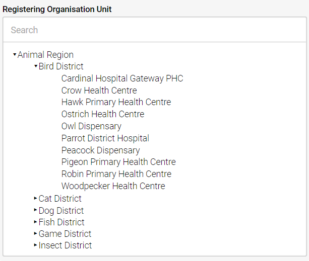

Once you’ve chosen a health facility, select “ICD-10 Morbidity &
Mortality” program.

Register a new event by clicking the New Event button in the top right
hand corner.

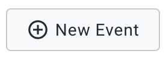

The event registration form has the following sections:

  - Basic Info

 

  - Patient Details

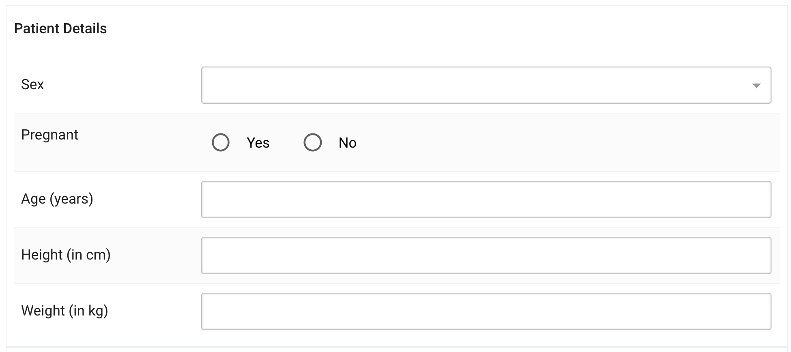

 

  - Admission Details

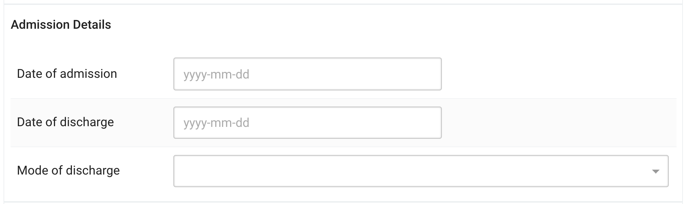

 

  - ICD-10 Diagnosis

 

Notice the “ICD-10 diagnosis” data element with the options available in
the drop down list.

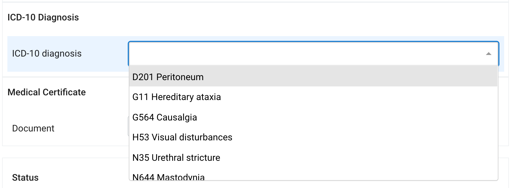

We have filled out a template to identify all of the various components
we have discussed in line with our DHIS2 data model. [TEMPLATE
LINK](https://www.google.com/url?q=https://studio.academy.dhis2.org/asset-v1:HISP%2BD2EVENTS100%2BQ2_2020%2Btype@asset%2Bblock@ICD10_Register_Data_Model_Template_Filled.xlsx&sa=D&ust=1605291870464000&usg=AOvVaw3wabyP10VKdM-TqZf2SvzC)

### Demonstration - Identify & Create Option Sets

#### Video - Creating Event Programs Demonstration Part 3 of 11

#### Part 3 Activity: Identify & Create Option Sets

First, navigate to the Maintenance app using the Search apps field.

Using the bar at the top, select Other then click on the box labeled
Option set.

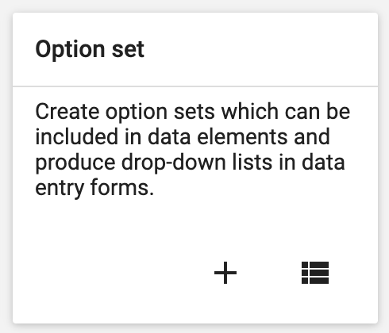

Now, click on the blue “+” icon at the bottom right to add a new option
set.

An Option set configuration window appears.

Fill in the first tab, Primary details.

For this use case, we will enter the following details:

  - Name: “Your username_Sex”
  - Code: “Your username_Sex”
  - Value type: “Text”

Then click on SAVE.

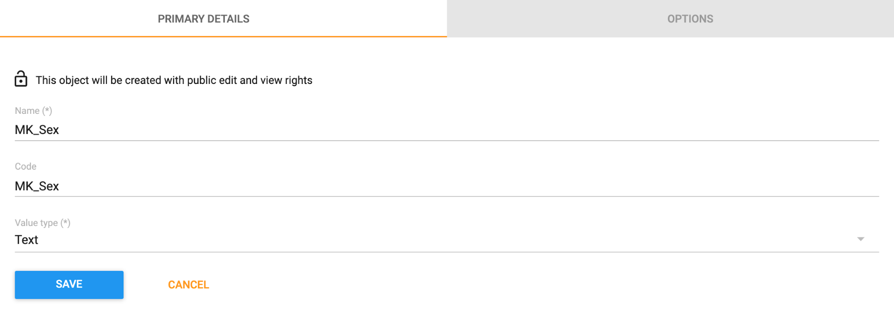

Now the Options tab will be made available. Navigate to this tab.

Click on the Add Option button in the bottom right.

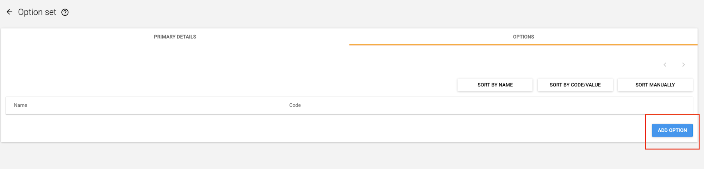

The following configuration box will appear:

Create an option with the following details:

  - Name: “Your username_Male”
  - Code: “Your username_MALE”;

Then click Save.

Now click on the Add Option button a second time.

Create a second option with the following details:

  - Name: “Your username_Female”
  - Code: “Your username_FEMALE”;

Then click Save.

You will see the options you created appear in the options list.

We will follow the exact same process to create the other option set,
Mode of discharge.

First, navigate back to the Option set management page by clicking on
the back arrow next to the Option set title.

Again, click on the blue plus button in the bottom right hand corner.

Enter the Primary Details as follows:

  - Name: “Your username_Mode of Discharge”
  - Code: “Your username_MODE OF DISCHARGE”
  - Value type: “Text”

Then click on SAVE.

Now enter the following Options for this Option Set by clicking on the
Add Option button.

Discharged

  - Name: “Your username_Discharged”
  - Code: “Your username_DISCHARGED”

Died

  - Name: “Your username_Died”
  - Code: “Your username_DIED”

Transferred

  - Name: “Your username_Transferred”
  - Code: “Your username_TRANSFERRED”

Absconded

  - Name: “Your username_Absconded”
  - Code: “Your username_ABSCONDED”

Once you have created the Mode of Discharge options, go back to the
Option set management page by clicking on the back arrow next to the
Option Set title and type your username into the Search apps bar.

You should see that both Options Sets should now be available:

  - Your username_Sex
  - Your username_Mode of Discharge

### Demonstration - Creating Data Elements

#### Video - Creating Event Programs Demonstration Part 4 of 11

#### Part 4 Activity: Creating Data Elements

Since we have created the options sets, the next step is to create the
data elements.

The [DHIS2
Documentation](https://www.google.com/url?q=https://docs.dhis2.org/master/en/user/html/dhis2_user_manual_en_full.html%23create_data_element&sa=D&ust=1605291870477000&usg=AOvVaw1ctrlJsAnib_gZJw8RLdBn) describes
each of the available fields in data element creation. Not all of them
are required when creating a data element; but you can refer to the link
if you want to understand each field in more detail.

We have filled out a template to identify all of the various components
we have discussed in line with our DHIS2 data model. Use the template to
give you more information on how to create each data element required in
this program. [TEMPLATE
LINK](https://www.google.com/url?q=https://studio.academy.dhis2.org/asset-v1:HISP%2BD2EVENTS100%2BQ2_2020%2Btype@asset%2Bblock@ICD10_Register_Data_Model_Template_Filled.xlsx&sa=D&ust=1605291870478000&usg=AOvVaw3Bbbz69MWokqIFJ5QiUYHT)

Navigate to the Maintenance app.

  - Click on the Data Element tab located in the top horizontal bar
  - Click on the + icon in the Data Element box

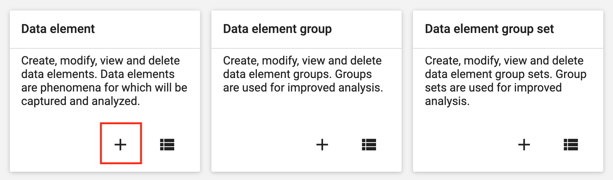

Create the Data Element to capture "sex" using the following details:

  - Name: “Your username_Sex”
  - Short name: “Your username_Sex”
  - Domain Type: “Tracker”
  - Value Type: “Text” (automatically selected with Option Set assigned)
  - Aggregation type: “None” (automatically selected with Option Set
    assigned)
  - Option set: “Your username_Sex”
  - Click Save

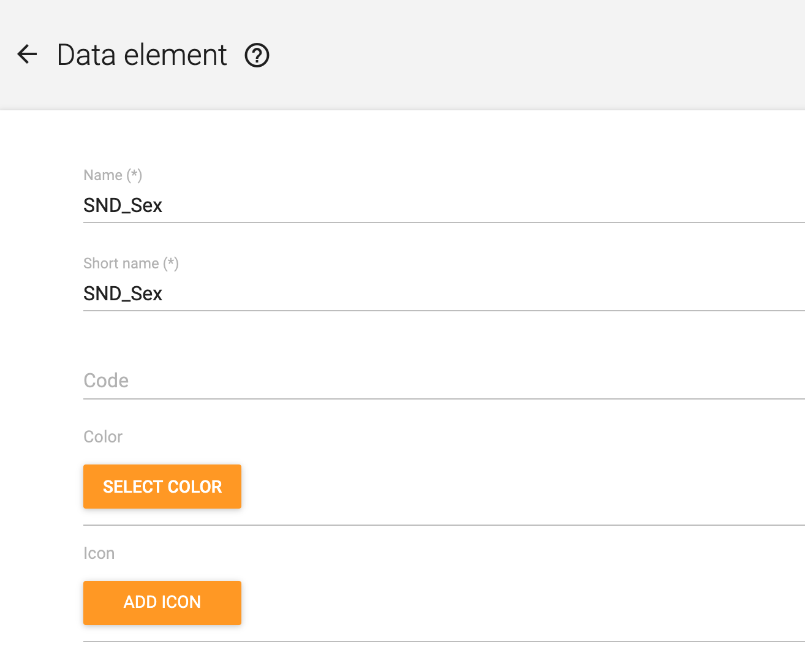

Click on the blue “+” icon again to repeat this process and create the
following data elements:

Data Element to capture pregnancy status:

  - Name: “Your username_Pregnant”
  - Short name: “Your username_Pregnant”
  - Domain Type: “Tracker”
  - Value Type: “Yes/No”
  - Aggregation type: “Sum”
  - Click Save

 

Data Element to capture height (in cm):

  - Name: “Your username_Height (in cm)”
  - Short name: “Your username_Height (in cm)”
  - Domain Type: “Tracker”
  - Value Type: “Positive or zero integer”
  - Aggregation type: “Average”
  - Click Save

NOTE: If you would like to continue practicing creating data elements,
please use the template provided to create them [TEMPLATE
LINK](https://www.google.com/url?q=https://studio.academy.dhis2.org/asset-v1:HISP%2BD2EVENTS100%2BQ2_2020%2Btype@asset%2Bblock@ICD10_Register_Data_Model_Template_Filled.xlsx&sa=D&ust=1605291870484000&usg=AOvVaw3FTm83nauCbEnE-N7vZBbz).
The option set for ICD-10 is available for you to add if you want to
create the ICD-10 diagnosis data element yourself. Please use your
username to create the remaining data elements as well. If you are
satisfied with creating data elements, the remaining data elements have
already been created for you to use in your program.

### Demonstration - Creating a Data Element Group

#### Video - Creating Event Programs Demonstration Part 5 of 11

#### Part 5 Activity: Creating Data Element Groups

Once you’ve created and saved the data elements above, navigate back to
the Data element management page so that you can proceed with creating
a Data Element Group.

Continue to use the template to give you more information on which data
elements to include in the data element group. [TEMPLATE
LINK](https://www.google.com/url?q=https://studio.academy.dhis2.org/asset-v1:HISP%2BD2EVENTS100%2BQ2_2020%2Btype@asset%2Bblock@ICD10_Register_Data_Model_Template_Filled.xlsx&sa=D&ust=1605291870486000&usg=AOvVaw2SW9QMwuE_Zqlm5R6djULM)

Select Data Element Group from the left context menu.

Then, click on the blue “+” icon in the bottom right hand corner.

Complete the creation of the Data Element Group using the following
details:

  - Name: “Your username_ICD-10 Register (Tracker)”
  - Assign the following Data Elements to the group by moving them from
    the box on the left to the box on the right:

<!-- end list -->

  - Your username_Sex
  - Your username_Pregnant
  - Your username_Height (in cm)
  - Age (years)
  - Weight (in kg)
  - Date of admission
  - ICD-10 diagnosis
  - Date of discharge
  - Mode of discharge

Click Save when finished.

### Demonstration - Create Event Program Details

#### Video - Creating Event Programs Demonstration Part 6 of 11

#### Part 6 Activity: Create Event Program Details

Now let’s create the Event Program.

Within the Maintenance app, click on the Program box and select
Program from the left context menu.

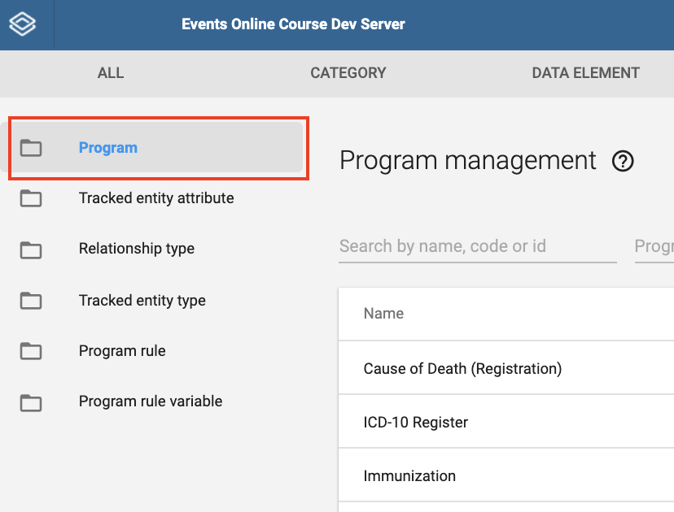

To add a new program, click on the blue “+” icon at the bottom right
hand corner of the program management screen and choose Event Program.

The following page will appear with a timeline of steps at the top:

1.  Add program details
2.  Assign data elements
3.  Create data entry form
4.  Access
5.  Create notifications

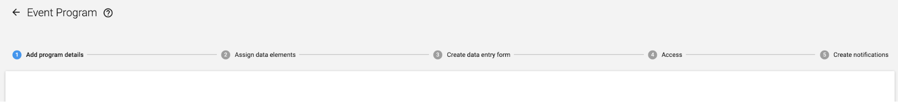

There are many fields that are available in the program details tab.
Consult the [DHIS2
documentation](https://www.google.com/url?q=https://docs.dhis2.org/master/en/user/html/dhis2_user_manual_en_full.html%23configure_event_program_in_maintenance_app&sa=D&ust=1605291870491000&usg=AOvVaw10p16ahEsJDJdRuXRE78ZQ) for
more detail on the available fields.

Fill in the following program details in the Add program details
section:

  - Name: “Your username__Morbidity/Mortality Register”
  - Short name: “Your username_ICD10 Register”
  - Code: “Your username_ICD10 Register"
  - Description: “The ICD-10 morbidity and mortality register.”
  - Feature type: “Point”

Then click Save.

### Demonstration - Assign Data Elements to the Program

#### Video - Assign Data Elements to the Program Part 7 of 11

#### Part 7 Activity: Assign Data Elements to the Program

In the Program management page, find the program you created and click
on it to open.

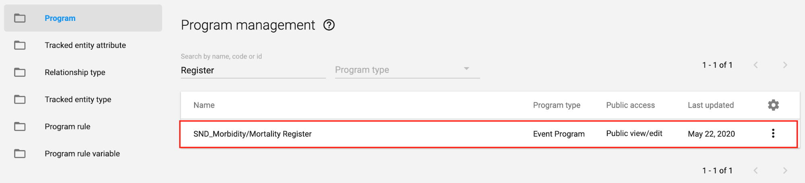

In the program you have created, move to the tab, Assign data elements.
Click on it to proceed.

To add in the data elements, find them in the list of data elements and
add them to your program.

Search for and add the data elements you already created beginning with
“Your username_”. To do this, enter your username in the area where
it says “Search available/selected items.” This should quickly filter
out the data elements you have created.

Assign the data elements by doing one of the following:

  - Double click on them
  - Select them and click on the arrow in the middle to move them to the
    selected box
  - Or if you have applied a filter and would like to move all of the
    data elements over, select Assign All to move them all from the
    available to the selected box

Assign the following data elements to the program:

  - Your username_Sex
  - Your username_Pregnant
  - Your username_Height (in cm)
  - Age (years)
  - Weight (in kg)
  - Date of admission
  - ICD-10 diagnosis
  - Date of discharge
  - Mode of discharge

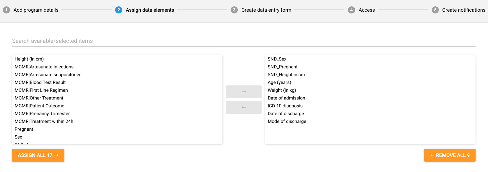

After you have assigned the elements, options will be made available
below the selection box for these assigned data elements. For a full
description of each option, refer to the [DHIS2
Documentation.](https://www.google.com/url?q=https://docs.dhis2.org/master/en/user/html/dhis2_user_manual_en_full.html%23configure_event_program_in_maintenance_app&sa=D&ust=1605291870496000&usg=AOvVaw3tIxOI7q1u_kL7mhpnLjQ0)

By default, all data elements have the Display in reports option
disabled. Enable this option for the following data elements:

  - Your username_Sex
  - Your username_Pregnant
  - Age (years)
  - ICD-10 diagnosis
  - Mode of discharge

Then click Save.

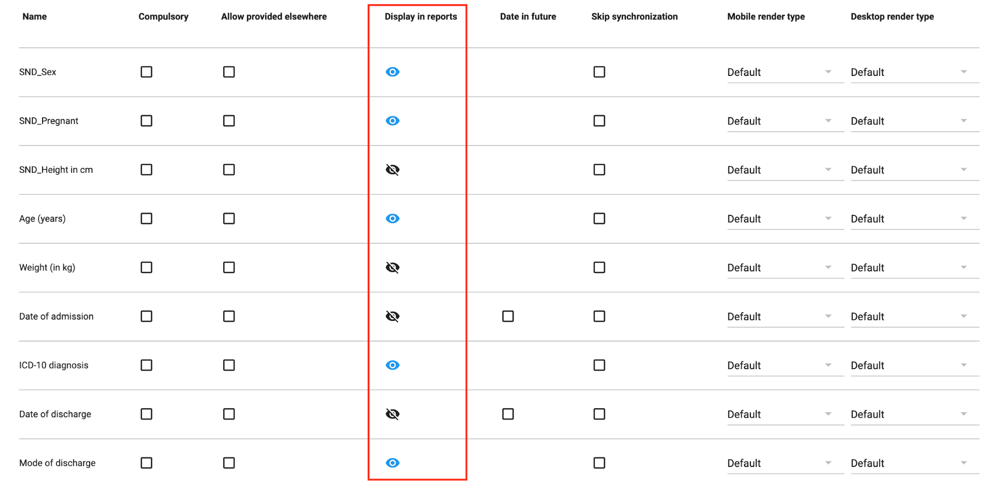

For more information on the options available, refer to the [DHIS2
Documentation.](https://www.google.com/url?q=https://docs.dhis2.org/master/en/user/html/dhis2_user_manual_en_full.html%23configure_event_program_in_maintenance_app&sa=D&ust=1605291870499000&usg=AOvVaw3Q9Xr397-uCtQny0cOU7Mu)

### Demonstration - Create the Data Entry Form

#### Video - Creating Event Programs Demonstration Part 8 of 11

#### Part 8 Activity: Create the Data Entry Form

In the Program management page, find the program you created and click
on it to open.

In the program you have created, move to the tab, Create data entry
form. Click on it to proceed.

Choose Section as the data entry form type by clicking on it.

Click on the blue “+” icon.

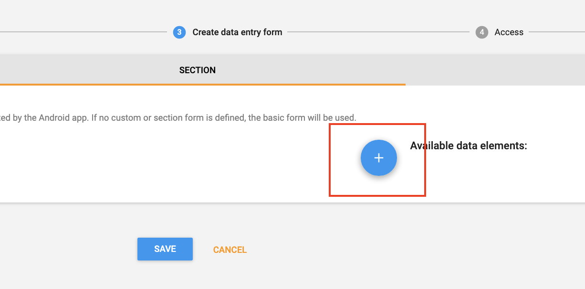

Add the section “Patient details” to the data entry form. Fill in the
following details:

  - Name: “Patient details”

Click on Add.

Repeat this process and add another section “Admission details”. Fill in
the following details:

  - Name: “Admission details”

Click on Add.

 

Then add the data elements to the section.

In order to add data elements, select one of the sections, for example,
the “Patient details” section. You will notice that the section is now
highlighted.

Then select the data elements from the right side menu Available data
elements, by clicking on the “+” icon next to each name.

Add the below Data Elements to “Patient details” in the following order:

  - “Your username_Sex”
  - “Your username_Pregnant”
  - “Age (years)”
  - “Your username_Height in cm”
  - “Weight in kg”

Select the section “Admission details”, and add the below Data
Elements in the following order:

  - “Date of admission”
  - “Diagnosis (ICD-10)”
  - “Date of discharge”
  - “Mode of Discharge”

Then click Save.

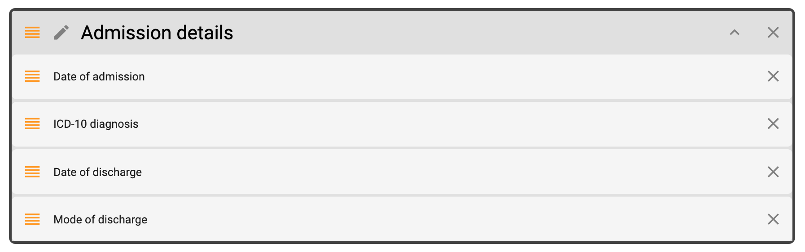

### Demonstration - Assign Program to Organisation Units

#### Video - Creating Event Programs Demonstration Part 9 of 11

#### Part 9 Activity: Assign The Program to Organisation Units

In the Program management page, find the program you created and click
on it to open.

In the program you have created, move to the tab, Access. Click on it to
proceed.

Under the Organisation units section, assign the program to your
organisation unit.

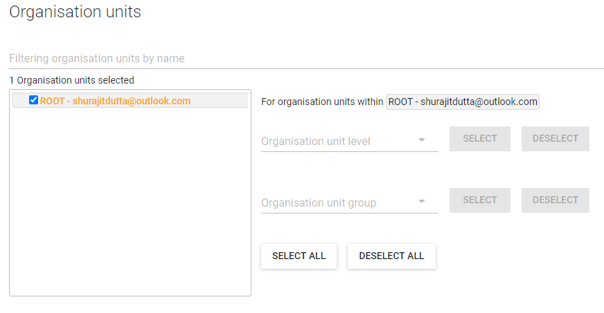

Save your changes when you are finished.

### Presentation - Sharing Settings

#### Video - Creating Event Programs Demonstration Part 10 of 11

#### Part 10 - Knowledge Check

Please complete the brief knowledge check below to ensure you understand
the sharing concept before proceeding. This is not graded and meant only
to re-enforce the presentation.

The concept of sharing allows you to

( ) Control which apps a user in DHIS2 has access to {{The sharing
concept allows you to control which metadata and data a user in DHIS2
has access to. We commonly set this through the use of user groups.
Sharing, when combined with user roles, allows you to have control over
exactly what a user can do in your system.}}

(x) Control which metadata and data a user in DHIS2 has access to {{The
sharing concept allows you to control which metadata and data a user in
DHIS2 has access to. We commonly set this through the use of user
groups. Sharing, when combined with user roles, allows you to have
control over exactly what a user can do in your system.}}

( ) Control what a user can do within a DHIS2 app {{The sharing concept
allows you to control which metadata and data a user in DHIS2 has access
to. We commonly set this through the use of user groups. Sharing, when
combined with user roles, allows you to have control over exactly what a
user can do in your system.}}

Click on check to verify your answer.

If I apply the sharing setting "metadata : can view only", how will
this impact the object I have applied this sharing setting to?

( ) A user with this setting will be able to modify or otherwise edit
this object {{Metadata : can view only means that a user will only be
able to see the object that has this setting applied to it. If I apply
this to my program, this means that the user or user group I apply this
to can see my program, but will not be able to modify it in any way.}}

(x) A user with this setting will be able to see the object, but not
update or edit it {{Metadata : can view only means that a user will only
be able to see the object that has this setting applied to it. If I
apply this to my program, this means that the user or user group I apply
this to can see my program, but will not be able to modify it in any
way.}}

( ) A user with this setting will be able to see any data stored in this
object {{Metadata : can view only means that a user will only be able to
see the object that has this setting applied to it. If I apply this to
my program, this means that the user or user group I apply this to can
see my program, but will not be able to modify it in any way.}}

Click on check to verify your answer.

### Demonstration - Sharing Settings

#### Video - Creating Event Programs Demonstration Part 11 of 11

#### Part 11 Activity: Sharing Settings

Back in program maintenance under the Access tab we can go ahead and
modify the sharing settings.

To edit these settings, click on the text under Roles and access, the
Sharing settings box will appear

At the bottom of the Sharing settings box, use the Add users and user
groups field to enter your name.

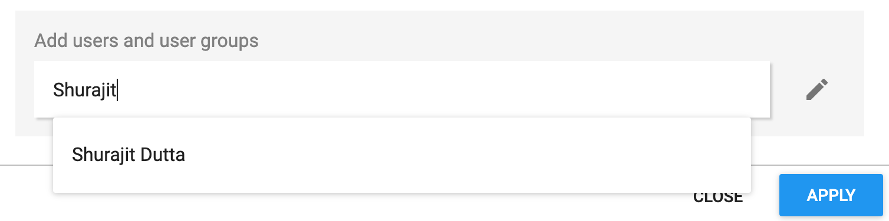

Once you have selected your name, it will appear in the “Who has access”
section.

Then assign yourself access to the program by clicking on the pencil
button and selecting:

  - Metadata: Can edit and view
  - Data: Can capture and view

Click Apply.

 

Ensure that the sharing settings from the program are the same as the
sharing settings in the stage. To do this, tick the box next to the
program stage name. Then click on the button Apply to selected stages.

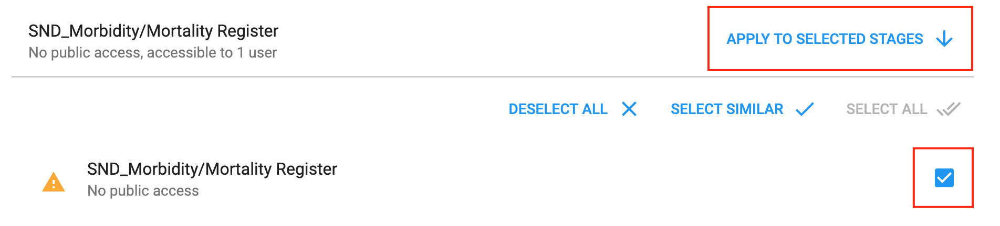

Click on Save at the bottom of the page to ensure the event program is
saved.

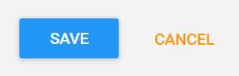

Now that the program has been created, open the Capture app and review
it to ensure it has been created correctly.

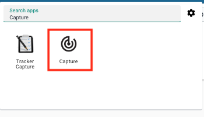

Select one of the facilities in the “Bird District” from the
organization unit hierarchy. And then select the program you created,
“Your username_Morbidity/Mortality Register”

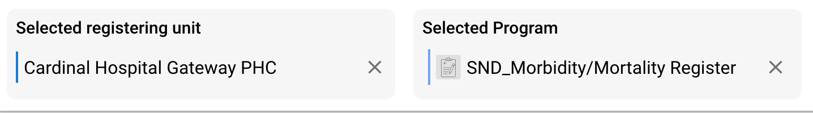

Click on the New Event button in the top right hand corner to view the
event registration section from.

Review the different sections, data elements, and option sets available,
and complete the data entry for an event.

 

Complete the event with sample data, and then click on Save and exit.

Confirm that this event has been saved to the program by finding it on
the front page list of registered events.

### Takeaways from Module 5

#### Recap, reflect and share

What new ideas have you come up with in this module? What doubts do you
have?

Even though most of the contents of the course are aimed for you to get
familiar with the DHIS2 features, the end goal is for you to relate what
you learn to your daily work and find new ways to solve data challenges
you face.

Take advantage of this space to recap, reflect, and share your thoughts
with your peers and learn from them.

## 5.3 - Graded Assignment - Creating an Event Program

### Instructions

Please read this assignment carefully from start to finish before
starting. If you have any questions please contact us on the discussion
forum to clarify your questions.

This assignment is to be done on the
[Customization](https://www.google.com/url?q=https://academy.events.dhis2.org/customization&sa=D&ust=1605291870515000&usg=AOvVaw31czO9yUNmWJRRWc2A5aFQ)
 database. Please use the log-in for
[Customization](https://www.google.com/url?q=https://academy.events.dhis2.org/customization&sa=D&ust=1605291870516000&usg=AOvVaw3Xmjzt80tNsNbv-XpK7rF5)
that you created at the beginning of Module 5.

Trainingland has been progressively implementing new measures of malaria
control. The program is moving from the control stage to a
pre-elimination stage. As part of these measures, the program would like
to introduce more intensive information collection mechanisms that
record each individual case as well as their location. This is
preparatory in nature to allow the malaria program enough time to
assimilate these practices into their routine procedures before it
becomes critical to track each case during the elimination phase.

In order to record each case, the malaria program has asked you to take
the case management register and implement an event program to capture
this data. Please refer to the accompanying [malaria event program
registry
spreadsheet](https://www.google.com/url?q=https://studio.academy.dhis2.org/asset-v1:HISP%2BD2EVENTS100%2BQ2_2020%2Btype@asset%2Bblock@Malaria_Event_Program_Registry.xlsx&sa=D&ust=1605291870516000&usg=AOvVaw2bWC0W806q2Sg-bwE0zRhY) that
has been provided.

As a first step, you should identify the data elements, data element
value types, options and option sets that are required to build the form
as a program in DHIS2. It is a good idea to create a record of these.
Please identify these items in the corresponding template that is part
of this exercise [(Malaria Line List Data Model
Template)](https://www.google.com/url?q=https://studio.academy.dhis2.org/asset-v1:HISP%2BD2EVENTS100%2BQ2_2020%2Btype@asset%2Bblock@Malaria_Line_List_Data_Model_Template.xlsx&sa=D&ust=1605291870517000&usg=AOvVaw0bhWOmeJbIqUb8taWiEfIL).

Note: We have provided you with a filled-in copy of the template
[(Malaria Line List Data Model
Template_Filled)](https://www.google.com/url?q=https://studio.academy.dhis2.org/asset-v1:HISP%2BD2EVENTS100%2BQ2_2020%2Btype@asset%2Bblock@Malaria_Line_List_Data_Model_Template_Filled.xlsx&sa=D&ust=1605291870517000&usg=AOvVaw01qO3G9Isi9_AiJefeCE8Q) that
you can refer to, to help you complete this part of the exercise. Please
attempt to fill in the incomplete template first for your own
understanding of how to perform this in practice.

When you have done this and are ready to create the program, this is the
rough guide to follow in DHIS2:

1.  Identify and create option sets and options
2.  Create data elements with domain type “Tracker”
3.  Add the data elements to a data element group
4.  Create an event program - make sure to include "Malaria" in the
    title.
5.  Add the data elements to the program
6.  Create a section based form
7.  Assign the program to your organization unit
8.  Assign sharing settings to the program

You can track the progress of each step of the assignment by using the
"progress" section within this module.

Make sure that you use your username as a prefix for any items that you
create within DHIS2. For example, if my username is “sdutta” and I make
a data element “Pregnant (Trimester),” then the name should be
“sdutta_Pregnant (Trimester)” in DHIS2. This is done to avoid
duplicates in DHIS2 as everyone is working on the assignment in the same
system.

If you are unclear on how to carry out any of these steps, please review
the specific subsection within this module. You may also ask us
questions directly using the forum.

##### Creation of Data Elements and Option Sets

One of the option sets has been made for you:

1.  “Blood Test Result”

You may use this when you complete your assignment.

Note that there are also some data elements you have already created, or
have access to from the previous ICD-10 activity. In the course of the
activity, at minimum, you would have created the following data elements
that also belong to the malaria case management register event program:

1.  “Your username_Sex”
2.  “Your username_Height”

Data elements that you already interacted with that are also in the
malaria program include:

1.  “Weight (in Kg)”
2.  “Age”

“Blood Test Result” has also already been created for you to accompany
the option set that is also available.

In event and tracker programs, you DO NOT need to re-create data
elements or option sets that you have already made or have access to
when making another program. This is because DHIS2 uniquely pairs each
data element with the program it is in, allowing these data elements to
be used across programs. For “sex,” there is an option set already
associated with the data element you have made and you DO NOT need to
make it again either.

Therefore, in this assignment, you should not need to re-create the 5
data elements above. In the filled template, “[Malaria Line List Data
Model
Template_Filled](https://www.google.com/url?q=https://studio.academy.dhis2.org/asset-v1:HISP%2BD2EVENTS100%2BQ2_2020%2Btype@asset%2Bblock@Malaria_Line_List_Data_Model_Template_Filled.xlsx&sa=D&ust=1605291870521000&usg=AOvVaw0d-XF_1hM0GHpgr_bDtdap),”
we have identified which data elements and option sets you must make by
making them bold and adding a comment that you must create them for the
assignment.

##### Creation of Program/Program Entry Form

When creating this program, use your “username” at the front of the
program. For example, “SND_Malaria Case Management Register.” To ensure
we can check your program, please include "Malaria" somewhere in the
name of the program.

After adding the data elements to the program, organize the section form
into the following sections (these sections are taken directly from the
[malaria event program registry
spreadsheet](https://www.google.com/url?q=https://studio.academy.dhis2.org/asset-v1:HISP%2BD2EVENTS100%2BQ2_2020%2Btype@asset%2Bblock@Malaria_Event_Program_Registry.xlsx&sa=D&ust=1605291870522000&usg=AOvVaw1eJrHSD1ya_WGh_lNJbAFh) that
has been provided):

1.  “Patient Details”
2.  “Diagnostic Test”
3.  “Treatment Prescribed”
4.  “Patient Outcome”

Place the data elements into these sections based on how they are
grouped in the [malaria event program registry
spreadsheet](https://www.google.com/url?q=https://studio.academy.dhis2.org/asset-v1:HISP%2BD2EVENTS100%2BQ2_2020%2Btype@asset%2Bblock@Malaria_Event_Program_Registry.xlsx&sa=D&ust=1605291870524000&usg=AOvVaw1PQOsaFthMdtWTQnTaRPNl) .
For the latitude and longitude, this will appear at the beginning of the
form if you select the feature type for the program as “point” as shown
in the video demonstrations.

##### Assigning the program to Organization Units

Assign the program to your ROOT organisation unit.

##### Sharing

For both the program and stage:

Set Public access to “none” for both metadata and data.

Provide “edit and view” access to your user for both metadata and data.

Note: These are same sharing settings you used in the ICD-10 register
activity.

##### Review the program

Make sure you have performed the outlined steps:

1.  Review the program design
2.  Identify and create option sets and options
3.  Create data elements with domain type “Tracker”
4.  Add the data elements to a data element group
5.  Create an event program
6.  Add the data elements to the program
7.  Create a section based form
8.  Assign the program to your organization unit
9.  Assign sharing settings to the program

Afterwards, you should be ready to review the program. Navigate to the
Capture app, select an organisation unit that you have assigned your
program to, along with the program you have created. Create a new event,
fill in details for the event and save the event.

### Graded Assignment Submission

#### Submission - Step 1: Progress check

#### Progress check

This progress section is meant to help you track the individual tasks
that will result in the completion of an event program. These responses
do not contribute to your grade. Your assignment will be checked to see
if you have made the program before your grade is assigned.

Are you ready to submit the assignment? Here is a checklist for you.

I have completed the review of the malaria program by identifying
options, option sets, data elements and data element value types.

I have created the option sets and options in DHIS2.

I have created data elements using the tracker domain type.  

I have added the data elements to a data element group.  

I have created an event program by entering the program details.

I have added the appropriate data elements to the program I created.  

I have created a section based form for my program.

I have assigned the program I made to my organization unit.

I have assigned sharing settings to my program.

I have been able to review my program in the Capture app and entered
some data into my program.

Let us know that you are done with your assignment by asking us to
grade.

#### Submission for staff assessment - Step 2: Notify the Course Staff

Did you manage to check all the boxes of the above checklist? Well
done! You can know ask the Course Staff to check your assignment in
Customization. To do so use the 'SUBMISSION FOR STAFF ASSESSMENT' right
below:

1.  Enter a short text message in the text box
2.  Click the 'Submit your response and move to the next step' button

Once you have submitted, your assignment is ready to be assessed by a
Course Staff.

Please allow for a week before the grading is completed after your
response is registered.

#### Resubmission of the assignment

Do you need to complete & resubmit your assignment on Customization? No
problem. You simply let us know by emailing us at  Course support
email and the course staff reopen the submission for you.

## Feedback - Customizing Event Programs

# Module 6: Tracker Use Cases

## 6.0 - Introduction to Module 6

### Introduction to Module 6

#### WELCOME TO MODULE 6!

This module focuses on providing you some preliminary background on
tracker use cases and functionality in DHIS2.

In module 6, there are 2 subsections that you will be reviewing:

  - 6.1 - Tracker Programs & Tracker Capture. This subsection is divided
    into 6 units.
  - 6.2 - Digital Data Packages & Cause of Death. This subsection is
    divided into 4 units.

#### OBJECTIVES

By the end of this module, you should be able to:

  - Describe how the tracker capture app is used to collect tracker data
  - Use the tracker capture app in order to enter tracker data into
    DHIS2
  - Explain the concept of a DHIS2 digital data package

#### ACTIVITIES & ASSIGNMENTS

##### Activities

You will be performing ungraded activities in subsection 6.1 for any
unit labelled "Demonstration," while in subsection 6.2 you will perform
1 activity in unit 3. There is therefore a total of 6 activities that
you will perform within this module. 

##### Assignments

You will have 1 graded assignment in the form of a quiz that will relate
to the material presented in subsection 6.1. This assignment contributes
to 10% of your overall grade.

##### Training Environment

You will be using the CAPTURE training environment to perform your
activities and assignments. If you have not done so, please sign up for
this training environment by following the instructions in the unit
Account Creation - Capture.

#### TIME COMMITMENT

This module should take you approximately 3 hours in total to review all
of the content, perform the ungraded activities and finish the graded
assignment as identified in the course outline.

## 6.1 - Tracker Programs & Tracker Capture

### Presentation - Introduction to Tracker Use Case & Demo Tasks

#### Introduction : Subsection 6.1 - Tracker Programs & Tracker Capture

In Subsection 6.1 we review how to enter tracker data into DHIS2 using
the tracker capture app on the web.

Subsection 6.1 has 6 units for you to review. We recommend that you
review these units in order.

1.  Presentation - Introduction to Tracker Use Case and Demo Tasks
2.  Demonstration - Open Immunization Program & Browse Registered
    Children
3.  Demonstration - Register a Child into the Immunization Program
4.  Demonstration - Enter Immunization Data & Discover the Tracker
    Dashboard
5.  Demonstration - Search Function & Dashboard Orientation
6.  Demonstration - Widgets

##### Ungraded Activities

There is an activity associated with each unit in this subsection
labelled as "demonstration." Scroll below the video demonstration in
each of these units in order to view the activity.

##### Graded Assignment

After you have completed reviewing all the material within this
subsection, please attempt the graded quiz for this subsection. This
quiz will contribute to 10% of your overall grade.

#### Video - Tracker Programs & Tracker Capture Demonstration Part 1 of 6

### Demonstration - Open Immunization Program & Browse Registered Children

#### Video - Tracker Programs & Tracker Capture Demonstration Part 2 of 6

#### Part 2 Activity: Open Immunization Program & Browse Registered Children

Open Tracker Capture using the Apps menu.

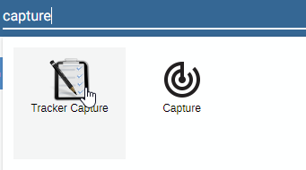

Using the organisation unit hierarchy on the left, select Food Region >
Staple District > Yam Health Centre.

Select the “Immunization” program from the options that appear in the
dropdown box.

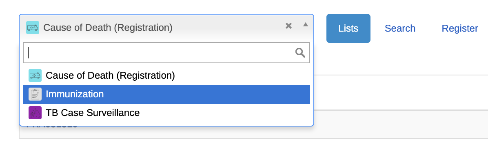

When the program is selected a list of persons who are already enrolled
in the immunization program appear. Each row in the table corresponds to
a single record within the "Immunization" program.

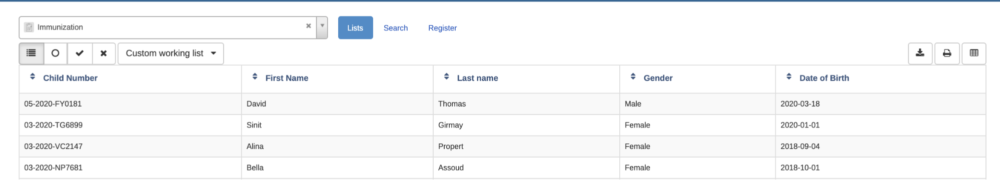

### Demonstration - Register a Child into the Immunization Program

#### Video - Tracker Programs & Tracker Capture Demonstration Part 3 of 6

#### Part 3 Activity: Register a Person

Now let’s register a child into the "Immunization" program.

Click on the Register button.

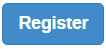

Fill in some of the main attributes (first name, last name…). Example
below.

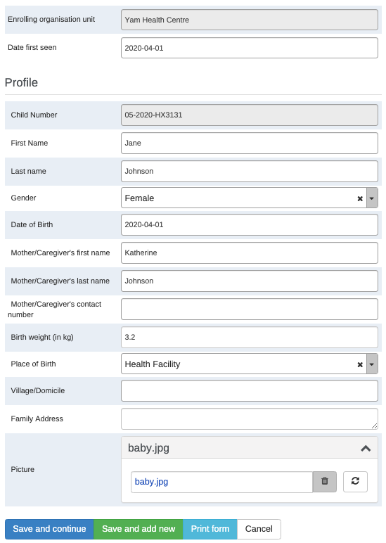

Next, click on Save and continue to register the child and view their
record.

You will arrive on the dashboard page, which contains the child’s
record.

### Demonstration - Enter Immunization Data & Discover the Tracker Dashboard

#### Video - Tracker Programs & Tracker Capture Demonstration Part 4 of 6

#### Part 4 Activity: Enter Immunization Data & Discover the Tracker Dashboard

Now let’s enter some immunization data for the child.

Within the Dashboard navigate to the Timeline Data Entry widget and
click on the blue + icon.

You will be prompted to enter the date that the services were provided.
The date is automatically populated with today’s date but you can adjust
it by clicking on the date then selecting a different one.

Select the same date as the date for ‘first seen’ then click on Save.

Next, we will see some of the variables associated with the
"Immunization" program appear.

Complete some of the requested details within this form. Notice that
when you tick the box next to an immunization in the “Immunization”
section, that it disappears from the “Stockouts” section. Program rules
all this to be configured.

Then click Complete.

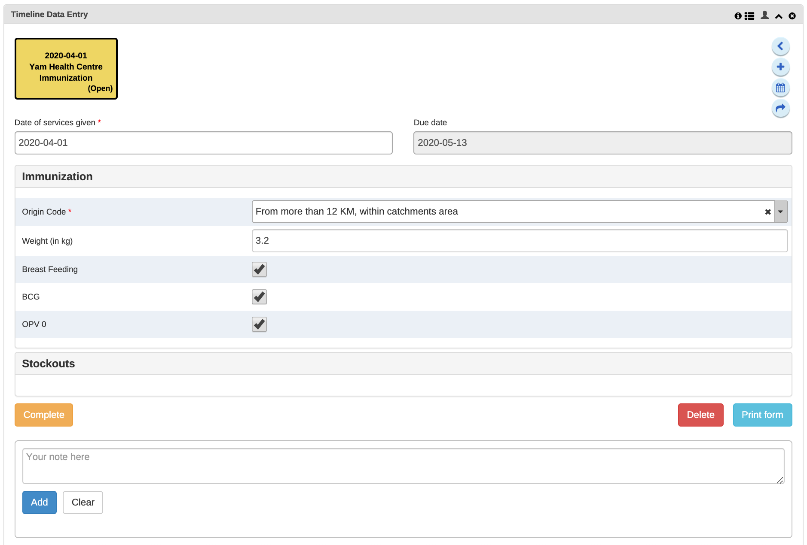

You will be prompted to select one of a few options: Complete, Complete
and exit, and Cancel.

For this instance, click on Complete.

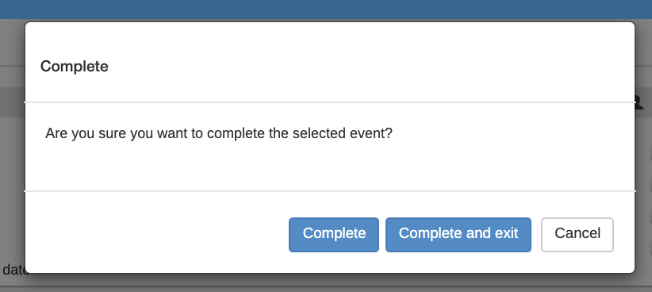

Next, the system will automatically prompt you to schedule the next
immunization appointment.

Enter a date that is 6 weeks from when the first immunization
appointment was provided and click Save.

You will find that you can now see a new program stage that appears in
green.

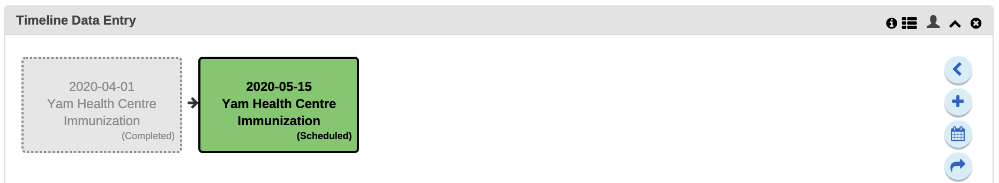

Another way of accessing the scheduling option is by clicking on the
blue calendar icon within the Timeline Data Entry widget.

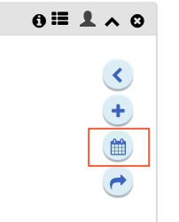

For a better understanding of the color coding used in the dashboard and
widgets, click on the Information button to view the details.

This will reveal a legend that displays what the colors of each events
means.

### Demonstration - Search Function & Dashboard Orientation

#### Video - Tracker Programs & Tracker Capture Demonstration Part 5 of 6

#### Part 5 Activity: Search Function & Dashboard Orientation

From the event dashboard page, using the Back button in the left corner
of the page, navigate to the front page where all of the children
registered in the “Immunization” program are listed for “Yam Health
Centre”.

### 

Let’s demonstrate
the search function.

Click the Search button at the top of the page.

### 

On the Search for person page enter some of the child’s details so that
you can find them, then click on the search button.

### 

Search results:

### 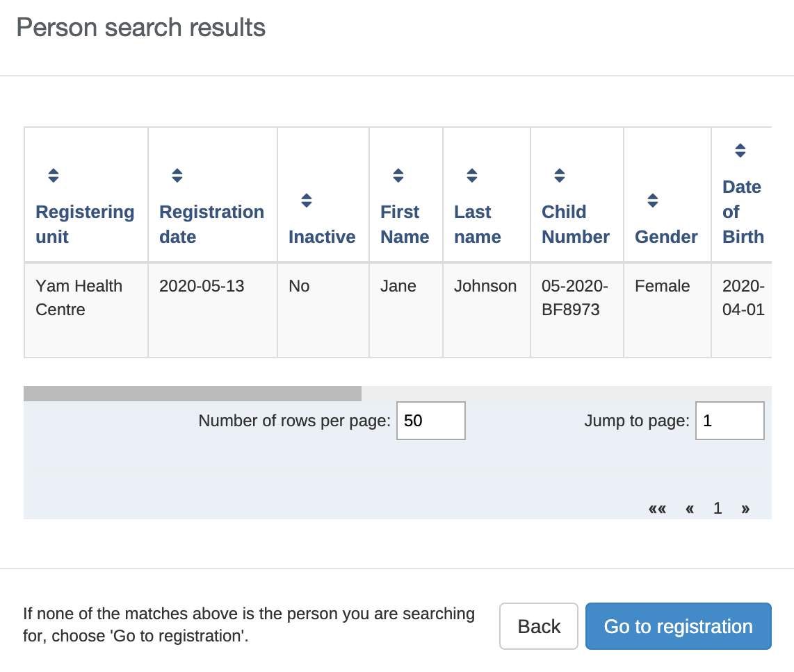

In the search results, click on the record that you created, and you
will be taken to the child’s dashboard.

Let’s take some time to get orientated to the test of the dashboard
layout and items.

  - Once again, the back button takes you back to the search and
    registration page

### 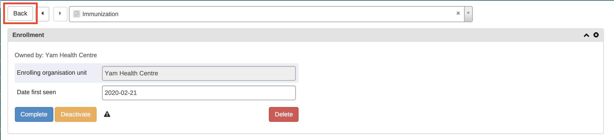

###  

  - The previous and next buttons allow you to access the previous or
    next child’s record

### 

###  

  - The top bar shows certain attributes of choice. This is customizable
    and optional to have in the Dashboard.

### 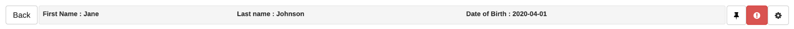

###  

  - The pin icon allows you to pin (or stick) the right side of the
    widgets so they don’t move. This is useful especially during data
    entry. If for example, there are many data elements, sticking the
    right side allows those widgets to be visible while scrolling the
    data entry column to the left.

### 

### 

###  

  - The red exclamation point button allows you to deactivate the child
    or completely delete his or her record from the program. Note that
    this is permission based, so not everyone will have access to
    perform this function.

### 

  - And finally the gear icon allows you to customize the items in the
    dashboard’s widgets and top bar.

### 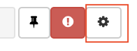

 Show/hide widgets - allows you to control which widgets you want to
display in the record’s dashboard.

###  

### 

  - There are nine widgets available to display. The widgets are
    collapsible, responsive and draggable - this helps to acquire
    optimal view area as per user needs. Widget rearrangements are saved
    automatically per user per program.

### 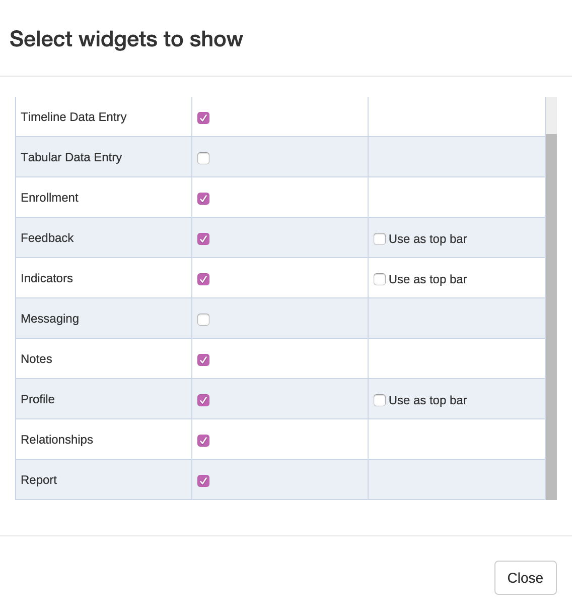

###  

  - The Top bar settings option allows you to modify the top bar options
    or turn it on and off.

### 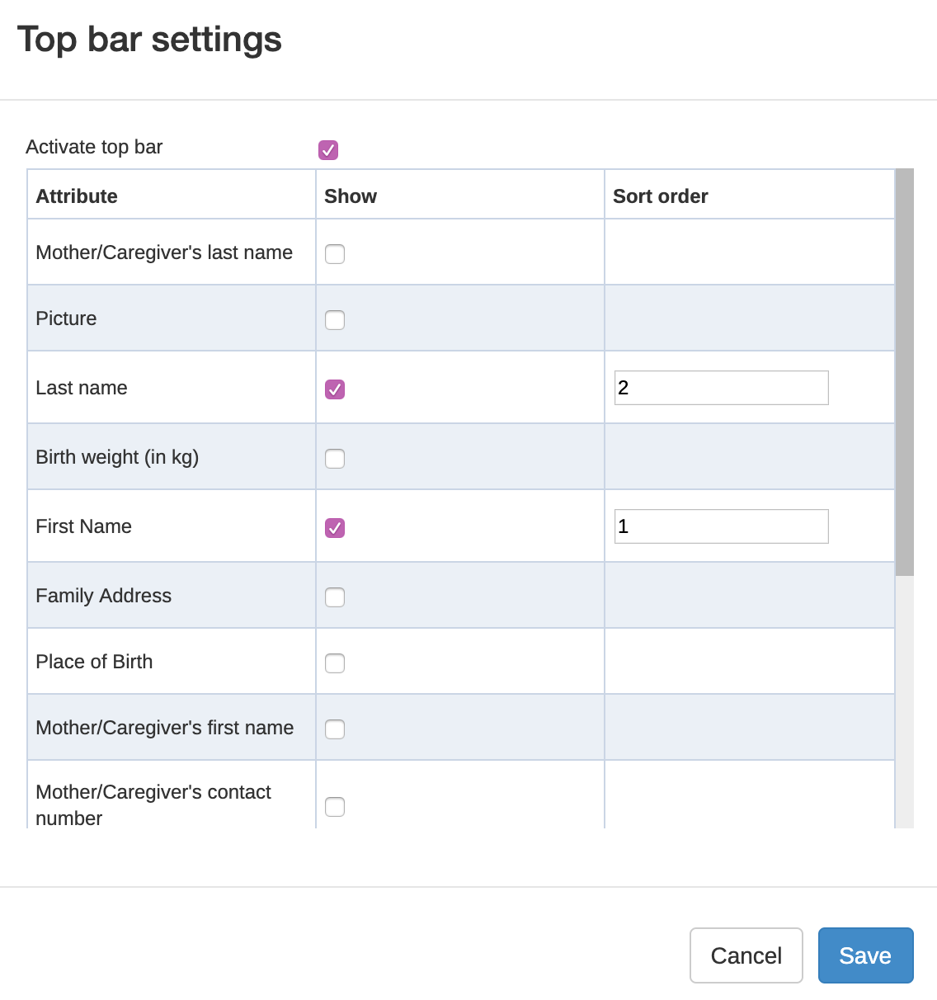

### 

### Demonstration - Widgets

#### Video - Tracker Programs & Tracker Capture Demonstration Part 6 of 6

#### Part 6 Activity: Widgets

Now let’s take a closer look at some of the widgets available and what
they are used for.

The Enrollment widget shows the programs the child is enrolled in and
the location of enrollment. It also allows you to manage the status of
the enrollment, mark the child for follow-up, and delete the child from
the program.

The Indicators widget can be used to show the calculated value of any of
the indicators for the selected program. In this example, the ‘Age’
indicator is automatically calculated and displayed.

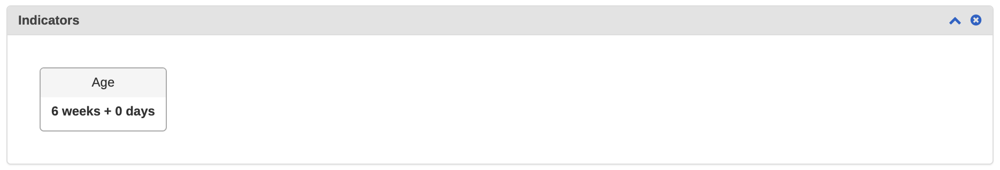

The Profile widget shows the attributes of the child that were entered
during registration. In this widget, you can also edit the enrollment
attributes.

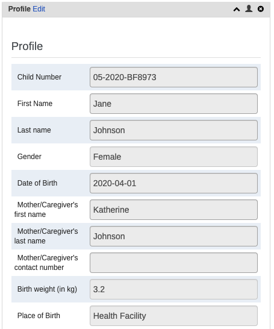

The Notes widget allows users to make notes on the child.

The Relationship widget allows you to relate the child with others that
are in the system.

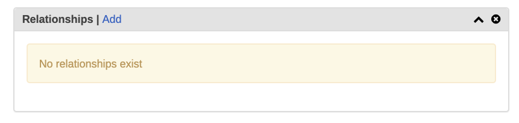

In this example, we could relate the particular child to another child
in the program, or even relate the child to a parent in another program.
For example, we could relate siblings or a mother and their child if
they are both registered within DHIS2 regardless of the program they are
receiving services for.

Scroll back down to the Timeline Data Entry, and select the scheduled
event you created earlier.

Select the date for this event; this date will be the same as the date
we scheduled for this service to occur.

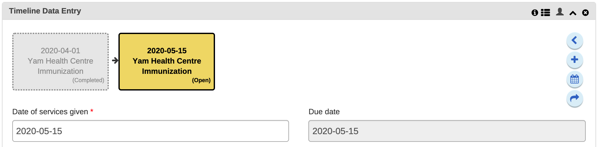

After you select the date, you can see the form opens up again allowing
you to enter related data.

You will notice that the fields that appear here are different from the
form for the first entry, and mirror the vaccinations that are scheduled
to be delivered at 6 weeks.

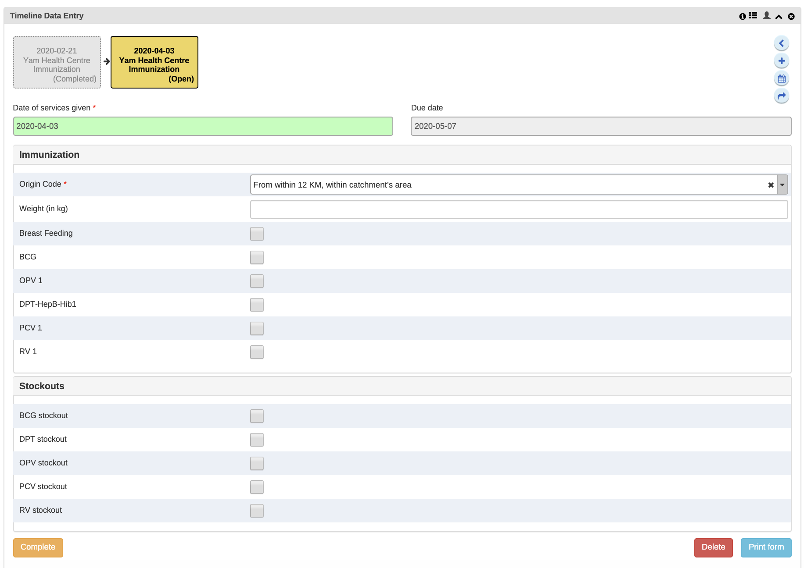

Fill in the details, making sure the child receives all of the scheduled
vaccinations. Then select Complete.

Lastly, select complete and exit when prompted.

### 

## 6.1 - Graded Quiz - Tracker Capture

### Graded Quiz - Tracker Data Capture

This is a graded quiz and it is worth 10% of your final grade.

You have 2 attempts to pass each question.

Select the "check" button to submit your answers.

If you want to save your current response without submitting it for
grading yet, select the "save" button. This allows you to come back
later and resume the attempt.

##### QUESTION 1 - SCREENSHOT

The above screenshot (Question 1 - Screenshot) shows the enrollment
page in tracker capture. Which of the following is a true statement
regarding the entry of these details?

(x) By entering these details, I am adding a unique object/entity to my
DHIS2 system.

( ) By entering these details, I am adding a common/non-unique
object/entity to my DHIS2 system. {{Have another look at the material
within the unit "Demonstration - Register a Tracked Entity Instance" if
not clear on this topic}}

( ) By entering these details, I am retrieving a record that meets the
details I have entered. {{Have another look at the material within the
unit "Demonstration - Register a Tracked Entity Instance" if not clear
on this topic}}

explanation

During the registration step of working within tracker; you are adding a
unique entity to your DHIS2 system. In the case of a person, as in the
example shown here, this means you are able to search for their person
and update their record when they interact with various services within
your system that you are tracking.

explanation

##### QUESTION 2 - SCREENSHOT

In the above screenshot (Question 2 - Screenshot) I am going to
search for an individual based on the details that I have entered. What
will be returned when I select the search button?

( ) I will be taken immediately to the record that meets my search
criteria {{Have another look at the material within the unit
"Demonstration - Search Function and Dashboard Orientation" if not clear
on this topic}}

(x) I will see a list of the records that meet my search criteria

( ) I will be taken back to the front page list of tracker capture and
any records that fit my criteria will be filtered out {{Have another
look at the material within the unit "Demonstration - Search Function
and Dashboard Orientation" if not clear on this topic}}

explanation

When entering general search details and performing a search, you will
always see a list of records that meet your criteria. Based on this
search method, you may have more than one record that meets the criteria
you have entered. You can than select the record you are looking for
from the list that is presented to you. If you were to search using a
Unique ID, then you would be taken directly to the record that meets
your criteria because there is only one record in your system that can
have the ID you have entered.

explanation

##### QUESTION 3 - SCREENSHOT

The screenshot above (Question 3 - Screenshot) shows the front-page
list of a tracker program (in this case, a COVID-19 case-base
surveillance tracker program). The filter selected is “Any enrollment
status.” The records that are shown in this list are:

( ) Individuals who are registered within DHIS2 but may not necessarily
be enrolled into the COVID-19 case based surveillance program. {{Have
another look at the material within the unit "Demonstration - Open
Immunization Program and Browse Registered TEI" if not clear on this
topic}}

( ) Individuals who have received all of the services within the
COVID-19 case based surveillance program and are marked as complete.

(x) Individuals who are enrolled within the COVID-19 case based
surveillance program. They could have received all of the services
within this program, still require additional services, or have
cancelled their enrollment. {{Have another look at the material within
the unit "Demonstration - Open Immunization Program and Browse
Registered TEI" if not clear on this topic}}

explanation

The front page list that you can view in tracker capture is specific to
the program you have selected. Entities that are not enrolled in the
program you have selected (people in this case) will not appear in the
front page list.

When I have the filter of “Any enrollment status” selected, it will show
all of the entities belonging to my program, regardless of their status
within the program.

explanation

 When working with a person, we are able to schedule services within
a tracker program in order to understand when that person should be
receiving their next service.

 (TRUE), FALSE

 explanation

We are able to schedule additional services when working with programs.
We can even filter out lists to determine who has upcoming services
scheduled and what the date of the scheduled service should be.

 explanation

The tracker dashboard is made up of several different widgets that
offer different information about the record you are accessing.

 (TRUE), FALSE

 explanation

Answer: There is a variety of information that can be presented within a
tracker dashboard. This includes the main component that you have
interacted with, data entry, as well as registration details,
indicators, etc. tied to the entity you are reviewing.

 explanation

## 6.2 - Digital Data Packages & Cause of Death

### Presentation - Overview of DHIS2 Digital Data Packages

#### INTRODUCTION - SUBSECTION 6.2 - DIGITAL DATA PACKAGES

In Subsection 6.2 we review the concept of DHIS2 digital data packages.
These packages act as a starting point for DHIS2 configurations based on
a number of best practices.

Subsection 6.2 has 4 units for you to review. We recommend that you
review these units in order.

1.  Presentation - Overview of DHIS2 Digital Data Packages
2.  Presentation - Review of DHIS2 Digital Data Package: Cause of Death
3.  Demonstration - DHIS2 Digital Data Package: Cause of Death
4.  Demonstration - Cause of Death Customized for a Country System

##### Ungraded Activities

You will find an activity located in unit 3 (Demonstration - DHIS2
Digital Data Package: Cause of Death).

##### Graded Assignment

There is no graded assignment for this subsection.

#### Video - Digital Data Packages & Cause of Death Part 1 of 4

#### EXTERNAL RESOURCES

You can learn more about the DHIS2 digital data packages here:

  - WHO website on digital data packages
  - DHIS2 website on digital data packages

### Presentation - Review of DHIS2 Digital Data Package: Cause of Death

#### Video - Digital Data Packages & Cause of Death Part 2 of 4

### Demonstration - DHIS2 Digital Data Package: Cause of Death

#### Video - Digital Data Packages & Cause of Death Part 3 of 4

#### Part 3 Activity: Exploring The Cause of Death Tracker Package

Navigate to the Tracker Capture app by typing in “Tracker” into the
search bar feature.

 

Using the Org Unit hierarchy on the left, select a health centre.

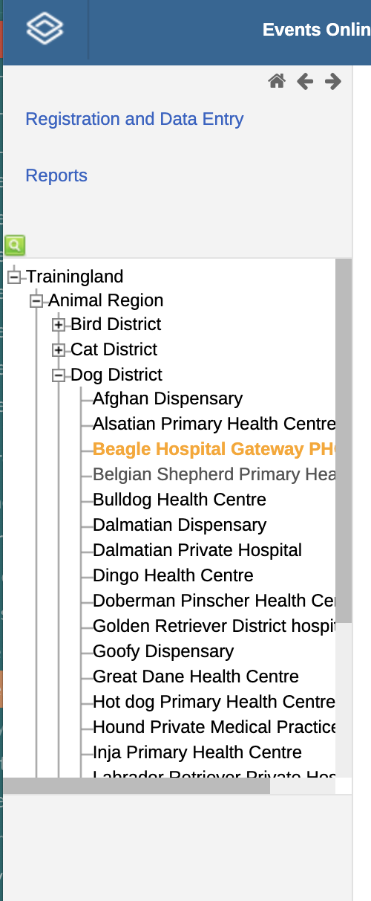

 

The Cause of Death program will show up as an option.

Click on Register.

The Enrollment form will show up.

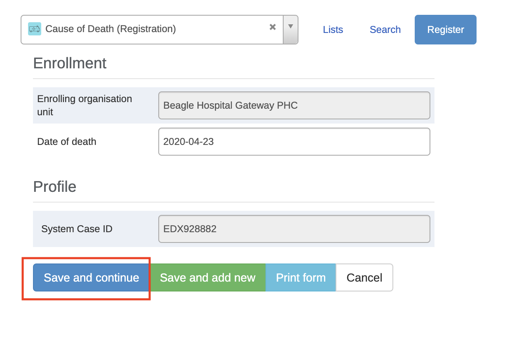

Click on Save and continue.

You should arrive on the form page. Scroll down to the section titled
Timeline Data Entry. The content within this section has been modeled
after the paper-based medical certificate of cause of death. [Paper
Cause of Death
form](https://www.google.com/url?q=https://studio.academy.dhis2.org/asset-v1:HISP%2BD2EVENTS100%2BQ2_2020%2Btype@asset%2Bblock@6.2.2_CoD_Filled.pdf&sa=D&ust=1605291870571000&usg=AOvVaw35AiQw9hBgUOKfjirHmGRK).

 

If you scroll down to the bottom of the DHIS2 form, you will find the
Results table which becomes populated as you fill in the certificate.

Each entry is registered using the ID number, which can be found in the
Profile box. You would have also seen this ID number when you registered
the death.

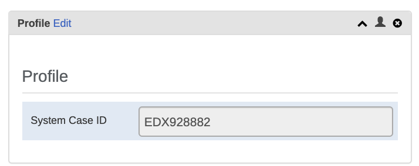

 

Scroll back down to the Timeline Data Entry box.

Using the paper form, we will complete the data entry in DHIS2 to
identify “Tuberculosis” as the underlying cause of death.

Starting with the demographic information, refer to the paper form to
fill in the date of birth in the electronic DHIS2 form.

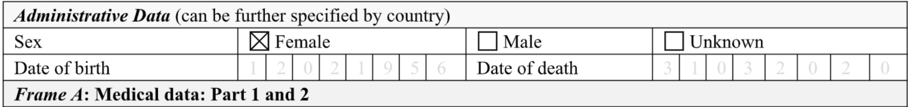

Paper form

 

DHIS2 form

 

 

Next, let’s move to the chain of events resulting in death. Make sure to
also fill in the corresponding time from onset to death.

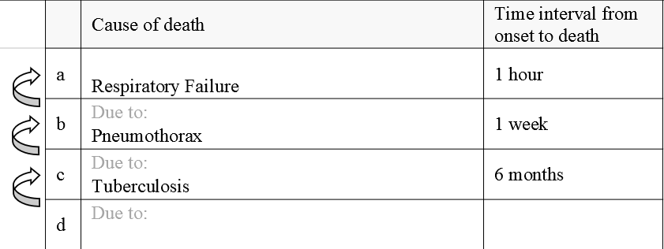

Paper form

 

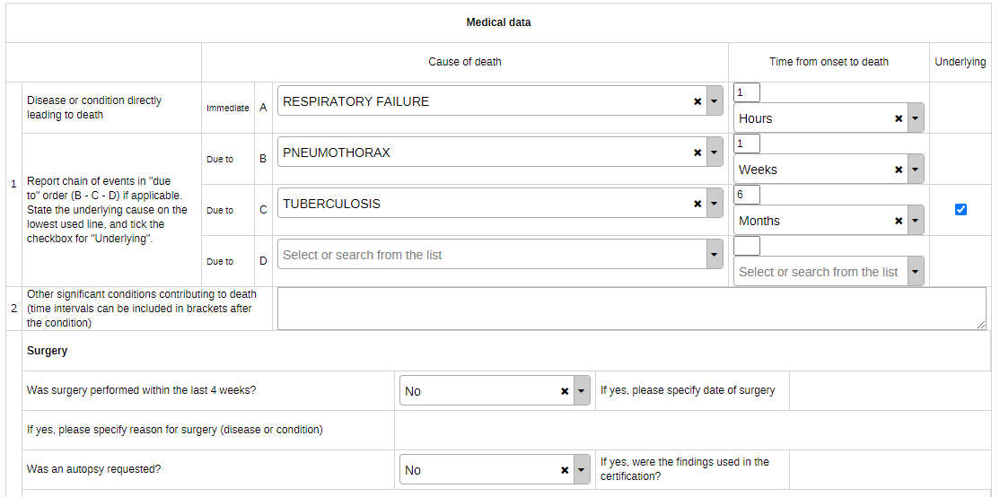

DHIS2 form

 

Make sure you have selected the underlying cause of death as well. Do
this by ticking the box in the “underlying” column where in row C of
your chain of events leading to death, as you can see in the screenshot
above.

Next, scroll down to the Results sections to view the results. The
underlying cause of death should show up along with the ICD-10 SMoL and
ICD-10 full codes for the underlying cause.

When comparing the paper form to the electronic DHIS2 form, you may find
that multiple fields that are not relevant have had their responses
section removed for data entry in order to reduce any potential data
entry errors.

### Takeaways from Module 6

#### Recap, reflect and share

What new ideas have you come up with in this module? What doubts do you
have?

Even though most of the contents of the course are aimed for you to get
familiar with the DHIS2 features, the end goal is for you to relate what
you learn to your daily work and find new ways to solve data challenges
you face.

Take advantage of this space to recap, reflect, and share your thoughts
with your peers and learn from them.

## Feedback - Tracker Use Cases

# Module 7: Next Steps & Course Closure

## 7.0 - Introduction to Module 7

### Introduction to Module 7

#### WELCOME TO MODULE 7!

Congratulations on reaching the final module! In this module, we focus
on providing you with some next steps to continue learning and wrap up
the course.

In module 7, there are 4 subsections that you will be reviewing:

  - 7.1 - DHIS2 Academies Overview. This subsection is divided into 3
    units.
  - 7.2 - Following Events and Tracker Development. This subsection is
    divided into 4 units.
  - 7.3 - Seeking Additional Support. This subsection is divided into 2
    units
  - 7.4 - Course Closure. There is 1 unit in this subsection.

#### OBJECTIVES

By the end of this module, you should be able to:

  - Compare each of the Level 1 DHIS2 academies
  - Describe the Level 2 Android and Tracker Implementation academies
  - Examine methods that can be used to follow event and tracker
    development
  - Use moodle, DHIS2 demo systems and the community of practice to
    support ongoing learning

#### ACTIVITIES & ASSIGNMENTS

##### Activities

There are optional activities in Subsection 7.2, units 2 and 4 and
Subsection 7.3 units 1 and 2.  There is therefore a total of 4 optional
activities that you can perform within this module.

##### Assignments

There are no graded assignments in Module 7! Congratulations!

##### Training Environment

You will not be using one of the DHIS2 training systems in this module.
Links to other resources where you can review material are provided.

#### TIME COMMITMENT

This module should take you approximately 1.5 hours in total to review
all of the content and perform the ungraded activities as identified in
the course outline.

## 7.1 - DHIS2 Academies Overview

### Presentation - Core DHIS2 Academy Principles & DHIS2 Academy Training Model

#### Introduction - Subsection 7.1 - DHIS2 Academies Overview

In Subsection 7.1 we will discuss the available DHIS2 academies for
further learning.

Subsection 7.1 has 3 units for you to review. We recommend that you
review these units in order.

1.  Presentation - Core DHIS2 Academy Principles & DHIS2 Academy
    Training Model
2.  Presentation - Level 1 Academies
3.  Presentation - Level 2 Academies

##### Ungraded Activities

There are no activities within this subsection.

##### Graded Assignment

There are no assignments within this subsection.

#### Video - DHIS2 Academies Overview Part 1 of 3

### Presentation - Level 1 Academies

#### Video - DHIS2 Academies Overview Part 2 of 3

### Presentation - Level 2 Academies

#### Video - DHIS2 Academies Overview Part 3 of 3

## 7.2 - Following Event & Tracker Development

### Presentation - Development Roadmap & Jira

#### INTRODUCTION : SUBSECTION 7.2 - FOLLOWING EVENT & TRACKER DEVELOPMENT

In Subsection 7.2 we discuss how you can keep up with the development of
the latest features related to events and tracker in DHIS2.

Subsection 7.2 has 3 units for you to review. We recommend that you
review these units in order.

1.  Presentation - Development Roadmap & Jira
2.  Demonstration - DHIS2 Jira
3.  Presentation - DHIS2 Release Cycle & Social Media
4.  Demonstration - DHIS2 Community of Practice

#### Ungraded Activities

There are optional activities in unit 1 and unit 2 of this subsection.
Scroll below the video demonstration in each unit in order to view the
activity.

#### Graded Assignment

There are no graded assignments in this subsection.

#### Video - Following Event & Tracker Development Part 1 of 4

### Demonstration - DHIS2 Jira

#### Part 2 Activity: Signing up for Jira

 

To sign up for an account, select the Sign up text underneath the login
details.

Enter in the account details and then select Sign up.

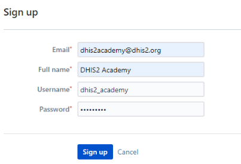

After you sign up, a confirmation will appear. Select Click here to log
in to continue.

 

Enter your log in details and select Log In to continue.

 Select your language then click on Continue.

 

If you would like to, you can add an avatar (an image of yourself), then
click on Next.

 

Next, select  Explore the current projects.

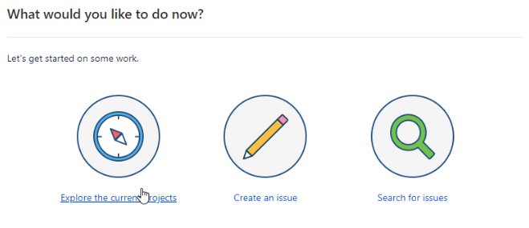

The two projects most related to this course are:

Android app for DHIS2

DHIS 2 Software

Please feel free to explore other projects.

The easiest way to explore these projects is by adding dashboards.

To do so, first select Dashboards > Manage Dashboards.

Select Popular from the left side menu. To bookmark a dashboard, click
on the star icon next to the dashboard’s name. Recommended dashboards
are "Tracker" and "DHIS2 Android App."

After bookmarking the dashboard, it will appear under the list of your
dashboards when you select  Dashboards from the top menu

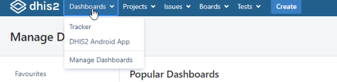

Navigate to the "Tracker" dashboard. You will see statistics on any
issues, as well as a list of the issues themselves.

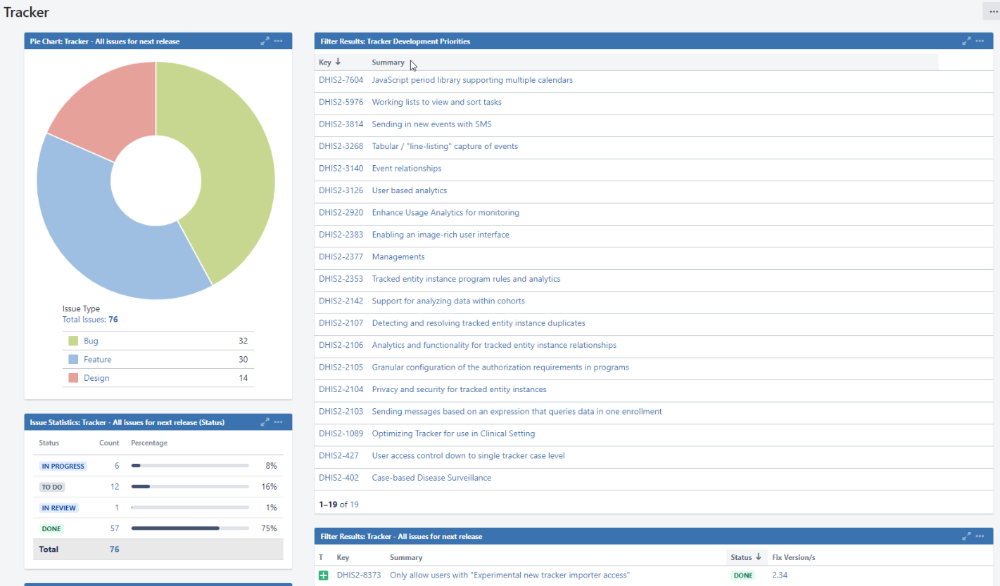

Selecting an issue will allow you to review it in more detail.

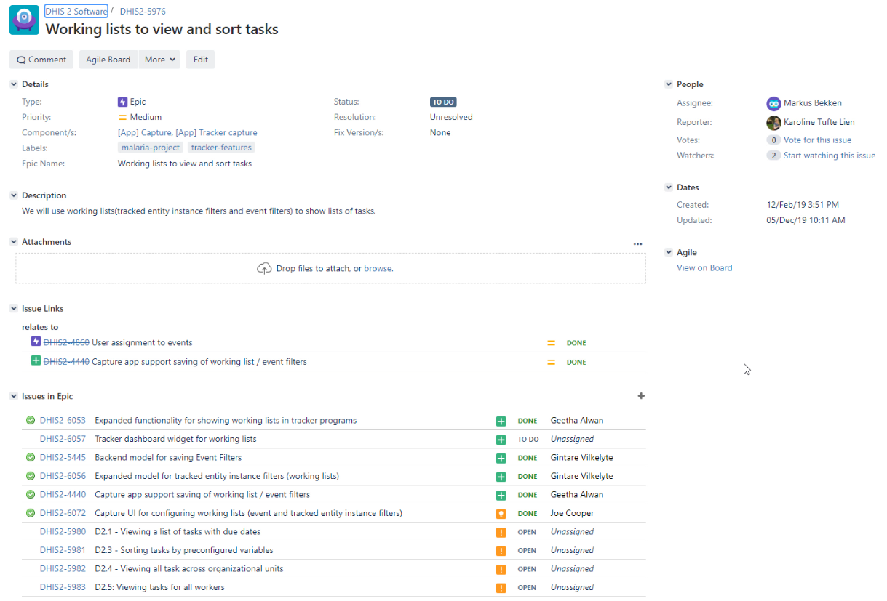

You can use labels to help you find related issues.

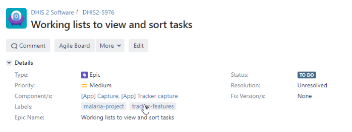

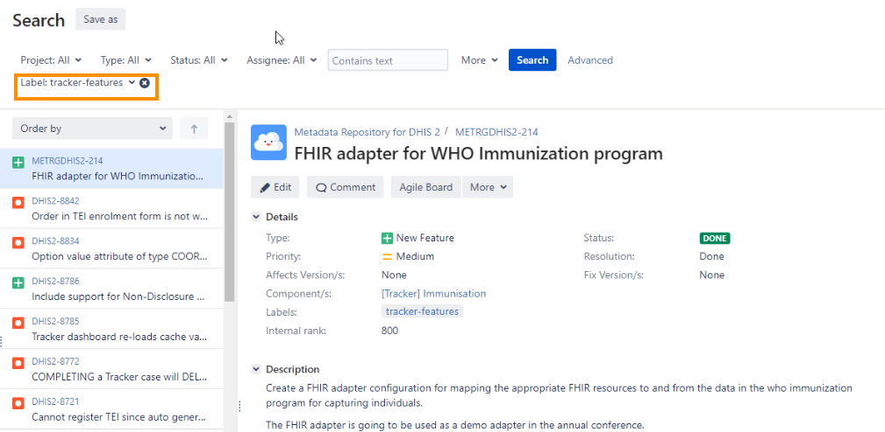

You can also create your own issues using the Create button at the top
on the header bar.

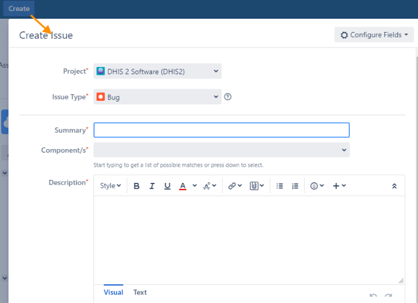

### Presentation - DHIS2 Release Cycle & Social Media

#### Video - Following Event & Tracker Development Part 3 of 4

### Demonstration - DHIS2 Community of Practice

#### Video - Following Event & Tracker Development Part 4 of 4

#### Activity: Signing Up for The Community of Practice

Access the community of practice here DHIS2 Community . and sign up for
an account.

Once you have signed up, you can access the community of practice thread
for this course here

To create a new account, select Sign Up.

7.2.4.1<em>dhis2</em>community

After this, enter in your account details. You will need to enter
details for all mandatory fields, then select Create New Account. An
example is shown below.

7.2.4.2<em>Create</em>new_account

After selecting Create New Account you will see an activation
notification.

Go to your email and find the activation email. Click on the link within
the email.

7.2.4.3<em>Resend</em>activation_email

 7.2.4.4<em>Confirm</em>new_account

 

Using this link, you can activate your account.

7.2.4.5<em>Confirm</em>new_account

 

After activating the account, you will receive the final confirmation.

7.2.4.6_Welcome

 

Consider going through the steps on the home page to get started with
using the community of practice, or simply go to one of the sections to
review posts, or make your own!

7.2.4.7<em>DHIS2</em>community

 

## 7.3 - Seeking Additional Support

## 7.4 - Course Closure

## Feedback - Wrap Up & Summary

## End of Course Feedback: DHIS2 Events Fundamentals

[a](#cmnt_ref1)Need to upload the outline

[b](#cmnt_ref2)I presume they will receive this email in french so
I´m going to retype the email underneath so we can get it translated
