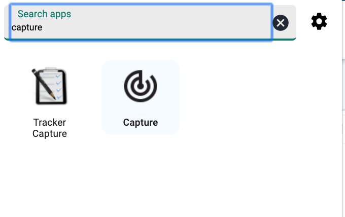
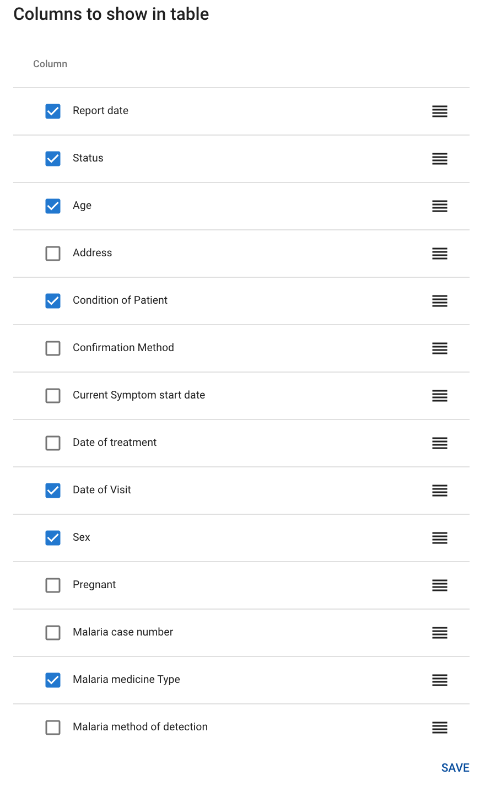
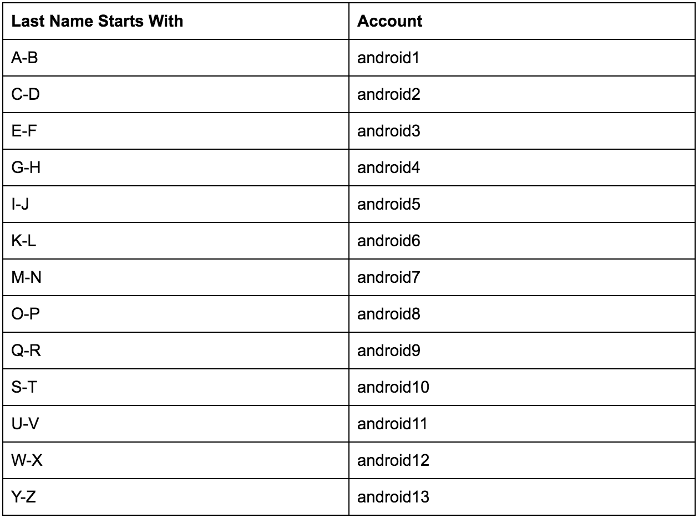
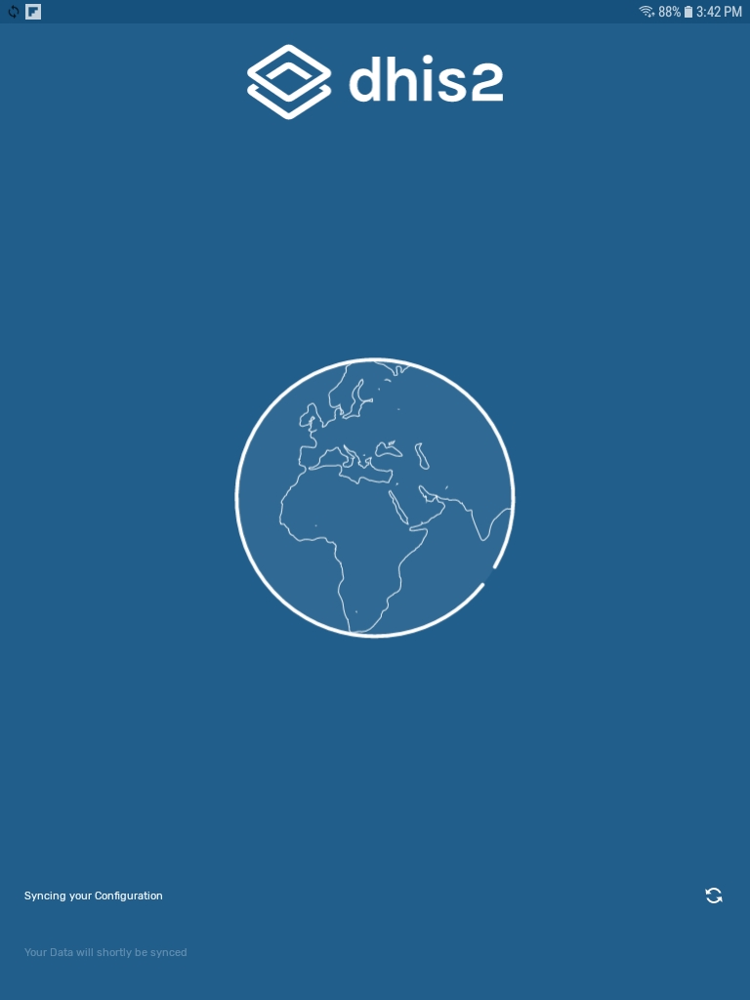

# Module 3: Event Data Capture

## 3.0 - Create your DHIS2 account on CAPTURE & Introduction to Module 3

### Introduction to Module 3

#### WELCOME TO MODULE 3!

This module focuses on showing you how you can enter event data into
DHIS2 using both a desktop web interface as well as through the use of
an Android device.

In module 3, there are 2 subsections that you will be reviewing:

  - 3.1 - Event Capture for Web. This subsection is divided into 3
    units.
  - 3.2 - Event Capture for Android. This subsection is divided into 4
    units.

#### OBJECTIVES

By the end of this module, you should be able to:

  - Describe how the capture app is used to collect event data
  - Use the capture app in order to enter data into DHIS2
  - Describe how the Android app is used to collect event data
  - Use the Android app in order to enter data into DHIS2

#### ACTIVITIES & ASSIGNMENTS

##### Activities

You will be performing ungraded activities for each unit within both 3.1
- Event Capture for Web as well as 3.2 - Event Capture for Android.
There is therefore a total of 7 activities that you will perform within
this module.

##### Assignments

You will have 2 graded assignments in the form of quizzes, one for each
subsection. Each graded quiz will contribute to 10% of your overall
grade. This module therefore contributes to 20% of your grade overall.

##### Training Environment

You will be using the CAPTURE training environment to perform your
activities and assignments. If you have not done so, please sign up for
this training environment by following the instructions in the unit
Account Creation - Capture

#### TIME COMMITMENT

This module should take you approximately 3 hours in total to review all
of the content, perform the ungraded activities and finish the graded
assignments as identified in the course outline.

### Account Creation - CAPTURE

#### Instructions - Account Creation on Capture

Printable version

In order to perform the exercises and assignments within Module 3, you
will be accessing the CAPTURE DHIS2 system. The CAPTURE DHIS2 system has
been set up with data capture in mind. The account you create will have
limited access to the apps within DHIS2, only including the apps
referenced in the screenshot below.

Please create an account for CAPTURE by following the available
instructions.

Click the "Request account" button below to request an account on the
DHIS2 Capture system.

You will receive an invitation by email with instructions on how to
complete the registration in DHIS2.

Note: the email address you use with OpenEDX will be sent to the DHIS2
database to create an account.

Give it a couple of seconds to think; DO NOT keep clicking the “Request
account” button several times in a row! It will send your email details
that you used when you registered in OpenEdX to the DHIS2 capture system
to begin the registration process. After 5-10 seconds you should receive
the following notification in your browser window.

Click on OK to close this notification.

Login to to your e-mail. You should receive an e-mail subject that looks
like the following:

We can see in the email subject that the DHIS2 system that has been
identified is the CAPTURE system that you should be signing up for.

Note that this e-mail may be in your junk folder. If you do not see it
in one of your primary inboxes, please check your junk folder in case it
was filtered out.

The e-mail itself should look like this

DHIS2 Events - Capture Invitation to create user account at
academy.events.dhis2.org/capture

DHIS2 Events - Capture message No reply

This is an invitation to create a DHIS2 Events - Capture user account.

Please follow the link bellow to accept the invitation and create your
account.

You must respond to this invitation within 4 days. If you take no
action, the invitation will expire at that time.

In order to continue, either click on the highlighted link or copy and
paste it into a new tab in your browser. This link will take you to the
following page:

Your email-details have already been filled in from OpenEdX. You will
need to fill in the remaining fields however.

Take note of the restrictions on the password. It must:

  - Be at least 8 characters long
  - Include an uppercase letter
  - Include 1 number/digit
  - Include a special character

After filling in all the fields select “Create” to proceed

This should log you in to the DHIS2 Capture system where you can view
the dashboard.

From here, please follow instructions for any activities or assignments
that are referring you to the DHIS2 capture system.

## 3.1 - Event Capture for Web

### Demonstration - Overview of Capture App

#### Introduction - Subsection 3.1

In Subsection 3.1 we review how to enter event data into DHIS2 using the
capture app on the web.

Subsection 3.1 has 3 units for you to review. We recommend that you
review these units in order.

1.  Demonstration - Overview of Capture App
2.  Demonstration - Skip Logic, Indicators & Validation Rules
3.  Demonstration - Form View & Row View

##### Ungraded Activities

There is an activity associated with each unit in this subsection.
Scroll below the video demonstration in each unit in order to view the
activity.

##### Graded Assignment

After you have completed reviewing all the material within this
subsection, please attempt the graded quiz for this subsection. This
quiz will contribute to 10% of your overall grade.

#### Video - Event Capture for Web Version Demonstration Part 1 of 3

#### Activity Links

#### Part 1 Activity: Overview of Capture App

DHIS2 Capture  DHIS2 Documentation   Printable version

This activity will be completed in DHIS2 Capture. Please use the account
details you have created for DHIS2 Capture  in order to log in.

Activity Instructions

In the **Search apps** field, search for the **Capture app**. Click on the
target symbol.

To choose a location, click on the arrow to expand the Organisation Unit
(OU) hierarchy in the desired branch.

  - Select the “Yam Health Centre,” by expanding **Trainingland > Food
    Region > Staple District**

Only programs relevant to the selected OU and user will show up in the
selection list.

Select the “Malaria Case Management” program.

Register a new event by clicking on the **New Event** button in the top
right corner.

First click on the **gear symbol** on the right; this allows users to decide
which columns to show or hide in the table of events displayed.

Second, click on the **horizontal ellipses** next to the gear symbol then
select “Download data…”

This allows for the download of a list of events in XML, JSON, or CSV
format.

 

Third, click any of the column headers. This sorts the information that
appears in the table by column. The sorting icon, which is a little
green arrow, indicates the current sorting column.

Fourth, it is also possible to filter the information that appears in
the table by clicking any of the **headers** at the top of the table. When
clicking them an input field appears to select, or type, a filtering
criteria. An example of the input field options for “Condition of
Patient” is shown below.

During filtering it is possible to define start and end dates for date
type data elements as well as lower and upper limits for number types.

Lastly, the interface’s paging options can be changed; it is possible to
edit the number of event rows that appear per page by using the paging
section at the bottom of the list and editing the **Rows per page** drop
down. You can also move between the pages of events using the arrows at
the bottom of the table.

### Demonstration - Skip Logic, Indicators & Validation Rules

#### Video - Event Capture for Web Version Demonstration Part 2 of 3

#### Part 2 Activity: Skip Logic, Indicators & Validation Rules

  - De-select the “Malaria case management” Program
  - Now select the “SARA RCH” program
  - Click on + **New Event** in the top right corner

Let’s review the form. First, as is required, select a report date.

Fill out the remainder of the form.

Let’s demonstrate how skip-logic functions as a result of program rules.

  - Switch between the selections of “Yes” and “No” for the following
    variables in the form:

<!-- end list -->

  - “Does this facility offer family planning services?”
  - “Received any family planning training in the last two years?”
  - “Received any training in adolescent sexual and reproductive health
    in the last two years?”
  - “Does this facility stock contraceptive commodities at this service
    site?”
  - “Does this facility offer antenatal care (ANC) services?”
  - “Received any ANC training in the last two years?”
  - “Received any training in IPTp in the last two years?”

If we click “Yes” when responding to the question “Does this facility
offer family planning services,” six sections of questions appear. If we
click “No”, to this question, nothing happens to the form. These fields
will not appear due to the “skip logic” incorporated into the form.

Let’s review the program indicators and how they can be calculated
within the Event Data Entry form.

  - In the form on the right is a section for program indicators
  - “On-the-fly” indicator expression evaluation is supported; if a
    program has indicators defined for it, the system will calculate the
    indicator and display the result the moment all values related to
    the indicator expression have been entered
  - All numerators and denominators are entered into this form

Let’s now take a look at program validation rules:

  - These are used to validate the data entered in each event
    registration form
  - Change the denominator value of the data element “How many staff are
    in this facility” to be < (less than) the number of those who
    “Received any family planning training in the last two years”

  - A validation warning will appear directly next to the data element
    where the violation is detected

  - Now let’s change the denominator value back to the original value so
    the validation warning no longer appears

## 3.1 - Graded Quiz - Event Capture for Web

#### Graded quiz - Event capture for web

This is a **graded quiz** and it is worth **10%** of your final grade.

You have **2 attempts** to pass each question.

Select the "**check**" button to submit your answers.

If you want to save your current response without submitting it for
grading yet, select the "save" button. This allows you to come back
later and resume the attempt.

#### Question 1 - Screenshot

The above screenshot (Question 1 - Screenshot) shows the default
view when I first navigate to the capture app. What steps do I take when
I want to enter new events within the capture app?

( ) I click on the “New” button in the top right corner. I can then
select the event program, organization unit and date associated with the
event. {{This is the incorrect sequence -- try again!}}

( ) I select the program I want to work with, click on the “New” button
in the top right corner, select the organization unit I want to add a
new event to followed by the date associated with the event {{This is
the incorrect sequence -- try again!}}

(x) I select the organisation unit I want to add a new event to, select
the event program I want to add a new event to than select the “New”
button followed by the date associated with the event

explanation

Work from left to right when adding new data for an event within the
capture app. DHIS2 will prompt you when you select an item in the
sequence out of order.

explanation

#### Question 2 - Screenshot

Review the screenshot above (Question 2 - Screenshot) taken from the
capture app when reviewing an event program. How can I filter the
results shown in the table using the field “Condition of Patient” to
show only cases that meet the criteria of Condition of Patient = Severe.
Note that the condition of patient data element uses a pre-populated
drop down list in order to record a response.

(x) Click on the button above the table labelled “Condition of patient”
with and Select “Severe.” Note this button has a small down arrow beside
its name. {{The grey buttons with dropdown arrows next to their name
above the table allow you to filter criteria shown within the table
itself. You can add additional filters within the event program you are
reviewing at any time if they are not shown above the table as well; the
subsequently use those to filter the table further.}}

( ) Click on the column heading “Condition of patient” within the table
and select “Severe” {{Column headings allow you to sort, but they do not
perform filtering of the table}}

( ) Use a filter function that allows me to type the criteria of
Condition of Patient = Severe in order to filter the table {{In this
case, you are working with a pre-populated response of options. You will
not need to type anything when using these types of lists.}}

explanation

The grey buttons with dropdown arrows next to their name above the table
allow you to filter criteria shown within the table itself. You can add
additional filters within the event program you are reviewing at any
time if they are not shown above the table as well; the subsequently use
those to filter the table further.

explanation

#### Question 3 - Screenshot

Within the capture app, I am able to change to “row view” by
selecting the button as shown in the above image (Question 3 -
Screenshot). How does the “row view” differ from the default view shown
in the capture app?

( ) The row view will take me back to the front page table list so I can
view the the events associated with the event program and organization
unit that have been selected in a tabular format. {{To take you back to
the front page tablelist you can use the back button within the DHIS2
application or your browser}}

(x) The row view will take the current event I am entering data for and
display the data elements within the selected program in a tabular
format. I am then able to enter my data in tabular format rather than a
vertical format.

( ) The row view will show me a table view produced via the event
reports application that is a summary of all of the events within the
organization unit and program I have selection {{You can view event
reports on the dashboard or via the event reports application but not in
the capture app.}}

explanation

The row view will alter the data entry interface so your data elements
are displayed horizontally rather then vertically.

explanation

#### Question 4

I am able to review indicators that have been calculated
“on-the-fly” (ie. directly in the event program as I enter data)
within the capture app on the web when entering data for an event
program

(TRUE), FALSE

explanation

True. This functionality gives flexibility to use individual data to
provide immediate feedback to a user for an individual event directly
within the capture app.

explanation

#### Question 5

I am unable to validate my data as it is being entered within an
event program.

TRUE, (FALSE)

explanation

We are able to validate our data directly within event capture as we are
entering data. Various rules can be created in order to perform this
validation to ensure data is being entered correctly.

explanation

## 3.2 - Event Capture for Android

### Demonstration - Installation & Logging In

#### Introduction - Subsection 3.2

In Subsection 3.2 we review how to enter event data into DHIS2 using the
capture app on an Android device.

Subsection 3.2 has 4 units for you to review. We recommend that you
review these units in order.

1.  Demonstration - Installation & Logging In
2.  Demonstration - Register & Sync an Event
3.  Demonstration - Settings Syncing Data to the Online Server
4.  Demonstration - Offline Event Capture

##### Ungraded Activities

There is an activity associated with each unit in this subsection.
Scroll below the video demonstration in each unit in order to view the
activity.

##### Graded Assignment

After you have completed reviewing all the material within this
subsection, please attempt the graded quiz for this subsection. This
quiz will contribute to 10% of your overall grade.

#### Video - Event Capture for Android Demonstration Part 1 of 4

#### Part 1 Activity: Installation & Logging In

  - Install the **Event Capture** app on your Android device
  - Open Google play on the device and search for “dhis2”

  - Note: You can access the DHIS2 app via the google play store
    directly via your computer if you would like by accessing the
    following link : [https://play.google.com/store/apps/details?id=com.dhis2](https://www.google.com/url?q=https://play.google.com/store/apps/details?id%3Dcom.dhis2&sa=D&ust=1605291870220000&usg=AOvVaw0H-KTeOoCAYtiVVokA0PXp)

  - Select the app called **DHIS2 Capture**

Next, select **Install** to install the app on the device.

##### Logging in

Next, let’s explore how to log in to the app.

Open the app and enter the following login details:

**Server URL**: https://academy.events.dhis2.org/capture

**Username**: Select a user name from the table below. **You will not be using the username that you created previously when interacting with theandroid app.**

**Password**: District1#

Note: For the username, several have been created for this exercise.
Please select an account according to your last name. This is being done
so that we can separate the data that is entered by the android devices
across the various organisation units within Trainingland Capture so it
is easier for each user to find their data when they log in through
their web browser later on.

The server will take some time to sync the configuration and load the
metadata.

The programs available will appear on the homepage of the app.
Underneath the program name you see the number of events that are
registered. In this case, we can see the **Malaria Case Registration program**.

  - **Note**: Depending on the user you select, you may not see any
    data/events registered in the program. This is because each user has
    been assigned different organization units.

Upon login, a screen that reads **Home** in the top left corner will appear.
Click on *Show help *for a walkthrough of the interface.

### Demonstration - Register & Sync an Event

#### Video - Event Capture for Android Demonstration Part 2 of 4

#### Part 2 Activity: Register & Sync an Event

##### Selecting a program

Now that we’ve logged in, let’s go over how to select a program for data
entry.

Select the program “Malaria case registration”. Note that both the color
and the icon that represent the program, and elements within it can be
defined by the user.

After selecting the program any events linked to the program and
organization units the user has access to will appear.

By using the **filter** button at the top right, you can filter the
registered events by organization unit or period, so that only events
that meet your filter criteria will appear in the
list.

##### Review the program and enter data

To register a new event, click on the + icon in the lower right corner.
Select the date the case visited the health center.

Select an organization unit at the lowest level. Note that the
organization units you see may be different then what is available in
the screenshot below. This is because each android account is assigned
different organization units.

Sections can be collapsed by clicking on the arrow next to the section
name. Note you can navigate to a different section by clicking on the
section name at the top, and selecting the section of interest.

The sections have a completion indicator next to the section name as
well. The 0/1 indicates there is 1 data element in this section in which
none have a response.

Fill in the details of this new malaria case event.

For each element, options are selected by tapping on the option of
interest on the screen. You can see that the option has been selected as
it will have a check mark next to it. The number indicators next to the
section headings are also updated as we enter data for each section to
indicate there are now values selected for the data elements within the
section.

Select “RDT” as the option in the “Diagnosis Method” section.

##### Program rules

Program rules allow for “skip logic” when entering data in event and
tracker programs. To view this feature:

  - With “RDT” selected as the “Diagnosis Method”, notice that the next
    section that appears is “Diagnosis Result RDT”
  - Navigate to the “Diagnosis Method” section and select “Microscope”
    as the method
  - Notice that the next section that appears is “Diagnosis Result
    Microscopy”

Fill in the data for the “Diagnosis Result Microscopy” section by
clicking on the section header. Select “Pf” as the result. When clicking
on this we can see the “Treatment PF” section appears. If we click into
the treatment section, we can see that the options within that are ACT
doses.

If we go back into the Diagnosis Result Microscopy section by clicking
on the section header, and select Pv as the result., the treatment
section now reads Treatment PV, and the options within it are different
doses of CQ and CQ + PQ.

Finish filling out the event data. Navigate to the “Village and Age”
section. Select the village as the same organization unit that you
registered the event in and tap Accept.

Tap on the “Age” element, and enter an age using the numeric keyboard.
Then tap Next on the keyboard.

Continue navigating through the sections and filling in data for the
event until each section is complete.

  - Select a sex
  - Select a diagnosis type
  - Select a treatment
  - And select a referral

When you have entered all of the data, click on the blue circular save
button in the bottom right corner of the screen.

Upon completing data entry, it will be possible to select whether or not
the event is complete. For this example, select Finish and complete.

The new event will then appear at the top of the list of events.

### Demonstration - Settings for Syncing Data to the Online Server

#### Video - Event Capture for Android Demonstration Part 3 of 4

#### Part 3 Activity: Settings for Syncing Data to the Online Server

##### Sync Status

If an event has not yet been synced with the online server, it will have
a Sync status button, which is the circular double arrow button, located
to the right of it in the program page. If the event has been synced
with the server, the Sync status button will not appear.

Clicking on the **sync status** button will reveal that the event has not yet synced to the server. This is a result of the settings and how
frequently the data are synced with DHIS2. Note that while it is not
sent to the server, the data are stored locally on the mobile device.

If you want to sync the event to the server, you can click on Send in
the bottom right corner after selecting the sync status.

The app will display a message that says the data have been sent to the
server. We can also see in the events list that the sync symbol is no
longer next to the event.

Sync

##### Sync settings

To access the app settings, click on the **Menu** button in the top left
corner, then select **Settings**. There are a number of different options, among them **Sync data, Sync configuration**, and **Sync parameter** settings.

To manually sync multiple events at one time:

  - Select **Sync data** in settings
  - Select **Sync data now**

##### Verify by logging in on the web

Verify that this event was sent by logging in through the web-browser
DHIS2 instance and opening up the **Capture** app. For the organisation unit **select the organization unit that you registered your event on when using the Android device**. This may be different then the facility shown in the screenshot below. and “Malaria Case Registration” as the program. The event should be in the list of events shown.

### Demonstration - Offline Event Capture

#### Video - Event Capture for Android Demonstration Part 4 of 4

#### Part 4 Activity: Offline Event Capture

To test the syncing of events while offline:

  - First, turn off the wifi on your Android device
  - Register and complete an event for the “Malaria Case Registration”
    program
  - Attempt to sync the event with the server

  - Now, turn the wifi back on and try to sync
  - Despite registering the event while offline, the event now syncs to
    the server

### Takeaways from Module 3

#### Recap, reflect and share

**What new ideas have you come up with in this module? What doubts do you have?**

Even though most of the contents of the course are aimed for you to get
familiar with the DHIS2 features, the end goal is for you to relate what
you learn to your daily work and find new ways to solve data challenges
you face.

Take advantage of this space to recap, reflect, and share your thoughts
with your peers and learn from them.

## 3.2 - Graded Quiz - Event Capture for Android

### Graded Quiz - Event Capture for Android

This is a **graded quiz** and it is worth **10%** of your final grade.

You have **2 attempts** to pass each question.

Select the "**check**" button to submit your answers.

If you want to save your current response without submitting it for
grading yet, select the "**save**" button. This allows you to come back
later and resume the attempt.

##### Question 1 - screenshot

The above screenshot (Question 1 - Screenshot) has highlighted the
server URL on the log in page using a box in red colour. When using this
URL field, I need to re-enter the server URL every time I log in to the
same server on the Android app.

TRUE, (FALSE)

explanation

If I am going to log in to a different server, I will need to re-enter
the URL. If I log in to the same URL on the same device, the URL will be
saved; I do not need to re-enter it.

explanation

Question 2 - Screenshot

The above screenshot (Question 2 - Screenshot) shows the default
view in the Android app after I have select an event program that I want
to work with. Which button do I select in order to create a new
event?

( ) The button outlined in the black box labelled as “1.” {{This allows
you to filter events}}

(x) The button outlined in the orange box labelled as “2.”

( ) The button outlined in the blue box labelled as “3.” {{This button
allows you to open an existing event}}

explanation

You select the plus sign within the Android app in order to add a new
event to the program you are working with.

explanation

##### Question 3 - Screenshot

In the screenshot above (Question 3 - Screenshot), one of the events
is outlined via a box in red colour. To the very right of the event,
there is an icon showing two grey circular arrows along with an !
(exclamation point) in the centre of the circular arrows in grey colour.
What does this icon represent?

( ) This means the data has been synchronized both on the device as well
as sent online. {{Please review the Demonstration - Settings for Syncing
Data to the Online Server if unsure about this icon}}

( ) This means the data has been synchronized online only {{Please
review the Demonstration - Settings for Syncing Data to the Online
Server if unsure about this icon}}

(x) This means the data has been synchronized to the Android device
only. It has not yet been sent online.

explanation

This icon represents that the event is not yet synchronized online; only
on the Android device. Events can be synchronized manually or via a
schedule that is set up to perform this automatically.

explanation

 Event programs can be created using large icons to represent
dropdown lists/option sets within the Android app.

(TRUE), FALSE

explanation

True. This is an option to allow for a more intuitive user interface
when the Android app is being used to collect data.

explanation

Program rules/skip logic does not work on the Android app. This is
a function that only works within the capture app when using the
web-based version of DHIS2.

TRUE, (FALSE)

explanation

False. Program rules/skip logic is fully supported within the Android
app. This allows us to implement necessary workflows to improve the data
entry process on both Web and Android when working with event programs.

explanation

## Feedback - Event Data Capture
