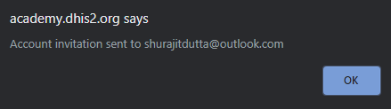
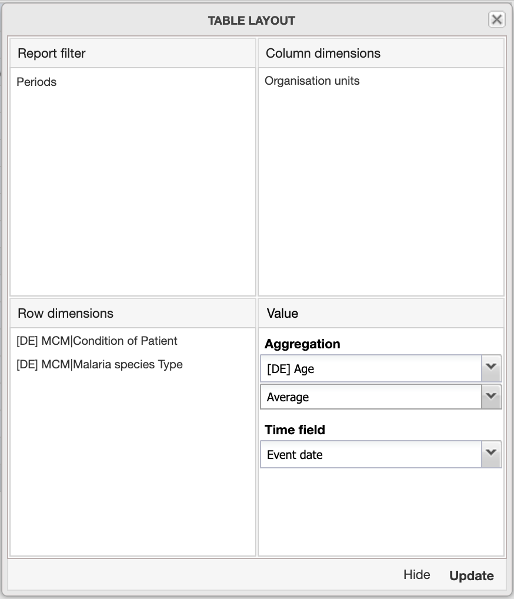

# Module 4: Event Data Analysis

## 4.0 - Create your DHIS2 account on ANALYSIS & Introduction to Module 4

### Introduction to Module 4

#### WELCOME TO MODULE 4!

This module focuses on showing you how you can use event data to create
event data outputs in the form of tables, charts and maps.

In module 4, there are 4 subsections that you will be reviewing:

  - 4.1 - Event Reports. This subsection is divided into 6 units.
  - 4.2 - Event Visualizer. This subsection is divided into 5 units.
  - 4.3 - Maps. This subsection is divided into 6 units
  - 4.4 - Joint Analysis of Event & Aggregate Data. This subsection is
    divided into 5 units.

#### OBJECTIVES

By the end of this module, you should be able to:

  - Describe the features of the event reports, event visualizer and
    maps apps as they relate to outputting event data
  - Use the event reports, event visualizer and maps app to create event
    data outputs in DHIS2
  - Describe how event and aggregate data can be reviewed together
  - Use the data visualizer and maps app to create joint event and
    aggregate data outputs

#### ACTIVITIES & ASSIGNMENTS

#### Activities

You will be performing ungraded activities **for each unit labelled as a demonstration** within the 4 subsections of this module. Activities will be identified within the subsection themselves. There is therefore a total of **20 activities** that you will perform within this module. Don't worry, we try not to make any single activity to long!

#### Assignments

You will have **4 graded assignments** in the form of hands-on exercises
that you must answer, one for each subsection. Each graded assignment
will contribute to 10% of your overall grade. This module therefore
contributes to 40% of your grade overall.

#### Training Environment

You will be using the ANALYSIS training environment to perform your
activities and assignments. If you have not done so, please sign up for
this training environment by following the instructions in the unit
Account Creation - Analysis.

#### TIME COMMITMENT

There is a significant amount of content to cover in this module! This
module should take you approximately **8 hours** in total to review all of the content, perform the ungraded activities and finish the graded
assignments as identified in the course outline. This is our longest
module, but will likely be very useful to many of you!

### Account Creation - ANALYSIS

Instructions - Account Creation on Analysis

In order to perform the exercises and assignments within Module 4, you
will be accessing the **ANALYSIS** DHIS2 system. The **ANALYSIS** system will grant you access to different apps within DHIS2 when compared to **CAPTURE**. You can see the apps you will have available in the screenshot below. In this system, you will not have access to any of the apps used to capture data. If modification of the data was allowed, this could potentially affect any of the values associated with the outputs used in this module.

Please create an account for ANALYSIS by following the available
instructions.

-----

Click the "Request account" button below to request an account on the
DHIS2 Analysis system.

You will receive an invitation by email with instructions on how to
complete the registration in DHIS2.

Note: the email address you use with OpenEDX will be sent to the DHIS2
database to create an account.

Give it a couple of seconds to think; DO NOT keep clicking the “Request
account” button several times in a row! It will send your email details
that you used when you registered in OpenEdX to the DHIS2 Analysis
system to begin the registration process. After 5-10 seconds you should
receive the following notification in your browser window.

Click on OK to close this notification.

Login to to your e-mail. You should receive an e-mail subject that looks
like the following:

We can see in the email subject that the DHIS2 system that has been
identified is the Analysis system that you should be signing up for.

Note that this e-mail may be in your junk folder. If you do not see it
in one of your primary inboxes, please check your junk folder in case it
was filtered out.

The e-mail itself should look like this

In order to continue, either click on the highlighted link or copy and
paste it into a new tab in your browser. This link will take you to the
following page:

Your email-details have already been filled in from OpenEdX. You will
need to fill in the remaining fields however.

Take note of the restrictions on the password. It must:

  - Be at least 8 characters long
  - Include an uppercase letter
  - Include 1 number/digit
  - Include a special character

After filling in all the fields select “Create” to proceed

This should log you in to the DHIS2 Analysis system where you can view
the dashboard.

From here, please follow instructions for any activities or assignments
that are referring you to the DHIS2 Analysis system.

## 4.1 - Event Reports

### Demonstration - Interface Description

#### Introduction - Subsection 4.1

In Subsection 4.1 we review how to enter event data into DHIS2 using the
capture app on the web.

Subsection 4.1 has 6 units for you to review. We recommend that you
review these units in order.

1.  Demonstration - Interface Description
2.  Demonstration - Creating a Line List Event Report
3.  Demonstration - Filtering Data Items
4.  Demonstration - Creating a Pivot Table Event Report
5.  Demonstration - Updating the Table Layout
6.  Demonstration - Aggregated Data Using an Average

##### Ungraded Activities

There is an activity associated with each unit in this subsection.
Scroll below the video demonstration in each unit in order to view the
activity.

##### Graded Assignment

After you have completed reviewing all the material within this
subsection, please attempt the graded quiz for this subsection. This
quiz will contribute to 10% of your overall grade.

#### Video - Event Reports Demonstration Part 1 of 6

#### Part 1 Activity: Interface Description

This activity will be completed in DHIS2 Analysis.

Clicking on the DHIS2 symbol below, located in the upper left of the
page, navigate to the main Dashboard page.

Next, select the **action ellipses** within the 4.1 Pivot Table, and click  “Open in Event Reports app.”

Using the **Data** tab on the left, add the data item “Condition of
Patient”.

**Update** the table to see the changes reflected on the screen.

Add the year “2020” to the **period** and then **update** the table.

Change the Organisation unit to “Animal Region” and update the table.

### Demonstration - Creating a Line List Event Report

#### Video - Event Reports Demonstration Part 2 of 6

#### Part 2 Activity: Creating Line List Event Report

Create a new table by selecting **Favorites > New**.

Select the **Table style** “Line list” and the **Output type** “Event.”

In the **Data** tab, select:

  - The **Program** and **Stage** “Malaria Case Management”
  - The data elements “Age", "Sex" and "MCM Treatment Outcome”

  - In the **Periods** tab select:
  - “Fixed and relative periods”
  - The period type “Yearly”
  - “2019”
  - Make sure to remove the checkmark next to “Last 12 months”

In the **Organisation units** tab select “Trainingland” and then click on **Update**.

### Demonstration - Filtering Data Items

#### Video - Event Reports Demonstration Part 3 of 6

#### Part 3 Activity: Filtering Data Items

Edit the data item “Sex” to filter the cases to show “Females” only.

Click **Update** and view the table.

Change the “Age” filter, set the option to “No range set” and the
operator to “=”.

Click **Update** and view the table.

### Demonstration - Creating a Pivot Table Event Report

#### Video - Event Reports Demonstration Part 4 of 6

#### Part 4 Activity: Creating a Pivot Table Event Report

Clear the current table. Select **Favorites> New**.

In the **Data** tab select:

  - The **Program** and **Stage** “Malaria Case Management”
  - The data elements “Age", "MCM | Condition of Patient" and
    "MCM|Malaria species Type”

In the **period** tab select:

  - “Fixed and relative periods”
  - The period “Yearly”
  - “2019”
  - Make sure to uncheck the “Last 12 months” box

Select the **Organisation Unit** “Animal Region.”

Click **Update**.

Edit the table **Options**

  - Remove the checks next to “Show row totals” and “Show row
    sub-totals”
  - Check the box next to “Hide n/a data”

Click Update.

### Demonstration - Updating the Table Layout

#### Video - Event Reports Demonstration Part 5 of 6

#### Part 5 Activity: Updating Table Layouts

Change the table layout by clicking on the **Layout** button

  - Put “Periods” under **Report filter**
  - Put “Age” under **Column dimensions**
  - Leave “MCM l Condition of Patient” and “MCM l Malaria species Type"
    in **Row dimensions**

Click Update.

Under the Data items change the “Age” legend to “CoD: Age group
(broad)”.

Click **Update**.

### Demonstration - Aggregated Data Using an Average

#### Video - Event Reports Demonstration Part 6 of 6

#### Part 6 Activity: Aggregated Data Using an Average

Click **Layout**.

Under Aggregation select “Age” instead of “Number of events”. Select the
aggregation operator as “Average”.

Click **Update**.

If you would like, you can save the table as a favorite. Click
**Favorites > Save**.

  - Please provide the favorite name and description using a unique
    naming convention that begins with your initials
  - A useful convention is: **your initials_program_what_where_when**
  - Next, select **Download**.

  - Click on the format you prefer

## 4.1 - Graded Assignment - Event Reports

### Graded Assignment - Event Reports

This is a **graded assignment** and it is worth **10%** of your final grade.

You have **2 attempts** to pass each question.

If you are not sure about the steps you followed in the assignment to
get to the correct answer, click on the "**hint**" button to see some tips.

If you want to save your current response without submitting it for
grading yet, select the "**save**" button. This allows you to come back
later and resume the attempt.

Select the "**check**" button to submit your answers.

#### Assignment Links

#### Instructions

1. For this assignment, answer questions using the **Event Reports** app
2. Use the “Malaria Case Management” **program** and **stage**
3. You will be marked based on the answers selected through multiple
    choice. To determine the answers, you must create the associated
    table described in the details section.
4. Save all tables as Favorites, using the convention:
    **username_program_what, where, when**

##### Question 1: Details

**Table style**: “Line list”

**Output type**: “Event”

**Program**: “Malaria Case Management”

**Stage**: “Malaria Case Management”

**Data elements**: “MCM | Malaria method of detection,” “MCM | Malaria species Type,” “MCM | Confirmation Method”

Period: “2020”

**Organisation Unit**: “Food Region”; “Select levels” as the mode and then “Facility”

The eighth event listed is from the “Ice Cream Dispensary.” What was
the “Malaria Species Type” for this event?

( ) Mix {{Mix is incorrect, it was not the Malaria Species Type for the
eighth event listed }}

( ) Po {{Po is incorrect, it was not the Malaria Species Type for the
eighth event listed}}

(x) Pk {{Pk is the Malaria Species Type for the eighth event listed}}

( ) Pf {{Pf is incorrect, it was not the Malaria Species Type for the
eighth event listed .}}

||(A) Make sure for the Period you chose “Fixed and relative periods,”
then''Yearly” before selecting “2020.”||

||(B) Make sure you unchecked the “Last 12 months” box in the Periods
section.||

||(C) In the Layout tab, make sure the “Longitude” and “Latitude” are
“Excluded dimensions.”||

##### Question 2: Details

**Table style**: “Pivot table”

**Output type**: “Event”

**Program**: “Malaria Case Management”

**Stage**: “Malaria Case Management”

**Data elements**: “Sex,” “MCM|Treatment Outcome”

**Period**: “Start/end dates,” from “15th August 2019” to “15th June 2020"

**Organisation unit**: “Trainingland”

**Tip**: Hide “n/a data” as well as “row totals.”

**What is the most common “MCM Treatment Outcome” for “Females?”**

(x) Recovered {{Recovered. ‘Recovered’ is the most common Treatment
Outcome for Females.}}

( ) Drop out {{Drop out - is not the most common Treatment Outcome for
Females. Double check you have entered all of the input details
correctly and disaggregated the number of malaria cases by “Sex.” }}

( ) Failed due to medication {{Failed due to medication - is not the
most common Treatment Outcome for Females. Double check you have entered
all of the input details correctly and disaggregated the number of
malaria cases by “Sex.”}}

( ) Dead {{Dead - is not the most common Treatment Outcome for Females.
Double check you have entered all of the input details correctly and
disaggregated the number of malaria cases by “Sex.”}}

( ) Follow up {{Follow up -  is not the most common Treatment Outcome
for Female. Double check you have entered all of the input details
correctly and disaggregated the number of malaria cases by “Sex.”}}

||(A) Make sure to disaggregate the number of malaria cases by gender by
going to the Data tab and selecting “Male” and “Female” within the data
item “Sex.”||

||(B) Use the Options menu to hide “n/a data” as well as “row totals.”
||

**What is the most common “MCM Treatment Outcome” for “Females?”**

(x) Recovered {{Recovered. ‘Recovered’ is the most common Treatment
Outcome for Females.}}

( ) Drop out {{Drop out - is not the most common Treatment Outcome for
Females. Double check you have entered all of the input details
correctly and disaggregated the number of malaria cases by “Sex.” }}

( ) Failed due to medication {{Failed due to medication - is not the
most common Treatment Outcome for Females. Double check you have entered
all of the input details correctly and disaggregated the number of
malaria cases by “Sex.”}}

( ) Dead {{Dead - is not the most common Treatment Outcome for Females.
Double check you have entered all of the input details correctly and
disaggregated the number of malaria cases by “Sex.”}}

( ) Follow up {{Follow up -  is not the most common Treatment Outcome
for Female. Double check you have entered all of the input details
correctly and disaggregated the number of malaria cases by “Sex.”}}

||(A) Make sure to disaggregate the number of malaria cases by gender by
going to the Data tab and selecting “Male” and “Female” within the data
item “Sex.”||

||(B) Use the Options menu to hide “n/a data” as well as “row totals.”
||

##### Question 3: Details

**Table style**: “Pivot table”

**Output type**: “Event”

**Program**: Malaria Case Management”

**Stage**: “Malaria Case Management”

**Data elements**: “Age,” “MCM l Condition of Patient”

**Periods**: “Fixed and relative periods” “Quarterly”   the following
quarters:

  - “July - September 2019”
  - “October - December 2019”
  - “January - March 2020”
  - “April - June 2020”

Organisation unit: “Trainingland”

***Tip**: Filter the number of cases in the Age Range 5-9

**Which quarter has the highest number of people aged, “5-9” with a “Severe” condition?**

( ) “Jul - Sep 2019” {{“Jul - Sep 2019” does not have the  highest
number of people aged 5-9 with a "Severe" condition. Double check you
have entered all of the input details correctly and that you are
reporting the number of patients within the “5-9” age range
disaggregated by “Condition of patient.”}}

(x) “Oct - Dec 2019” {{“Oct-Dec 2019” has the highest number of people
aged, 5-9 with a "Severe" condition.}}

( ) “Jan - Mar 2020” {{Jan - Mar 2020” does not have the  highest number
of people aged 5-9 with a "Severe" condition. Double check you have
entered all of the input details correctly and that you are reporting
the number of patients within the “5-9” age range disaggregated by
“Condition of patient.”}}

( ) “Apr - Jun 2020”  {{ “Apr - Jun 2020” does not have the highest
number of people aged 5-9 with a "Severe" condition. Double check you
have entered all of the input details correctly and that you are
reporting the number of patients within the “5-9” age range
disaggregated by “Condition of patient.”}}

||Think about the objective and the specifics of what you are reporting.
Make sure to correctly adjust the age ranges in the data tab under the
“Age” data item. When choosing the period you may need to make use of
the Prev year and Next year buttons.||

##### Question 4: Details

**Table style**: “Pivot table”

**Output type**: “Event”

**Program**: “Malaria Case Management”

**Stage**: “Malaria Case Management”

**Data elements**: “Age,” “MCM | Condition of Patient”

**Period**: “Fixed and relative periods”; “Yearly”; “2020”

**Organisation unit**: Facilities within Animal Region > Bird District.

***Tip**: Calculate the average of the “Age” data element using the Layout tab

**Which facility in the “Bird District” has the highest average age of
“Severe” malaria cases?**

( ) “Owl Dispensary” {{“Owl Dispensary” does not have the highest
average age of severe malaria cases in Bird District. Double check you
have entered all of the input details correctly and that you are
reporting the average age of “Severe” malaria cases within all “Bird
District” facilities in “2020.”}}

(x) “Robin Primary Health Centre” {{“Robin Primary Health Centre” has
the highest average age of severe malaria cases in Bird District.}}

() “Ostrich Health Centre”  {{“Ostrich Health Centre” does not have the
highest average age of severe malaria cases in Bird District. Double
check you have entered all of the input details correctly and that you
are reporting the average age of “Severe” malaria cases within all “Bird
District” facilities in “2020.”}}

( ) “Parrot District Hospital” {{“Parrot District Hospital” does not
have the highest average age of severe malaria cases in Bird District.
Double check you have entered all of the input details correctly and
that you are reporting the average age of “Severe” malaria cases within
all “Bird District” facilities in “2020.”}}

||(A) Update the layout of the report. Click on Layout and make sure
“Organisation units” is under Row dimensions, and the “Condition of
patient” is in the Report Filter. ||

||(B) Remember you are reporting the “Severe” cases of Malaria and make
sure the "Condition of patient" data item is filtering only "Severe"
cases.||

||(C) In order to calculate the average of the “Age” data element in the
Layout tab, under the Value > Aggregation section, find the “Age” data
element and then, directly below, select the aggregation type as
"Average".||

## 4.2 - Event Visualizer

### Demonstration - Navigating the Event Visualizer Application

#### Introduction - Subsection 4.2

In Subsection 4.2 we review how to create data outputs using the event
visualizer app in DHIS2.

Subsection 4.2 has 5 units for you to review. We recommend that you
review these units in order.

1. Demonstration - Navigating the Event Visualizer Application
2. Demonstration - Visualizing Event Data in a Column Chart
3. Demonstration - Filtering an Age Range
4. Demonstration - Additional Filters for a Visualization
5. Demonstration - Creating a Pie Chart with Event Data

##### Ungraded Activities

There is an activity associated with each unit in this subsection.
Scroll below the video demonstration in each unit in order to view the
activity.

##### Graded Assignment

After you have completed reviewing all the material within this
subsection, please attempt the graded quiz for this subsection. This
quiz will contribute to 10% of your overall grade.

#### Video - Event Visualizer Demonstration Part 1 of 5

#### Part 1 Activity: Navigating the Event Visualizer Application

Navigate to the **Event Visualizer** application. To do so:

a) Use the **search apps** feature OR 

b) Use the **action ellipses** and select “Open in Event Visualizer app”

Now that we are in the app, let’s review the interface.

At the very top left corner of the criteria selection column, we can see
the first option to select is the **Type**.

Next, we can see the **Data** selection tab where we choose the program, and if the program is a tracker program, we will also have the option to select the program stage too. The available data items are the data elements and program indicators related to the selected program.

The next tab is the **Period**, and here, as in the Event Reports app, we
have the option to select either the fixed and relative period, or the
start and end dates.

Lastly the **Organisation Unit** selection tab is where we can select the organisation units we would like to view in the report.

### Demonstration - Visualizing Event Data in a Column Chart

#### Video - Event Visualizer Demonstration Part 2 of 5

#### Part 2 Activity: Visualizing Event Data in a Column Graph

Now let’s proceed with **Task 1** and create a column graph displaying the options for malaria species type in 2019 for Trainingland.

From the **Event Visualizer** app, select **Favorites > New**.

Click **Ok** to continue and approve the discarding of any changes made to the previous chart.

Select the **column graph** type.

In the data tab select:

  - The **Program** and **Stage** “Malaria Case Management”
  - The **data element** “MCM l Malaria species Type”
  - Select all “MCM l Malaria species types,” “Mix, Pf, Pk, Pm, Po, Pv”

In the Period tab, select:

  - “Fixed and relative periods”
  - The **period type** “Yearly”
  - The period “2019”
  - Ensure “Last 12 months” is deselected in the Relative Periods
    section

In the **Organisation units** tab, use the **Selection mode** “Select
organisation units” and then select “Trainingland.” Next, click **Update**.

The graph shows all malaria species types listed across the horizontal
axis. It is showing the aggregate number of cases of malaria in 2019 for
the whole of Trainingland, by species type.

Next, let’s view the species type separately by region.

From the **Organisation Units** tab, select the “Animal” and “Food” regions.

Click on the **Layout** button:

  - “Organisation units” should be listed under **Category dimensions**
  - “Periods” should be listed under **Report Filter**

Click **Update**.

Now we are able to view the mix of species types of malaria cases
separately for Animal Region and Food Region in the chart.

Now let’s see what happens when we drill down even further into the
Organisation Units.

From the **Organisation Units** tab, select all of the districts within the “Animal Region”; then click **Update**.

This gives you separate results for malaria cases by species in each of
the districts within “Animal Region”.

Next, from the **Options** menu, above the chart:

  - Select “Hide n/a data”
  - Chose the **Sort order** “Low to high”
  - Leave **Hide chart title** unchecked and add a chart title “Malaria
    Species Type, Animal Region, 2019”

 

Then click **Update**.

The chart now displays the results by district from lowest to highest,
and we can see the title at the top.

Save your chart as a favorite.

  - In the menu bar, click on **Favorites > Save**

  - Fill in the Name section: “Your initials_Malaria: Species Type,
    Animal Region, 2019”
  - Add a description, “This chart shows the positive malaria cases
    separated by their species type within the Animal Region in 2019”
  - Click **Save**

You are able to download this chart in various formats by clicking
**Download** in the menu bar and choosing your preferred download option.

### Demonstration - Filtering an Age Range

#### Video - Event Visualizer Demonstration Part 3 of 5

#### Part 3 Activity: Filtering an Age Range

Now, we will move onto **Task 2** , where we will filter out a range of ages
in an event report. Recall that we want to view the conditions of
malaria patients who are between the ages of 15-20, with the time frame
of July - December 2019, by district, in the Food Region.

From the **Event Visualizer** app, click on **Favorites > New**.

Select the **Line chart**.

In the **Data tab**, select:

  - The **Program** and **Stage** “Malaria Case Management”
  - The **Data elements** “MCM l Condition of Patient” and “Age”  
    

To view cases that are in the age range of “15-20”:

  - **Duplicate** the “Age” data item
  - Select “No range set” for both “Age” items
  - one Age item, choose “>=” and “15”
  - the other Age item, choose “<=” and “20”  
    

In the **Period** tab select:

  - “Fixed and relative periods” and “Six - monthly”
  - Select “July - December 2019” as the period
  - Ensure “Last 12 months” is unticked in the **Relative Periods** section  
    

In the **Organisation units** tab open the hierarchy for “Food Region”.

  - Select all Districts in “Food Region”  
    

Click on the **Layout** tab

  - Set “Age” as the **Report filter**
  - Put “Organisation Units” in **Category dimensions**
  - Put “MCM l Condition of Patient” in **Series dimensions**
  - Click on **Update**  
      
    The resulting line graph should now depict the number of simple and
    severe malaria cases for people >=15 and <=20 years old by
    district within the Food Region.

### Demonstration - Additional Filters for a Visualization

#### Video - Event Visualizer Demonstration Part 4 of 5

#### Part 4 Activity: Additional Filters for a Visualization

Continuing on with the line chart from the last activity, now let’s
update the chart to only show female cases in the line graph. We’ll need
to add more filters to this visualization.

In the **Data** tab select:

  - “Sex” as a **data element**
  - “Female” as the **filter**

In the **Layout** menu organise the following:

  - Put “Age” and “Sex” under **Report filter**
  - Put “MCM l Condition of Patient” under **Series dimensions**
  - Put “Organisation units” under **Category dimensions**
  - Click **Update**

The line graph should now depict the number of “Simple” and “Severe”
malaria cases for females aged between 15 -20 years old by district in
the “Food Region”.

Let’s add another filter to your **Line chart**.

In the **Data** tab, select:

- “Pregnant” as the **data element**
  - Filter this element by selecting “Yes”

Click on the **Layout** menu and organise the following:

  - “Pregnant” under **Report filter**
  - “Organisation Units” under **Category dimensions**
  - “Condition of Patient” under **Series dimensions**

Then click on **Update**.

The graph type is no longer appropriate for this data. Change the graph
type to a **bar graph** and click **Update**.

  - Click on **Favorites > Save**
  - Provide the chart with a name and description using the recommended
    naming convention “Your intials_program, data elements, location,
    period”

### Demonstration - Creating a Pie Chart with Event Data

#### Video - Event Visualizer Demonstration Part 5 of 5

#### Part 5 Activity: Creating a Pie Chart with Event Data

From the **Event Visualizer** app, click on **Favorites > New**.

Please create a pie chart that follows the example in the demo.

Choose **pie chart** as the chart type.

In the Data tab, select

  - The **Program** and **Stage** “Malaria case management”
  - The **data element** “MCM l Treatment Outcome”

In the **Periods** tab, select

  - “Fixed and relative periods”
  - The period type “Yearly”
  - “2020” as the available period
  - Ensure “Last 12 months” is unticked in the Relative Periods section

In the **Organisation units** tab, select “Trainingland.”

From the **Layout** menu organize the following:

  - “Periods” under the **Report filter**
  - “Organisation units” under the **Series dimensions**
  - “MCM l Treatment Outcome” under the **Category dimensions**

Then click on **Update**.

  - Click on **Favorites > Save**
  - Provide the chart with a name and description using the recommended
    naming convention “Your intials_program, data elements, location,
    period"

## 4.2 - Graded Assignment - Event Visualizer

#### GRADED ASSIGNMENT - EVENT VISUALIZER

This is a **graded assignment** and it is worth **10%** of your final grade.

You have **2 attempts** to pass each question.

If you are not sure about the steps you followed in the assignment to
get to the correct answer, click on the "**hint**" button to see some tips.

If you want to save your current response without submitting it for
grading yet, select the "**save**" button. This allows you to come back
later and resume the attempt.

Select the "**check**" button to submit your answers.

#### INSTRUCTIONS

1. For this assignment, answer questions using the **Event Visualizer** app
2. Use the “Malaria Case Management” **program** and **stage**
3. You will be marked based on the answers selected through multiple
  choice. To determine the answers, you must create the associated
  table described in the details section.
4. Save all tables as Favorites, using the convention:
  **username_program_what, where, when**

#### QUESTION 1: DETAILS

  - **Visualization Type**: Pie Chart
  - **Program**: “Malaria Case Management”
  - **Data Element**: “MCM|Malaria method of detection”
  - **Period**: “2020”
  - **Organisation Unit**: “Trainingland”

In 2020, what is the most common method for detecting malaria?

( ) MFS {{“MFS”; in 2020 MSF was not the most common method for malaria
detection at 12.1% Double check you have entered all of the input
details correctly, including the program, data elements, org unit and
period }}

(x ) FUP {{In 2020 FUP was the most common method for malaria detection
at 13.8%}}

( ) Kader {{“Kader”; in 2020 Kader was not the most common method for
malaria detection at 12.4% Double check you have entered all of the
input details correctly, including the program, data elements, org unit
and period}}

( ) SK {{“SK”; in 2020 SK was not the most common method for malaria
detection at 11.3%

Double check you have entered all of the input details correctly,
including the program, data elements, org unit and period}}

|| You may need to update the Layout of this chart. Click on Layout to
make sure “Periods” is under Report filter, “Organisation units” is
under Series dimensions, and “Malaria method of detection” is under
Category dimensions.||

#### Question 2: Details

**Visualization Type**: Line Chart

**Program**: “Malaria Case Management”

**Data Elements**:

“Sex”

“Age" >= 30

**Period**: “July to December 2019”

**Organisation Units**: Districts in “Trainingland”

In which Districts do women (aged >=30) have more malaria cases
than men (aged >=30)?

( ) “Cat District, Dinner District, Fruit District” {{“Cat District,
Dinner District, Fruit District” - Dinner District is the only District
where more women have malaria cases. Double check you have entered all
of the input details correctly, including the program, data elements,
org unit and period.}}

(x) “Dessert District, Dinner District, Sweet District” {{in “Dessert
District, Dinner District, Sweet District” women have more malaria cases
than men.}}

( ) “Dessert District, Bird District, Insect District” {{ “Dessert
District, Dinner District, Insect District”  In Bird District there are
ten more male case of malaria than there are female cases. Double check
you have entered all of the input details correctly, including the
program, data elements, org unit and period. }}

( ) “Dinner District, Game District, Staple District” {{“Dinner
District, Game District, Staple District”  In Game District, men have
more malaria cases than women. Double check you have entered all of the
input details correctly, including the program, data elements, org unit
and period

.}}

||Make sure that when you’re entering “Age >= 30” you use “No range
set” so that you are able to enter the number 30 manually||

||Review the layout of the chart by clicking the layout tab: “Age” and
"Periods" should be under Report filter; “Sex” should be under Series
dimensions; Organisation units should be under Category dimensions.||

#### QUESTION 3: DETAILS

**Visualization Type**: Bar Chart

**Program**: "Malaria Case Management"

**Data Elements**:

“Age” Range: 20-59

“MCM|Treatment Outcome = Dead”

“MCM|Condition of Patient" = "Severe”

**Periods**: “2020”

**Organisation Units**: Districts in “Animal Region”

In 2020, which District has the least amount of people who passed
away from “Severe” malaria for the age range “20-59?”

( ) Game District {{“Game District” does not have the least amount of
cases; it has 27. Double check you have entered all of the input details
correctly, including the program, data elements, org unit and period .}}

(x) Insect District {{“Insect District” has the least amount of people
who passed away from “Severe” malaria cases for the age range “20-59,”
with 8 “dead” cases registered.}}

( ) Dog District {{“Dog District”  does not have the least amount of
cases; it has 20. Double check you have entered all of the input details
correctly, including the program, data elements, org unit and period.}}

( ) Fish District {{“Fish District” does not have the least amount of
cases; it has 49. Double check you have entered all of the input details
correctly, including the program, data elements, org unit and period

.}}

||Click on Layout and make sure  (A) “MCM | Condition of Patient,” “Age”
and “Periods” are under Report Filter (B) “MCM | Treatment Outcome” is
under Series dimensions and (C) “Organisation units” is under Category
dimensions. ||

## 4.3 - Maps

### Presentation - Introduction to Maps

#### Introduction : Subsection 4.3 - Maps

In Subsection 4.3 we review how to create data outputs using the maps
app in DHIS2.

Subsection 4.3 has 6 units for you to review. We recommend that you
review these units in order.

1. Presentation - Introduction to Maps
2. Demonstration - Coordinates in Capture App & Maps Interface
    Description
3. Demonstration -  Adding Layers to Maps
4. Demonstration - Styling Layers & Adding Filters
5. Demonstration - Style by Data Element & Donut Clusters
6. Demonstration - Creating a Dashboard

##### Ungraded Activities

There is an activity associated with each unit in this subsection
labelled as "demonstration." Scroll below the video demonstration in
each of these units in order to view the activity.

##### Graded Assignment

After you have completed reviewing all the material within this
subsection, please attempt the graded quiz for this subsection. This
quiz will contribute to 10% of your overall grade.

#### Video - Maps Presentation Part 1 of 6

### Demonstration - Coordinates in Capture App & Maps Interface Description

#### Video - Maps Demonstration Part 2 of 6

#### Part 2 Activity: Coordinates in Capture App & Maps Interface Description

Now let’s see how coordinates can be visualized in the maps app. We can
do so by using an existing map.

Navigate to the dashboard by clicking on the **Dashboard** app in the **Search apps** menu.

Find the particular map of interest within the dashboard and click on
the **action ellipses**.

Then click on “Open in Maps app.”

Note the criteria selection column is on the left.

Click on the **pencil symbol** at the bottom left of the layer box to edit
the layer.

Click on the **Org Units** tab, then deselect “Trainingland” and select
“Animal Region.” Then click **Update Layer**.

Next, let’s add a boundary layer. Click on the **Add layer** button in the
top left corner.

Next, select a “Boundaries” layer.

In the **Organisation Units** tab, ensure “Trainingland” is selected. Make
sure the **level** “Region” is selected.

Under the **Style** tab, make sure the **Labels** box is ticked.

Then select **Add Layer**.

Example of what the result should look like:

### Demonstration - Adding Layers to Maps

#### Video - Maps Demonstration Part 3 of 6

#### Part 3 Activity: Adding Layers to Maps

Under the **File** button, click on “New” to open a new map.

In the left corner, you can see the default layer, the **Basemap** layer. It
allows you to choose the basemap. Let’s choose **Bing Road** as the **Basemap**.

Click on the **Add layer** button.

Choose Boundaries.

From the Organisation Unit tree, select “Trainingland”.

From the **Select levels** drop down list choose “Region” and “District”.

Click on **Add Layer**.

You can now see the region and district boundaries of “Trainingland”.

Add another new layer by clicking on the **Add layer** button.

As a layer type, choose Events.

The **Add new event layer** box opens.

Under the **Data** tab, choose “Malaria Case Management” as the **Program** and
as the **Stage**.

Leave the Coordinate field as “Event location”.

Select the **Period** tab.

In the period tab, choose a “Start/end date”.

Select “January 1, 2020 - March 31, 2020” as the period.

Go to the **Org Units** tab and select “Trainingland”.

  - Choose the **Filter tab** and click on **Add Filter**
  - This tab allows you to apply criteria to the events being displayed
    on the map
  - In our case, we have two criteria:
  - Choose “Pregnant” under **Data item**, “one of” as the **Operator** and
    “Yes” as the **option**
  - Add a second filter by selecting **Add Filter**
  - Choose the **Data item** “MCM|Condition of Patient,” **the Operator** “one
    of,” and “Severe” under the **Options**

Before adding the layer, we want to ensure that the clustering is on.

Go to the **Style** tab and select “Group events”. By doing so, you will
regroup events and make the map easier to read if there are a large
number of events.

Click on **Add Layer**.

**N.B. The filter that you have applied to the map will appear along with
the legend on the left side of the maps app. You can edit the layer by
clicking on the pen icon.**

Zoom in until you get to point data and click one point. A box opens
that shows the attributes of the selected event.

  - You can verify the condition of the patient is “Severe”. You will
    also be able to determine what kind of treatment the woman has
    received (ACT, Non-ACT…)

Go to **File > Save**.

Enter the name of the map and a short description and save it.

### Demonstration - Styling Layers & Adding Filters

#### Video - Maps Demonstration Part 4 of 6

#### Part 4 Activity: Styling Layers & Adding Filters

Click on **File > New**.

First choose **Bing Road** as the base map.

Click on **Add layer** on the top left side of the interface and choose
**Boundaries** as a layer type.

From the Organization unit tree, select **Animal Region > Cat District**.

Go to the **Style tab** and select **Labels** to display the name of the
district on the map. You can change the size of the font.

Click on Add Layer.

We now only see the boundaries of the “Cat District”.

The second step is to add an event layer to display all malaria cases
that have resulted in death from “July 31 2019 to December 31 2019”.

Click on **Add Layer** and select **Events**.

Under the **Data** tab, choose “Malaria Case Management” as the **Program** and
the **Stage**.

Leave the **Coordinate field** as “Event location”.

Go to the **Period tab** and specify the **period** type as “Start/end dates”.

Use “July 31 2019” as a **Start date** and “December 31 2019” as an **End
date**.

Under the **Org Units** tab, select **Animal Region > Cat District**. Make sure
the box next to Trainingland is unchecked.

Under the **Filter** tab, click **Add filter**.

Choose the **Data item** “MCM|Treatment Outcome”, **the Operator** “one of,” and
“Dead” under the **Options**.

Go to the **Style** tab.

Select “View all events”.

Pick a color on the color scale.

Change the Radius size to “4”.

Click on **Add Layer**.

As the map shows, unfortunately, there are some deaths from malaria in
the “Cat District,” between “July 31, 2019 and December 31, 2019”.

Note that you can view the filter that has been applied on the left side
panel. It indicates that the “Treatment outcome” is “Dead” under the
filter heading.

Do not forget to save your map as a favorite!

Select **File > Save**. Add a name that includes your initials and a
description.

### Demonstration - Style by Data Element & Donut Clusters

#### Video - Maps Demonstration Part 5 of 6

#### Part 5 Activity: Style by Data Element & Donut Clusters

The last task is to create a map that filters the data by “Female” and
“PF” malaria and that applies a data element style using the
confirmation method.

Click on **File > New**.

Choose “Bing Road” as the base map.

Click on **Add layer** and choose “Boundaries”.

From the org units tree choose the **Insect District** under the **Animal
Region**.

Click on **Add Layer**. The app shows the boundaries of the **Insect District**.

Add an Event layer to our map.

Click on **Add layer** and choose “Events”.

Under the **Data** tab, choose “Malaria Case Management” as the **Program** and
**Stage**.

Leave the coordinate field as “Event Location”.

In the **Period** tab, select “Start/End dates.”

  - **Start date** is “July 1st 2019”
  - **End date** is “December 31 2019”

In the **Org Units** tab, select the “Insect District” from the organization
unit tree.

Under the **Filter** tab, click **Add filter**.

Choose the **Data item** “Sex”, the Operator “one of”, and the Option
"Female".

Click on Add filter to add the second filter to specify the Malaria
species type. Choose the Data item “Malaria species Type,” the
Operator “one of,” and “Pf” as the Option.

With these options, the map will only display events that show where
women are infected with the Pf species of malaria. These filters will
appear under this layer’s heading in the column on the left.

  each event we would like to know what type of confirmation method
has been used. To do this, we need to apply a data element style.

In the Style tab, click on the Style by data element drop down list and
choose “Confirmation Method.”

Notice that all of the options for confirmation method appear: “RDT,
Microscopy and Both.”

The colors that appear next to each option can be customized by clicking
on the color and adjusting to the color of your choice.

Change the colors as follows:

  - “RDT = purple”
  - “Microscopy = blue”
  - “Both = red”

Click on Add Layer.

The map now displays the “female” cases of malaria infected with the
“Pf” species that occurred in the “Insect District” between “July
and December” of 2019. Using donut clusters the map shows these cases by
the confirmation method.

The number displayed in the middle of the cluster represents the total
number of cases by cluster, and the different colored rings represent
the percentage of each confirmation method. The number displayed in the
middle of the cluster represents the total number of cases by cluster,
and the different colored rings represent the percentage of each
confirmation method.

Click on the File > Save. Give the map a name with your initials and a
description.

An example is shown below.

### Demonstration - Creating a Dashboard

#### Video - Maps Demonstration Part 6 of 6

#### Part 6 Activity: Creating a Dashboard

Now that we have all of the maps from the 3 tasks in this demonstration
saved, let’s add them to a dashboard.

Search for the Dashboard app in the apps menu then select it.

Let’s create a new dashboard. Do so but clicking on the green plus
button.

Provide the new dashboard with a name. See an example below.

Now in the Search for items to add to this dashboard tab, type in the
individual names of the maps you just created and click on the
insert button at the right of the name.

Once you have clicked “insert” for all of the relevant maps, click on
Save changes at the top of the page.

The maps you’ve just added are now available on your dashboard.

  - The dashboards are interactive, the +, - buttons allow you to zoom
    in or out on the map
  - The button with 4 arrows allows you to view the map in fullscreen
    mode
  - The list icon allows you to easily view the layers on the map

## 4.3 - Graded Assignment - Maps

#### GRADED ASSIGNMENT - MAPS

This is a graded assignment and it is worth 10% of your final grade.

You have 2 attempts to pass each question.

If you are not sure about the steps you followed in the assignment to
get to the correct answer, click on the "hint" button to see some tips.

If you want to save your current response without submitting it for
grading yet, select the "save" button. This allows you to come back
later and resume the attempt.

Select the "check" button to submit your answers.

#### 

#### INSTRUCTIONS

1.    this assignment, answer questions using the Maps app
2.  Use the “Malaria Case Management” program and stage
3.  You will be marked based on the answers selected through multiple
    choice. To determine the answers, you must create the associated
    table described in the details section.
4.  Save all tables as Favorites, using the convention:
    username_program_what, where, when

 Click here for a printable version of this assignment.

##### Question 1: Details

Create an event layer map for all of Trainingland that shows pregnant
women with severe malaria. Make sure that the district boundary layer is
present along with the labels for the district layer.

  - Basemap: Bing Road
  - Program/Program Stage: “Malaria Case Management”
  - Period: “January 1 2019 - December 31 2019”
  - Organisation Unit: “Trainingland”
  - Data Element Filters:

  - “Pregnant = Yes”
  - “MCM|Condition of Patient = Severe”

How many cases of severe malaria in pregnant women are there in the
"Insect District"?

( ) 10 {{10 is the total for Sweet District. Make sure: (a) you have
entered all of the inputs correctly in the Event Layer, including the
program, period and org unit (b) the additional Boundaries Layer has
been established with the district borders outlined using labels}}

( ) 24 {{24 is the total for Game District. Make sure: (a) you have
entered all of the inputs correctly in the Event Layer, including the
program, period and org unit (b) the additional Boundaries Layer has
been established with the district borders outlined using labels}}

(x) 15 {{15; During this period, 12 pregnant women had severe cases of
malaria within “Insect District.”}}

||Remember to set up the additional district boundary layer to  view
where the events are allocated. This means clicking on Add layer, then
“Boundaries.” Afterwards, select the “Insect District” as the Org
Unit, and check the “Labels” box under Style.||

##### Question 2: Details

Create a map for "Cat District" showing all the malaria medicine types
from January 31 2019 to Dec 31 2019. The map will be more meaningful if
you add the district boundary for Cat District.

  - Basemap: Bing Road
  - Program/Program Stage: “Malaria Case Management”
  - Period: “January 31 2019 - December 31 2019”
  - Organisation Unit: “Cat District”
  - Data Element Filters: “MCM|Malaria medicine Type”

What is the medicine type that has been provided to the highlighted
case?

( ) ACT + Primaquine {{“ACT + Primaquine”. Make sure: (a) you have
entered all of the inputs correctly in the Event Layer, including the
program, period and org unit (b) the additional Boundaries Layer has
been established with the district borders outlined using labels.}}

( ) Artemeter Injeksi {{ “Artemeter Injeksi”. Make sure: (a) you have
entered all of the inputs correctly in the Event Layer, including the
program, period and org unit (b) the additional Boundaries Layer has
been established with the district borders outlined using labels.}}

(x) Kina+Primaquine+Doksisiclin {{ “Kina+Primaquine+Doksisiclin” is the
medicine type that has been provided to the highlighted case of the
female who is 62 years old.}}

( ) Kina+Primaquine {{“Kina+Primaquine". Make sure: (a) you have entered
all of the inputs correctly in the Event Layer, including the program,
period and org unit (b) the additional Boundaries Layer has been
established with the district borders outlined using labels.}}

||You can access additional details about individual events on the map
by clicking on the event. Review the details for the event using this
feature.||

-----

#### Question 3: Details

Create a map of malaria cases filtering the data by the condition of the
patient, the confirmation method and gender. Also apply a data element
style using the confirmation method data.

  - Basemap: Bing Road
  - Program/Program Stage: “Malaria Case Management”
  - Period: “July 01 2019 - December 31 2019”
  - Organisation Unit: “Fruit District”
  - Data Element Filters:

  - “MCM|Confirmation Method" = "Both", "Microscopy" and "RDT”
  - “MCM|Condition of Patient" = "Simple”
  - “Sex" = "Male”

  - Data element style should be on: “MCM|Confirmation Method”

What is the most common confirmation method used in "Fruit District"
to detect simple malaria cases who are male?

(x) RDT {{ RDT.  This should be easily identifiable via the legend that
has been applied as a result of the data element style that has been
added. Roughly 50% of the simple, male cases have been identified using
an RDT.}}

( ) Microscopy {{Microscopy”. Roughly 25% of male cases with “Simple”
malaria have been confirmed with the “Microscopy” method in Fruit
District. Make sure to: (a) apply a data element style using the style
tab on the event layer in order to easily identify which confirmation
type was the most common (b) group the events in clusters so you can
view the distribution by confirmation method.

}}

( ) Both {{Roughly 25% of male cases with “Simple”  malaria have been
confirmed with “Both” methods in Fruit District. Make sure: (a) to apply
a data element style using the style tab on the event layer in order to
easily identify which confirmation type was the most common (b) group
the events in clusters so you can view the distribution by confirmation
method.

}}

||Ensure that in the MCM Event Layer Style tab, you have the option
“Group events” turned on. To view the donut cluster for the whole
district, zoom out on the map so you only have one cluster for the
district.||

## 4.4 - Joint Analysis of Event & Aggregate Data

### Presentation - Introduction of Joint Analysis

#### Introduction : Subsection 4.4 - Joint Analysis of Event & Aggregate Data

In Subsection 4.4 we will review how you can create data outputs that
combine both aggregate and event data together using the data visualizer
and maps app in DHIS2.

Subsection 4.4 has 6 units for you to review. We recommend that you
review these units in order.

1.  Presentation - Introduction of Joint Analysis
2.  Demonstration - Analysis of Program Indicators Using a Pivot Table
3.  Demonstration - Analysis of Program Indicators Using a Chart
4.  Demonstration - Analysis of Aggregate Data, Program Indicators and
    Combined Indicators
5.  Demonstration - Analysis of Event Data & Combined Indicators using
    Maps

##### Ungraded Activities

There is an activity associated with each unit in this subsection
labelled as "demonstration." Scroll below the video demonstration in
each of these units in order to view the activity.

##### Graded Assignment

After you have completed reviewing all the material within this
subsection, please attempt the graded quiz for this subsection. This
quiz will contribute to 10% of your overall grade.

#### Video - Joint Analysis of Event & Aggregate Data Presentation Part 1 of 5

### Demonstration - Analysis of Program Indicators Using a Pivot Table

#### Video - Joint Analysis of Event & Aggregate Data Demonstration Part 2 of 5

#### Part 2 Activity: Analysis of Program Indicators in Data Visualizer App Using a Pivot Table

Navigate to the Data Visualizer app.

Search for the Data Visualizer app in the search apps field, then click
on the app.

Once you have the Data Visualizer app open, choose the Pivot
table option:

Then enter the following data:

  - Under the Data tab choose “Program indicators”
  - Select the Program “SARA RCH”
  - Select the Program indicators “SARAFacilities offering ANC” and
    “SARAfacilities offering Family Planning services”

  - Use the arrow pointing to the right to move them over to the
    Selected Data box

  - Then click Hide

  - Under the Period dimension, select the period type ”Fixed periods,”
    the period type “Yearly” and the year “2020”. Make sure to move
    “2020” to the Selected Data column using the arrow pointing to the
    right
  - Remove “Last 12 Months” from the Selected Data column
  - Then click Hide

  - In the Organization Unit dimension, ensure “Trainingland” is
    selected in the hierarchy
  - Select the Level “District”
  - Then click Hide

  - To ensure we can view the facilities by district, change the layout
    around; bring the “Organization Unit” to the Rows dimension, and the
    “Period” into the Filter dimension
  - Click Update

  - If we only want to view rows with data in them, using the
    Options tab we can select the “Hide empty rows” and then select
    “Column totals” to view the total number of facilities that
    provide ANC or family planning services
  - Next, click Update

 

Click on File > Save.

Provide the pivot table with a name and a description.

### Demonstration - Analysis of Program Indicators Using a Chart

#### Video - Joint Analysis of Event & Aggregate Data Demonstration Part 3 of 5

#### Part 3 Activity: Analysis of Program Indicators in Data Visualizer App Using a Chart

Click on File > New. In the chart types drop down menu in the top left
corner of the app, select “Line”

  -   the Data dimension choose “Program indicators”
  - Select the program “Malaria Case Management”
  - Select the Program indicators “Malaria cases male,” “Malaria cases
    female,” and “Malaria cases”
  - Click Hide

  -   the Period dimension, select:

  - “Fixed periods”
  - Period type “Monthly”
  - Year “2019”
  - “July - December2019”
  - Deselect “Last 12 months”

  - Then choose “Trainingland” as the Organisation Unit dimension
  - Then click Update

 

Now let’s compare the cases by district:

  - Change the graph type to a “Column” graph

Next, edit the layout:

  - Move the “Period” dimension to the Filter
  - Move the “Organization Unit” dimension to the Category

  - Edit the Organization unit level to show “District”

Then click Update.

Save this graph. Click File > Save.

Provide this graph with a name and description.

### 

### Demonstration - Analysis of Aggregate Data, Program Indicators and Combined Indicators

#### Video - Joint Analysis of Event & Aggregate Data Demonstration Part 4 of 5

#### Part 4 Activity: Analysis of Aggregate Data Elements, Program Indicators and Combined Indicators in Data Visualizer App

  - First, File > New
  - Choose the Pivot Table option under graph types

 

  - Under Data Type choose “Program indicators”
  - Select the Program “Malaria Case Management”
  - Select the Program indicator “Malaria cases”

 

  - Second, under Data Type choose “Data elements”
  - Select the data element group “Primary Health Care Yearly”
  - Select “Total Population”

 

  - Third, choose the Data Type “Indicators”
  - Choose the indicator group “Malaria”
  - Select “Malaria case incidence per 10,000”
  - Click Hide.

  -   the Period dimension, select the period Fixed periods and the
    Period type as “Yearly”
  - Then choose “2019” from the available list and move it to the
    Selected Data column
  - Remove “Last 12 months” from the Selected Data column
  - Then click Hide

 

  - In the Organization Unit dimension, ensure “Trainingland” is
    selected in the hierarchy
  - Select the Level “District”
  - Then click Hide 
  - Change the layout around and esure: “Period” under Filter,
    “Organisation Unit” under Row and “Data” under Columns
  - Click Update

Click on Favorites > Save. Provide this Pivot table with a name and a
description.

### Demonstration -  Analysis of Event Data & Combined Indicators using Maps

#### Video - Joint Analysis of Event & Aggregate Data Demonstration Part 5 of 5

#### Part 5 Activity: Analysis of Event Data & Combined Indicators using Maps

  the last example in this subsection, we will be using the Maps app.

From within the Data Visualizer app, click on the grid button in the
upper right corner to open the Search apps feature.

Search for and open the Maps app.

 

Once within the Maps app, select “Bing Road” as the Basemap.

Next, we’ll add the “Thematic” layer by clicking on Add layer, and then
selecting “Thematic.”

  - In the Data tab, select the Item type “Indicator”
  - Choose the Indicator group “Malaria” and the Indicator “Malaria case
    incidence per 10,000”
  - Leave Aggregation type as “By data element”

  - Within the Period tab select the Period type “Six-monthly”
  - Use the arrows to navigate to the year “2019,” and select the period
    “July - December 2019”

 

  - In the Org Units tab, ensure “Trainingland” is selected in the
    hierarchy, and use the Select levels option to choose the “District”
    level

Click Add Layer.

Next, using the Add layer button, add an Event layer by selecting the
Events option.

  - Under the Data tab select the Program and Stage as “Malaria Case
    Management”
  - Under Coordinate field leave the selection “Event location”

  - In the Period tab of this layer, select the period “Start and end
    dates”

  - Use the Start date “July 1, 2019” and an End date of “December 31,
    2019”

  - Select the Organization Unit “Trainingland”

  - Click on the Add Layer button to add this “Event Layer” to the Map

Click on File > Save.

### Takeaways from Module 4

#### Recap, reflect and share

What new ideas have you come up with in this module? What doubts do you
have?

Even though most of the contents of the course are aimed for you to get
familiar with the DHIS2 features, the end goal is for you to relate what
you learn to your daily work and find new ways to solve data challenges
you face.

Take advantage of this space to recap, reflect, and share your thoughts
with your peers and learn from them.

## 4.4 - Graded Assignment - Joint Analysis of Event & Aggregate Data

#### Graded Assignment - Joint Analysis of Event & Aggregate Data

This is a graded assignment and it is worth 10% of your final grade.

You have 2 attempts to pass each question.

If you are not sure about the steps you followed in the assignment to
get to the correct answer, click on the "hint" button to see some tips.

If you want to save your current response without submitting it for
grading yet, select the "save" button. This allows you to come back
later and resume the attempt.

Select the "check" button to submit your answers.

#### Instructions

1.  You will be marked based on the answers selected through multiple
    choice. To determine the answers, you must create the associated
    table described in the details section.
2.  Save all tables as Favorites, using the convention:
    username_program_what, where, when

 Click here for a printable version of this assignment.

##### Question 1: Details

  - Visualization App: Data Visualizer
  - Visualization Type: Column
  - Data Type: Program indicators
  - Program and Program Stage: “SARA RCH program”
  - Program Indicators: “Staff received adolescent health training”,
    “Staff received ANC training”, “Staff received family planning
    training”, “Staff received IPTp training”
  - Period: “2020”
  - Organization Unit: “Trainingland”

In Trainingland, in 2020, what type of training was delivered to the
greatest number of staff?

(x) IPTp training {{“IPTp training”. Staff at health facilities in
Trainingland in 2020 received the most training in IPTp, with 1,105
staff trained.}}

( ) Family planning training {{“Family planning training”. 435 staff
members at health facilities in Trainingland in 2020 received training
in family planning. This is not the training type that staff have been
trained the most. Make sure you have the data in the series dimension,
so you can compare the staff trained by type of training.}}

( ) ANC training {{“ANC training”. Staff at health facilities in
Trainingland in 2020 received the least training in ANC, with 219 staff
trained. Make sure you have the data in the series dimension, so you can
compare the staff trained by type of training.}}

( ) Adolescent health training {{“Adolescent health training”. 1,024
staff members at health facilities in Trainingland in 2020 received
training in adolescent health. This is not the training type that staff
have been trained in the most. Make sure you have the data in the series
dimension, so you can compare the staff trained by type of training.}}

||"Data" should be in the series, “period” should be in the category,
and “Organization units” should be filtered out of the graph.||

##### Question 2: Details

  - Visualization App: Data Visualizer
  - Visualization Type: Pivot table
  - Data Type: Program indicators
  - Program and Program Stage: “Malaria Case Management”
  - Program Indicators: “Malaria deaths", "Malaria cases severe”
  - Period: “2019”
  - Organization Units: Districts in "Trainingland"

Which district has less than 100 “malaria deaths” and more than 250
 “Malaria cases severe?”

( ) Staple District {{“Staple District” has less than 100 malaria
deaths, but has less than 250 severe malaria cases. Use the up and down
arrows next to the data element names to sort the districts from most
deaths to least deaths.}}

(x) Dog District {{“Dog District” has a total of 90 malaria deaths and
279 severe malaria cases. }}

( ) Dinner District {{“Dinner District” has more than 250 severe malaria
cases, but has more than 100 malaria deaths. Use the up and down arrows
next to the data element names to sort the districts from most deaths to
least deaths.}}

( ) Vegetable District {{“Vegetable District” has less than 100 malaria
deaths, but has less than 250 severe malaria cases.  Use the up and down
arrows next to the data element names to sort the districts from most
deaths to least deaths.}}

||Adjust the layout of the table. “Periods” should be under the Report
Filter, “Organization units” should be under Row dimensions, “Data”
should be under Column dimensions.||

##### Question 3: Details

Visualization App: Maps

Basemap

  - “Bing Road”

Thematic layer

  - Value type: “Indicator”
  - Indicator group: “Malaria”
  - Indicator: “Malaria case incidence per 10,000”
  - Period: “Yearly", "2019”
  - Organization unit: “Trainingland,” “District level”

Event layer

  - Program and Program Stage: “Malaria Case Management”
  - Periods, start and end dates: “1 January 2019 - 31 December 2019”
  - Organization Units: “Trainingland”
  - Filter:
  - Data item: “Condition of patient”
  - Operator: “One of”
  - Option: “Severe”

In the district with the highest incidence of malaria, what was the
treatment outcome of the northern most severe case?

( ) Recovered {{The district with the highest incidence is colored dark
orange. To inspect the case details, find the case that is at the
northern tip of the district, and click on the case for more
information.}}

( ) Failed due to medication {{The district with the highest incidence
is colored dark orange. To inspect the case details, find the case that
is at the northern tip of the district, and click on the case for more
information.}}

( ) Dead {{The district with the highest incidence is colored dark
orange. To inspect the case details, find the case that is at the
northern tip of the district, and click on the case for more
information.}}

(x) Drop out {{“Drop out.” The district with the highest incidence is
Sweet District. The treatment outcome for the northernmost case was
“Drop out.”}}

||Use the zoom feature in the application. Also, clicking on a case will
provide you with information about that case, including the treatment
outcome.||

## Feedback - Data Analysis of Events
