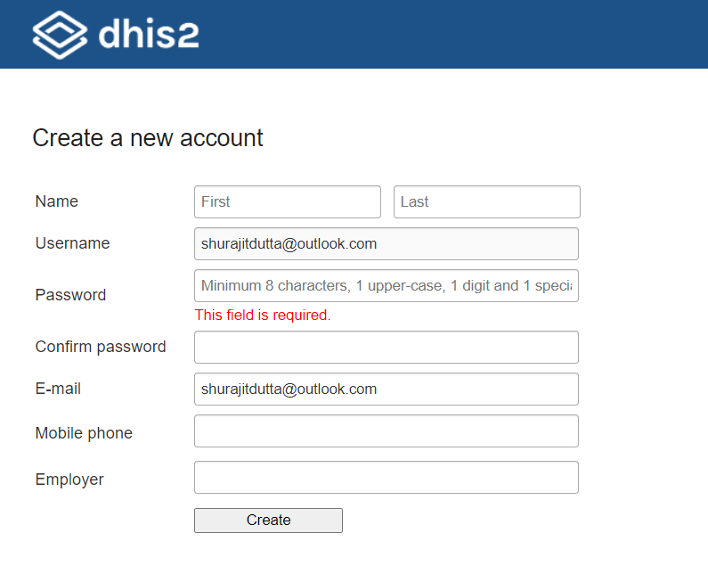
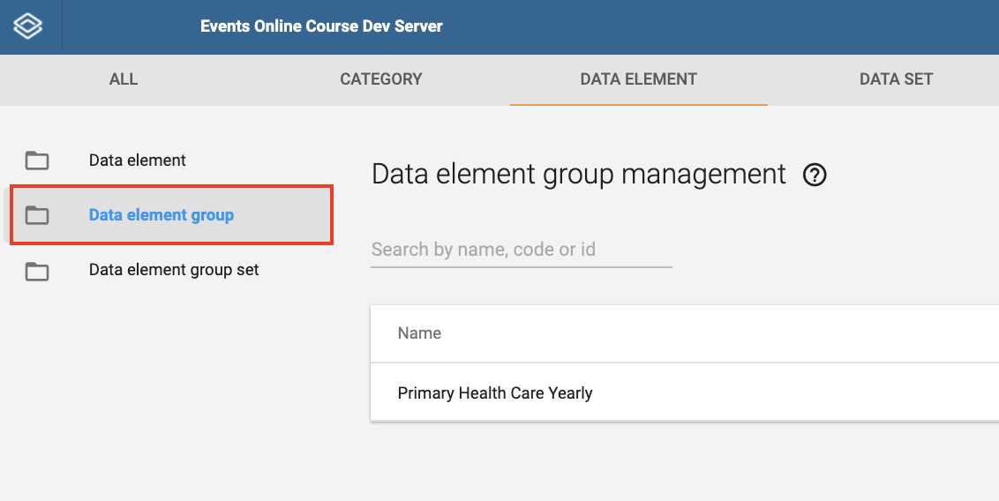
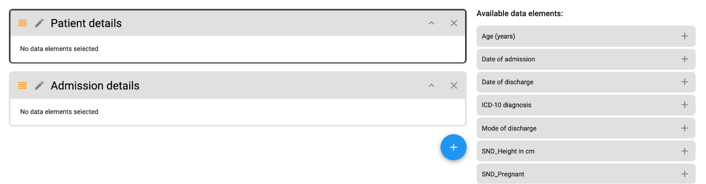

# Module 5: Customizing Event Programs

## 5.0 - Create your DHIS2 account on CUSTOMIZATION & Introduction to Module 5

### Introduction to Module 5

#### Welcome to Module 5!

This module focuses on showing you to configure an event program in
DHIS2. In order to do this, we will also discuss the event data model
(terms and parameters that need to be understood to configure event
programs in DHIS2).

In module 5, there are 3 subsections that you will be reviewing:

  - 5.1 - Event Data Model. This subsection is divided into 2 units.
  - 5.2 - Event Data Model in Practice. This subsection is divided into
    2 units.
  - 5.3 - Creating an Event Program. This subsection is divided into 11
    units.

#### Objectives

By the end of this module, you should be able to:

  - Identify the different components of the event data model
  - Examine data collection tools and apply the event data model to them
  - Construct event programs in DHIS2

#### Activities & Assignments

##### Activities

You will be performing 1 ungraded activity in each of subsection 5.1 and
5.2 within the second unit of each of these subsections. Activities will
be identified within the subsection themselves. In subsection 5.3, you
will be performing activities for units 2-11. There is therefore a total
of **12 activities** that you will perform within this module.

##### Assignments

You will have **1 graded assignment** in the form of hands-on exercises that
you must perform in subsection 5.3. This assignment contributes to 30%
of your overall grade.

##### Training Environment

You will be using the CUSTOMIZATION training environment to perform your
activities and assignments. If you have not done so, please sign up for
this training environment by following the instructions in the unit
Account Creation - Customization.

#### Time Commitment

This is the most technical module of our course and time to complete
this module will likely be variable depending on your background. This
module should take you approximately **7 hours** in total to review all of
the content, perform the ungraded activities and finish the graded
assignment as identified in the course outline.

### Account Creation - Customization

#### Instructions - Account Creation on Customization

In order to perform the exercises and assignments within Module 5, you
will be accessing the **CUSTOMIZATION** DHIS2 system. The
**CUSTOMIZATION** system is very different then **CAPTURE** and **ANALYSIS**. In **CUSTOMIZATION** you will have elevated authority, as you will be allowed to access the maintenance app and create meta-data within this system. You can see the apps you will have access to in the screenshot below.

Please create an account for CUSTOMIZATION by following the available
instructions.

-----

Click the "Request account" button below to request an account on the
DHIS2 Customization system.

You will receive an invitation by email with instructions on how to
complete the registration in DHIS2.

Note: the email address you use with OpenEDX will be sent to the DHIS2
database to create an account.

Give it a couple of seconds to think; DO NOT keep clicking the “Request
account” button several times in a row! It will send your email details
that you used when you registered in OpenEdX to the DHIS2 Customization
system to begin the registration process. After 5-10 seconds you should
receive the following notification in your browser window.

Click on OK to close this notification.

Login to to your e-mail. You should receive an e-mail subject that looks
like the following:

We can see in the email subject that the DHIS2 system that has been
identified is the Customization system that you should be signing up
for.

Note that this e-mail may be in your junk folder. If you do not see it
in one of your primary inboxes, please check your junk folder in case it
was filtered out.

The e-mail itself should look like this

In order to continue, either click on the highlighted link or copy and
paste it into a new tab in your browser. This link will take you to the
following page:

Your email-details have already been filled in from OpenEdX. You will
need to fill in the remaining fields however.

Take note of the restrictions on the password. It must:

  - Be at least 8 characters long
  - Include an uppercase letter
  - Include 1 number/digit
  - Include a special character

After filling in all the fields select “Create” to proceed

This should log you in to the DHIS2 Customization system. Note that
there is no dashboard when you log in to this system.

From here, please follow instructions for any activities or assignments
that are referring you to the DHIS2 Customization system.

## 5.1 - Event Data Model

### Presentation - Event Programs: Key Terms & Conceptual Overview

#### Introduction : Subsection 5.1 - Event Data Model

In Subsection 5.1 we explain some of the key terms that need to be
understood when customization event programs in DHIS2.

Subsection 5.1 has 2 units for you to review. We recommend that you
review these units in order.

1. Presentation - Event Programs : Key Terms & Conceptual Overview
2. Presentation - Data Elements, Options and Option Sets: Key Terms,
    Conceptual Overview & Application

##### Ungraded Activities

There is an activity associated with the second unit in this module.
Scroll below the video demonstration in the second unit in order to view
the activity.

##### Graded Assignment

There is no graded assignment associated with subsection 5.1.

#### Video - Event Data Model Presentation Part 1 of 2

### Presentation - Data Elements, Options and Option Sets: Key Terms, Conceptual Overview & Application

#### Video - Event Data Model Presentation Part 2 of 2

#### Knowledge Check

Please complete the questions below as the activity for this session.
Note that this is **not a graded assignment**, it is only meant to
re-enforce the concepts that have been discussed in this session. You
can attempt the questions as many times as you need. If you find after 2
attempts that you are unable to answer a question, it may be a good idea
to review the video and/or presentation again.

##### Question 1

Event Programs are meant to be used when more detailed analysis must
be captured about an activity or event.

(x) True {{When data entry can happen at the lowest possible level, more
details can be captured. The more detailed data generated by storing
these anonymous individual level data, allows for an increase in the
flexibility of analyses and visualizations performed, in comparison to
aggregated data. For example, in aggregated data, we can only review a
case's age range, where as in the event data, we store the case’s actual
age. This age can then be grouped in analyses in DHIS2 if necessary.}}

( ) False {{In the case where detailed information does not need to be
captured we can refer to the aggregate model, not an Event program. With
Event Programs, when data entry can happen at the lowest possible level,
more details can be captured. The more detailed data generated by
storing these anonymous individual level data, allows for an increase in
the flexibility of analyses and visualizations performed, in comparison
to aggregated data. For example, in aggregated data, we can only review
cases’ age range, whereas in the event data, we store the cases’ actual
age. This age can then be grouped in analyses in DHIS2 if necessary.}}

##### Question 2

 What is a set of information collected on a single dengue case
called?

( ) Program {{A “Program” is similar to a paper register that would be
filled out. Thus, it can contain all of the dengue cases, not just
information on one case. To create a program, you must first configure
several types of metadata objects.}}

( ) Data element {{Data elements define what is actually recorded in the
system, for example, in the case of dengue, the gender or the pregnancy
status of the dengue case.}}

(x) Event {{The event is the actual activity captured, without
registration. For example, a set of information about a single dengue
case, such as symptoms experienced. The event is anonymous; no person is
attached to these individual transactions. }}

( ) Options {{Options are used when a data element has a few choices to
select from. Options make up Option Sets, and provide a pre-defined
dropdown (enumerated) list for use in DHIS2. You can define any kind of
options, for instance an option set called "Delivery type" where
"Normal," "Breach," "Caesarian," and "Assisted," would be the options.}}

||This set of information is not registered, it is anonymous, and linked
to an entity.||

In Event Programs data elements must be of the domain type
 “----------” and a predefined list of values assigned to them are
“------------.” 

( ) Tracker / Categories {{In Event Programs data elements must be of
the domain type “Tracker” to collect details about any entity.

A “Category” is a group of "Category options" but they are used in an
aggregate model. Remember, the category model has three main elements:
1) the “category option,” which corresponds to “female,” “male,” and
less then 5 years,” and “more then 5 years”.

2) The category, which corresponds to “gender” and “age group”.

3) The category combination, which should in the above example be named
“gender and age group” and be assigned both categories mentioned above.

.}}

( ) Aggregate / Option sets {{Aggregate domain types are used for the
Aggregate data model in DHIS2. Option sets are a list of values assigned
to a data element of tracker type. They provide a predefined drop-down
(enumerated) list for use in DHIS2. You can define any kind of options.
An option set called “Delivery type” would have the options: “Normal”,
“Breach”, “Caesarian” and “Assisted”}}

(x) Tracker / Option sets {{In Event programs data elements must be of
the domain type “Tracker” to collect detail about any entity. The list
of values assigned to a data element are called an Option set, which is
a group of options similar to a multiple choice question.  They provide
a predefined drop-down (enumerated) list for use in DHIS2. You can
define any kind of options. An option set called “Delivery type” would
have the options: “Normal,” “Breach,” “Caesarian,” and “Assisted.”}}

|| In Event Program, a list of values provides a predefined drop-down
(enumerated) list for use in DHIS2.||

||Think about which domain type is needed to collect details about any
entity. ||

In Event Programs each event is independent and does not have a
relationship with another event. However, the events can still share the
location and the date.

(x) True {{Events are without registration of any entity (they are
anonymous events), such as a person, but information can be collected on
the same date about different persons that belong to the same
location.}}

( ) False {{When events are related to each other based on a predefined
relationship a Tracker program can be used.}}

## 5.2 - Event Data Model in Practice

### Presentation - Event vs. Aggregate Data Dimensions & Applying Data Model to SARA Survey

#### Introduction : Subsection 5.2 - Event Data Model in Practice

In Subsection 5.2 we will apply the event data model we learned about in
subsection 5.1 to the SARA survey and malaria case management event
programs that we have been reviewing in this course.

Subsection 5.2 has 2 units for you to review. We recommend that you
review these units in order.

1. Presentation - Events vs. Aggregate Data Dimensions & Applying Data
    Model to SARA Survey
2. Presentation - Event Model Indicators & Applying Data Model to
    Malaria Case Management

##### Ungraded Activities

There is an activity associated with the second unit in this module.
Scroll below the video demonstration in the second unit in order to view
the activity.

##### Graded Assignment

There is no graded assignment associated with subsection 5.2.

#### Video - Event Data Model in Practice Presentation Part 1 of 2

### Presentation - Event Model Indicators & Applying Data Model to Malaria Case Management

#### Video - Event Data Model in Practice Presentation Part 2 of 2

#### Part 2 Activities: Event Data Model in Practice

In this activity, we are going to work through the event data model and
apply what we have learned to an example paper registry. This will
demonstrate how a paper registry can be converted to the DHIS2 data
model.

In order to do this, we will need to consider the following items for
this registry and map them to the DHIS2 data model:

1. What are the data elements?
2. What are the data element value types?
3. Are there any option sets?
4. What are the options included in those option sets?

To complete this activity, download the Cholera line list form here:
[Cholera line
list](https://www.google.com/url?q=https://studio.academy.dhis2.org/assets/courseware/958e79a13a191709a526d1777c7d5411/asset-v1:HISP%2BD2EVENTS100%2BQ2_2020%2Btype@asset%2Bblock/5_2_2_Activities_Link_1_Cholera_line_list_template.xlsx&sa=D&ust=1605291870453000&usg=AOvVaw23MBhZ-UV_VHZSRgrEWAQY)

Then, using this form, attempt to fill in this template: [Cholera line
list
template](https://www.google.com/url?q=https://studio.academy.dhis2.org/assets/courseware/1fdc00aea8b3b71e8963f411725f32fa/asset-v1:HISP%2BD2EVENTS100%2BQ2_2020%2Btype@asset%2Bblock/5_2_2_Activities_Link_2__Cholera_Line_List_Data_Model_Template.xlsx&sa=D&ust=1605291870454000&usg=AOvVaw17kuYuGLEPTzZjhsLgZRgV)

We have filled in one line in the template so you can see what it might
look like. You may want to consider referring to the following
documentation when entering the data element value types: [Data
element](https://www.google.com/url?q=https://docs.dhis2.org/master/en/user/html/dhis2_user_manual_en_full.html%23create_data_element&sa=D&ust=1605291870454000&usg=AOvVaw0fbxUXRuHlDl8GRjhN-L2z)

We have provided the completed template
[here](https://www.google.com/url?q=https://studio.academy.dhis2.org/assets/courseware/8b05ca893c501134cd8256e0c495c247/asset-v1:HISP%2BD2EVENTS100%2BQ2_2020%2Btype@asset%2Bblock/5_2_2_Activities_Link_4_Cholera_Line_List_Data_Model_Template_Filled.xlsx&sa=D&ust=1605291870455000&usg=AOvVaw1ljnxMYp5_sBHYmbZIfRs4to
check you have completed the activity correctly, but please do not
download the completed template until you have tried this exercise on
your own.

## 5.3 - Creating an Event Program

### Presentation - Introduction to Demo Tasks

#### Introduction - Subsection 5.3 - Creating an Event Program

In Subsection 5.3 we will demonstrate how to create an event program in
DHIS2. Understanding the DHIS2 data model makes the creation of an event
program much easier; please ensure you have reviewed subsection 5.1 and
5.2 prior to reviewing the concepts presenting in this subsection.

Subsection 5.3 has 11 units for you to review. We recommend that you
review these units in order.

1. Presentation - Introduction to the Demo Tasks
2. Demonstration - Review Program in Capture App
3. Demonstration - Identify & Create Option Sets
4. Demonstration - Creating Data Elements
5. Demonstration - Creating a Data Element Group
6. Demonstration - Creating Event Program Details
7. Demonstration - Assign Data Elements to the Program
8. Demonstration - Create the Data Entry Form
9. Demonstration - Assign Program to Organization Units
10. Presentation - Sharing Settings
11. Demonstration - Sharing Settings

##### Ungraded Activities

Starting from unit 2 (Demonstration - Review Program in Capture App),
there will be an ungraded activity for each unit. Scroll below the video
demonstration in each unit in order to view the activity.

##### Graded Assignment

After you have completed reviewing all the material within this
subsection, please attempt the graded hands-on assignment for this
subsection. This assignment will contribute to 30% of your overall
grade.

#### Video - Creating Event Programs Presentation Part 1 of 11

### Demonstration - Review Program in Capture App

#### Video - Creating Event Programs Demonstration Part 2 of 11

#### Part 2 Activity: Review Program in Capture App

This activity will be completed in [DHIS2
Customization](https://www.google.com/url?q=https://academy.events.dhis2.org/customization&sa=D&ust=1605291870460000&usg=AOvVaw3wAcqHZV1_o6mtw4iOOud3)
. You will be using a generic account to complete this activity, not the
account you have created for customization. Use the following login
details when performing this activity:

Username: icd

Password: District1#

International Classification of Diseases, 10th revision (ICD-10) is a
medical classification of diseases that is published by the World Health
Organization. The Event Program we will create in this subsection is the
[ICD-10 Register](https://www.google.com/url?q=https://studio.academy.dhis2.org/asset-v1:HISP%2BD2EVENTS100%2BQ2_2020%2Btype@asset%2Bblock@5.3.2_ICD10_Register.xlsx&sa=D&ust=1605291870461000&usg=AOvVaw1NgQVMF_MaI2m3GkMy2Mjv), which captures information on patient morbidities and mortalities, following the ICD-10 classifications.

To see how this form has been made into an Event Program already, open
the Capture app.

In the Search apps field, search for the Capture app.

Use the ‘arrow’ symbol to expand the Organisation Unit hierarchy in the
desired branch, then select a health facility in the hierarchy.

Once you’ve chosen a health facility, select “ICD-10 Morbidity &
Mortality” program.

Register a new event by clicking the New Event button in the top right
hand corner.

The event registration form has the following sections:

  - Basic Info

  - Patient Details

  - Admission Details

  - ICD-10 Diagnosis

Notice the “ICD-10 diagnosis” data element with the options available in
the drop down list.

We have filled out a template to identify all of the various components
we have discussed in line with our DHIS2 data model. [TEMPLATE
LINK](https://www.google.com/url?q=https://studio.academy.dhis2.org/asset-v1:HISP%2BD2EVENTS100%2BQ2_2020%2Btype@asset%2Bblock@ICD10_Register_Data_Model_Template_Filled.xlsx&sa=D&ust=1605291870464000&usg=AOvVaw3wabyP10VKdM-TqZf2SvzC)

### Demonstration - Identify & Create Option Sets

#### Video - Creating Event Programs Demonstration Part 3 of 11

#### Part 3 Activity: Identify & Create Option Sets

First, navigate to the Maintenance app using the Search apps field.

Using the bar at the top, select Other then click on the box labeled
Option set.

Now, click on the blue “+” icon at the bottom right to add a new option
set.

An Option set configuration window appears.

Fill in the first tab, Primary details.

For this use case, we will enter the following details:

  - Name: “Your username_Sex”
  - Code: “Your username_Sex”
  - Value type: “Text”

Then click on SAVE.

Now the Options tab will be made available. Navigate to this tab.

Click on the Add Option button in the bottom right.

The following configuration box will appear:

Create an option with the following details:

  - Name: “Your username_Male”
  - Code: “Your username_MALE”;

Then click Save.

Now click on the Add Option button a second time.

Create a second option with the following details:

  - Name: “Your username_Female”
  - Code: “Your username_FEMALE”;

Then click Save.

You will see the options you created appear in the options list.

We will follow the exact same process to create the other option set,
Mode of discharge.

First, navigate back to the Option set management page by clicking on
the back arrow next to the Option set title.

Again, click on the blue plus button in the bottom right hand corner.

Enter the Primary Details as follows:

  - Name: “Your username_Mode of Discharge”
  - Code: “Your username_MODE OF DISCHARGE”
  - Value type: “Text”

Then click on SAVE.

Now enter the following Options for this Option Set by clicking on the
Add Option button.

Discharged

  - Name: “Your username_Discharged”
  - Code: “Your username_DISCHARGED”

Died

  - Name: “Your username_Died”
  - Code: “Your username_DIED”

Transferred

  - Name: “Your username_Transferred”
  - Code: “Your username_TRANSFERRED”

Absconded

  - Name: “Your username_Absconded”
  - Code: “Your username_ABSCONDED”

Once you have created the Mode of Discharge options, go back to the
Option set management page by clicking on the back arrow next to the
Option Set title and type your username into the Search apps bar.

You should see that both Options Sets should now be available:

  - Your username_Sex
  - Your username_Mode of Discharge

### Demonstration - Creating Data Elements

#### Video - Creating Event Programs Demonstration Part 4 of 11

#### Part 4 Activity: Creating Data Elements

Since we have created the options sets, the next step is to create the
data elements.

The [DHIS2 Documentation](https://www.google.com/url?q=https://docs.dhis2.org/master/en/user/html/dhis2_user_manual_en_full.html%23create_data_element&sa=D&ust=1605291870477000&usg=AOvVaw1ctrlJsAnib_gZJw8RLdBn)
describes each of the available fields in data element creation.
Not all of them are required when creating a data element; but you can
refer to the link if you want to understand each field in more detail.

We have filled out a template to identify all of the various components
we have discussed in line with our DHIS2 data model. Use the template to
give you more information on how to create each data element required in
this program. [TEMPLATE
LINK](https://www.google.com/url?q=https://studio.academy.dhis2.org/asset-v1:HISP%2BD2EVENTS100%2BQ2_2020%2Btype@asset%2Bblock@ICD10_Register_Data_Model_Template_Filled.xlsx&sa=D&ust=1605291870478000&usg=AOvVaw3Bbbz69MWokqIFJ5QiUYHT)

Navigate to the Maintenance app.

  - Click on the Data Element tab located in the top horizontal bar
  - Click on the + icon in the Data Element box

Create the Data Element to capture "sex" using the following details:

  - Name: “Your username_Sex”
  - Short name: “Your username_Sex”
  - Domain Type: “Tracker”
  - Value Type: “Text” (automatically selected with Option Set assigned)
  - Aggregation type: “None” (automatically selected with Option Set
    assigned)
  - Option set: “Your username_Sex”
  - Click Save

Click on the blue “+” icon again to repeat this process and create the
following data elements:

Data Element to capture pregnancy status:

  - Name: “Your username_Pregnant”
  - Short name: “Your username_Pregnant”
  - Domain Type: “Tracker”
  - Value Type: “Yes/No”
  - Aggregation type: “Sum”
  - Click Save

Data Element to capture height (in cm):

  - Name: “Your username_Height (in cm)”
  - Short name: “Your username_Height (in cm)”
  - Domain Type: “Tracker”
  - Value Type: “Positive or zero integer”
  - Aggregation type: “Average”
  - Click Save

NOTE: If you would like to continue practicing creating data elements,
please use the template provided to create them [TEMPLATE
LINK](https://www.google.com/url?q=https://studio.academy.dhis2.org/asset-v1:HISP%2BD2EVENTS100%2BQ2_2020%2Btype@asset%2Bblock@ICD10_Register_Data_Model_Template_Filled.xlsx&sa=D&ust=1605291870484000&usg=AOvVaw3FTm83nauCbEnE-N7vZBbz).
The option set for ICD-10 is available for you to add if you want to
create the ICD-10 diagnosis data element yourself. Please use your
username to create the remaining data elements as well. If you are
satisfied with creating data elements, the remaining data elements have
already been created for you to use in your program.

### Demonstration - Creating a Data Element Group

#### Video - Creating Event Programs Demonstration Part 5 of 11

#### Part 5 Activity: Creating Data Element Groups

Once you’ve created and saved the data elements above, navigate back to
the Data element management page so that you can proceed with creating
a Data Element Group.

Continue to use the template to give you more information on which data
elements to include in the data element group. [TEMPLATE
LINK](https://www.google.com/url?q=https://studio.academy.dhis2.org/asset-v1:HISP%2BD2EVENTS100%2BQ2_2020%2Btype@asset%2Bblock@ICD10_Register_Data_Model_Template_Filled.xlsx&sa=D&ust=1605291870486000&usg=AOvVaw2SW9QMwuE_Zqlm5R6djULM)

Select Data Element Group from the left context menu.

Then, click on the blue “+” icon in the bottom right hand corner.

Complete the creation of the Data Element Group using the following
details:

  - Name: “Your username_ICD-10 Register (Tracker)”
  - Assign the following Data Elements to the group by moving them from
    the box on the left to the box on the right:
  - Your username_Sex
  - Your username_Pregnant
  - Your username_Height (in cm)
  - Age (years)
  - Weight (in kg)
  - Date of admission
  - ICD-10 diagnosis
  - Date of discharge
  - Mode of discharge

Click Save when finished.

### Demonstration - Create Event Program Details

#### Video - Creating Event Programs Demonstration Part 6 of 11

#### Part 6 Activity: Create Event Program Details

Now let’s create the Event Program.

Within the Maintenance app, click on the Program box and select
Program from the left context menu.

To add a new program, click on the blue “+” icon at the bottom right
hand corner of the program management screen and choose Event Program.

The following page will appear with a timeline of steps at the top:

1. Add program details
2. Assign data elements
3. Create data entry form
4. Access
5. Create notifications

There are many fields that are available in the program details tab.
Consult the [DHIS2
documentation](https://www.google.com/url?q=https://docs.dhis2.org/master/en/user/html/dhis2_user_manual_en_full.html%23configure_event_program_in_maintenance_app&sa=D&ust=1605291870491000&usg=AOvVaw10p16ahEsJDJdRuXRE78ZQ) for
more detail on the available fields.

Fill in the following program details in the Add program details
section:

  - Name: “Your username__Morbidity/Mortality Register”
  - Short name: “Your username_ICD10 Register”
  - Code: “Your username_ICD10 Register"
  - Description: “The ICD-10 morbidity and mortality register.”
  - Feature type: “Point”

Then click Save.

### Demonstration - Assign Data Elements to the Program

#### Video - Assign Data Elements to the Program Part 7 of 11

#### Part 7 Activity: Assign Data Elements to the Program

In the Program management page, find the program you created and click
on it to open.

In the program you have created, move to the tab, Assign data elements.
Click on it to proceed.

To add in the data elements, find them in the list of data elements and
add them to your program.

Search for and add the data elements you already created beginning with
“Your username_”. To do this, enter your username in the area where
it says “Search available/selected items.” This should quickly filter
out the data elements you have created.

Assign the data elements by doing one of the following:

  - Double click on them
  - Select them and click on the arrow in the middle to move them to the
    selected box
  - Or if you have applied a filter and would like to move all of the
    data elements over, select Assign All to move them all from the
    available to the selected box

Assign the following data elements to the program:

  - Your username_Sex
  - Your username_Pregnant
  - Your username_Height (in cm)
  - Age (years)
  - Weight (in kg)
  - Date of admission
  - ICD-10 diagnosis
  - Date of discharge
  - Mode of discharge

After you have assigned the elements, options will be made available
below the selection box for these assigned data elements. For a full
description of each option, refer to the [DHIS2
Documentation.](https://www.google.com/url?q=https://docs.dhis2.org/master/en/user/html/dhis2_user_manual_en_full.html%23configure_event_program_in_maintenance_app&sa=D&ust=1605291870496000&usg=AOvVaw3tIxOI7q1u_kL7mhpnLjQ0)

By default, all data elements have the Display in reports option
disabled. Enable this option for the following data elements:

  - Your username_Sex
  - Your username_Pregnant
  - Age (years)
  - ICD-10 diagnosis
  - Mode of discharge

Then click Save.

For more information on the options available, refer to the [DHIS2
Documentation.](https://www.google.com/url?q=https://docs.dhis2.org/master/en/user/html/dhis2_user_manual_en_full.html%23configure_event_program_in_maintenance_app&sa=D&ust=1605291870499000&usg=AOvVaw3Q9Xr397-uCtQny0cOU7Mu)

### Demonstration - Create the Data Entry Form

#### Video - Creating Event Programs Demonstration Part 8 of 11

#### Part 8 Activity: Create the Data Entry Form

In the Program management page, find the program you created and click
on it to open.

In the program you have created, move to the tab, Create data entry
form. Click on it to proceed.

Choose Section as the data entry form type by clicking on it.

Click on the blue “+” icon.

Add the section “Patient details” to the data entry form. Fill in the
following details:

  - Name: “Patient details”

Click on Add.

Repeat this process and add another section “Admission details”. Fill in
the following details:

  - Name: “Admission details”

Click on Add.

Then add the data elements to the section.

In order to add data elements, select one of the sections, for example,
the “Patient details” section. You will notice that the section is now
highlighted.

Then select the data elements from the right side menu Available data
elements, by clicking on the “+” icon next to each name.

Add the below Data Elements to “Patient details” in the following order:

  - “Your username_Sex”
  - “Your username_Pregnant”
  - “Age (years)”
  - “Your username_Height in cm”
  - “Weight in kg”

Select the section “Admission details”, and add the below Data
Elements in the following order:

  - “Date of admission”
  - “Diagnosis (ICD-10)”
  - “Date of discharge”
  - “Mode of Discharge”

Then click Save.

### Demonstration - Assign Program to Organisation Units

#### Video - Creating Event Programs Demonstration Part 9 of 11

#### Part 9 Activity: Assign The Program to Organisation Units

In the Program management page, find the program you created and click
on it to open.

In the program you have created, move to the tab, Access. Click on it to
proceed.

Under the Organisation units section, assign the program to your
organisation unit.

Save your changes when you are finished.

### Presentation - Sharing Settings

#### Video - Creating Event Programs Demonstration Part 10 of 11

#### Part 10 - Knowledge Check

Please complete the brief knowledge check below to ensure you understand
the sharing concept before proceeding. This is not graded and meant only
to re-enforce the presentation.

The concept of sharing allows you to

( ) Control which apps a user in DHIS2 has access to {{The sharing
concept allows you to control which metadata and data a user in DHIS2
has access to. We commonly set this through the use of user groups.
Sharing, when combined with user roles, allows you to have control over
exactly what a user can do in your system.}}

(x) Control which metadata and data a user in DHIS2 has access to {{The
sharing concept allows you to control which metadata and data a user in
DHIS2 has access to. We commonly set this through the use of user
groups. Sharing, when combined with user roles, allows you to have
control over exactly what a user can do in your system.}}

( ) Control what a user can do within a DHIS2 app {{The sharing concept
allows you to control which metadata and data a user in DHIS2 has access
to. We commonly set this through the use of user groups. Sharing, when
combined with user roles, allows you to have control over exactly what a
user can do in your system.}}

Click on check to verify your answer.

If I apply the sharing setting "metadata : can view only", how will
this impact the object I have applied this sharing setting to?

( ) A user with this setting will be able to modify or otherwise edit
this object {{Metadata : can view only means that a user will only be
able to see the object that has this setting applied to it. If I apply
this to my program, this means that the user or user group I apply this
to can see my program, but will not be able to modify it in any way.}}

(x) A user with this setting will be able to see the object, but not
update or edit it {{Metadata : can view only means that a user will only
be able to see the object that has this setting applied to it. If I
apply this to my program, this means that the user or user group I apply
this to can see my program, but will not be able to modify it in any
way.}}

( ) A user with this setting will be able to see any data stored in this
object {{Metadata : can view only means that a user will only be able to
see the object that has this setting applied to it. If I apply this to
my program, this means that the user or user group I apply this to can
see my program, but will not be able to modify it in any way.}}

Click on check to verify your answer.

### Demonstration - Sharing Settings

#### Video - Creating Event Programs Demonstration Part 11 of 11

#### Part 11 Activity: Sharing Settings

Back in program maintenance under the Access tab we can go ahead and
modify the sharing settings.

To edit these settings, click on the text under Roles and access, the
Sharing settings box will appear

At the bottom of the Sharing settings box, use the Add users and user
groups field to enter your name.

Once you have selected your name, it will appear in the “Who has access”
section.

Then assign yourself access to the program by clicking on the pencil
button and selecting:

  - Metadata: Can edit and view
  - Data: Can capture and view

Click Apply.

Ensure that the sharing settings from the program are the same as the
sharing settings in the stage. To do this, tick the box next to the
program stage name. Then click on the button Apply to selected stages.

Click on Save at the bottom of the page to ensure the event program is
saved.

Now that the program has been created, open the Capture app and review
it to ensure it has been created correctly.

Select one of the facilities in the “Bird District” from the
organization unit hierarchy. And then select the program you created,
“Your username_Morbidity/Mortality Register”

Click on the New Event button in the top right hand corner to view the
event registration section from.

Review the different sections, data elements, and option sets available,
and complete the data entry for an event.

 

Complete the event with sample data, and then click on Save and exit.

Confirm that this event has been saved to the program by finding it on
the front page list of registered events.

### Takeaways from Module 5

#### Recap, reflect and share

What new ideas have you come up with in this module? What doubts do you
have?

Even though most of the contents of the course are aimed for you to get
familiar with the DHIS2 features, the end goal is for you to relate what
you learn to your daily work and find new ways to solve data challenges
you face.

Take advantage of this space to recap, reflect, and share your thoughts
with your peers and learn from them.

## 5.3 - Graded Assignment - Creating an Event Program

### Instructions

Please read this assignment carefully from start to finish before
starting. If you have any questions please contact us on the discussion
forum to clarify your questions.

This assignment is to be done on the
[Customization](https://www.google.com/url?q=https://academy.events.dhis2.org/customization&sa=D&ust=1605291870515000&usg=AOvVaw31czO9yUNmWJRRWc2A5aFQ)
 database. Please use the log-in for
[Customization](https://www.google.com/url?q=https://academy.events.dhis2.org/customization&sa=D&ust=1605291870516000&usg=AOvVaw3Xmjzt80tNsNbv-XpK7rF5)
that you created at the beginning of Module 5.

Trainingland has been progressively implementing new measures of malaria
control. The program is moving from the control stage to a
pre-elimination stage. As part of these measures, the program would like
to introduce more intensive information collection mechanisms that
record each individual case as well as their location. This is
preparatory in nature to allow the malaria program enough time to
assimilate these practices into their routine procedures before it
becomes critical to track each case during the elimination phase.

In order to record each case, the malaria program has asked you to take
the case management register and implement an event program to capture
this data. Please refer to the accompanying [malaria event program
registry spreadsheet]
(https://www.google.com/url?q=https://studio.academy.dhis2.org/asset-v1:HISP%2BD2EVENTS100%2BQ2_2020%2Btype@asset%2Bblock@Malaria_Event_Program_Registry.xlsx&sa=D&ust=1605291870516000&usg=AOvVaw2bWC0W806q2Sg-bwE0zRhY) that has been provided.

As a first step, you should identify the data elements, data element
value types, options and option sets that are required to build the form
as a program in DHIS2. It is a good idea to create a record of these.
Please identify these items in the corresponding template that is part
of this exercise [(Malaria Line List Data Model
Template)](https://www.google.com/url?q=https://studio.academy.dhis2.org/asset-v1:HISP%2BD2EVENTS100%2BQ2_2020%2Btype@asset%2Bblock@Malaria_Line_List_Data_Model_Template.xlsx&sa=D&ust=1605291870517000&usg=AOvVaw0bhWOmeJbIqUb8taWiEfIL).

Note: We have provided you with a filled-in copy of the template
[(Malaria Line List Data Model
Template_Filled)](https://www.google.com/url?q=https://studio.academy.dhis2.org/asset-v1:HISP%2BD2EVENTS100%2BQ2_2020%2Btype@asset%2Bblock@Malaria_Line_List_Data_Model_Template_Filled.xlsx&sa=D&ust=1605291870517000&usg=AOvVaw01qO3G9Isi9_AiJefeCE8Q) that
you can refer to, to help you complete this part of the exercise. Please
attempt to fill in the incomplete template first for your own
understanding of how to perform this in practice.

When you have done this and are ready to create the program, this is the
rough guide to follow in DHIS2:

1. Identify and create option sets and options
2. Create data elements with domain type “Tracker”
3. Add the data elements to a data element group
4. Create an event program - make sure to include "Malaria" in the
    title.
5. Add the data elements to the program
6. Create a section based form
7. Assign the program to your organization unit
8. Assign sharing settings to the program

You can track the progress of each step of the assignment by using the
"progress" section within this module.

Make sure that you use your username as a prefix for any items that you
create within DHIS2. For example, if my username is “sdutta” and I make
a data element “Pregnant (Trimester),” then the name should be
“sdutta_Pregnant (Trimester)” in DHIS2. This is done to avoid
duplicates in DHIS2 as everyone is working on the assignment in the same
system.

If you are unclear on how to carry out any of these steps, please review
the specific subsection within this module. You may also ask us
questions directly using the forum.

##### Creation of Data Elements and Option Sets

One of the option sets has been made for you:

1. “Blood Test Result”

You may use this when you complete your assignment.

Note that there are also some data elements you have already created, or
have access to from the previous ICD-10 activity. In the course of the
activity, at minimum, you would have created the following data elements
that also belong to the malaria case management register event program:

1. “Your username_Sex”
2. “Your username_Height”

Data elements that you already interacted with that are also in the
malaria program include:

1. “Weight (in Kg)”
2. “Age”

“Blood Test Result” has also already been created for you to accompany
the option set that is also available.

In event and tracker programs, you DO NOT need to re-create data
elements or option sets that you have already made or have access to
when making another program. This is because DHIS2 uniquely pairs each
data element with the program it is in, allowing these data elements to
be used across programs. For “sex,” there is an option set already
associated with the data element you have made and you DO NOT need to
make it again either.

Therefore, in this assignment, you should not need to re-create the 5
data elements above. In the filled template, “[Malaria Line List Data
Model
Template_Filled](https://www.google.com/url?q=https://studio.academy.dhis2.org/asset-v1:HISP%2BD2EVENTS100%2BQ2_2020%2Btype@asset%2Bblock@Malaria_Line_List_Data_Model_Template_Filled.xlsx&sa=D&ust=1605291870521000&usg=AOvVaw0d-XF_1hM0GHpgr_bDtdap),”
we have identified which data elements and option sets you must make by
making them bold and adding a comment that you must create them for the
assignment.

##### Creation of Program/Program Entry Form

When creating this program, use your “username” at the front of the
program. For example, “SND_Malaria Case Management Register.” To ensure
we can check your program, please include "Malaria" somewhere in the
name of the program.

After adding the data elements to the program, organize the section form
into the following sections (these sections are taken directly from the
[malaria event program registry
spreadsheet](https://www.google.com/url?q=https://studio.academy.dhis2.org/asset-v1:HISP%2BD2EVENTS100%2BQ2_2020%2Btype@asset%2Bblock@Malaria_Event_Program_Registry.xlsx&sa=D&ust=1605291870522000&usg=AOvVaw1eJrHSD1ya_WGh_lNJbAFh) that
has been provided):

1. “Patient Details”
2. “Diagnostic Test”
3. “Treatment Prescribed”
4. “Patient Outcome”

Place the data elements into these sections based on how they are
grouped in the [malaria event program registry
spreadsheet](https://www.google.com/url?q=https://studio.academy.dhis2.org/asset-v1:HISP%2BD2EVENTS100%2BQ2_2020%2Btype@asset%2Bblock@Malaria_Event_Program_Registry.xlsx&sa=D&ust=1605291870524000&usg=AOvVaw1PQOsaFthMdtWTQnTaRPNl).
For the latitude and longitude, this will appear at the beginning of the
form if you select the feature type for the program as “point” as shown
in the video demonstrations.

##### Assigning the program to Organization Units

Assign the program to your ROOT organisation unit.

##### Sharing

For both the program and stage:

Set Public access to “none” for both metadata and data.

Provide “edit and view” access to your user for both metadata and data.

Note: These are same sharing settings you used in the ICD-10 register
activity.

##### Review the program

Make sure you have performed the outlined steps:

1. Review the program design
2. Identify and create option sets and options
3. Create data elements with domain type “Tracker”
4. Add the data elements to a data element group
5. Create an event program
6. Add the data elements to the program
7. Create a section based form
8. Assign the program to your organization unit
9. Assign sharing settings to the program

Afterwards, you should be ready to review the program. Navigate to the
Capture app, select an organisation unit that you have assigned your
program to, along with the program you have created. Create a new event,
fill in details for the event and save the event.

### Graded Assignment Submission

#### Submission - Step 1: Progress check

#### Progress check

This progress section is meant to help you track the individual tasks
that will result in the completion of an event program. These responses
do not contribute to your grade. Your assignment will be checked to see
if you have made the program before your grade is assigned.

Are you ready to submit the assignment? Here is a checklist for you.

I have completed the review of the malaria program by identifying
options, option sets, data elements and data element value types.

I have created the option sets and options in DHIS2.

I have created data elements using the tracker domain type.  

I have added the data elements to a data element group.  

I have created an event program by entering the program details.

I have added the appropriate data elements to the program I created.  

I have created a section based form for my program.

I have assigned the program I made to my organization unit.

I have assigned sharing settings to my program.

I have been able to review my program in the Capture app and entered
some data into my program.

Let us know that you are done with your assignment by asking us to
grade.

#### Submission for staff assessment - Step 2: Notify the Course Staff

Did you manage to check all the boxes of the above checklist? Well
done! You can know ask the Course Staff to check your assignment in
Customization. To do so use the 'SUBMISSION FOR STAFF ASSESSMENT' right
below:

1. Enter a short text message in the text box
2. Click the 'Submit your response and move to the next step' button

Once you have submitted, your assignment is ready to be assessed by a
Course Staff.

Please allow for a week before the grading is completed after your
response is registered.

#### Resubmission of the assignment

Do you need to complete & resubmit your assignment on Customization? No
problem. You simply let us know by emailing us at  Course support
email and the course staff reopen the submission for you.

## Feedback - Customizing Event Programs
