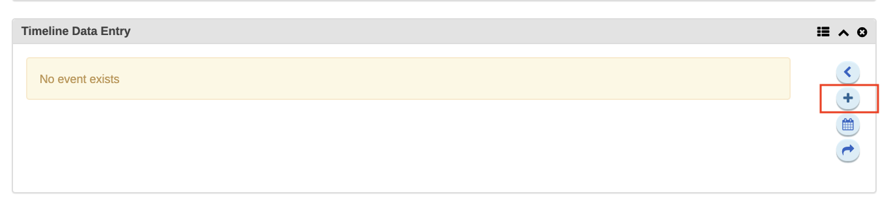
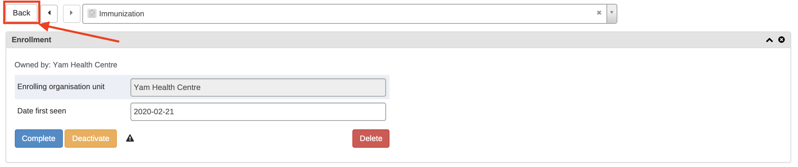

# Module 6: Tracker Use Cases

## 6.0 - Introduction to Module 6

### Introduction to Module 6

#### WELCOME TO MODULE 6!

This module focuses on providing you some preliminary background on
tracker use cases and functionality in DHIS2.

In module 6, there are 2 subsections that you will be reviewing:

  - 6.1 - Tracker Programs & Tracker Capture. This subsection is divided
    into 6 units.
  - 6.2 - Digital Data Packages & Cause of Death. This subsection is
    divided into 4 units.

#### OBJECTIVES

By the end of this module, you should be able to:

  - Describe how the tracker capture app is used to collect tracker data
  - Use the tracker capture app in order to enter tracker data into
    DHIS2
  - Explain the concept of a DHIS2 digital data package

#### ACTIVITIES & ASSIGNMENTS

##### Activities

You will be performing ungraded activities in subsection 6.1 for any
unit labelled "Demonstration," while in subsection 6.2 you will perform
1 activity in unit 3. There is therefore a total of 6 activities that
you will perform within this module. 

##### Assignments

You will have 1 graded assignment in the form of a quiz that will relate
to the material presented in subsection 6.1. This assignment contributes
to 10% of your overall grade.

##### Training Environment

You will be using the CAPTURE training environment to perform your
activities and assignments. If you have not done so, please sign up for
this training environment by following the instructions in the unit
Account Creation - Capture.

#### TIME COMMITMENT

This module should take you approximately 3 hours in total to review all
of the content, perform the ungraded activities and finish the graded
assignment as identified in the course outline.

## 6.1 - Tracker Programs & Tracker Capture

### Presentation - Introduction to Tracker Use Case & Demo Tasks

#### Introduction : Subsection 6.1 - Tracker Programs & Tracker Capture

In Subsection 6.1 we review how to enter tracker data into DHIS2 using
the tracker capture app on the web.

Subsection 6.1 has 6 units for you to review. We recommend that you
review these units in order.

1.  Presentation - Introduction to Tracker Use Case and Demo Tasks
2.  Demonstration - Open Immunization Program & Browse Registered
    Children
3.  Demonstration - Register a Child into the Immunization Program
4.  Demonstration - Enter Immunization Data & Discover the Tracker
    Dashboard
5.  Demonstration - Search Function & Dashboard Orientation
6.  Demonstration - Widgets

##### Ungraded Activities

There is an activity associated with each unit in this subsection
labelled as "demonstration." Scroll below the video demonstration in
each of these units in order to view the activity.

##### Graded Assignment

After you have completed reviewing all the material within this
subsection, please attempt the graded quiz for this subsection. This
quiz will contribute to 10% of your overall grade.

#### Video - Tracker Programs & Tracker Capture Demonstration Part 1 of 6

### Demonstration - Open Immunization Program & Browse Registered Children

#### Video - Tracker Programs & Tracker Capture Demonstration Part 2 of 6

#### Part 2 Activity: Open Immunization Program & Browse Registered Children

Open Tracker Capture using the Apps menu.

Using the organisation unit hierarchy on the left, select Food Region >
Staple District > Yam Health Centre.

Select the “Immunization” program from the options that appear in the
dropdown box.

When the program is selected a list of persons who are already enrolled
in the immunization program appear. Each row in the table corresponds to
a single record within the "Immunization" program.

### Demonstration - Register a Child into the Immunization Program

#### Video - Tracker Programs & Tracker Capture Demonstration Part 3 of 6

#### Part 3 Activity: Register a Person

Now let’s register a child into the "Immunization" program.

Click on the Register button.

Fill in some of the main attributes (first name, last name…). Example
below.

Next, click on Save and continue to register the child and view their
record.

You will arrive on the dashboard page, which contains the child’s
record.

### Demonstration - Enter Immunization Data & Discover the Tracker Dashboard

#### Video - Tracker Programs & Tracker Capture Demonstration Part 4 of 6

#### Part 4 Activity: Enter Immunization Data & Discover the Tracker Dashboard

Now let’s enter some immunization data for the child.

Within the Dashboard navigate to the Timeline Data Entry widget and
click on the blue + icon.

You will be prompted to enter the date that the services were provided.
The date is automatically populated with today’s date but you can adjust
it by clicking on the date then selecting a different one.

Select the same date as the date for ‘first seen’ then click on Save.

Next, we will see some of the variables associated with the
"Immunization" program appear.

Complete some of the requested details within this form. Notice that
when you tick the box next to an immunization in the “Immunization”
section, that it disappears from the “Stockouts” section. Program rules
all this to be configured.

Then click Complete.

You will be prompted to select one of a few options: Complete, Complete
and exit, and Cancel.

For this instance, click on Complete.

Next, the system will automatically prompt you to schedule the next
immunization appointment.

Enter a date that is 6 weeks from when the first immunization
appointment was provided and click Save.

You will find that you can now see a new program stage that appears in
green.

Another way of accessing the scheduling option is by clicking on the
blue calendar icon within the Timeline Data Entry widget.

For a better understanding of the color coding used in the dashboard and
widgets, click on the Information button to view the details.

This will reveal a legend that displays what the colors of each events
means.

### Demonstration - Search Function & Dashboard Orientation

#### Video - Tracker Programs & Tracker Capture Demonstration Part 5 of 6

#### Part 5 Activity: Search Function & Dashboard Orientation

From the event dashboard page, using the Back button in the left corner
of the page, navigate to the front page where all of the children
registered in the “Immunization” program are listed for “Yam Health
Centre”.

### 

Let’s demonstrate
the search function.

Click the Search button at the top of the page.

### 

On the Search for person page enter some of the child’s details so that
you can find them, then click on the search button.

### 

Search results:

### 

In the search results, click on the record that you created, and you
will be taken to the child’s dashboard.

Let’s take some time to get orientated to the test of the dashboard
layout and items.

  - Once again, the back button takes you back to the search and
    registration page

### 

###  

  - The previous and next buttons allow you to access the previous or
    next child’s record

### 

###  

  - The top bar shows certain attributes of choice. This is customizable
    and optional to have in the Dashboard.

### 

###  

  - The pin icon allows you to pin (or stick) the right side of the
    widgets so they don’t move. This is useful especially during data
    entry. If for example, there are many data elements, sticking the
    right side allows those widgets to be visible while scrolling the
    data entry column to the left.

### 

### 

###  

  - The red exclamation point button allows you to deactivate the child
    or completely delete his or her record from the program. Note that
    this is permission based, so not everyone will have access to
    perform this function.

### 

  - And finally the gear icon allows you to customize the items in the
    dashboard’s widgets and top bar.

### 

 Show/hide widgets - allows you to control which widgets you want to
display in the record’s dashboard.

###  

### 

  - There are nine widgets available to display. The widgets are
    collapsible, responsive and draggable - this helps to acquire
    optimal view area as per user needs. Widget rearrangements are saved
    automatically per user per program.

### 

###  

  - The Top bar settings option allows you to modify the top bar options
    or turn it on and off.

### 

### 

### Demonstration - Widgets

#### Video - Tracker Programs & Tracker Capture Demonstration Part 6 of 6

#### Part 6 Activity: Widgets

Now let’s take a closer look at some of the widgets available and what
they are used for.

The Enrollment widget shows the programs the child is enrolled in and
the location of enrollment. It also allows you to manage the status of
the enrollment, mark the child for follow-up, and delete the child from
the program.

The Indicators widget can be used to show the calculated value of any of
the indicators for the selected program. In this example, the ‘Age’
indicator is automatically calculated and displayed.

The Profile widget shows the attributes of the child that were entered
during registration. In this widget, you can also edit the enrollment
attributes.

The Notes widget allows users to make notes on the child.

The Relationship widget allows you to relate the child with others that
are in the system.

In this example, we could relate the particular child to another child
in the program, or even relate the child to a parent in another program.
For example, we could relate siblings or a mother and their child if
they are both registered within DHIS2 regardless of the program they are
receiving services for.

Scroll back down to the Timeline Data Entry, and select the scheduled
event you created earlier.

Select the date for this event; this date will be the same as the date
we scheduled for this service to occur.

After you select the date, you can see the form opens up again allowing
you to enter related data.

You will notice that the fields that appear here are different from the
form for the first entry, and mirror the vaccinations that are scheduled
to be delivered at 6 weeks.

Fill in the details, making sure the child receives all of the scheduled
vaccinations. Then select Complete.

Lastly, select complete and exit when prompted.

### 

## 6.1 - Graded Quiz - Tracker Capture

### Graded Quiz - Tracker Data Capture

This is a graded quiz and it is worth 10% of your final grade.

You have 2 attempts to pass each question.

Select the "check" button to submit your answers.

If you want to save your current response without submitting it for
grading yet, select the "save" button. This allows you to come back
later and resume the attempt.

##### QUESTION 1 - SCREENSHOT

The above screenshot (Question 1 - Screenshot) shows the enrollment
page in tracker capture. Which of the following is a true statement
regarding the entry of these details?

(x) By entering these details, I am adding a unique object/entity to my
DHIS2 system.

( ) By entering these details, I am adding a common/non-unique
object/entity to my DHIS2 system. {{Have another look at the material
within the unit "Demonstration - Register a Tracked Entity Instance" if
not clear on this topic}}

( ) By entering these details, I am retrieving a record that meets the
details I have entered. {{Have another look at the material within the
unit "Demonstration - Register a Tracked Entity Instance" if not clear
on this topic}}

explanation

During the registration step of working within tracker; you are adding a
unique entity to your DHIS2 system. In the case of a person, as in the
example shown here, this means you are able to search for their person
and update their record when they interact with various services within
your system that you are tracking.

explanation

##### QUESTION 2 - SCREENSHOT

In the above screenshot (Question 2 - Screenshot) I am going to
search for an individual based on the details that I have entered. What
will be returned when I select the search button?

( ) I will be taken immediately to the record that meets my search
criteria {{Have another look at the material within the unit
"Demonstration - Search Function and Dashboard Orientation" if not clear
on this topic}}

(x) I will see a list of the records that meet my search criteria

( ) I will be taken back to the front page list of tracker capture and
any records that fit my criteria will be filtered out {{Have another
look at the material within the unit "Demonstration - Search Function
and Dashboard Orientation" if not clear on this topic}}

explanation

When entering general search details and performing a search, you will
always see a list of records that meet your criteria. Based on this
search method, you may have more than one record that meets the criteria
you have entered. You can than select the record you are looking for
from the list that is presented to you. If you were to search using a
Unique ID, then you would be taken directly to the record that meets
your criteria because there is only one record in your system that can
have the ID you have entered.

explanation

##### QUESTION 3 - SCREENSHOT

The screenshot above (Question 3 - Screenshot) shows the front-page
list of a tracker program (in this case, a COVID-19 case-base
surveillance tracker program). The filter selected is “Any enrollment
status.” The records that are shown in this list are:

( ) Individuals who are registered within DHIS2 but may not necessarily
be enrolled into the COVID-19 case based surveillance program. {{Have
another look at the material within the unit "Demonstration - Open
Immunization Program and Browse Registered TEI" if not clear on this
topic}}

( ) Individuals who have received all of the services within the
COVID-19 case based surveillance program and are marked as complete.

(x) Individuals who are enrolled within the COVID-19 case based
surveillance program. They could have received all of the services
within this program, still require additional services, or have
cancelled their enrollment. {{Have another look at the material within
the unit "Demonstration - Open Immunization Program and Browse
Registered TEI" if not clear on this topic}}

explanation

The front page list that you can view in tracker capture is specific to
the program you have selected. Entities that are not enrolled in the
program you have selected (people in this case) will not appear in the
front page list.

When I have the filter of “Any enrollment status” selected, it will show
all of the entities belonging to my program, regardless of their status
within the program.

explanation

 When working with a person, we are able to schedule services within
a tracker program in order to understand when that person should be
receiving their next service.

 (TRUE), FALSE

 explanation

We are able to schedule additional services when working with programs.
We can even filter out lists to determine who has upcoming services
scheduled and what the date of the scheduled service should be.

 explanation

The tracker dashboard is made up of several different widgets that
offer different information about the record you are accessing.

 (TRUE), FALSE

 explanation

Answer: There is a variety of information that can be presented within a
tracker dashboard. This includes the main component that you have
interacted with, data entry, as well as registration details,
indicators, etc. tied to the entity you are reviewing.

 explanation

## 6.2 - Digital Data Packages & Cause of Death

### Presentation - Overview of DHIS2 Digital Data Packages

#### INTRODUCTION - SUBSECTION 6.2 - DIGITAL DATA PACKAGES

In Subsection 6.2 we review the concept of DHIS2 digital data packages.
These packages act as a starting point for DHIS2 configurations based on
a number of best practices.

Subsection 6.2 has 4 units for you to review. We recommend that you
review these units in order.

1.  Presentation - Overview of DHIS2 Digital Data Packages
2.  Presentation - Review of DHIS2 Digital Data Package: Cause of Death
3.  Demonstration - DHIS2 Digital Data Package: Cause of Death
4.  Demonstration - Cause of Death Customized for a Country System

##### Ungraded Activities

You will find an activity located in unit 3 (Demonstration - DHIS2
Digital Data Package: Cause of Death).

##### Graded Assignment

There is no graded assignment for this subsection.

#### Video - Digital Data Packages & Cause of Death Part 1 of 4

#### EXTERNAL RESOURCES

You can learn more about the DHIS2 digital data packages here:

  - WHO website on digital data packages
  - DHIS2 website on digital data packages

### Presentation - Review of DHIS2 Digital Data Package: Cause of Death

#### Video - Digital Data Packages & Cause of Death Part 2 of 4

### Demonstration - DHIS2 Digital Data Package: Cause of Death

#### Video - Digital Data Packages & Cause of Death Part 3 of 4

#### Part 3 Activity: Exploring The Cause of Death Tracker Package

Navigate to the Tracker Capture app by typing in “Tracker” into the
search bar feature.

 

Using the Org Unit hierarchy on the left, select a health centre.

 

The Cause of Death program will show up as an option.

Click on Register.

The Enrollment form will show up.

Click on Save and continue.

You should arrive on the form page. Scroll down to the section titled
Timeline Data Entry. The content within this section has been modeled
after the paper-based medical certificate of cause of death. [Paper
Cause of Death
form](https://www.google.com/url?q=https://studio.academy.dhis2.org/asset-v1:HISP%2BD2EVENTS100%2BQ2_2020%2Btype@asset%2Bblock@6.2.2_CoD_Filled.pdf&sa=D&ust=1605291870571000&usg=AOvVaw35AiQw9hBgUOKfjirHmGRK).

 

If you scroll down to the bottom of the DHIS2 form, you will find the
Results table which becomes populated as you fill in the certificate.

Each entry is registered using the ID number, which can be found in the
Profile box. You would have also seen this ID number when you registered
the death.

 

Scroll back down to the Timeline Data Entry box.

Using the paper form, we will complete the data entry in DHIS2 to
identify “Tuberculosis” as the underlying cause of death.

Starting with the demographic information, refer to the paper form to
fill in the date of birth in the electronic DHIS2 form.

Paper form

 

DHIS2 form

 

 

Next, let’s move to the chain of events resulting in death. Make sure to
also fill in the corresponding time from onset to death.

Paper form

 

DHIS2 form

 

Make sure you have selected the underlying cause of death as well. Do
this by ticking the box in the “underlying” column where in row C of
your chain of events leading to death, as you can see in the screenshot
above.

Next, scroll down to the Results sections to view the results. The
underlying cause of death should show up along with the ICD-10 SMoL and
ICD-10 full codes for the underlying cause.

When comparing the paper form to the electronic DHIS2 form, you may find
that multiple fields that are not relevant have had their responses
section removed for data entry in order to reduce any potential data
entry errors.

### Takeaways from Module 6

#### Recap, reflect and share

What new ideas have you come up with in this module? What doubts do you
have?

Even though most of the contents of the course are aimed for you to get
familiar with the DHIS2 features, the end goal is for you to relate what
you learn to your daily work and find new ways to solve data challenges
you face.

Take advantage of this space to recap, reflect, and share your thoughts
with your peers and learn from them.

## Feedback - Tracker Use Cases
