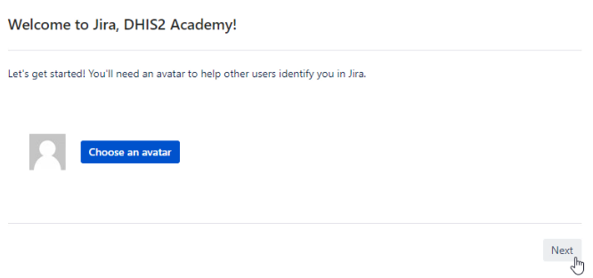

# Module 7: Next Steps & Course Closure

## 7.0 - Introduction to Module 7

### Introduction to Module 7

#### WELCOME TO MODULE 7!

Congratulations on reaching the final module! In this module, we focus
on providing you with some next steps to continue learning and wrap up
the course.

In module 7, there are 4 subsections that you will be reviewing:

  - 7.1 - DHIS2 Academies Overview. This subsection is divided into 3
    units.
  - 7.2 - Following Events and Tracker Development. This subsection is
    divided into 4 units.
  - 7.3 - Seeking Additional Support. This subsection is divided into 2
    units
  - 7.4 - Course Closure. There is 1 unit in this subsection.

#### OBJECTIVES

By the end of this module, you should be able to:

  - Compare each of the Level 1 DHIS2 academies
  - Describe the Level 2 Android and Tracker Implementation academies
  - Examine methods that can be used to follow event and tracker
    development
  - Use moodle, DHIS2 demo systems and the community of practice to
    support ongoing learning

#### ACTIVITIES & ASSIGNMENTS

##### Activities

There are optional activities in Subsection 7.2, units 2 and 4 and
Subsection 7.3 units 1 and 2.  There is therefore a total of 4 optional
activities that you can perform within this module.

##### Assignments

There are no graded assignments in Module 7! Congratulations!

##### Training Environment

You will not be using one of the DHIS2 training systems in this module.
Links to other resources where you can review material are provided.

#### TIME COMMITMENT

This module should take you approximately 1.5 hours in total to review
all of the content and perform the ungraded activities as identified in
the course outline.

## 7.1 - DHIS2 Academies Overview

### Presentation - Core DHIS2 Academy Principles & DHIS2 Academy Training Model

#### Introduction - Subsection 7.1 - DHIS2 Academies Overview

In Subsection 7.1 we will discuss the available DHIS2 academies for
further learning.

Subsection 7.1 has 3 units for you to review. We recommend that you
review these units in order.

1. Presentation - Core DHIS2 Academy Principles & DHIS2 Academy
    Training Model
2. Presentation - Level 1 Academies
3. Presentation - Level 2 Academies

##### Ungraded Activities

There are no activities within this subsection.

##### Graded Assignment

There are no assignments within this subsection.

#### Video - DHIS2 Academies Overview Part 1 of 3

### Presentation - Level 1 Academies

#### Video - DHIS2 Academies Overview Part 2 of 3

### Presentation - Level 2 Academies

#### Video - DHIS2 Academies Overview Part 3 of 3

## 7.2 - Following Event & Tracker Development

### Presentation - Development Roadmap & Jira

#### INTRODUCTION : SUBSECTION 7.2 - FOLLOWING EVENT & TRACKER DEVELOPMENT

In Subsection 7.2 we discuss how you can keep up with the development of
the latest features related to events and tracker in DHIS2.

Subsection 7.2 has 3 units for you to review. We recommend that you
review these units in order.

1. Presentation - Development Roadmap & Jira
2. Demonstration - DHIS2 Jira
3. Presentation - DHIS2 Release Cycle & Social Media
4. Demonstration - DHIS2 Community of Practice

#### Ungraded Activities

There are optional activities in unit 1 and unit 2 of this subsection.
Scroll below the video demonstration in each unit in order to view the
activity.

#### Graded Assignment

There are no graded assignments in this subsection.

#### Video - Following Event & Tracker Development Part 1 of 4

### Demonstration - DHIS2 Jira

#### Part 2 Activity: Signing up for Jira

To sign up for an account, select the Sign up text underneath the login
details.

Enter in the account details and then select Sign up.

After you sign up, a confirmation will appear. Select Click here to log
in to continue.

Enter your log in details and select Log In to continue.

 Select your language then click on Continue.

If you would like to, you can add an avatar (an image of yourself), then
click on Next.

Next, select  Explore the current projects.

The two projects most related to this course are:

Android app for DHIS2

DHIS 2 Software

Please feel free to explore other projects.

The easiest way to explore these projects is by adding dashboards.

To do so, first select Dashboards > Manage Dashboards.

Select Popular from the left side menu. To bookmark a dashboard, click
on the star icon next to the dashboard’s name. Recommended dashboards
are "Tracker" and "DHIS2 Android App."

After bookmarking the dashboard, it will appear under the list of your
dashboards when you select  Dashboards from the top menu

Navigate to the "Tracker" dashboard. You will see statistics on any
issues, as well as a list of the issues themselves.

Selecting an issue will allow you to review it in more detail.

You can use labels to help you find related issues.

You can also create your own issues using the Create button at the top
on the header bar.

### Presentation - DHIS2 Release Cycle & Social Media

#### Video - Following Event & Tracker Development Part 3 of 4

### Demonstration - DHIS2 Community of Practice

#### Video - Following Event & Tracker Development Part 4 of 4

#### Activity: Signing Up for The Community of Practice

Access the community of practice here DHIS2 Community . and sign up for
an account.

Once you have signed up, you can access the community of practice thread
for this course here

To create a new account, select Sign Up.

7.2.4.1dhis2community

After this, enter in your account details. You will need to enter
details for all mandatory fields, then select Create New Account. An
example is shown below.

7.2.4.2Createnew_account

After selecting Create New Account you will see an activation
notification.

Go to your email and find the activation email. Click on the link within
the email.

7.2.4.3Resendactivation_email

 7.2.4.4Confirmnew_account

Using this link, you can activate your account.

7.2.4.5Confirmnew_account

After activating the account, you will receive the final confirmation.

7.2.4.6_Welcome

Consider going through the steps on the home page to get started with
using the community of practice, or simply go to one of the sections to
review posts, or make your own!

7.2.4.7DHIS2community

## 7.3 - Seeking Additional Support

## 7.4 - Course Closure

## Feedback - Wrap Up & Summary

## End of Course Feedback: DHIS2 Events Fundamentals

[a](#cmnt_ref1)Need to upload the outline

[b](#cmnt_ref2)I presume they will receive this email in french so
I´m going to retype the email underneath so we can get it translated
